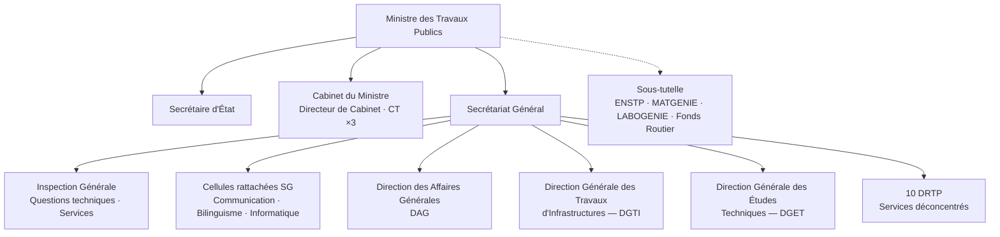
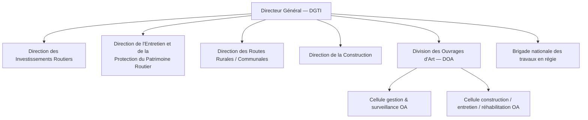
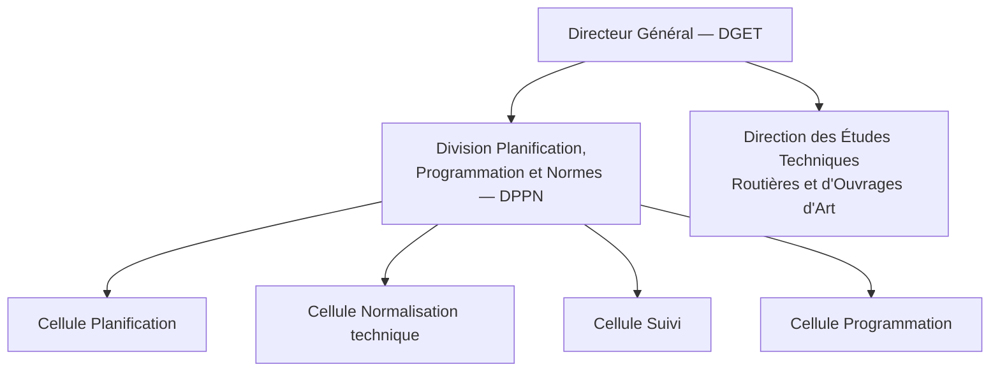
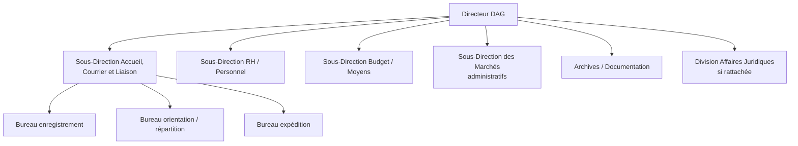
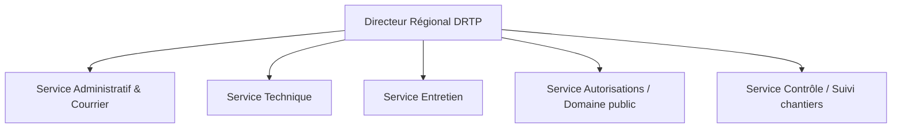

# Organigramme détaillé du MINTP — Postes, responsabilités & 30 circuits de dossiers

**Projet :** FluxPro  
**Ministère :** Ministère des Travaux Publics du Cameroun (MINTP)  
**Référence légale :** Décret n° **2018/461** du 07 août 2018  
**Sources :** Décret 2018/461, [mintp.cm](https://www.mintp.cm), cahier des charges FluxPro, annuaire statistique MINTP  
**Version document :** 1.0 — 25 juillet 2026  

> **Avertissement.** Ce document synthétise l’organisation **publique** du MINTP pour paramétrage FluxPro (référentiel ORG + templates de chaînes). Les libellés de sous-bureaux peuvent évoluer ; valider avec le **SG / DSI MINTP** avant déploiement national.  
> Le code CDC FluxPro utilise parfois **DIER** : en pratique, cela correspond au périmètre **investissements / entretien** porté par la **DGTI** (Direction des Investissements Routiers + Entretien).

---

## Table des matières

1. [Missions du MINTP](#1-missions-du-mintp)
2. [Graphe — organigramme global](#2-graphe--organigramme-global)
3. [Cabinet, SG, Inspection](#3-cabinet-sg-inspection)
4. [Direction des Affaires Générales (DAG)](#4-direction-des-affaires-générales-dag)
5. [Direction Générale des Travaux d’Infrastructures (DGTI)](#5-direction-générale-des-travaux-dinfrastructures-dgti)
6. [Direction Générale des Études Techniques (DGET)](#6-direction-générale-des-études-techniques-dget)
7. [Services déconcentrés — 10 DRTP](#7-services-déconcentrés--10-drtp)
8. [Structures sous tutelle](#8-structures-sous-tutelle)
9. [Matrice postes / rôles FluxPro](#9-matrice-postes--rôles-fluxpro)
10. [30 cas de dossiers avec circuits](#10-30-cas-de-dossiers-avec-circuits)
11. [Annexes](#11-annexes)

---

## 1. Missions du MINTP

Le MINTP est responsable de :

- la **supervision et le contrôle technique** de la construction des infrastructures et bâtiments publics ;
- l’**entretien et la protection** du patrimoine routier national ;
- l’élaboration de la **politique** de construction, maintenance et entretien ;
- le concours à la construction / entretien des routes (y compris voirie urbaine) ;
- la tutelle technique sur **ENSTP**, **MATGENIE**, **LABOGENIE**, **Fonds Routier**.

---

## 2. Graphe — organigramme global

### 2.1 Vue d’ensemble (Mermaid)

### 2.2 Zoom DGTI

### 2.3 Zoom DGET

### 2.4 Zoom DAG

### 2.5 Zoom DRTP (type)

### 2.6 Hiérarchie des niveaux (modèle ORG FluxPro)

---

## 3. Cabinet, SG, Inspection

### 3.1 Ministre

| Poste | Responsabilités |
|-------|-----------------|
| **Ministre** | Orientations politiques ; arbitrages ; signature des actes majeurs ; représentation |
| **Secrétaire d’État** | Appui au Ministre ; dossiers délégués ; suivi sectoriel |

### 3.2 Cabinet du Ministre

| Poste | Responsabilités |
|-------|-----------------|
| **Directeur de Cabinet** | Coordination du Cabinet ; filtrage des dossiers sensibles ; liaison SG |
| **Conseillers techniques (×3)** | Avis techniques sur dossiers complexes ; notes au Ministre |
| **Chargés de mission** | Missions ponctuelles ; suivi de projets prioritaires |
| **Attachés / secrétariat Cabinet** | Agenda, courrier Cabinet, audiences |

### 3.3 Secrétariat Général (SG)

| Poste | Responsabilités |
|-------|-----------------|
| **Secrétaire Général** | Coordination de l’administration centrale ; visas ; transmission Cabinet ; cohérence des circuits |
| **Chargés d’études / assistants SG** | Instruction des notes ; suivi des délais interministériels |
| **Secrétariat SG** | Enregistrement des dossiers au niveau SG |

### 3.4 Inspection Générale

| Poste / unité | Responsabilités |
|---------------|-----------------|
| **Inspecteur Général (questions techniques)** | Contrôle technique des projets / services |
| **Inspecteur Général des Services** | Contrôle administratif et disciplinaire |
| **Inspecteurs** | Missions d’inspection, rapports, recommandations |

### 3.5 Cellules rattachées (SG / Cabinet)

| Unité | Responsabilités |
|-------|-----------------|
| **Cellule Communication** | Com. institutionnelle, presse, web |
| **Cellule Promotion du bilinguisme** | Application du bilinguisme (décret 2018) |
| **Cellule Informatique / DSI** | SI, réseau, applications (dont FluxPro) |

---

## 4. Direction des Affaires Générales (DAG)

**Rôle :** support administratif transversal (courrier, RH, moyens, marchés admin, archives).

| Poste / unité | Responsabilités |
|---------------|-----------------|
| **Directeur DAG** | Pilotage ; validation courrier sensible ; arbitrage RH / moyens |
| **Sous-Direction Accueil, Courrier et Liaison** | Réception, enregistrement, orientation, expédition du courrier |
| **Chef de bureau enregistrement** | Numérotation, numérisation, saisie dossier |
| **Chef de bureau orientation** | Affectation vers direction compétente |
| **Chef de bureau expédition** | Envoi réponses, AR, archives de sortie |
| **Sous-Direction RH / Personnel** | Actes de carrière, congés, missions, dossiers agents |
| **Sous-Direction Budget / Moyens** | Engagements, matériel, logistique |
| **Sous-Direction / Service Marchés (admin)** | Marchés de fonctionnement, passation administrative |
| **Archives / Documentation** | Classement, conservation, communication des pièces |
| **Affaires juridiques** (si rattachée) | Avis juridiques, contentieux, contentieux administratif |

**Rôles FluxPro typiques :** `SUPPORT`, `AGENT`, `SERVICE_HEAD`, `DIRECTOR`, `BUSINESS_ADMIN`.

---

## 5. Direction Générale des Travaux d’Infrastructures (DGTI)

**Rôle :** conception opérationnelle, suivi et contrôle des **travaux** (routes, construction, OA, entretien, régie).

### 5.1 Encadrement

| Poste | Responsabilités |
|-------|-----------------|
| **Directeur Général (DGTI)** | Pilotage global travaux ; arbitrage entre directions ; visas majeurs |
| **Assistants / secrétariat DGTI** | Suivi des dossiers entrants / sortants DG |

### 5.2 Direction des Investissements Routiers

| Poste / unité | Responsabilités |
|---------------|-----------------|
| **Directeur** | Programmes d’investissement routier ; priorisation projets |
| **Chefs de service / projets** | Instruction technique et administrative des dossiers d’investissement |
| **Chargés d’études** | Analyse dossiers, devis, planning |

> **Alias FluxPro :** souvent regroupé avec l’entretien sous le code métier **DIER** dans le CDC.

### 5.3 Direction de l’Entretien et de la Protection du Patrimoine Routier

| Poste / unité | Responsabilités |
|---------------|-----------------|
| **Directeur** | Politique d’entretien ; protection du patrimoine ; liaison Fonds Routier |
| **Chefs de service entretien** | Programmes d’entretien, urgences, signalements |
| **Agents techniques** | Visites, constats, fiches d’intervention |

### 5.4 Direction des Routes Rurales / Communales

| Poste / unité | Responsabilités |
|---------------|-----------------|
| **Directeur** | Routes rurales / communales ; appui collectivités |
| **Chefs de service** | Instruction dossiers HIMO / rural ; suivi chantiers |

### 5.5 Direction de la Construction

| Poste / unité | Responsabilités |
|---------------|-----------------|
| **Directeur** | Construction / reconstruction d’infrastructures et bâtiments publics |
| **Chefs de projet / service** | Suivi marchés de construction, décomptes, PV |
| **Contrôleurs / agents** | Suivi chantier, conformité |

### 5.6 Division des Ouvrages d’Art (DOA)

| Poste / unité | Responsabilités |
|---------------|-----------------|
| **Chef de Division** | Pilotage OA (ponts, viaducs…) |
| **Cellule gestion & surveillance OA** | Inspections, banque de données, surveillance |
| **Cellule construction / entretien / réhabilitation OA** | Suivi travaux OA, specs techniques, DAO techniques |

### 5.7 Brigade nationale des travaux en régie

| Poste / unité | Responsabilités |
|---------------|-----------------|
| **Chef de brigade** | Portefeuille des travaux en régie |
| **Sections** | Préparation programmes, liasses-projets, petits ouvrages, exécution régie |

---

## 6. Direction Générale des Études Techniques (DGET)

**Rôle :** études, normes, planification et programmation **en amont** des travaux.

| Poste / unité | Responsabilités |
|---------------|-----------------|
| **Directeur Général (DGET)** | Pilotage études & normes |
| **DPPN — Chef de Division** | Planification, programmation, normes |
| **Cellule Planification** | Études prospectives, plans directeurs |
| **Cellule Normalisation technique** | Élaboration / diffusion des normes |
| **Cellule Programmation** | Programmation pluriannuelle |
| **Cellule Suivi** | Suivi des indicateurs / études |
| **Direction des Études Techniques Routières et OA** | Études techniques routes & ouvrages |

---

## 7. Services déconcentrés — 10 DRTP

### 7.1 Liste des délégations

| Code | Région | Siège typique |
|------|--------|---------------|
| DRTP-AD | Adamaoua | Ngaoundéré |
| DRTP-CE | Centre | Yaoundé |
| DRTP-ES | Est | Bertoua |
| DRTP-EN | Extrême-Nord | Maroua |
| DRTP-LT | Littoral | Douala |
| DRTP-NO | Nord | Garoua |
| DRTP-NW | Nord-Ouest | Bamenda |
| DRTP-OU | Ouest | Bafoussam |
| DRTP-SU | Sud | Ebolowa |
| DRTP-SW | Sud-Ouest | Buea |

### 7.2 Postes type DRTP

| Poste | Responsabilités |
|-------|-----------------|
| **Directeur Régional** | Représentation régionale ; validation autorisations ; arbitrage local |
| **Chef Service Administratif** | Courrier régional, RH locale, moyens |
| **Chef Service Technique** | Instruction dossiers techniques |
| **Chef Service Entretien** | Entretien réseau régional |
| **Chef Service Autorisations** | Occupations / travaux domaine public routier |
| **Chef Service Contrôle** | Visites terrain, PV, conformité |
| **Agents / contrôleurs** | Instruction, terrain, transmission |

**Rôle FluxPro :** `REGIONAL_DIRECTOR`, `SERVICE_HEAD`, `AGENT`, `SUPPORT`.

---

## 8. Structures sous tutelle

| Structure | Mission | Lien FluxPro |
|-----------|---------|--------------|
| **ENSTP** | Formation ingénieurs TP | Hors cœur (sauf courriers tutelle) |
| **MATGENIE** | Parc matériel génie civil | Dossiers équipements / conventions |
| **LABOGENIE** | Essais / laboratoire | Demandes d’essais, rapports |
| **Fonds Routier** | Financement entretien | Visas / conventions / déblocages (circuit externe) |

---

## 9. Matrice postes / rôles FluxPro

| Poste MINTP | Rôle FluxPro suggéré | Périmètre org |
|-------------|----------------------|---------------|
| Super admin DSI | `SUPER_ADMIN` | MINTP |
| Admin métier DAG/DGTI | `BUSINESS_ADMIN` | Direction |
| Directeur / DG | `DIRECTOR` | Direction / DG |
| Directeur régional | `REGIONAL_DIRECTOR` | DRTP |
| Chef de service / division | `SERVICE_HEAD` | Service |
| Agent traitant | `AGENT` | Service |
| Cadre d’appui courrier | `SUPPORT` | DAG / DRTP |
| SG | `SECRETARY_GENERAL` | MINTP |
| Cabinet / Ministre | `EXECUTIVE_OFFICE` | Cabinet |
| Lecture seule | `READER` | Selon besoin |

---

## 10. 30 cas de dossiers avec circuits

**Légende des circuits**

- Chaque flèche `→` = **maillon** (responsable + délai indicatif en jours ouvrés).  
- `[Portail EXT]` / `[Portail INT]` = entrée possible via portail FluxPro.  
- Délais = **ordres de grandeur** à valider en atelier métier.

### Famille A — Courrier & Cabinet (DAG / SG)

#### 1. Courrier entrant standard
| | |
|--|--|
| **Code** | `COUR-STD` |
| **Entrée** | DAG (métier) |
| **Circuit** | Réception DAG (1j) → Orientation (1j) → Service métier (3j) → Chef de service (2j) → Directeur (2j) → Expédition / clôture (2j) |
| **Délai total** | ~11 j.o. |
| **Template FluxPro** | T01 |

#### 2. Courrier urgent
| | |
|--|--|
| **Code** | `COUR-URG` |
| **Circuit** | Réception DAG (2h) → Orientation (2h) → Traitement (4h) → Visa directeur (2h) → Expédition (2h) |
| **Délai** | heures ouvrées (T02) |

#### 3. Note au Ministre / SG
| | |
|--|--|
| **Code** | `NOTE-CAB` |
| **Circuit** | Direction auteur (2j) → DG / Directeur (2j) → SG (3j) → Cabinet (3j) → Retour instruction (2j) |
| **Délai** | ~12 j.o. |

#### 4. Demande d’audience
| | |
|--|--|
| **Code** | `AUD-CAB` |
| **Entrée** | `[Portail EXT]` optionnel |
| **Circuit** | Réception Cabinet/DAG (1j) → Filtrage Cabinet (2j) → Décision agenda (3j) → Notification (1j) |

#### 5. Courrier sortant à viser
| | |
|--|--|
| **Code** | `COUR-OUT` |
| **Circuit** | Rédacteur (2j) → Chef service (1j) → Directeur (2j) → SG si requis (2j) → Expédition (1j) |

---

### Famille B — Marchés & investissements (DGTI / DIR)

#### 6. Passation marché sous seuil
| | |
|--|--|
| **Code** | `MARCHE-SMP` |
| **Circuit** | Enregistrement (1j) → Instruction technique (4j) → Visa financier (2j) → Directeur DGTI/DIR (2j) → Avis SG (3j) → Visa Cabinet si requis (5j) → Notification (2j) |
| **Délai** | ~15–21 j.o. (T03) |

#### 7. Validation DAO / dossier d’appel d’offres
| | |
|--|--|
| **Code** | `DAO-VAL` |
| **Circuit** | Service projet (3j) → Division/Direction (3j) → Service marchés (3j) → DG (2j) → SG (2j) |

#### 8. Avenant de marché
| | |
|--|--|
| **Code** | `AVENANT` |
| **Circuit** | Chef projet (3j) → Directeur (3j) → Juridique (3j) → SG (3j) → Notification (1j) |

#### 9. Réception de travaux / PV de réception
| | |
|--|--|
| **Code** | `PV-RECEP` |
| **Circuit** | Contrôle terrain (3j) → Chef service (2j) → Directeur (2j) → Commission réception (5j) → Clôture (2j) |

#### 10. Décompte / demande de paiement entrepreneur
| | |
|--|--|
| **Code** | `DECOMPTE` |
| **Entrée** | `[Portail EXT]` possible |
| **Circuit** | Dépôt (1j) → Vérif technique (4j) → Visa financier (3j) → Directeur (2j) → Transmission paiement (2j) |

#### 11. Marché à visas parallèles
| | |
|--|--|
| **Code** | `MARCHE-PAR` |
| **Circuit** | Enregistrement → **∥** Visa technique **+** Visa financier **+** Avis juridique → Jonction ET → SG → Notification |
| **Template** | T06 |

---

### Famille C — Entretien & patrimoine routier

#### 12. Dossier d’entretien routier programmé
| | |
|--|--|
| **Code** | `ENT-PROG` |
| **Circuit** | Service entretien (3j) → Direction Entretien (3j) → Programmation / Fonds (si requis, 5j) → Validation DG (2j) → Lancement (2j) |

#### 13. Signalement urgence / dégradation routière
| | |
|--|--|
| **Code** | `ENT-URG` |
| **Entrée** | `[Portail EXT]` |
| **Circuit** | Réception (1j) → Constat terrain DRTP (2j) → Décision intervention (2j) → Exécution / suivi (5j) → Clôture (1j) |

#### 14. Demande d’inspection / visite de chantier
| | |
|--|--|
| **Code** | `INSP-CHANT` |
| **Entrée** | `[Portail EXT]` |
| **Circuit** | Dépôt (1j) → Planification visite (3j) → Visite (1j) → Rapport (3j) → Visa chef service (2j) |

---

### Famille D — Autorisations & domaine public (DRTP)

#### 15. Autorisation de travaux sur domaine public routier
| | |
|--|--|
| **Code** | `AUTH-TRAV` |
| **Entrée** | `[Portail EXT]` |
| **Circuit** | Réception DRTP (2j) → Instruction technique (5j) → Visite terrain (3j) → Chef service (2j) → Directeur DRTP (3j) → Délivrance (3j) |
| **Délai** | ~18 j.o. (T04) |

#### 16. Autorisation d’occupation temporaire
| | |
|--|--|
| **Code** | `AUTH-OCC` |
| **Entrée** | `[Portail EXT]` |
| **Circuit** | Réception (1j) → Instruction (4j) → Avis technique (3j) → Directeur DRTP (3j) → Acte (2j) |

#### 17. Déclaration d’ouverture / reprise de chantier
| | |
|--|--|
| **Code** | `DECL-CHANT` |
| **Entrée** | `[Portail EXT]` |
| **Circuit** | Dépôt (1j) → Vérification pièces (2j) → Visa service (2j) → Accusé / suivi (1j) |

---

### Famille E — Ouvrages d’art & construction

#### 18. Dossier suivi ouvrage d’art (construction / réhab)
| | |
|--|--|
| **Code** | `OA-SUIVI` |
| **Circuit** | Cellule DOA (4j) → Chef Division DOA (3j) → Direction Construction / DG (3j) → SG si seuil (3j) |

#### 19. Inspection / surveillance OA
| | |
|--|--|
| **Code** | `OA-INSP` |
| **Circuit** | Programmation (2j) → Inspection (2j) → Rapport cellule (3j) → Chef DOA (2j) → Décision entretien (3j) |

#### 20. Travaux en régie (brigade)
| | |
|--|--|
| **Code** | `REGIE` |
| **Circuit** | Proposition section (3j) → Chef brigade (3j) → DG DGTI (3j) → Validation / lancement (2j) → Compte rendu (3j) |

#### 21. Dossier construction / reconstruction bâtiment public
| | |
|--|--|
| **Code** | `CONST-BAT` |
| **Circuit** | Direction Construction (5j) → Visas techniques (5j) → DG (3j) → SG (3j) → Notification (2j) |

---

### Famille F — Études & normes (DGET)

#### 22. Demande d’avis technique / étude
| | |
|--|--|
| **Code** | `AVIS-TECH` |
| **Entrée** | `[Portail EXT]` possible |
| **Circuit** | Réception DGET (2j) → Direction études (5j) → DPPN si norme (3j) → DG DGET (3j) → Transmission avis (2j) |

#### 23. Élaboration / mise à jour de norme technique
| | |
|--|--|
| **Code** | `NORME` |
| **Circuit** | Cellule Normalisation (10j) → DPPN (5j) → DG DGET (5j) → Validation SG (5j) → Diffusion (2j) |

#### 24. Fiche programmation / plan directeur
| | |
|--|--|
| **Code** | `PROG-INFRA` |
| **Circuit** | Cellule Programmation (5j) → DPPN (5j) → DG (3j) → Concertation MINEPAT si requis (10j) → Adoption (5j) |

---

### Famille G — RH & admin interne (DAG — portail interne)

#### 25. Demande de congé
| | |
|--|--|
| **Code** | `RH-CONGE` |
| **Entrée** | `[Portail INT]` |
| **Circuit** | Soumission agent (0) → Réception RH (1j) → Validation N+1 (2j) → Clôture RH (0–1j) |
| **Seed FluxPro** | RH-CONGE / T-CONGE |

#### 26. Ordre de mission
| | |
|--|--|
| **Code** | `MISSION` |
| **Entrée** | `[Portail INT]` |
| **Circuit** | Demandeur (1j) → Chef service (1j) → Directeur (2j) → Moyens / engagement (2j) → Édition OM (1j) |

#### 27. Demande d’attestation de service
| | |
|--|--|
| **Code** | `ATT-SERV` |
| **Entrée** | `[Portail INT]` |
| **Circuit** | Demande (1j) → RH vérification (2j) → Visa DAG (1j) → Remise (1j) |

#### 28. Demande d’achat / engagement interne
| | |
|--|--|
| **Code** | `ACHAT-INT` |
| **Circuit** | Service demandeur (2j) → DAG / Moyens (3j) → Visa budgétaire (3j) → Directeur (2j) → Commande (2j) |

---

### Famille H — Contentieux, tutelle, partenaires

#### 29. Réclamation / contentieux
| | |
|--|--|
| **Code** | `RECLAM` |
| **Entrée** | `[Portail EXT]` |
| **Circuit** | Réception (1j) → Service métier (5j) → Affaires juridiques (5j) → Directeur (3j) → SG (3j) → Réponse (2j) |

#### 30. Dossier coopération / partenariat / tutelle
| | |
|--|--|
| **Code** | `COOP` |
| **Circuit** | Direction concernée (5j) → DG (3j) → SG (5j) → Cabinet (5j) → Notification partenaire (2j) |
| **Template** | T05 (si activé) |

---

### Synthèse des 30 cas

| # | Code | Famille | Unité pivot | Portail |
|---|------|---------|-------------|---------|
| 1 | COUR-STD | Courrier | DAG | — |
| 2 | COUR-URG | Courrier | DAG | — |
| 3 | NOTE-CAB | Cabinet | SG/Cabinet | — |
| 4 | AUD-CAB | Cabinet | Cabinet | EXT |
| 5 | COUR-OUT | Courrier | DAG | — |
| 6 | MARCHE-SMP | Marchés | DGTI/DIR | — |
| 7 | DAO-VAL | Marchés | DGTI | — |
| 8 | AVENANT | Marchés | DGTI | — |
| 9 | PV-RECEP | Marchés | DGTI | — |
| 10 | DECOMPTE | Marchés | DGTI | EXT |
| 11 | MARCHE-PAR | Marchés | DGTI | — |
| 12 | ENT-PROG | Entretien | DEP | — |
| 13 | ENT-URG | Entretien | DRTP | EXT |
| 14 | INSP-CHANT | Contrôle | DRTP/DGTI | EXT |
| 15 | AUTH-TRAV | Autorisation | DRTP | EXT |
| 16 | AUTH-OCC | Autorisation | DRTP | EXT |
| 17 | DECL-CHANT | Autorisation | DRTP | EXT |
| 18 | OA-SUIVI | OA | DOA | — |
| 19 | OA-INSP | OA | DOA | — |
| 20 | REGIE | Régie | Brigade | — |
| 21 | CONST-BAT | Construction | DCO | — |
| 22 | AVIS-TECH | Études | DGET | EXT |
| 23 | NORME | Normes | DPPN | — |
| 24 | PROG-INFRA | Programmation | DPPN | — |
| 25 | RH-CONGE | RH | DAG | INT |
| 26 | MISSION | RH | DAG | INT |
| 27 | ATT-SERV | RH | DAG | INT |
| 28 | ACHAT-INT | Admin | DAG | — |
| 29 | RECLAM | Contentieux | Juridique | EXT |
| 30 | COOP | Partenariat | SG | — |

---

## 11. Annexes

### 11.1 Mapping CDC FluxPro ↔ structures officielles

| Code CDC / seed | Structure officielle approximative |
|-----------------|-------------------------------------|
| `MINTP` | Ministère |
| `DAG` | Direction des Affaires Générales |
| `DIER` | Direction Investissements Routiers + Entretien (sous DGTI) |
| `DRTP-C` | DRTP Centre |
| `DSI` | Cellule informatique |

### 11.2 Priorisation pilote recommandée (6 premiers circuits)

1. `COUR-STD` — DAG  
2. `MARCHE-SMP` — DGTI/DIR  
3. `AUTH-TRAV` — DRTP Centre  
4. `RH-CONGE` — Portail interne  
5. `ENT-URG` — Portail externe  
6. `DECOMPTE` — Portail externe / DGTI  

### 11.3 Documents de référence projet

- [Cahier des charges FluxPro](./CAHIER-DES-CHARGES-CHAINEFLUX-MINTP%20(1).md)  
- [SPEC-CHN](./SPEC-CHN.md) · [SPEC-CHN-TPL](./SPEC-CHN-TPL.md)  
- [Inventaire types de dossiers Phase 0](./PHASE-0-INVENTAIRE-TYPES-DOSSIERS.md)  
- [SPEC Portail](../new%20doc/portail/SPEC-PORTAIL-SOUMISSION-DETAILLEE.md)  

### 11.4 Prochaine étape métier

Atelier de validation (½ journée) avec référents **DAG, DGTI, DGET, DRTP Centre** pour :

1. confirmer libellés d’unités ;  
2. figer les délais j.o. ;  
3. désigner les responsables par maillon (step assignments FluxPro).

### 11.5 Implémentation (25 juil. 2026)

| Script | Contenu |
|--------|---------|
| [`sql/2026-07-25_seed_org_mintp_full.sql`](./sql/2026-07-25_seed_org_mintp_full.sql) | Organigramme MINTP (SG, IG, DGTI, DGET, services…) |
| [`sql/2026-07-25_alter_chain_template_code_len.sql`](./sql/2026-07-25_alter_chain_template_code_len.sql) | `chain_templates.code` → VARCHAR(32) |
| [`sql/2026-07-25_seed_pilot_circuits.sql`](./sql/2026-07-25_seed_pilot_circuits.sql) | Pilotes ENT-URG, DECOMPTE, AUTH-TRAV portail |
| [`sql/2026-07-25_seed_remaining_circuits_a.sql`](./sql/2026-07-25_seed_remaining_circuits_a.sql) | Circuits batch A |
| [`sql/2026-07-25_seed_remaining_circuits_b.sql`](./sql/2026-07-25_seed_remaining_circuits_b.sql) | Circuits batch B |
| [`sql/2026-07-25_seed_pilot_step_assignments.sql`](./sql/2026-07-25_seed_pilot_step_assignments.sql) | `step_assignments` sur préconfigurés portail |

**Catalogue :** les **30 types** du §10 ont un `file_type` + `chain_template` actifs.  
**Portail :** 12 dossiers préconfigurés (INT/EXT) avec responsables par maillon.  
`DIER` reste l’alias CDC à côté de `DGTI`.

---

*Document produit pour FluxPro — paramétrage organisationnel et catalogue de circuits MINTP.*
