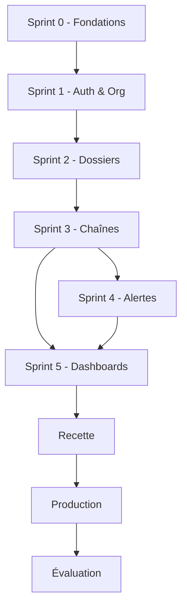

# Roadmap d'implémentation — FluxPro MINTP

**Projet :** FluxPro — Suivi de dossiers par chaîne hiérarchique  
**Cas pilote :** Ministère des Travaux Publics du Cameroun (MINTP)  
**Durée totale :** 36 semaines (~9 mois)  
**Référence :** [Cahier des charges v1.0](./CAHIER-DES-CHARGES-CHAINEFLUX-MINTP%20(1).md)  
**Date du roadmap :** 30 juin 2025

---

## 1. Vue d'ensemble

### 1.1 Objectif du roadmap

Ce document traduit le cahier des charges en plan d'exécution concret : phases, sprints, livrables, dépendances techniques et critères d'acceptation. Il sert de fil conducteur pour l'équipe de développement et le comité de pilotage MINTP.

### 1.2 État actuel du dépôt

| Composant | Stack actuelle | Écart vs CDC |
|-----------|----------------|--------------|
| Frontend (`flux-pro-front`) | Next.js 16, React 19, TypeScript, Tailwind, shadcn/ui | Conforme |
| Backend (`flux-pro-backend`) | Spring Boot (Java) | CDC recommande NestJS ou FastAPI — **décision à figer en S0** |
| Infrastructure | MySQL local (dev) | Pas de Docker en dev ; Redis, MinIO à provisionner plus tard (S2–S4) |
| Fonctionnalités | Squelette UI uniquement | MVP complet à développer |

### 1.3 Périmètre MVP pilote

- **Entités :** DAG, DIER, DRTP Centre (~85 utilisateurs)
- **Types de dossiers :** Courriers entrants (P1), Marchés publics simplifiés (P1), Autorisations travaux (P2)
- **Templates :** T01, T02, T03, T04 (+ T05 pré-configuré hors pilote actif)

### 1.4 Timeline globale

```
Sem.  1────4────8────12───16───20───24───28───32───36
      │Phase 0│──── Phase 1 : Développement MVP ────│
      │Cadrage│                                    │Phase 2│
      │       │                                    │Recette│
      │       │                                    │Form.  │
      │       │                                    │PROD   │
      │       │                                    │── Phase 3-4 : Pilote & évaluation ──│
```

| Phase | Semaines | Durée | Objectif |
|-------|----------|-------|----------|
| **Phase 0** — Cadrage | S1–S4 | 4 sem. | Valider le périmètre, baseline, données initiales |
| **Phase 1** — MVP | S5–S16 | 12 sem. | Développer et intégrer toutes les fonctionnalités Must |
| **Phase 2** — Recette & formation | S17–S20 | 4 sem. | Tests, corrections, documentation, formation |
| **Phase 3** — Production pilote | S21 | 1 sem. | Bascule progressive DAG → DIER → DRTP |
| **Phase 4** — Évaluation | S22–S36 | 15 sem. | Observation 3 mois, mesure KPI, recommandations |

---

## 2. Phase 0 — Cadrage (Semaines 1–4)

### 2.1 Objectifs

- Valider le cahier des charges et nommer le comité de pilotage
- Collecter les données métier nécessaires au développement
- Établir la baseline de performance (délais actuels)
- Finaliser les choix techniques et l'environnement de travail

### 2.2 Activités détaillées

| Semaine | Activité | Responsable | Livrable |
|---------|----------|-------------|----------|
| S1 | Validation CDC + nomination comité pilotage | SG + Chef projet | CDC signé, note de service |
| S1 | Atelier architecture technique | DSI + Équipe dev | Document d'architecture (ADR) |
| S2 | Inventaire types de dossiers (DAG, DIER, DRTP) | Référents métier | Catalogue dossiers v1 |
| S2 | Export annuaire agents (CSV) | DSI + RH | Fichier `agents-mintp.csv` |
| S3 | Mesure baseline sur 30 dossiers/direction | Référents métier | Rapport baseline |
| S3 | Maquettage UX (écrans clés) | UX + Référents | Wireframes validés |
| S4 | Setup environnements dev/staging | DSI + DevOps | Infra opérationnelle |
| S4 | Import référentiel org MINTP (10 DRTP) | Admin métier | Données org en staging |

### 2.3 Décisions techniques à prendre (S1)

| Décision | Options | Recommandation |
|----------|---------|----------------|
| Backend | Conserver Spring Boot vs migrer NestJS/FastAPI | **Spring Boot** si l'équipe Java est en place ; aligner sur compétences internes |
| Hébergement pilote | OVH/Scaleway (A), Cloud Temple (B), On-premise (C) | Option A pour time-to-market |
| Stockage fichiers | MinIO self-hosted vs S3-compatible cloud | MinIO sur même VPS pilote |
| Authentification | JWT maison vs Keycloak | JWT + refresh token (phase 1) |

### 2.4 Critères de sortie Phase 0

- [ ] CDC signé par SG, Directeurs pilotes et DSI
- [ ] Comité de pilotage opérationnel (réunions hebdo planifiées)
- [ ] Baseline mesurée (délais courrier, marché, autorisation travaux)
- [ ] Fichiers CSV agents + organigramme MINTP disponibles
- [ ] Environnements `dev` et `staging` accessibles
- [ ] Backlog produit priorisé et découpé en 6 sprints

---

## 3. Phase 1 — Développement MVP (Semaines 5–16)

Organisation en **6 sprints de 2 semaines**. Chaque sprint se termine par une démo au comité technique et une livraison sur `staging`.

### Sprint 0 — Fondations (Semaines 5–6)

**Thème :** Socle technique, CI/CD, modèle de données

| Epic | Tâches | Exigences CDC |
|------|--------|---------------|
| Infrastructure | MySQL local + CI/CD GitHub Actions (pas de Docker en dev) | §13.3 |
| Backend core | Schéma BDD, migrations Flyway/Liquibase, modules de base | §14 |
| Frontend core | Layout app, routing, thème MINTP, i18n FR | §12.3 |
| DevOps | Environnements dev/staging/prod, secrets, TLS | §12.4, §15 |

**Entités BDD à créer :**
`Organisation`, `Utilisateur`, `TemplateChaine`, `MaillonTemplate`, `Dossier`, `Passation`, `PieceJointe`, `Alerte`, `AuditLog`

**Critères d'acceptation :**
- [ ] Backend connecté à **MySQL local** (`fluxpro` sur `localhost:3306`) — sans Docker
- [ ] Pipeline CI : lint + tests + build sur chaque PR
- [ ] Schéma BDD versionné et documenté

---

### Sprint 1 — Auth & Référentiel organisationnel (Semaines 7–8)

**Thème :** Authentification, RBAC, organigramme MINTP

| Module | Fonctionnalités | IDs CDC |
|--------|-----------------|---------|
| AUTH | Login email/mot de passe, politique MDP, verrouillage 5 tentatives, session 8h, journal connexions | AUTH-01 à AUTH-04, AUTH-07 |
| ORG | Arbre hiérarchique, CRUD organisations, import CSV/Excel | ORG-01, ORG-02, ORG-06 |
| Users | CRUD utilisateurs, affectation poste/direction, 10 rôles RBAC | §5.1 |
| Frontend | Pages login, admin org, admin users | — |

**Rôles RBAC à implémenter :**
`SUPER_ADMIN`, `ADMIN_METIER`, `CABINET`, `SG`, `DIRECTEUR`, `CHEF_SERVICE`, `AGENT`, `APPUI`, `LECTEUR`, `DRTP`

**Critères d'acceptation :**
- [ ] Import CSV de 85 agents pilotes réussi
- [ ] Un agent DRTP Centre ne voit pas les dossiers DRTP Littoral (isolation org)
- [ ] Verrouillage compte après 5 échecs testé
- [ ] Journal connexions consultable par SUPER_ADMIN

**Livrables :** API Auth + Org documentée (OpenAPI/Swagger)

---

### Sprint 2 — Gestion des dossiers (Semaines 9–10)

**Thème :** CRUD dossiers, numérotation, pièces jointes, recherche

| Module | Fonctionnalités | IDs CDC |
|--------|-----------------|---------|
| DOS | Création dossier, numéro auto `MINTP-{DIR}-{ANNÉE}-{SÉQUENCE}`, statuts, priorités | DOS-01 à DOS-04, DOS-07 |
| Fichiers | Upload PDF/DOCX/XLSX/JPG/PNG (max 20 Mo), stockage MinIO | DOS-05 |
| Recherche | Full-text objet/numéro/expéditeur, filtres direction/statut/retard/responsable/période | DOS-08, DOS-09 |
| Frontend | Liste dossiers, fiche dossier, formulaire création, upload | Annexe C |

**Règles métier :**
- Numérotation séquentielle par direction et année
- Statuts : `Brouillon`, `En cours`, `En attente`, `Clôturé`, `Archivé`, `Annulé`
- Priorités : `Normal`, `Urgent`, `Très urgent`

**Critères d'acceptation :**
- [ ] Création dossier génère `MINTP-DAG-2025-0001` correctement
- [ ] Upload 20 Mo accepté, 21 Mo rejeté
- [ ] Recherche < 2 s sur 1000 dossiers (PERF-02)
- [ ] Commentaires internes par maillon (DOS-10)

---

### Sprint 3 — Chaînes de passation (Semaines 11–12)

**Thème :** Templates, transmission, calcul délais, cœur métier

| Module | Fonctionnalités | IDs CDC |
|--------|-----------------|---------|
| CHN Templates | CRUD templates T01–T05, maillons (libellé, rôle, délai, action) | CHN-01, CHN-02 |
| Passation | Transmission maillon à maillon, horodatage, verrouillage 1 responsable | CHN-03, CHN-04, CHN-08 |
| Délais | Calcul jours ouvrés, heures ouvrées (Très urgent), jours fériés CM | RM-01 à RM-04, CHN-05 |
| Workflow | Retour arrière (motif 20 car.), statut « En attente pièce externe » | CHN-06, CHN-07, RM-05 |
| Frontend | Vue circuit dossier, boutons Transmettre/Retourner, indicateur « chez M. X depuis N jours » | UC-01, UC-02 |

**Templates pilote à configurer :**

| Code | Type | Maillons | Délai total |
|------|------|----------|-------------|
| T01 | Courrier entrant standard | 7 | 11 j.o. |
| T02 | Courrier très urgent | 6 | 2 j.o. |
| T03 | Marché public simplifié | 7 | 15 j.o. |
| T04 | Autorisation travaux | 5 | 18 j.o. |

**Service critique :** `DelaiService` — calcul jours ouvrés avec calendrier fériés Cameroun (Annexe B)

**Critères d'acceptation :**
- [ ] UC-01 complet de bout en bout (courrier entrant DAG)
- [ ] UC-02 complet (marché DIER)
- [ ] UC-03 complet (autorisation DRTP)
- [ ] Suspension délai en statut « En attente pièce externe »
- [ ] Un seul responsable actif par dossier à tout instant

---

### Sprint 4 — Alertes & notifications (Semaines 13–14)

**Thème :** Moteur d'alertes, escalade hiérarchique, emails

| Module | Fonctionnalités | IDs CDC |
|--------|-----------------|---------|
| ALR | Rappel J-2, alerte J+0, escalade J+3 (directeur), J+7 (SG) | ALR-01 à ALR-04 |
| Worker CRON | Job quotidien calcul retards, file Redis/BullMQ | §13.1 |
| Notifications | In-app (WebSocket ou polling), email SMTP MINTP | ALR-05 |
| Config | Seuils paramétrables par template, suspension si attente externe | ALR-06, ALR-07 |
| Frontend | Centre notifications, badge alertes, préférences | Annexe C |

**Matrice d'escalade par défaut :**

| Seuil | Destinataires |
|-------|---------------|
| J-2 | Responsable actuel |
| J+0 | Responsable + Chef de service |
| J+3 | Directeur |
| J+7 | Secrétaire Général |

**Critères d'acceptation :**
- [ ] Alerte J-2 déclenchée automatiquement (test avec délai raccourci)
- [ ] Email reçu via SMTP MINTP
- [ ] Notification in-app visible au login
- [ ] Alertes suspendues si dossier « En attente pièce externe »
- [ ] ≥ 95 % alertes à temps sur jeu de test (KPI O3)

---

### Sprint 5 — Tableaux de bord & reporting (Semaines 15–16)

**Thème :** Dashboards par rôle, statistiques, exports

| Module | Fonctionnalités | IDs CDC |
|--------|-----------------|---------|
| DSH Agent | Mes dossiers, retards, transmissions | DSH-01 |
| DSH Chef service | Dossiers équipe, charge par agent | DSH-02 |
| DSH Directeur | KPI direction, top retards, délai moyen | DSH-03, UC-04 |
| DSH SG/Cabinet | Vision transversale, heatmap directions | DSH-04 |
| Stats | Compteurs, graphiques 30/90j, classement directions | DSH-05 à DSH-07 |
| Exports | CSV/PDF rapports, fiche circulation PDF | DSH-08, AUD-02 |
| AUD | Journal inaltérable, horodatage NTP, conservation 5 ans | AUD-01, AUD-03, AUD-04 |

**Critères d'acceptation :**
- [ ] Dashboard directeur charge < 3 s (PERF-01)
- [ ] Export PDF fiche de circulation conforme
- [ ] Rapport mensuel PDF généré automatiquement (template)
- [ ] Journal audit : aucune suppression possible (append-only)
- [ ] UC-04 validé avec données réalistes

---

## 4. Phase 2 — Recette & formation (Semaines 17–20)

### 4.1 Semaine 17–18 : Recette fonctionnelle

| Activité | Détail |
|----------|--------|
| Tests utilisateurs | 10 agents (3 DAG, 4 DIER, 3 DRTP) |
| Scénarios de test | UC-01, UC-02, UC-03, UC-04 + cas limites |
| Tests non fonctionnels | Performance (100 users simultanés), sécurité (OWASP top 10), RBAC |
| Corrections | Buffer 1 semaine pour bugs P1/P2 |

**Matrice de recette (extrait) :**

| # | Scénario | Résultat attendu |
|---|----------|------------------|
| R01 | Créer courrier entrant + transmettre 7 maillons | Dossier clôturé, journal complet |
| R02 | Laisser dossier en retard 3 jours | Escalade directeur déclenchée |
| R03 | Agent DRTP tente accès dossier DIER | Accès refusé (403) |
| R04 | Retour arrière sans motif (< 20 car.) | Validation refusée |
| R05 | Export fiche circulation PDF | PDF horodaté, lisible |

### 4.2 Semaine 19 : Formation

| Session | Public | Durée | Contenu |
|---------|--------|-------|---------|
| F1 | Référents DAG | 4 h | Admin métier, templates, paramétrage alertes |
| F2 | Référents DIER + DRTP | 4 h | Idem |
| F3–F8 | Agents (6 × 15 pers.) | 2 h | Création dossier, transmission, dashboard |

### 4.3 Semaine 20 : Documentation & gel

| Livrable | Description |
|----------|-------------|
| Guide utilisateur | PDF + vidéos courtes (< 3 min) |
| Guide administrateur | Import CSV, gestion templates, paramètres alertes |
| Documentation technique | Architecture, API, procédures déploiement |
| Release candidate | Tag `v1.0.0-rc1` sur staging |

---

## 5. Phase 3 — Mise en production pilote (Semaine 21)

### 5.1 Plan de bascule progressive

```
Semaine 21
├── J1-J2 : DAG (courriers entrants) — 25 users
├── J3-J4 : DIER (marchés publics) — 30 users
└── J5    : DRTP Centre (autorisations travaux) — 20 users
```

### 5.2 Checklist go-live

- [ ] Sauvegarde BDD + fichiers testée (restauration validée)
- [ ] Monitoring actif (uptime, latence, erreurs)
- [ ] Hotline DSI + éditeur opérationnelle (4 semaines)
- [ ] Double saisie papier + FluxPro (2 premières semaines) — mitigation résistance au changement
- [ ] Point comité pilotage J+1, J+7

### 5.3 Support post-déploiement (S21–S24)

| Niveau | SLA | Canal |
|--------|-----|-------|
| P1 — Application indisponible | < 4 h | Hotline + email |
| P2 — Fonction bloquante | < 8 h ouvrées | Ticket |
| P3 — Anomalie mineure | < 48 h | Ticket |

---

## 6. Phase 4 — Évaluation pilote (Semaines 22–36)

### 6.1 Période d'observation (3 mois)

| Mois | Focus | Actions |
|------|-------|---------|
| M1 | Adoption | Suivi connexions hebdo, support renforcé, ajustements UX |
| M2 | Performance | Mesure délais vs baseline, taux respect SLA |
| M3 | Consolidation | Rapport KPI, enquête satisfaction, recommandations |

### 6.2 KPI à mesurer

**Opérationnels :**

| KPI | Baseline | Cible | Source |
|-----|----------|-------|--------|
| Délai moyen courrier entrant | 25 j | ≤ 15 j | FluxPro |
| Délai moyen marché simplifié | 45 j | ≤ 25 j | FluxPro |
| Délai moyen autorisation travaux | 35 j | ≤ 20 j | FluxPro |
| Dossiers avec responsable identifié | ~40 % | 100 % | FluxPro |
| Alertes déclenchées à temps | 0 % | ≥ 95 % | FluxPro |
| Respect délais internes | ~50 % | ≥ 75 % | FluxPro |

**Adoption :**

| KPI | Cible |
|-----|-------|
| Connexion hebdomadaire | ≥ 80 % users pilotes |
| Dossiers dans FluxPro vs papier | ≥ 90 % à M+2 |
| Satisfaction (enquête) | ≥ 3,5 / 5 |

### 6.3 Livrables finaux

| # | Livrable | Semaine |
|---|----------|---------|
| L6 | Rapport mensuel automatisé (template actif) | S24 |
| L7 | Rapport d'évaluation pilote + recommandations | S36 |
| L8 | Dossier de généralisation (10 DRTP) | S36 |

---

## 7. Architecture cible & structure du code

### 7.1 Stack recommandée (alignée dépôt)

```
fluxpro/
├── flux-pro-front/          # Next.js 16 + React + shadcn/ui
│   ├── src/app/             # App Router (pages)
│   ├── src/components/      # UI + métier
│   ├── src/lib/             # API client, utils
│   └── src/types/           # Types TypeScript
├── flux-pro-backend/        # Spring Boot 3.x
│   ├── domain/              # Entités JPA
│   ├── repository/          # Repositories
│   ├── service/             # Logique métier
│   │   ├── DossierService
│   │   ├── ChaineService
│   │   ├── DelaiService      # ← Critique
│   │   ├── AlerteService
│   │   ├── AuditService
│   │   ├── ReportService
│   │   └── NotificationService
│   ├── controller/          # REST API
│   ├── security/            # JWT + RBAC
│   └── worker/              # Jobs CRON alertes
├── infra/                   # Optionnel — staging/prod uniquement
│   └── scripts/             # Backup, migration
│   # Dev local : MySQL installé sur la machine (voir application.properties)
└── docs/
```

### 7.2 Modules backend par sprint

| Sprint | Packages / modules |
|--------|-------------------|
| S0 | `config`, `domain`, migrations |
| S1 | `auth`, `organisation`, `utilisateur`, `security` |
| S2 | `dossier`, `piecejointe`, `recherche` |
| S3 | `template`, `passation`, `delai` |
| S4 | `alerte`, `notification`, `worker` |
| S5 | `dashboard`, `report`, `audit` |

### 7.3 Pages frontend par sprint

| Sprint | Routes |
|--------|--------|
| S0 | `/`, layout, design system |
| S1 | `/login`, `/admin/org`, `/admin/users` |
| S2 | `/dossiers`, `/dossiers/nouveau`, `/dossiers/[id]` |
| S3 | `/dossiers/[id]/circuit`, transmission modals |
| S4 | `/notifications`, composant cloche alertes |
| S5 | `/dashboard`, `/dashboard/equipe`, `/dashboard/direction`, `/rapports` |

---

## 8. Dépendances entre modules



**Chemin critique :** Auth → Org → Dossiers → Passation/Délais → Alertes → Dashboards

**Parallélisable :**
- Maquettage UX (Phase 0) en parallèle du Sprint 0
- Documentation utilisateur dès Sprint 4
- Tests unitaires `DelaiService` dès Sprint 3

---

## 9. Phase 2 post-pilote (roadmap indicative)

À planifier après validation du pilote (S36+) :

| Trimestre | Fonctionnalités | Priorité |
|-----------|-----------------|----------|
| T1 | SMS (MTN/Orange), digest email 7h30 directeurs | Should |
| T1 | Intérim / suppléance (ORG-04), CC informé (CHN-09) | Should |
| T2 | LDAP/AD MINTP, 2FA email | Should |
| T2 | Extension 10 DRTP | Must |
| T3 | PWA mobile, mode dégradé offline | Could |
| T3 | Workflows parallèles (visas simultanés) | Could |
| T4 | Dashboard Ministre/Cabinet, API GED | Should |

---

## 10. Équipe & charge estimée

### 10.1 Équipe MVP recommandée

| Rôle | ETP | Période |
|------|-----|---------|
| Chef de projet / PO | 0,5 | S1–S36 |
| Dev backend (Spring Boot) | 1,5 | S5–S16 |
| Dev frontend (Next.js) | 1 | S5–S16 |
| Dev full-stack / lead | 1 | S5–S20 |
| QA / testeur | 0,5 | S13–S20 |
| DevOps | 0,25 | S1–S21 |
| UX/UI | 0,25 | S1–S8 |
| Référent métier MINTP | 0,25 | S1–S36 |

**Total développement MVP :** ~3 ETP × 4 mois (conforme budget CDC §20.1)

### 10.2 Vélocité cible par sprint

| Sprint | Story points cible | Risque |
|--------|-------------------|--------|
| S0 | 15 | Faible |
| S1 | 25 | Moyen (RBAC complexe) |
| S2 | 20 | Faible |
| S3 | 30 | **Élevé** (cœur métier) |
| S4 | 25 | Moyen (async, SMTP) |
| S5 | 25 | Moyen (reporting) |

---

## 11. Risques & mitigations

| Risque | Impact | Mitigation | Sprint concerné |
|--------|--------|------------|-----------------|
| Calcul délais incorrect | Fort | Tests exhaustifs calendrier CM, revue métier | S3 |
| Résistance au changement | Fort | Double saisie temporaire, sponsors SG | S21+ |
| Données org incomplètes | Moyen | Atelier import S4, validation référents | S0, S1 |
| SMTP MINTP indisponible | Moyen | File d'attente + retry, alertes in-app prioritaires | S4 |
| Performance dashboards | Moyen | Index BDD, cache Redis, pagination | S5 |
| Écart stack backend (Java vs Node) | Faible | Documenter ADR, capitaliser compétences équipe | S0 |

---

## 12. Definition of Done (DoD)

Une user story est **Done** lorsque :

1. Code revu et mergé sur `main`
2. Tests unitaires + intégration passants
3. API documentée (Swagger) si applicable
4. Interface responsive (≥ 1280×720)
5. Textes en français, dates JJ/MM/AAAA, fuseau Africa/Douala
6. Journal audit alimenté pour actions métier
7. Déployé sur `staging` et démontrable
8. Pas de régression sur scénarios de recette existants

---

## 13. Prochaines actions immédiates

| # | Action | Responsable | Échéance |
|---|--------|-------------|----------|
| 1 | Valider le choix Spring Boot vs NestJS (ADR) | DSI + Lead dev | S1 |
| 2 | Configurer MySQL local + documenter `application.properties` | Dev | S1 |
| 3 | Créer le schéma BDD initial (14 entités §14.1) | Backend | S5 |
| 4 | Implémenter module Auth + RBAC | Backend + Frontend | S7–S8 |
| 5 | Planifier atelier import CSV avec RH MINTP | Chef projet | S2 |
| 6 | Initialiser backlog Jira/Linear avec epics S0–S5 | PO | S1 |

---

*Roadmap v1.0 — Projet FluxPro — À réviser après Phase 0 (Semaine 4).*
