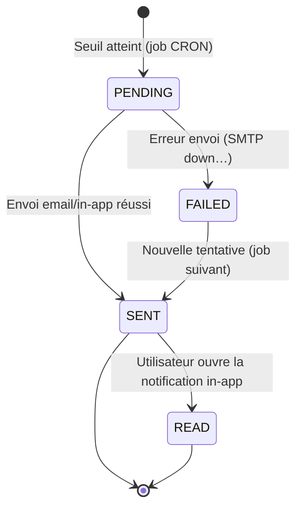

# Spécification détaillée — Module ALR (Alertes et escalade)

**Projet :** FluxPro — Suivi de dossiers par chaîne hiérarchique
**Cas pilote :** Ministère des Travaux Publics du Cameroun (MINTP)
**Module :** ALR — Alertes et escalade (CDC §7.5)
**Version :** 1.0
**Date :** 4 juillet 2026
**Statut :** Spécification cible — **non implémenté** (prérequis CHN-PASS / DEL livrés)

**Références :**
- [Cahier des charges §7.5](./CAHIER-DES-CHARGES-CHAINEFLUX-MINTP%20(1).md) — ALR-01 à ALR-09
- [Cahier des charges §10](./CAHIER-DES-CHARGES-CHAINEFLUX-MINTP%20(1).md#10-règles-métier-et-alertes) — §10.1 calcul des délais, §10.2 matrice d'escalade par défaut
- [Cahier des charges §11.1](./CAHIER-DES-CHARGES-CHAINEFLUX-MINTP%20(1).md) — rapport mensuel automatique
- [Roadmap — Sprint 4](./ROADMAP-IMPLEMENTATION-CHAINEFLUX.md) — moteur d'alertes, escalade, notifications email
- [SPEC CHN](./SPEC-CHN.md) — module chaîne de passation : `FilePassage`, `due_at`, `overdue`, verrouillage
- [SPEC DOS](./SPEC-DOS.md) — `FileEntity`, statuts, `file_id`
- [SPEC USR / RBAC](./SPEC-USR-RBAC.md) — rôles, permissions, hiérarchie
- Code existant : `DelaiService`, `PassageService`, `ResponsibleUserResolver`, `PassageAuthorityService`
- Règle projet : `spring.jpa.hibernate.ddl-auto=none` — scripts dans `docs/sql/`

---

## Table des matières

1. [Contexte et objectifs](#1-contexte-et-objectifs)
2. [État des lieux](#2-état-des-lieux)
3. [Périmètre fonctionnel](#3-périmètre-fonctionnel)
4. [Concepts métier](#4-concepts-métier)
5. [Architecture et flux](#5-architecture-et-flux)
6. [Modèle de données](#6-modèle-de-données)
7. [Règles métier et matrice d'escalade](#7-règles-métier-et-matrice-descalade)
8. [Moteur d'alertes — algorithme](#8-moteur-dalertes--algorithme)
9. [Canaux de notification](#9-canaux-de-notification)
10. [API REST](#10-api-rest)
11. [RBAC et permissions](#11-rbac-et-permissions)
12. [Frontend — centre de notifications](#12-frontend--centre-de-notifications)
13. [User stories et cas d'usage](#13-user-stories-et-cas-dusage)
14. [Plan de tests](#14-plan-de-tests)
15. [Recette UAT](#15-recette-uat)
16. [Hors périmètre et dépendances](#16-hors-périmètre-et-dépendances)
17. [Definition of Done](#17-definition-of-done)

---

## 1. Contexte et objectifs

### 1.1 Problème

Le module **CHN-PASS** calcule une échéance (`due_at`) pour chaque maillon actif et expose un indicateur de retard (`overdue`), mais rien ne se passe automatiquement quand un maillon dépasse son délai : personne n'est prévenu tant que quelqu'un ne consulte pas le dossier. C'est exactement le constat de la Phase 0 (*« absence d'alerte précoce »*, objectif **O3** du CDC) qui justifie FluxPro.

Le module **ALR** transforme les échéances calculées par `DelaiService` en **alertes proactives** : rappel avant échéance, notification au dépassement, puis escalade hiérarchique automatique si le retard persiste.

### 1.2 Objectifs du module ALR

| Objectif | Description | Exigence CDC |
|----------|-------------|--------------|
| **Prévenir** | Rappeler au responsable actuel avant l'échéance | ALR-01 |
| **Signaler** | Notifier le retard dès qu'il survient | ALR-02 |
| **Escalader** | Remonter automatiquement la hiérarchie si le retard persiste | ALR-03, ALR-04 |
| **Diffuser** | Notifier sur plusieurs canaux (in-app, email, SMS phase 2) | ALR-05, ALR-09 |
| **Paramétrer** | Permettre à l'admin métier d'ajuster les seuils par template | ALR-06 |
| **Suspendre** | Ne jamais alerter un dossier légitimement en attente externe | ALR-07 |
| **Synthétiser** | Donner à chaque directeur une vue quotidienne des retards | ALR-08 |

### 1.3 Exigences CDC §7.5 couvertes

| ID | Libellé | Priorité | Sprint cible |
|----|---------|----------|--------------|
| ALR-01 | Alerte J-2 : rappel au responsable actuel | Must | S4 |
| ALR-02 | Alerte J+0 : dépassement — notification responsable + chef de service | Must | S4 |
| ALR-03 | Alerte J+3 : escalade au directeur | Must | S4 |
| ALR-04 | Alerte J+7 : escalade au Secrétaire Général | Should | S4 |
| ALR-05 | Canaux : notification in-app + email | Must | S4 |
| ALR-06 | Paramétrage des seuils par template de chaîne | Must | S4 |
| ALR-07 | Désactivation alertes si dossier en statut « En attente pièce externe » | Must | S4 |
| ALR-08 | Récapitulatif quotidien des retards par directeur (digest email 7h30) | Should | S4 |
| ALR-09 | SMS via API opérateur local | Could | Phase 2 |

### 1.4 Principes transverses

- Nommage technique en **anglais** (`alerts`, `alert_rules`, `alert_types`), aligné sur les conventions CHN/DOS déjà en place.
- UUID en **BINARY(16)** ; schéma BDD via scripts SQL manuels (`docs/sql/`) — **jamais** via `ddl-auto`.
- Fuseau horaire métier : **`Africa/Douala`** (UTC+1), cohérent avec `DelaiService.BUSINESS_ZONE`.
- **Aucun rôle destinataire n'est codé en dur dans le moteur.** « Directeur » (J+3) ou « chef de service » (J+0) sont des valeurs de configuration dans `alert_rules.target_role` — n'importe quel rôle du référentiel `UserRole` peut être assigné à n'importe quel seuil, pour n'importe quel template (ALR-06). Le moteur ne fait que lire cette configuration, il n'a aucune connaissance métier de « qui doit recevoir quoi ».
- **Aucun type d'alerte n'est figé dans une énumération Java.** `REMINDER`, `OVERDUE`, `ESCALATION`, `DAILY_DIGEST` sont des **lignes d'un catalogue administrable** (`alert_types`, cf. §6.2), au même titre que `file_types` pour les dossiers. Un admin métier peut créer un nouveau type (ex. « Relance intermédiaire », « Alerte critique Cabinet ») sans déploiement.
- **Aucune règle d'alerte n'est globale ou implicite.** Chaque `AlertRule` est rattachée à un `chain_template_id` obligatoire, exactement comme un `ChainStepTemplate` appartient à un `ChainTemplate` — il n'existe pas de « matrice par défaut » appliquée en coulisses par le moteur. La matrice CDC §10.2 n'est qu'un **profil de seed optionnel**, que l'admin peut appliquer (copier) sur un template au moment de sa création, puis modifier librement.
- Le moteur d'alertes est un **consommateur** de CHN-PASS : il ne modifie jamais `FilePassage` ni `FileEntity` (sauf marquage interne des alertes envoyées).
- Toute alerte envoyée est **idempotente** : un même couple (maillon, seuil) ne génère jamais deux notifications.
- Chaque envoi alimente le journal d'audit (AUD-01, Sprint 5) via l'action `ALERT_SENT`.
- Erreurs API : **RFC 7807** (`ProblemDetail`), cohérent avec CHN/DOS.

---

## 2. État des lieux

*Mise à jour : 4 juillet 2026*

| Composant | Statut |
|-----------|--------|
| Entité `FilePassage` (`due_at`, `status`, `suspended_at`) | **Livré** (module CHN-PASS) |
| `DelaiService` (`isOverdue`, `countWorkingDays`, fuseau `Africa/Douala`) | **Livré** |
| `ResponsibleUserResolver.resolve(file, role)` | **Livré** — réutilisable pour résoudre directeur / SG |
| `PassageAuthorityService.ROLE_RANK` | **Livré** — hiérarchie des rôles réutilisable pour l'escalade |
| Entité `Alert` / table `alerts` | Non créée |
| Table `alert_types` (catalogue administrable des types d'alerte) | Non créée |
| Table `alert_rules` (seuils, obligatoirement rattachés à un template) | Non créée |
| `AlertEngineService` (calcul des seuils, création alertes) | Non implémenté |
| `AlertTypeService` (CRUD catalogue des types) | Non implémenté |
| `NotificationService` (email + in-app) | Non implémenté |
| Job CRON quotidien (`AlertSchedulerJob`) | Non implémenté |
| Digest email 7h30 (`AlertDigestJob`) | Non implémenté |
| Intégration SMTP MINTP (`JavaMailSender`) | Non configurée (`application.properties`) |
| Permissions `ALERTS:*` (RBAC) | Non seedées |
| API `/api/alerts`, `/api/notifications` | Non implémentée |
| Frontend — centre de notifications, badge cloche | Non implémenté |
| Passerelle SMS opérateur local (ALR-09) | Non implémentée (Phase 2) |

### 2.1 Prérequis satisfaits

| Prérequis | Module | Apport pour ALR |
|-----------|--------|------------------|
| Auth JWT + RBAC | USR | Identification des destinataires, permissions |
| Organisations + hiérarchie | ORG | Résolution chef de service / directeur / SG |
| Dossiers (`FileEntity`) | DOS | `file_id`, `status`, `ON_HOLD` |
| Chaîne de passation (`FilePassage`) | CHN-PASS | `due_at`, `status IN_PROGRESS/SUSPENDED`, `responsible_user_id` |
| Calcul des délais (`DelaiService`) | DEL | Jours/heures ouvrés, jours fériés CM |

---

## 3. Périmètre fonctionnel

### 3.1 Fonctionnalités Must

| ID | Fonctionnalité | Exigence CDC |
|----|----------------|--------------|
| ALR-F01 | Calculer, pour chaque maillon actif, les seuils applicables (J-2, J+0, J+3, J+7…) | ALR-01..04, RM-01 |
| ALR-F02 | Générer une alerte **RAPPEL** au responsable actuel à J-2 | ALR-01 |
| ALR-F03 | Générer une alerte **RETARD** au responsable + chef de service à J+0 | ALR-02 |
| ALR-F04 | Générer une alerte **ESCALADE niveau 1** au directeur à J+3 | ALR-03 |
| ALR-F05 | Générer une alerte **ESCALADE niveau 2** au SG à J+7 | ALR-04 |
| ALR-F06 | Envoyer chaque alerte sur les canaux configurés (in-app + email) | ALR-05 |
| ALR-F07 | Exposer un centre de notifications in-app avec badge non-lues | ALR-05 |
| ALR-F08 | Paramétrer les seuils (offset, type, destinataire) **par template de chaîne**, chaque template portant sa propre configuration | ALR-06 |
| ALR-F09 | Ne déclencher aucune alerte tant que le maillon est `SUSPENDED` / dossier `ON_HOLD` | ALR-07 |
| ALR-F10 | Reprendre le calcul des seuils au moment de la reprise (`resume`) sans rattraper les alertes manquées pendant la suspension | ALR-07 |
| ALR-F11 | Ne jamais renvoyer deux fois la même alerte pour le même (maillon, seuil) | Règle idempotence |
| ALR-F12 | Marquer une notification in-app comme lue | ALR-05 |
| ALR-F17 | Gérer un catalogue de **types d'alerte créables/éditables** par l'admin métier (code, libellé, gabarit email) | ALR-06 (extension) |
| ALR-F18 | Appliquer un « profil de seed » (matrice CDC §10.2) sur un template au moment de sa création, comme point de départ éditable | ALR-06 (extension) |

### 3.2 Fonctionnalités Should

| ID | Fonctionnalité | Exigence CDC |
|----|----------------|--------------|
| ALR-F13 | Escalade niveau 3 (J+15, Cabinet) pour dossiers `URGENT` / `VERY_URGENT` uniquement | §10.2 matrice |
| ALR-F14 | Digest email quotidien 7h30 par directeur : retards de sa direction | ALR-08 |
| ALR-F15 | Préférences de notification par utilisateur (opt-out email non critique) | Confort UX |

### 3.3 Fonctionnalités Could (Phase 2)

| ID | Fonctionnalité | Exigence CDC |
|----|----------------|--------------|
| ALR-F16 | Envoi SMS via API opérateur local (MTN / Orange Cameroun) | ALR-09 |

---

## 4. Concepts métier

### 4.1 Vocabulaire

| Terme | Définition |
|-------|------------|
| **Seuil (threshold)** | Décalage temporel par rapport à `due_at` déclenchant une alerte (ex. J-2, J+3). |
| **Type d'alerte (`AlertType`)** | Nature du message, choisie dans un **catalogue administrable** (`alert_types`) — pas une énumération figée. `REMINDER`, `OVERDUE`, `ESCALATION`, `DAILY_DIGEST` sont les codes fournis en seed, mais un admin métier peut en créer d'autres à tout moment (ex. `RELANCE_INTERMEDIAIRE`). |
| **Niveau d'escalade** | Simple **numéro de palier** (1, 2, 3…) permettant d'ordonner les escalades successives d'un même maillon. Le rôle réellement notifié à chaque palier n'est pas fixé par le niveau : il est défini par la règle (`AlertRule.targetRole`), configurable indépendamment. |
| **Destinataire** | Utilisateur ciblé par une alerte, résolu à l'exécution à partir du **rôle configuré sur la règle** (`AlertRule.targetRole`, un `UserRole` quelconque) et de l'organisation du dossier — jamais un rôle fixé dans le code. |
| **Canal** | Moyen de diffusion : `IN_APP`, `EMAIL`, `SMS` (phase 2). |
| **Digest** | Email de synthèse quotidien regroupant tous les retards d'un périmètre, envoyé aux utilisateurs du rôle configuré pour ce digest (ALR-08). |
| **Règle d'alerte (`AlertRule`)** | Association seuil ↔ type (référence catalogue) ↔ rôle destinataire, **rattachée à un template de chaîne précis** — jamais une règle globale implicite (ALR-06). |
| **Profil de seed** | Jeu de règles pré-rempli (matrice CDC §10.2) qu'un admin peut appliquer sur un template lors de sa création, comme point de départ, puis modifier ou remplacer intégralement. |

### 4.2 Cycle de vie d'une alerte



### 4.3 Résolution des destinataires — principe générique

Le moteur ne connaît **aucun rôle par son nom**. Pour chaque seuil franchi, il lit la règle (`AlertRule`) applicable, qui porte :

- soit `targetMode = CURRENT_RESPONSIBLE` → le destinataire est le responsable actuel du maillon (`FilePassage.responsibleUser`) ;
- soit `targetMode = ROLE` + un `targetRole` quelconque (n'importe quelle valeur de l'énumération `UserRole` : `AGENT`, `SERVICE_HEAD`, `DIRECTOR`, `REGIONAL_DIRECTOR`, `SECRETARY_GENERAL`, `EXECUTIVE_OFFICE`…) → le destinataire est résolu via `ResponsibleUserResolver.resolve(file, targetRole)`, qui remonte l'arbre organisationnel du dossier jusqu'à trouver un utilisateur actif de ce rôle.

Une même règle peut aussi cibler **plusieurs rôles à la fois** (ex. J+0 → responsable + un second rôle) en associant plusieurs lignes `AlertRule` au même `threshold_code`.

### 4.4 Chaque template porte sa propre configuration d'alertes

Contrairement à une conception « règle globale + surcharges », FluxPro retient le même modèle que pour les maillons (`ChainStepTemplate` appartient à un `ChainTemplate`, sans « maillon par défaut » partagé) : une `AlertRule` appartient **toujours** à un `chain_template_id` précis. Il n'y a donc pas de comportement implicite — un template sans règle ne génère simplement **aucune alerte** tant que l'admin ne lui en a pas configuré.

Pour éviter de tout ressaisir à la main sur chaque nouveau template, un **profil de seed** optionnel (la matrice CDC §10.2 ci-dessous) peut être **appliqué** (copié) sur un template via une action explicite d'administration (§10.3) — après quoi les règles copiées appartiennent pleinement à ce template et peuvent être modifiées, complétées ou supprimées indépendamment des autres templates.

| Seuil (profil de seed CDC §10.2) | Type (code catalogue) | Niveau | Rôle cible proposé |
|-------------------------------------|--------------------------|--------|------------------------|
| J-2 | `REMINDER` | — | `CURRENT_RESPONSIBLE` |
| J+0 | `OVERDUE` | — | `CURRENT_RESPONSIBLE` + `SERVICE_HEAD` |
| J+3 ouvrés | `ESCALATION` | 1 | `DIRECTOR` |
| J+7 ouvrés | `ESCALATION` | 2 | `SECRETARY_GENERAL` |
| J+15 ouvrés (Should, priorité Urgent+) | `ESCALATION` | 3 | `EXECUTIVE_OFFICE` |

> Après application sur, par exemple, le template T04 (DRTP), l'admin peut librement changer le rôle du seuil J+3 en `REGIONAL_DIRECTOR`, ajouter un palier J+5 propre à T04, ou supprimer l'escalade J+15 — sans que cela affecte T01, T02, T03 ou T05. Un template peut aussi être configuré **sans jamais appliquer le profil de seed**, avec un jeu de seuils et de types entièrement différent.

### 4.5 Non-cumul et suspension (ALR-07)

- Si `FilePassage.status = SUSPENDED` (ou `FileEntity.status = ON_HOLD`) : **aucun** calcul de seuil, quel que soit `due_at`.
- À la reprise (`resume`), `due_at` est déjà recalculé par `PassageService` (décalage de la durée de suspension) — le moteur ALR repart avec des compteurs propres, sans envoyer d'alertes rétroactives pour la période gelée.
- Un maillon `RETURNED`, `COMPLETED` ou `SKIPPED` sort définitivement du périmètre d'alerte de ce maillon (plus de seuils à évaluer).

---

## 5. Architecture et flux

### 5.1 Packages backend cibles

```
com.nanotech.flux_pro_backend
├── entity/
│   ├── Alert.java                     ⏳
│   ├── AlertRule.java                 ⏳  (rattachée obligatoirement à un ChainTemplate)
│   └── AlertType.java                 ⏳  (catalogue administrable, PAS une enum)
├── enumeration/
│   ├── AlertChannel.java              ⏳  (IN_APP, EMAIL, SMS)
│   ├── AlertStatus.java               ⏳  (PENDING, SENT, FAILED, READ)
│   └── AlertTargetMode.java           ⏳  (CURRENT_RESPONSIBLE, ROLE)
├── service/
│   ├── AlertEngineService.java        ⏳  (calcul des seuils, création des alertes)
│   ├── AlertRuleService.java          ⏳  (CRUD seuils par template — ALR-06)
│   ├── AlertTypeService.java          ⏳  (CRUD catalogue des types — ALR-F17)
│   ├── AlertRuleSeedProfileService.java ⏳ (application du profil CDC §10.2 sur un template)
│   ├── NotificationService.java       ⏳  (dispatch email + in-app)
│   ├── EmailService.java              ⏳  (JavaMailSender, SMTP MINTP)
│   └── SmsGatewayService.java         ⏳  (interface + stub — Phase 2)
├── scheduler/
│   ├── AlertSchedulerJob.java         ⏳  (@Scheduled — évaluation seuils)
│   └── AlertDigestJob.java            ⏳  (@Scheduled 07:30 — ALR-08)
├── controller/
│   ├── AlertRuleController.java       ⏳  (admin — /api/admin/chain-templates/{id}/alert-rules)
│   ├── AlertTypeController.java       ⏳  (admin — /api/admin/alert-types)
│   └── NotificationController.java    ⏳  (/api/notifications)
```

> Notez l'absence d'`AlertType.java` dans `enumeration/` : le type d'alerte est une **entité JPA** (table `alert_types`), pas une constante Java, exactement comme `FileType` (référentiel `file_types`) n'est pas une énumération.

### 5.2 Vue d'ensemble du flux

```
┌────────────────────────────────────────────────────────────────┐
│                     AlertSchedulerJob (CRON)                   │
│                  toutes les 15–30 min, jours ouvrés             │
└───────────────────────────┬──────────────────────────────────┘
                            ▼
        FilePassageRepository.findActiveOverdueCandidates()
        (status IN (IN_PROGRESS) — SUSPENDED exclu ALR-07)
                            │
                            ▼
              Pour chaque FilePassage actif :
   rules = AlertRuleRepository.findActiveByChainTemplateId(passage.file.chainTemplate.id)
   (aucune règle globale implicite — un template sans règle ne produit aucune alerte)
                            │
                            ▼
      AlertEngineService.evaluate(passage, rules)
                            │
             seuil atteint ET alerte non déjà envoyée ?
                            │ oui
                            ▼
                 Alert créée (status = PENDING)
                            │
                            ▼
        NotificationService.dispatch(alert)
         ├── EmailService.send(...)      (canal EMAIL)
         └── persist in-app (canal IN_APP, visible immédiatement)
                            │
                            ▼
              Alert.status = SENT (ou FAILED + retry)
                            │
                            ▼
                  AuditLog: ALERT_SENT (Sprint 5)
```

### 5.3 Flux — digest quotidien (ALR-08)

```
AlertDigestJob — cron "0 30 7 * * MON-FRI" (Africa/Douala)
        │
        ▼
digestRole = configuration ALR-08 (rôle destinataire du digest, DIRECTOR par défaut — modifiable)
Pour chaque utilisateur actif du rôle digestRole (ex. DIRECTOR, ou REGIONAL_DIRECTOR pour le périmètre DRTP) :
   retards = FilePassageRepository.findOverdueByOrganizationScope(utilisateur.organization)
        │
        ▼
   Si retards non vide → EmailService.sendDigest(utilisateur, retards)
        │
        ▼
   Alert (type=DAILY_DIGEST, channel=EMAIL) tracée pour audit
```

> Le rôle destinataire du digest (`DIRECTOR` par défaut) est lui aussi une donnée de configuration (`fluxpro.alerts.digest.target-role` ou une ligne `AlertRule` dédiée au type `DAILY_DIGEST`), pas une valeur codée en dur — un déploiement pilote pourrait tout aussi bien l'attribuer à `SERVICE_HEAD` si le MINTP le souhaite.

### 5.4 Flux — suspension / reprise (rappel ALR-07)

```
PassageService.suspend(...)                 PassageService.resume(...)
        │                                            │
        ▼                                            ▼
FilePassage.status = SUSPENDED         FilePassage.status = IN_PROGRESS
        │                                            │
        ▼                                            ▼
AlertSchedulerJob exclut ce maillon    due_at décalé (déjà géré par CHN-PASS)
   de la sélection candidate                Nouveaux seuils réévalués au
   (aucune alerte tant que SUSPENDED)        prochain passage du job
```

---

## 6. Modèle de données

### 6.1 Schéma relationnel

```
alert_types (1) ──< alert_rules >── (1) chain_templates
chain_step_templates (0..1) ──< alert_rules   (rattachement fin à un maillon, optionnel)
files (1) ──< file_passages
file_passages (1) ──< alerts >── (1) users (destinataire)
alert_types (1) ──< alerts
users (1) ──< alerts (destinataire)
```

### 6.2 Table `alert_types` (catalogue administrable — pas une énumération)

```sql
CREATE TABLE alert_types (
    id                    BINARY(16)   NOT NULL PRIMARY KEY,
    code                  VARCHAR(30)  NOT NULL UNIQUE,      -- ex. 'REMINDER', 'ESCALATION', 'RELANCE_INTERMEDIAIRE'
    label                 VARCHAR(100) NOT NULL,             -- libellé affiché (FR)
    description           TEXT         NULL,
    email_template_code   VARCHAR(100) NULL,                 -- gabarit email à utiliser ; NULL = gabarit générique
    system_defined        BOOLEAN      NOT NULL DEFAULT FALSE, -- TRUE pour les 4 types de seed, protégés en suppression
    active                BOOLEAN      NOT NULL DEFAULT TRUE,
    created_at            DATETIME(6)  NOT NULL DEFAULT CURRENT_TIMESTAMP(6),
    updated_at            DATETIME(6)  NOT NULL DEFAULT CURRENT_TIMESTAMP(6)
        ON UPDATE CURRENT_TIMESTAMP(6)
) ENGINE=InnoDB DEFAULT CHARSET=utf8mb4 COLLATE=utf8mb4_unicode_ci;
```

**Seed initial (`system_defined = TRUE`, non supprimables, mais modifiables et désactivables) :**

| `code` | `label` | `email_template_code` |
|--------|---------|--------------------------|
| `REMINDER` | Rappel avant échéance | `alert-reminder` |
| `OVERDUE` | Dépassement de délai | `alert-overdue` |
| `ESCALATION` | Escalade hiérarchique | `alert-escalation` |
| `DAILY_DIGEST` | Récapitulatif quotidien | `alert-digest` |

> L'admin métier peut ajouter librement d'autres types (ex. `RELANCE_INTERMEDIAIRE`, `ALERTE_CRITIQUE_CABINET`) via `/api/admin/alert-types` (§10.3) : le moteur ne fait aucune hypothèse sur le nombre ou le nom des types existants, il traite chaque `AlertType` comme une donnée opaque servant à choisir un gabarit et à afficher un libellé. Seuls `system_defined = TRUE` sont protégés contre la suppression (mais restent modifiables/désactivables) car ils sont référencés par le profil de seed §4.4.

### 6.3 Table `alert_rules` — toujours rattachée à un template (ALR-06)

```sql
CREATE TABLE alert_rules (
    id                    BINARY(16)   NOT NULL PRIMARY KEY,
    chain_template_id     BINARY(16)   NOT NULL,     -- rattachement obligatoire, comme chain_step_templates
    chain_step_template_id BINARY(16)  NULL,          -- optionnel : restreindre la règle à un maillon précis du template
    threshold_code        VARCHAR(20)  NOT NULL,      -- libre : 'J_MINUS_2', 'J_PLUS_3', ou tout autre code choisi par l'admin
    offset_value          INT          NOT NULL,      -- ex. -2, 0, 3, 7, 15
    offset_unit           VARCHAR(20)  NOT NULL DEFAULT 'WORKING_DAYS',
    alert_type_id         BINARY(16)   NOT NULL,      -- FK vers alert_types — plus de valeur figée
    escalation_level      INT          NULL,           -- simple numéro de palier (1, 2, 3…)
    target_mode           VARCHAR(20)  NOT NULL DEFAULT 'ROLE', -- CURRENT_RESPONSIBLE | ROLE
    target_role           VARCHAR(30)  NULL,           -- valeur libre de l'énumération UserRole ; requis si target_mode = 'ROLE'
    priority_scope        VARCHAR(20)  NULL,           -- NULL = toutes priorités ; 'URGENT_PLUS' = Urgent/Très urgent seulement
    active                BOOLEAN      NOT NULL DEFAULT TRUE,
    created_at            DATETIME(6)  NOT NULL DEFAULT CURRENT_TIMESTAMP(6),
    updated_at            DATETIME(6)  NOT NULL DEFAULT CURRENT_TIMESTAMP(6)
        ON UPDATE CURRENT_TIMESTAMP(6),
    CONSTRAINT fk_alert_rule_template
        FOREIGN KEY (chain_template_id) REFERENCES chain_templates(id) ON DELETE CASCADE,
    CONSTRAINT fk_alert_rule_step_template
        FOREIGN KEY (chain_step_template_id) REFERENCES chain_step_templates(id) ON DELETE CASCADE,
    CONSTRAINT fk_alert_rule_type
        FOREIGN KEY (alert_type_id) REFERENCES alert_types(id),
    UNIQUE KEY uq_alert_rule (chain_template_id, threshold_code, target_mode, target_role),
    INDEX idx_alert_rule_template (chain_template_id),
    INDEX idx_alert_rule_type (alert_type_id)
) ENGINE=InnoDB DEFAULT CHARSET=utf8mb4 COLLATE=utf8mb4_unicode_ci;
```

**Résolution effective d'une règle pour un maillon donné :** `SELECT * FROM alert_rules WHERE chain_template_id = :templateDuDossier AND active = TRUE` — **aucun repli** sur une quelconque règle globale ou par défaut. Un template sans ligne dans `alert_rules` ne génère strictement aucune alerte, ce qui est un état valide (ex. un template pilote encore en phase de test peut volontairement n'avoir aucune alerte configurée). Un même `threshold_code` peut porter **plusieurs lignes** sur le même template (plusieurs rôles notifiés au même seuil, ex. J+0), l'unicité porte sur la combinaison (template, seuil, destinataire) pour éviter les doublons de configuration.

### 6.4 Profil de seed CDC §10.2 — application par template (ALR-F18)

Le contenu ci-dessous n'est **jamais lu directement par le moteur** : c'est un modèle que l'admin métier applique explicitement à un template via `POST /api/admin/chain-templates/{id}/alert-rules/apply-default-profile` (§10.3). L'opération **copie** ces lignes dans `alert_rules` avec le `chain_template_id` du template ciblé ; elles deviennent ensuite des règles ordinaires, éditables une à une, sans lien conservé avec un quelconque « profil ».

| `threshold_code` | `offset_value` | `alert_type.code` | `escalation_level` | `target_mode` | `target_role` | `priority_scope` |
|-------------------|-----------------|------------------------|----------------------|-----------------|----------------|--------------------|
| `J_MINUS_2` | -2 | `REMINDER` | — | `CURRENT_RESPONSIBLE` | — | — |
| `J_PLUS_0` | 0 | `OVERDUE` | — | `CURRENT_RESPONSIBLE` | — | — |
| `J_PLUS_0` | 0 | `OVERDUE` | — | `ROLE` | `SERVICE_HEAD` | — |
| `J_PLUS_3` | 3 | `ESCALATION` | 1 | `ROLE` | `DIRECTOR` | — |
| `J_PLUS_7` | 7 | `ESCALATION` | 2 | `ROLE` | `SECRETARY_GENERAL` | — |
| `J_PLUS_15` | 15 | `ESCALATION` | 3 | `ROLE` | `EXECUTIVE_OFFICE` | `URGENT_PLUS` |

> Scripts à produire : `docs/sql/2026-XX-XX_alert_types.sql` (catalogue de seed §6.2) et `docs/sql/2026-XX-XX_alert_rules.sql` (application du profil ci-dessus sur les templates pilotes T01–T04, exécutée manuellement — règle `ddl-auto=none`). Rien n'empêche de laisser un template (ex. T05, inactif) sans aucune règle, ou de composer un jeu de seuils totalement différent pour un nouveau template créé après le pilote.

### 6.5 Table `alerts`

```sql
CREATE TABLE alerts (
    id                  BINARY(16)   NOT NULL PRIMARY KEY,
    file_id             BINARY(16)   NOT NULL,
    file_passage_id     BINARY(16)   NULL,          -- NULL pour DAILY_DIGEST (pas lié à un maillon précis)
    alert_rule_id       BINARY(16)   NULL,
    alert_type_id       BINARY(16)   NOT NULL,       -- FK vers alert_types (catalogue, plus de valeur figée)
    escalation_level    INT          NULL,
    channel             VARCHAR(10)  NOT NULL,       -- IN_APP | EMAIL | SMS
    recipient_user_id   BINARY(16)   NOT NULL,
    status              VARCHAR(10)  NOT NULL DEFAULT 'PENDING', -- PENDING | SENT | FAILED | READ
    sent_at             DATETIME(6)  NULL,
    read_at             DATETIME(6)  NULL,
    error_message       VARCHAR(500) NULL,
    created_at          DATETIME(6)  NOT NULL DEFAULT CURRENT_TIMESTAMP(6),
    CONSTRAINT fk_alert_file
        FOREIGN KEY (file_id) REFERENCES files(id),
    CONSTRAINT fk_alert_passage
        FOREIGN KEY (file_passage_id) REFERENCES file_passages(id),
    CONSTRAINT fk_alert_rule
        FOREIGN KEY (alert_rule_id) REFERENCES alert_rules(id),
    CONSTRAINT fk_alert_type
        FOREIGN KEY (alert_type_id) REFERENCES alert_types(id),
    CONSTRAINT fk_alert_recipient
        FOREIGN KEY (recipient_user_id) REFERENCES users(id),
    UNIQUE KEY uq_alert_idempotence (file_passage_id, alert_rule_id, channel),
    INDEX idx_alert_recipient_status (recipient_user_id, status),
    INDEX idx_alert_file (file_id)
) ENGINE=InnoDB DEFAULT CHARSET=utf8mb4 COLLATE=utf8mb4_unicode_ci;
```

**Contrainte d'idempotence (ALR-F11) :** `UNIQUE (file_passage_id, alert_rule_id, channel)` empêche techniquement l'envoi en double de la même alerte pour le même maillon, même en cas d'exécution concurrente du job.

> Script à produire : `docs/sql/2026-XX-XX_alerts.sql`.

### 6.6 Entités JPA (cible)

```java
@Entity @Table(name = "alert_types")
public class AlertType extends BaseEntity {
    private String code;                 // unique, ex. 'REMINDER' ou un code créé par l'admin
    private String label;
    private String description;
    private String emailTemplateCode;    // nullable -> gabarit générique
    private boolean systemDefined;       // seed protégé en suppression, pas en édition
    private boolean active = true;
}

@Entity @Table(name = "alert_rules")
public class AlertRule extends BaseEntity {
    @ManyToOne(optional = false) private ChainTemplate chainTemplate; // rattachement obligatoire
    @ManyToOne private ChainStepTemplate chainStepTemplate;           // nullable = tous les maillons du template
    private String thresholdCode;        // libre, pas une énumération fermée
    private int offsetValue;
    @Enumerated(EnumType.STRING) private DelayUnit offsetUnit;
    @ManyToOne(optional = false) private AlertType alertType;         // référence catalogue, pas un enum
    private Integer escalationLevel;               // simple numéro de palier, sans signification métier propre
    @Enumerated(EnumType.STRING) private AlertTargetMode targetMode; // CURRENT_RESPONSIBLE | ROLE
    @Enumerated(EnumType.STRING) private UserRole targetRole;        // n'importe quel rôle du référentiel ; requis si targetMode = ROLE
    private String priorityScope; // null | URGENT_PLUS
    private boolean active = true;
}

@Entity @Table(name = "alerts")
public class Alert extends BaseEntity {
    @ManyToOne private FileEntity file;
    @ManyToOne private FilePassage filePassage; // nullable (digest)
    @ManyToOne private AlertRule alertRule;      // nullable (digest)
    @ManyToOne(optional = false) private AlertType alertType;
    private Integer escalationLevel;
    @Enumerated(EnumType.STRING) private AlertChannel channel;
    @ManyToOne private User recipient;
    @Enumerated(EnumType.STRING) private AlertStatus status = AlertStatus.PENDING;
    private Instant sentAt;
    private Instant readAt;
    private String errorMessage;
}

public enum AlertChannel { IN_APP, EMAIL, SMS }
public enum AlertStatus { PENDING, SENT, FAILED, READ }
public enum AlertTargetMode { CURRENT_RESPONSIBLE, ROLE }
```

> Deux choix structurants par rapport à une première ébauche : **(1)** `alertType` n'est plus une énumération Java mais une relation `@ManyToOne` vers l'entité `AlertType` — créer un type revient à insérer une ligne, pas à modifier du code Java ni redéployer. **(2)** `chainTemplate` sur `AlertRule` est **non-nullable** (`optional = false`) — il n'existe aucune notion de règle « par défaut, tous templates » dans le moteur ; `targetRole` réutilise directement `com.nanotech.flux_pro_backend.enumeration.UserRole`, sans énumération parallèle et restreinte de « rôles d'alerte ».

### 6.7 DTOs API

**`AlertTypeResponse`** (catalogue — §10.3)
```json
{
  "id": "uuid",
  "code": "RELANCE_INTERMEDIAIRE",
  "label": "Relance intermédiaire",
  "description": "Rappel additionnel à mi-parcours du délai, propre au template T03",
  "emailTemplateCode": null,
  "systemDefined": false,
  "active": true
}
```

**`AlertTypeUpsertRequest`** — créer un type n'est qu'une insertion de donnée, aucun redéploiement requis :
```json
{
  "code": "RELANCE_INTERMEDIAIRE",
  "label": "Relance intermédiaire",
  "description": "Rappel additionnel à mi-parcours du délai, propre au template T03",
  "emailTemplateCode": null,
  "active": true
}
```

**`AlertResponse`**
```json
{
  "id": "uuid",
  "fileId": "uuid",
  "fileReferenceNumber": "MINTP-DIER-2026-0031",
  "filePassageId": "uuid",
  "alertTypeCode": "ESCALATION",
  "alertTypeLabel": "Escalade hiérarchique",
  "escalationLevel": 1,
  "channel": "IN_APP",
  "status": "SENT",
  "sentAt": "2026-07-04T08:00:00+01:00",
  "readAt": null,
  "stepLabel": "Directeur destinataire",
  "workingDaysOverdue": 3
}
```

**`AlertRuleUpsertRequest`** (ALR-06) — `chainTemplateId` est **obligatoire** (aucune règle globale) ; `alertTypeId` référence une ligne du catalogue `alert_types` (ici le type de seed `ESCALATION`, mais ce pourrait être n'importe quel type créé par l'admin) ; `targetRole` accepte n'importe quelle valeur de `UserRole` :

```json
{
  "chainTemplateId": "uuid",
  "chainStepTemplateId": null,
  "thresholdCode": "J_PLUS_3",
  "offsetValue": 2,
  "offsetUnit": "WORKING_DAYS",
  "alertTypeId": "uuid-du-type-ESCALATION",
  "escalationLevel": 1,
  "targetMode": "ROLE",
  "targetRole": "DIRECTOR",
  "priorityScope": null,
  "active": true
}
```

**`AlertRuleApplyDefaultProfileRequest`** — application du profil de seed §6.4 sur un template, sans configuration ligne par ligne :
```json
{
  "chainTemplateId": "uuid-de-T01",
  "overwriteExisting": false
}
```

---

## 7. Règles métier et matrice d'escalade

| ID | Règle | Validation |
|----|-------|------------|
| ALR-R01 | Aucune alerte générée pour un maillon `SUSPENDED` ou un dossier `ON_HOLD` | `AlertEngineService` filtre en amont (ALR-07) |
| ALR-R02 | Une alerte (maillon, seuil, canal) n'est jamais envoyée deux fois | Contrainte unique `uq_alert_idempotence` |
| ALR-R03 | Les seuils sont exprimés en jours/heures **ouvrés** (cohérence RM-01 à RM-05) | Réutilise `DelaiService` |
| ALR-R04 | Une `AlertRule` appartient toujours à un template précis ; **il n'existe pas de règle globale implicite**. Un template sans règle ne produit aucune alerte | `alert_rules.chain_template_id NOT NULL` + `AlertRuleService.findByTemplate(template)` |
| ALR-R05 | Le niveau 3 (J+15, Cabinet) ne s'applique qu'aux dossiers `URGENT` / `VERY_URGENT` | `priority_scope = URGENT_PLUS` |
| ALR-R06 | Si aucun utilisateur du rôle cible n'est trouvé (organisation incomplète), l'alerte est journalisée en `FAILED` avec message explicite, pas d'exception silencieuse | `ResponsibleUserResolver` retourne `null` → log + notification `BUSINESS_ADMIN` |
| ALR-R07 | Le digest quotidien (ALR-08) n'est envoyé que s'il existe au moins un retard dans le périmètre du directeur | `AlertDigestJob` |
| ALR-R08 | La désactivation d'une règle (`active=false`) stoppe la génération sans purger l'historique des alertes déjà envoyées | `AlertRuleService.deactivate` |
| ALR-R09 | Modifier un seuil ne rejoue pas rétroactivement les alertes déjà dues avant le changement | `AlertEngineService` évalue uniquement l'état courant à chaque exécution |
| ALR-R10 | Un `AlertType` peut être créé, modifié ou désactivé librement ; les types `system_defined = TRUE` (seed) ne peuvent pas être **supprimés**, seulement désactivés | `AlertTypeService.delete` refuse si `systemDefined` |
| ALR-R11 | Un `AlertType` référencé par au moins une `AlertRule` (active ou non) ne peut pas être supprimé, seulement désactivé | `AlertTypeService.delete` vérifie `alertRuleRepository.existsByAlertTypeId(id)` |
| ALR-R12 | L'application du profil de seed (§6.4) sur un template ne modifie **jamais** les règles d'un autre template, et n'écrase les règles existantes du template ciblé que si `overwriteExisting=true` | `AlertRuleSeedProfileService.apply(template, overwriteExisting)` |

### 7.1 Matrice d'escalade — profil de seed du CDC §10.2

Cette matrice décrit le **profil de seed** applicable par template (cf. §4.4, §6.4), pas une règle figée dans le moteur. Une fois appliquée à un template, elle reste modifiable via l'API d'administration des seuils (§10.3) sans changement de code, indépendamment des autres templates.

| Seuil | Action | Destinataire par défaut | Priorité CDC |
|-------|--------|---------------------------|--------------|
| J-2 | Rappel préventif | Responsable actuel | Must (ALR-01) |
| J+0 (échéance dépassée) | Alerte retard | Responsable actuel + rôle configuré (par défaut : chef de service) | Must (ALR-02) |
| J+3 ouvrés | Escalade niveau 1 | Rôle configuré (par défaut : directeur) | Must (ALR-03) |
| J+7 ouvrés | Escalade niveau 2 | Rôle configuré (par défaut : Secrétaire Général) | Should (ALR-04) |
| J+15 ouvrés | Escalade niveau 3 | Rôle configuré (par défaut : Cabinet), dossiers Urgent / Très urgent uniquement | Should (§10.2) |

### 7.2 Interaction avec les règles de délai (RM-01 à RM-05)

Le moteur ALR ne recalcule rien : il consomme `FilePassage.dueAt` (déjà positionné par `DelaiService` sur la base des jours ouvrés et jours fériés camerounais) et les seuils sont exprimés comme des décalages **par rapport à cette échéance**, pas par rapport à la date de réception. Ainsi J+3 signifie « 3 jours ouvrés après `due_at` », cohérent avec la matrice §10.2.

---

## 8. Moteur d'alertes — algorithme

### 8.1 Sélection des candidats

```sql
-- Pseudo-requête exécutée par AlertSchedulerJob
SELECT p FROM FilePassage p
JOIN FETCH p.file f
WHERE p.status = 'IN_PROGRESS'
  AND f.status IN ('IN_PROGRESS')   -- exclut ON_HOLD (ALR-07)
```

### 8.2 Évaluation par maillon

```
Pour chaque FilePassage candidat :
    template = passage.file.chainTemplate
    rules   = AlertRuleRepository.findActiveByChainTemplateId(template.id)
              // pas de fallback : un template sans règle -> rules est vide -> rien ne se passe (ALR-R04)
    Si rule.chainStepTemplateId != null ET rule.chainStepTemplateId != passage.chainStepTemplate.id :
        continuer  // règle restreinte à un autre maillon du même template

    Pour chaque rule active dans rules :
        seuilDate = calculerSeuil(passage.dueAt, rule.offsetValue, rule.offsetUnit)
        Si maintenant >= seuilDate :
            Si rule.priorityScope == 'URGENT_PLUS' ET file.priority == NORMAL :
                continuer  // règle non applicable
            destinataire = resoudreDestinataire(rule.targetMode, rule.targetRole, passage, file)
            Si destinataire == null :
                journaliser ALR-R06 ; continuer
            Pour chaque canal actif (IN_APP, EMAIL) :
                Si !existsAlert(passage.id, rule.id, canal) :   // idempotence ALR-R02
                    créerAlert(passage, rule, rule.alertType, destinataire, canal)
                    NotificationService.dispatch(alert)         // alert.alertType pilote le gabarit (§9.2)
```

### 8.3 Résolution du destinataire

Le moteur ne teste jamais un rôle précis : il délègue entièrement au contenu de la règle. Aucune branche `if role == DIRECTOR` n'existe dans le code — ajouter, retirer ou reconfigurer un rôle destinataire ne demande donc **aucune modification du moteur**, uniquement une opération CRUD sur `alert_rules` (ALR-06).

```java
private User resolveRecipient(AlertRule rule, FilePassage passage, FileEntity file) {
    if (rule.getTargetMode() == AlertTargetMode.CURRENT_RESPONSIBLE) {
        return passage.getResponsibleUser();
    }
    // rule.getTargetRole() est un UserRole quelconque, choisi librement par l'admin métier (ALR-06) :
    // DIRECTOR et REGIONAL_DIRECTOR n'ont ici aucun statut particulier vis-à-vis du moteur — ce sont
    // deux valeurs parmi d'autres, chacune portée par la règle du template concerné.
    return responsibleUserResolver.resolve(file, rule.getTargetRole());
}
```

Le cas « directeur régional pour les templates DRTP » (qu'une implémentation naïve aurait pu coder en dur comme `isRegional(file) ? REGIONAL_DIRECTOR : DIRECTOR`) n'est donc **pas géré en code** : le template T04 porte sa propre `AlertRule` avec `chain_template_id = T04.id`, `target_role = REGIONAL_DIRECTOR`, tandis que les autres templates (T01, T02, T03) portent chacun leur propre règle avec `target_role = DIRECTOR` — deux configurations indépendantes, sans lien de dépendance ni de repli entre elles.

### 8.4 Fréquence d'exécution

| Job | Cron (Africa/Douala) | Fenêtre |
|-----|------------------------|---------|
| `AlertSchedulerJob` | `0 0/30 7-18 * * MON-FRI` | Toutes les 30 min, heures ouvrées (08h–18h) |
| `AlertDigestJob` | `0 30 7 * * MON-FRI` | Une fois par jour ouvré, 07h30 (ALR-08) |

> Fréquence 30 min retenue pour couvrir le cas T02 (heures ouvrées, seuils fins) sans surcharger la base. Ajustable par configuration (`application.properties` : `fluxpro.alerts.scheduler.cron`).

### 8.5 Gestion des échecs d'envoi

- Un échec SMTP place l'alerte en `FAILED` avec `error_message`.
- Le job suivant retente l'envoi des alertes `FAILED` de moins de 24 h avant de considérer de nouveaux candidats.
- Le canal `IN_APP` est toujours persisté indépendamment du succès de l'email (l'utilisateur voit la notification même si le SMTP est indisponible).

---

## 9. Canaux de notification

### 9.1 In-app (ALR-05)

- Persistance directe en base (`alerts` avec `channel = IN_APP`, `status = SENT` dès la création).
- Exposé via `GET /api/notifications` (liste) et `GET /api/notifications/unread-count` (badge cloche).
- Passage à `READ` via `PATCH /api/notifications/{id}/read`.
- Rafraîchissement frontend : polling léger (30 s) en V1 ; WebSocket envisageable en V2 (cf. roadmap Sprint 4, « in-app temps réel »).

### 9.2 Email (ALR-05)

- `EmailService` basé sur `JavaMailSender` (Spring Boot Starter Mail), configuré via SMTP MINTP :

```properties
spring.mail.host=${MINTP_SMTP_HOST}
spring.mail.port=${MINTP_SMTP_PORT:587}
spring.mail.username=${MINTP_SMTP_USER}
spring.mail.password=${MINTP_SMTP_PASSWORD}
spring.mail.properties.mail.smtp.auth=true
spring.mail.properties.mail.smtp.starttls.enable=true
fluxpro.alerts.from-address=alertes@mintp.cm
```

- Gabarit sélectionné via `AlertType.emailTemplateCode` (ex. `alert-reminder`, `alert-overdue`, `alert-escalation`, `alert-digest` pour les 4 types de seed) ; si `emailTemplateCode` est `NULL` (cas d'un type créé par un admin sans gabarit dédié), un **gabarit générique** (`alert-generic.html`, basé sur `AlertType.label` + `AlertType.description`) est utilisé — créer un nouveau type d'alerte ne nécessite donc pas de créer un nouveau gabarit.
- Contenu minimal : numéro dossier, objet, maillon, responsable actuel, jours de retard, lien direct vers la fiche dossier.

### 9.3 Digest quotidien (ALR-08)

- Un email par utilisateur actif du **rôle configuré pour le digest** (`DIRECTOR` par défaut, reconfigurable — cf. §5.3), regroupant tous les dossiers en retard de son périmètre organisationnel (mêmes règles que `OrganizationScopeService`).
- Structure : tableau `Numéro | Objet | Maillon | Responsable | Jours de retard`, trié par retard décroissant.
- Alimente aussi indirectement le futur module DSH (mêmes données agrégées).

### 9.4 SMS — Phase 2 (ALR-09)

- Interface `SmsGatewayService` définie dès la V1 (contrat stable), implémentation **stub** (no-op, log uniquement) jusqu'à l'intégration effective d'une API opérateur (MTN / Orange Cameroun).
- Activation via propriété `fluxpro.alerts.sms.enabled=false` par défaut.
- Réservé aux escalades critiques (niveau 2 et 3) pour limiter les coûts, selon arbitrage MINTP.

---

## 10. API REST

### 10.1 Notifications (utilisateur courant)

Base : `/api/notifications`

| Méthode | Route | Permission | Description |
|---------|-------|------------|--------------|
| GET | `/` | Authentifié | Liste paginée des notifications de l'utilisateur |
| GET | `/unread-count` | Authentifié | Compteur non-lues (badge) |
| PATCH | `/{id}/read` | Authentifié (propriétaire) | Marquer comme lue |
| PATCH | `/read-all` | Authentifié | Tout marquer comme lu |

### 10.2 Alertes — vue métier (dossier)

| Méthode | Route | Permission | Description |
|---------|-------|------------|--------------|
| GET | `/api/files/{id}/alerts` | `FILES:READ` | Historique des alertes d'un dossier |

### 10.3 Administration des types d'alerte — catalogue (ALR-F17)

Base : `/api/admin/alert-types`

| Méthode | Route | Permission | Description |
|---------|-------|------------|--------------|
| GET | `/` | `ALERT_TYPES:READ` | Liste du catalogue (types de seed + types créés) |
| GET | `/{id}` | `ALERT_TYPES:READ` | Détail d'un type |
| POST | `/` | `ALERT_TYPES:CREATE` | Créer un nouveau type d'alerte |
| PUT | `/{id}` | `ALERT_TYPES:UPDATE` | Modifier libellé / description / gabarit email |
| PATCH | `/{id}/activate` \| `/deactivate` | `ALERT_TYPES:UPDATE` | Activer / désactiver |
| DELETE | `/{id}` | `ALERT_TYPES:DELETE` | Supprimer (refusé si `systemDefined=true` ou référencé par une règle — ALR-R10, ALR-R11) |

### 10.4 Administration des seuils — toujours par template (ALR-06)

Base : `/api/admin/chain-templates/{chainTemplateId}/alert-rules` (cohérent avec `/api/admin/chain-templates/{id}/steps` pour les maillons — cf. SPEC-CHN-TPL)

| Méthode | Route | Permission | Description |
|---------|-------|------------|--------------|
| GET | `/` | `ALERT_RULES:READ` | Règles configurées pour **ce** template (aucune autre) |
| POST | `/` | `ALERT_RULES:CREATE` | Créer une règle pour ce template |
| PUT | `/{ruleId}` | `ALERT_RULES:UPDATE` | Modifier offset / type / destinataire / canal |
| PATCH | `/{ruleId}/activate` \| `/deactivate` | `ALERT_RULES:UPDATE` | Activer / désactiver |
| DELETE | `/{ruleId}` | `ALERT_RULES:DELETE` | Supprimer la règle de ce template |
| POST | `/apply-default-profile` | `ALERT_RULES:CREATE` | Copier le profil de seed CDC §10.2 (§6.4) dans ce template (ALR-F18) |

### 10.5 Exemple — liste notifications

```json
GET /api/notifications?unread=true

{
  "content": [
    {
      "id": "uuid",
      "alertTypeCode": "ESCALATION",
      "alertTypeLabel": "Escalade hiérarchique",
      "escalationLevel": 1,
      "fileReferenceNumber": "MINTP-DIER-2026-0031",
      "stepLabel": "Directeur destinataire",
      "message": "Dossier MINTP-DIER-2026-0031 en retard de 3 jours ouvrés — maillon « Directeur destinataire »",
      "createdAt": "2026-07-04T08:00:00+01:00",
      "readAt": null
    }
  ],
  "unreadCount": 4
}
```

### 10.6 Erreurs (RFC 7807)

```json
{
  "status": 409,
  "detail": "An alert rule already exists for template T01 and threshold J_PLUS_3",
  "code": "ALERT_RULE_DUPLICATE"
}
```

```json
{
  "status": 409,
  "detail": "Cannot delete a system-defined alert type",
  "code": "ALERT_TYPE_SYSTEM_DEFINED"
}
```

```json
{
  "status": 409,
  "detail": "Cannot delete alert type 'ESCALATION': still referenced by 3 alert rule(s)",
  "code": "ALERT_TYPE_IN_USE"
}
```

---

## 11. RBAC et permissions

### 11.1 Permissions

| Permission | Description |
|------------|--------------|
| `ALERT_TYPES:READ` | Consulter le catalogue des types d'alerte |
| `ALERT_TYPES:CREATE` | Créer un nouveau type d'alerte |
| `ALERT_TYPES:UPDATE` | Modifier / activer / désactiver un type |
| `ALERT_TYPES:DELETE` | Supprimer un type (non système, non utilisé) |
| `ALERT_RULES:READ` | Consulter la configuration des seuils d'un template |
| `ALERT_RULES:CREATE` | Créer une règle pour un template, ou appliquer le profil de seed |
| `ALERT_RULES:UPDATE` | Modifier / activer / désactiver une règle |
| `ALERT_RULES:DELETE` | Supprimer une règle d'un template |
| *(aucune permission dédiée)* | Consultation de ses propres notifications : accès ouvert à tout utilisateur authentifié sur ses données |

### 11.2 Matrice rôles

Cette matrice reflète uniquement le **profil de seed** décrit en §6.4, tel qu'il serait appliqué à un template donné : la colonne « Reçoit… » dépend entièrement du contenu de `alert_rules` pour ce template à un instant donné, pas d'une logique figée par rôle. Un autre template peut afficher une matrice complètement différente. Toute ligne peut être réassignée à un autre rôle via `/api/admin/chain-templates/{id}/alert-rules` sans impact sur la permission `ALERT_RULES:*` elle-même (qui ne concerne que le droit de *configurer*, pas le droit de *recevoir*).

| Rôle | Config seuils (ALR-06) | Reçoit rappels/retards (par défaut) | Reçoit escalade (par défaut) | Reçoit digest (par défaut) |
|------|--------------------------|-----------------------------------------|-----------------------------------|--------------------------------|
| `SUPER_ADMIN` | CRUD | — | — | — |
| `BUSINESS_ADMIN` | CRUD | — | — | — |
| `AGENT` / `SUPPORT` | Lecture | Oui (si responsable actuel) | — | — |
| `SERVICE_HEAD` | Lecture | Oui (J+0) | — | — |
| `DIRECTOR` / `REGIONAL_DIRECTOR` | Lecture | — | Oui (J+3) | Oui (ALR-08) |
| `SECRETARY_GENERAL` | Lecture | — | Oui (J+7) | — |
| `EXECUTIVE_OFFICE` | Lecture | — | Oui (J+15, Should) | — |

> N'importe quelle autre valeur de `UserRole` (ex. `READER` pour une escalade de convenance, ou `AGENT` pour un rappel intermédiaire) peut être ajoutée à cette matrice par simple création d'une `AlertRule` ; elle n'est absente ci-dessus que parce qu'elle ne fait pas partie du seed initial.

### 11.3 Portée organisationnelle

- Un directeur ne reçoit que les escalades et le digest concernant son propre périmètre (`OrganizationScopeService`), jamais ceux d'une autre direction.
- La configuration des seuils (ALR-06) reste une fonction **transversale** admin métier — pas de scoping organisationnel sur `alert_rules`.

---

## 12. Frontend — centre de notifications

### 12.1 Écrans cibles

| Route | Description | Permission |
|-------|--------------|------------|
| Icône cloche (header `AppShell`) | Badge compteur non-lues + menu déroulant des 10 dernières notifications | Authentifié |
| `/notifications` | Liste complète, filtrable par type/statut lu | Authentifié |
| `/admin/alert-types` | Catalogue des types d'alerte : liste, création, édition, désactivation | `ALERT_TYPES:READ` / `ALERT_TYPES:CREATE` |
| `/admin/chain-templates/[id]` — onglet **Alertes** | Seuils configurés pour **ce** template uniquement, bouton « Appliquer le profil par défaut » | `ALERT_RULES:READ` |
| `/admin/chain-templates/[id]/alert-rules/new` | Créer une règle pour ce template (seuil, type, destinataire, canaux) | `ALERT_RULES:CREATE` |
| Fiche dossier `/files/[id]` — onglet **Alertes** | Historique des alertes de ce dossier | `FILES:READ` |

> La configuration des alertes est intégrée à l'écran de gestion des templates (comme l'onglet **Maillons**), et non dans une section globale déconnectée : cela matérialise visuellement le fait que chaque template porte sa propre configuration d'alertes, sans notion de règle « par défaut » cachée ailleurs.

### 12.2 Composant `NotificationBell` (cible)

```
┌───────────────────────────────────┐
│ 🔔 3                              │
├───────────────────────────────────┤
│ ⚠ MINTP-DIER-2026-0031            │
│   Retard 3 j. — Directeur         │
│   il y a 2 h                      │
├───────────────────────────────────┤
│ ⏰ MINTP-DAG-2026-0042             │
│   Échéance dans 2 jours           │
│   il y a 5 h                      │
├───────────────────────────────────┤
│         [Voir toutes]             │
└───────────────────────────────────┘
```

### 12.3 Onglet « Alertes » d'un template (`/admin/chain-templates/[id]`)

| Colonne | Contenu |
|---------|---------|
| Seuil | Libellé libre (`J-2`, `J+0`, `J+3`… ou tout code personnalisé) |
| Maillon | Tous les maillons, ou un maillon précis du template |
| Type | Libellé issu du catalogue `alert_types` (ex. Rappel / Retard / Escalade / … ou un type créé par l'admin) + niveau d'escalade |
| Destinataire | Rôle cible (n'importe quel rôle du référentiel) |
| Canaux | Badges IN_APP / EMAIL / SMS |
| Portée priorité | « Toutes » ou « Urgent+ » |
| Statut | Actif / Inactif |
| Actions | Modifier, Activer/Désactiver, Supprimer |

En-tête de l'onglet : bouton **« Appliquer le profil par défaut »** (visible seulement si l'onglet est vide), qui déclenche `POST .../alert-rules/apply-default-profile` et pré-remplit le tableau à partir de la matrice CDC §10.2 — sans empêcher ensuite toute modification libre.

### 12.4 Administration du catalogue (`/admin/alert-types`)

| Colonne | Contenu |
|---------|---------|
| Code | Identifiant technique unique |
| Libellé | Nom affiché dans les notifications et emails |
| Gabarit email | Code du gabarit associé, ou « Générique » si non défini |
| Origine | « Système » (protégé en suppression) ou « Personnalisé » |
| Statut | Actif / Inactif |
| Utilisé par | Nombre de règles d'alerte référençant ce type |
| Actions | Modifier, Activer/Désactiver, Supprimer (désactivé si « Système » ou « Utilisé par > 0 ») |

### 12.5 Clés i18n (extrait)

```
notifications.title
notifications.unreadCount
notifications.markAllRead
notifications.empty
admin.alertTypes.title
admin.alertTypes.code
admin.alertTypes.label
admin.alertTypes.emailTemplateCode
admin.alertTypes.systemDefined
admin.alertTypes.cannotDeleteSystemDefined
admin.alertTypes.cannotDeleteInUse
admin.chainTemplates.tabs.alerts
admin.chainTemplates.alerts.applyDefaultProfile
admin.chainTemplates.alerts.threshold
admin.chainTemplates.alerts.targetRole
admin.chainTemplates.alerts.priorityScope
files.tabs.alerts
```

---

## 13. User stories et cas d'usage

### US-ALR-01 — Rappel avant échéance

**En tant qu'** agent responsable d'un maillon,
**je veux** recevoir un rappel 2 jours ouvrés avant l'échéance,
**afin de** traiter le dossier à temps.

| AC | Given | When | Then |
|----|-------|------|------|
| AC-01 | Maillon `IN_PROGRESS`, échéance dans 2 j. ouvrés | Job CRON s'exécute | Alerte `REMINDER` créée, in-app + email |
| AC-02 | Alerte déjà envoyée pour ce seuil | Job CRON s'exécute à nouveau | Aucune nouvelle alerte (idempotence) |

### US-ALR-02 — Notification de retard

**En tant que** chef de service,
**je veux** être notifié dès qu'un dossier de mon équipe dépasse son délai,
**afin d'**intervenir rapidement.

| AC | Given | When | Then |
|----|-------|------|------|
| AC-01 | Maillon dépasse `due_at` | Job CRON s'exécute | Alerte `OVERDUE` au responsable + chef de service |
| AC-02 | Dossier `ON_HOLD` (pièce externe) | Job CRON s'exécute | Aucune alerte (ALR-07) |

### US-ALR-03 — Escalade hiérarchique

**En tant que** directeur,
**je veux** être alerté quand un dossier de ma direction reste bloqué 3 jours ouvrés après échéance,
**afin de** débloquer la situation.

| AC | Given | When | Then |
|----|-------|------|------|
| AC-01 | Maillon en retard depuis 3 j. ouvrés | Job CRON s'exécute | Escalade niveau 1 au directeur du périmètre du dossier |
| AC-02 | Retard atteint 7 j. ouvrés | Job CRON s'exécute | Escalade niveau 2 au Secrétaire Général (en plus, pas à la place, de l'escalade niveau 1) |

### US-ALR-04 — Paramétrage des seuils et des rôles destinataires

**En tant qu'** administrateur métier,
**je veux** ajuster à la fois le délai et le rôle destinataire d'un seuil, par template,
**afin de** coller à l'organisation réelle de chaque circuit (ex. heures ouvrées de T02, hiérarchie régionale de T04).

| AC | Given | When | Then |
|----|-------|------|------|
| AC-01 | Template T02, seuil `J_PLUS_0` non configuré | POST règle avec `chainTemplateId=T02.id`, seuil `J_PLUS_0`, offset en heures | Règle créée et appliquée uniquement aux dossiers T02 |
| AC-02 | Règle créée à l'étape précédente | DELETE cette règle | Le seuil `J_PLUS_0` disparaît pour T02 (aucun report vers un autre template) |
| AC-03 | Template T04 (DRTP), règle J+3 → `DIRECTOR` | PUT règle T04 avec `targetRole = REGIONAL_DIRECTOR` | Les dossiers T04 escaladent vers le directeur régional, les autres templates restent sur `DIRECTOR` |
| AC-04 | Aucune règle ne cible `READER` | POST nouvelle règle avec `targetRole = READER` sur un seuil existant | La règle est acceptée : aucune liste fermée de rôles éligibles n'est imposée par le moteur |
| AC-05 | Nouveau template T06 créé, aucune règle d'alerte | Job CRON s'exécute sur des dossiers T06 | Aucune alerte générée (ALR-R04) — pas de repli sur une matrice globale |
| AC-06 | Template T01 sans règle | POST `/alert-rules/apply-default-profile` | Les 5 lignes du profil CDC §10.2 sont copiées dans T01, éditables ensuite indépendamment de T02/T03/T04 |

### US-ALR-05 — Digest quotidien

**En tant que** directeur,
**je veux** recevoir chaque matin à 7h30 la liste des retards de ma direction,
**afin de** prioriser ma journée sans consulter FluxPro en continu.

| AC | Given | When | Then |
|----|-------|------|------|
| AC-01 | 3 dossiers en retard dans la direction | 07h30 (jour ouvré) | Email digest reçu avec les 3 dossiers |
| AC-02 | Aucun dossier en retard | 07h30 | Aucun email envoyé (ALR-R07) |

### US-ALR-06 — Créer un type d'alerte métier

**En tant qu'** administrateur métier,
**je veux** créer un type d'alerte qui n'existe pas dans le catalogue initial (ex. « Relance intermédiaire » à mi-délai),
**afin de** l'utiliser dans une règle sur un template spécifique, sans attendre un développement.

| AC | Given | When | Then |
|----|-------|------|------|
| AC-01 | Aucun type « Relance intermédiaire » dans le catalogue | POST `/api/admin/alert-types` avec `code=RELANCE_INTERMEDIAIRE` | `201`, type créé avec `systemDefined=false` |
| AC-02 | Type créé à l'étape précédente | POST règle sur un template avec `alertTypeId` = ce type | La règle est acceptée, sans modification du moteur |
| AC-03 | Type utilisé par au moins une règle | DELETE ce type | `409 ALERT_TYPE_IN_USE` |
| AC-04 | Type de seed `ESCALATION` | DELETE ce type | `409 ALERT_TYPE_SYSTEM_DEFINED` (mais désactivation autorisée) |

### Cas d'usage pilote (rappel CDC)

- **UC-01 (courrier entrant, T01) :** *« À J+1 sans action au maillon 2 → alerte email au directeur concerné »* — cas particulier documenté dans le CDC, réalisable en créant directement une règle `AlertRule` sur T01 (seuil `J_PLUS_1`, type au choix) si le MINTP le confirme en atelier ; ce seuil intermédiaire n'existe pas dans le profil de seed §6.4, mais rien n'empêche de le créer spécifiquement pour T01.
- **UC-03 (autorisation travaux DRTP, T04) :** maillon 3 suspendu (« attente pièce externe ») → alertes suspendues avec motif tracé (ALR-07), aucune notification pendant la suspension.

---

## 14. Plan de tests

### 14.1 Tests unitaires

| ID | Composant | Scénario |
|----|-----------|----------|
| UT-ALR-01 | `AlertEngineService` | Seuil J-2 atteint → alerte `REMINDER` créée |
| UT-ALR-02 | `AlertEngineService` | Alerte déjà existante → pas de doublon (idempotence) |
| UT-ALR-03 | `AlertEngineService` | Maillon `SUSPENDED` → aucune alerte générée |
| UT-ALR-04 | `AlertEngineService` | Dossier `ON_HOLD` → aucune alerte générée |
| UT-ALR-05 | `AlertRuleService.findByTemplate` | Un template sans règle renvoie une liste vide, aucune règle d'un autre template n'est retournée |
| UT-ALR-06 | `AlertEngineService` | Seuil `URGENT_PLUS` ignoré pour priorité `NORMAL` |
| UT-ALR-07 | Résolution destinataire | Directeur introuvable → alerte `FAILED` + log, pas d'exception |
| UT-ALR-08 | `AlertDigestJob` | Aucun retard → aucun email envoyé |
| UT-ALR-09 | `NotificationService` | Échec SMTP → statut `FAILED`, canal `IN_APP` tout de même persisté |
| UT-ALR-10 | `resolveRecipient` | Rôle cible reconfiguré (ex. `DIRECTOR` → `REGIONAL_DIRECTOR` sur une règle) → nouveau destinataire résolu sans modification du moteur |
| UT-ALR-11 | `AlertTypeService.create` | Création d'un type personnalisé (`systemDefined=false`) → utilisable immédiatement dans une `AlertRule` |
| UT-ALR-12 | `AlertTypeService.delete` | Type `systemDefined=true` → `409 ALERT_TYPE_SYSTEM_DEFINED` |
| UT-ALR-13 | `AlertTypeService.delete` | Type référencé par une `AlertRule` → `409 ALERT_TYPE_IN_USE` |
| UT-ALR-14 | `AlertRuleSeedProfileService.apply` | Application du profil sur un template vide → 5 règles créées, aucun autre template affecté |
| UT-ALR-15 | `AlertRuleSeedProfileService.apply` | Application avec `overwriteExisting=false` sur un template ayant déjà des règles → aucune règle existante modifiée |

### 14.2 Tests d'intégration

| ID | Scénario |
|----|----------|
| IT-ALR-01 | Job CRON complet sur jeu de maillons variés (à temps, J-2, J+0, J+3, J+7, suspendu) → alertes attendues uniquement |
| IT-ALR-02 | Double exécution consécutive du job → pas de doublons en base (contrainte unique respectée) |
| IT-ALR-03 | Suspension puis reprise d'un maillon en retard → pas d'alerte rétroactive sur la période gelée |
| IT-ALR-04 | Admin crée une règle de seuil sur un template → prise en compte immédiate au job suivant |
| IT-ALR-05 | Digest quotidien avec 2 directions ayant des retards distincts → un email par direction, contenu isolé par périmètre |
| IT-ALR-06 | Deux templates avec des règles différentes sur le même `threshold_code` (rôles distincts) → chaque template applique sa propre règle, sans interférence |
| IT-ALR-07 | Création d'un `AlertType` custom via API → apparaît immédiatement dans la liste déroulante de création de règle (pas de redéploiement) |

### 14.3 Tests E2E frontend

| ID | Scénario |
|----|----------|
| E2E-ALR-01 | Connexion agent → badge cloche affiche le nombre de notifications non lues |
| E2E-ALR-02 | Clic notification → marquage lu + redirection fiche dossier |
| E2E-ALR-03 | Admin modifie un seuil dans l'onglet Alertes d'un template → confirmation et persistance |
| E2E-ALR-04 | Onglet Alertes d'un dossier → historique complet avec dates et destinataires |
| E2E-ALR-05 | Admin crée un type d'alerte sur `/admin/alert-types` → apparaît dans le sélecteur de type lors de la création d'une règle |
| E2E-ALR-06 | Nouveau template sans règle → bouton « Appliquer le profil par défaut » visible ; clic → 5 lignes créées |

---

## 15. Recette UAT

### 15.1 Scénarios métier

| ID | Scénario | Résultat attendu |
|----|----------|-------------------|
| UAT-ALR-01 | Dossier T01 approche son échéance (J-2) | Responsable reçoit rappel in-app + email |
| UAT-ALR-02 | Dossier T01 dépasse son échéance | Responsable et chef de service notifiés (J+0) |
| UAT-ALR-03 | Retard atteint 3 jours ouvrés | Directeur de la direction concernée notifié |
| UAT-ALR-04 | Retard atteint 7 jours ouvrés | Secrétaire Général notifié en complément |
| UAT-ALR-05 | Dossier T04 en « attente pièce externe » | Aucune alerte tant que le statut persiste |
| UAT-ALR-06 | Reprise du dossier T04 après suspension | Alertes reprennent normalement, sans rattrapage rétroactif |
| UAT-ALR-07 | Admin ajuste le seuil J+3 pour le template T03 | Nouveau seuil appliqué uniquement à T03 |
| UAT-ALR-08 | 07h30, jour ouvré, direction avec retards | Digest reçu par le directeur concerné |
| UAT-ALR-09 | 07h30, direction sans retard | Aucun digest envoyé |
| UAT-ALR-10 | Admin crée un type d'alerte métier propre au MINTP | Type disponible immédiatement dans la configuration des règles |
| UAT-ALR-11 | Nouveau template créé sans règle d'alerte | Aucune alerte générée pour ses dossiers tant qu'aucune règle n'est configurée |

### 15.2 Mesure de l'objectif O3

| Indicateur | Cible CDC | Méthode de mesure |
|------------|-----------|---------------------|
| % alertes déclenchées à temps | ≥ 95 % | Jeu de test avec délais raccourcis (minutes) simulant J-2/J+0/J+3/J+7 ; comparer heure attendue vs `alerts.created_at` |

### 15.3 PV de recette (modèle)

```
PROCÈS-VERBAL DE RECETTE UAT — Module ALR
Date : ___________
Participants : DAG ___, DIER ___, DRTP ___, DSI ___

Résultat global : [ ] Conforme  [ ] Réserves  [ ] Non conforme
Réserves : _______________________________________________
```

---

## 16. Hors périmètre et dépendances

### 16.1 Hors périmètre module ALR

| Sujet | Module | Sprint |
|-------|--------|--------|
| Calcul de `due_at` et détection du retard | CHN-PASS / DEL | S3 (livré) |
| Rapport mensuel PDF (§11.1 du CDC) | DSH / AUD | S5 |
| Tableaux de bord retards (DSH-03, DSH-06, DSH-07) | DSH | S5 |
| Export CSV/PDF des alertes | AUD | S5 |
| Notifications in-app **temps réel** (WebSocket) | ALR (V2) | Post-pilote |
| Intégration SMS opérateur réelle | ALR (Phase 2) | Post-pilote |

### 16.2 Dépendances entrantes

| Module | Besoin pour ALR |
|--------|-------------------|
| USR / RBAC | Authentification, rôles, permissions |
| ORG | Résolution hiérarchique (chef de service, directeur, SG) |
| DOS | `FileEntity` : statut, priorité, périmètre organisationnel |
| CHN-PASS | `FilePassage` : `due_at`, `status`, responsable actuel |
| DEL | `DelaiService` : jours/heures ouvrés, jours fériés CM |
| CHN-TPL | `ChainTemplate` / `ChainStepTemplate` : rattachement **obligatoire** des règles d'alerte (ALR-06) — même modèle de possession que les maillons |

### 16.3 Dépendances sortantes

| Module | Alimenté par ALR |
|--------|---------------------|
| DSH | Historique des alertes pour KPI retards (DSH-03, DSH-06) |
| AUD | Journal `ALERT_SENT` pour traçabilité (AUD-01) |

---

## 17. Definition of Done

### 17.1 Backend

- [ ] Scripts SQL `docs/sql/2026-XX-XX_alert_types.sql`, `docs/sql/2026-XX-XX_alert_rules.sql` et `docs/sql/2026-XX-XX_alerts.sql` exécutables manuellement
- [ ] Entité `AlertType` (catalogue, table `alert_types`) — **pas** d'énumération Java pour les types d'alerte
- [ ] Entités `AlertRule` (rattachement `chain_template_id NOT NULL`), `Alert` + enums `AlertChannel`, `AlertStatus`, `AlertTargetMode` (le rôle destinataire réutilise `UserRole`, aucune énumération fermée dédiée)
- [ ] `AlertEngineService`, `AlertRuleService`, `AlertTypeService`, `AlertRuleSeedProfileService`, `NotificationService`, `EmailService`
- [ ] `AlertSchedulerJob` et `AlertDigestJob` (`@EnableScheduling`)
- [ ] Seed du catalogue `alert_types` (4 types système) + profil de seed applicable §6.4 (non appliqué automatiquement)
- [ ] Contrainte d'idempotence vérifiée par test concurrent
- [ ] Permissions `ALERT_TYPES:*` et `ALERT_RULES:*` seedées RBAC
- [ ] Configuration SMTP MINTP externalisée (variables d'environnement)
- [ ] Tests UT-ALR-01 à UT-ALR-15 verts
- [ ] Tests IT-ALR-01 à IT-ALR-07 verts
- [ ] OpenAPI à jour (`/api/notifications`, `/api/admin/alert-types`, `/api/admin/chain-templates/{id}/alert-rules`)

### 17.2 Frontend

- [ ] `NotificationBell` dans `AppShell` avec badge et polling
- [ ] Page `/notifications`
- [ ] Page admin `/admin/alert-types` (catalogue)
- [ ] Onglet **Alertes** dans `/admin/chain-templates/[id]` (par template, bouton « Appliquer le profil par défaut »)
- [ ] Onglet **Alertes** sur la fiche dossier
- [ ] i18n FR/EN
- [ ] Tests E2E-ALR-01 à E2E-ALR-06 verts

### 17.3 Recette

- [ ] UAT-ALR-01 à UAT-ALR-11 validés par référents DAG / DIER / DRTP
- [ ] Objectif O3 (≥ 95 % alertes à temps) mesuré sur jeu de test à délais raccourcis
- [ ] Vérification absence de doublons sur un run de 48 h en environnement staging
- [ ] Vérification qu'un template sans règle ne produit aucune alerte (absence de repli global)

### 17.4 Documentation

- [ ] Mise à jour du §2 (état des lieux) après implémentation
- [ ] Guide admin : configuration SMTP et paramétrage des seuils
- [ ] Lien croisé depuis `SPEC-CHN.md` §19 (dépendances sortantes) vers ce document

---

## Documents connexes

| Document | Rôle |
|----------|------|
| [SPEC-CHN.md](./SPEC-CHN.md) | Module chaîne de passation — source de `due_at`, `overdue`, `ON_HOLD` |
| [SPEC-DOS.md](./SPEC-DOS.md) | Module dossiers — `FileEntity`, statuts, périmètre |
| [SPEC-CHN-TPL.md](./SPEC-CHN-TPL.md) | Templates de chaîne — rattachement des règles ALR-06 |
| [ROADMAP-IMPLEMENTATION-CHAINEFLUX.md](./ROADMAP-IMPLEMENTATION-CHAINEFLUX.md) | Planning global — Sprint 4 |

---

*Spécification ALR v1.0 — FluxPro MINTP — Juillet 2026*
