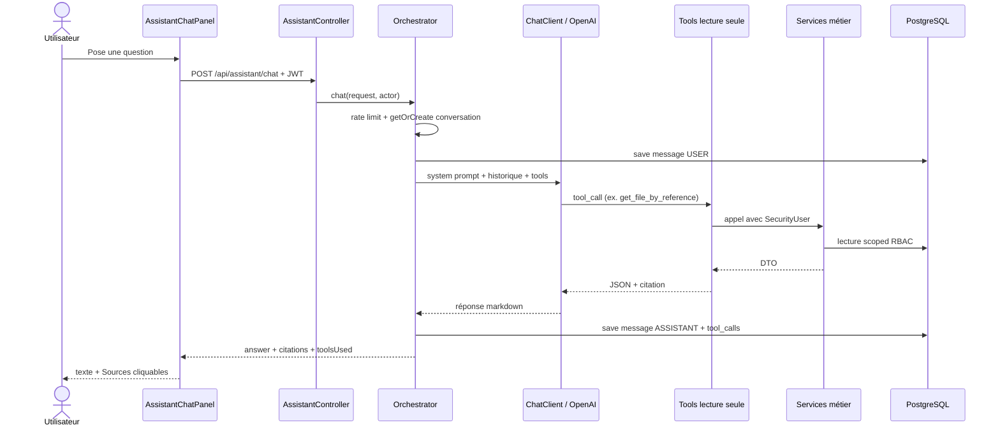
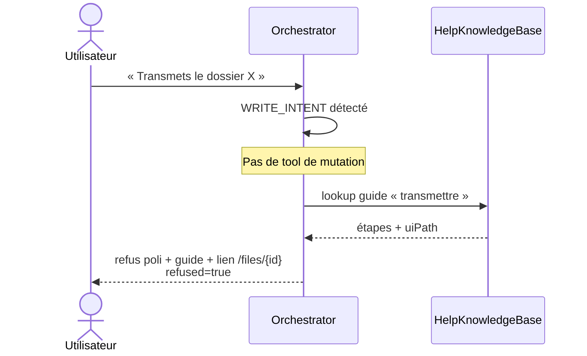
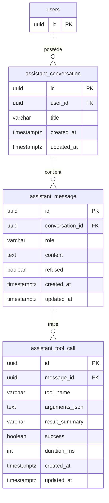

# Spécification fonctionnelle — Module Assistant conversationnel métier

**Projet :** FluxPro — Suivi de dossiers par chaîne hiérarchique  
**Cas pilote :** Ministère des Travaux Publics du Cameroun (MINTP)  
**Module :** ASSIST — Assistant conversationnel métier (lecture seule)  
**Version :** 1.2  
**Date :** 4 août 2026  
**Statut :** Spécification ciblée — **implémenté** (Sprints 0 à 3) ; durcissement / audit (Sprint 4) en cours de planification  

**Références :**
- [Roadmap Assistant IA](./ROADMAP-ASSISTANT-IA.md) — vision, sprints, catalogue tools
- [ADR LLM / Spring AI](./ADR-ASSISTANT-LLM-SPRING-AI.md) — choix OpenAI + Spring AI 2.0
- [SPEC DOS](./SPEC-DOS.md), [SPEC CHN](./SPEC-CHN.md), [SPEC ALR](./SPEC-ALR.md), [SPEC DSH](./SPEC-DSH.md)
- [SPEC ORG](./SPEC-ORG.md), [SPEC USR / RBAC](./SPEC-USR-RBAC.md)
- Prompt système : [`docs/assistant/system-prompt.md`](./assistant/system-prompt.md)
- Base d’aide : [`docs/assistant/help-kb.md`](./assistant/help-kb.md)
- Matrice intent → écran : [`docs/assistant/intent-matrix.md`](./assistant/intent-matrix.md)
- Banque d’évaluation P0 : [`docs/assistant/eval-bank-p0.md`](./assistant/eval-bank-p0.md)
- SQL permission + tables : [`docs/sql/2026-08-03_assistant_permission_and_tables.sql`](./sql/2026-08-03_assistant_permission_and_tables.sql)

---

## Table des matières

1. [Pourquoi cet assistant ?](#1-pourquoi-cet-assistant--à-lire-dabord)
2. [Objectifs et non-objectifs](#2-objectifs-et-non-objectifs)
3. [Public et permission d’usage](#3-public-et-permission-dusage)
4. [Principes non négociables](#4-principes-non-négociables)
5. [Comment ça fonctionne (vue pédagogique)](#5-comment-ça-fonctionne-vue-pédagogique)
6. [Architecture](#6-architecture)
7. [Cas d’utilisation](#7-cas-dutilisation)
8. [Périmètre fonctionnel par domaine](#8-périmètre-fonctionnel-par-domaine)
9. [Catalogue des capacités (tools)](#9-catalogue-des-capacités-tools)
10. [Interface utilisateur](#10-interface-utilisateur)
11. [Modèle de données](#11-modèle-de-données)
12. [Règles de gestion](#12-règles-de-gestion)
13. [Sécurité, RBAC et périmètre organisationnel](#13-sécurité-rbac-et-périmètre-organisationnel)
14. [API et persistance](#14-api-et-persistance)
15. [Exigences non fonctionnelles](#15-exigences-non-fonctionnelles)
16. [Recette et critères d’acceptation](#16-recette-et-critères-dacceptation)
17. [Glossaire](#17-glossaire)
18. [Hors périmètre et évolutions](#18-hors-périmètre-et-évolutions)

---

## 1. Pourquoi cet assistant ? (à lire d’abord)

### 1.1 Le problème en une phrase

Dans FluxPro, les informations existent (dossiers, passages, KPI, organigramme…), mais les retrouver demande souvent **d’ouvrir plusieurs écrans**, de poser des filtres, de connaître le bon menu — surtout pour un agent pressé ou un manager qui veut une réponse rapide.

### 1.2 Ce que l’assistant change

L’utilisateur pose sa question **en français**, comme à un collègue :

| Au lieu de… | On peut demander… |
|-------------|-------------------|
| Ouvrir `/files`, filtrer par référence | « Où est MINTP-DAG-2026-0042 ? » |
| Aller au dashboard puis aux retards | « Combien de dossiers ai-je en retard ? » |
| Naviguer l’organigramme puis les utilisateurs | « Liste les agents de la DAG et de ses sous-structures » |
| Chercher le mode d’emploi | « Comment transmettre un dossier ? » |

L’assistant **interroge les mêmes services métier** que les écrans (mêmes droits, même périmètre), puis **formule une réponse** avec des liens vers l’UI.

### 1.3 Image mentale

```
 Vous (connecté)          Panneau chat              Backend FluxPro              Données
 ───────────────         ─────────────             ────────────────              ───────
 « Où est le dossier X ? » ──► message JWT ──► LLM + outils lecture ──► File / Passage / …
                               ◄── réponse FR + citations (/files/…) ◄── résultats RBAC
```

**Analogie :** l’assistant est un **guichet d’information**, pas un agent qui signe ou transmet à votre place.

---

## 2. Objectifs et non-objectifs

### 2.1 Objectifs produit

| ID | Objectif | Mesure de succès |
|----|----------|------------------|
| OBJ-1 | Répondre aux questions opérationnelles (où / qui / combien / pourquoi alerte) | Réponse grounded + citation cliquable |
| OBJ-2 | Aider au pilotage (charge, retards, classements) dans le périmètre de l’utilisateur | KPI cohérents avec `/dashboard` et `/rapports` |
| OBJ-3 | Guider dans l’UI sans exécuter d’action | Lien + étapes ; **aucune mutation** |
| OBJ-4 | Respecter strictement le RBAC FluxPro | Un agent ne voit jamais hors de son scope |
| OBJ-5 | Rester traçable | Conversation + outils utilisés journalisés |

### 2.2 Ce que l’assistant n’est **pas**

| Non-objectif | Pourquoi |
|--------------|----------|
| Exécuter une transmission, un retour, une clôture | Risque métier ; les actions restent dans les écrans dédiés |
| Remplacer les règles d’alerte déterministes (ALR) | L’ALR décide ; l’assistant **explique** |
| Chatbot public / citoyen non authentifié | Hors portail interne authentifié |
| Lire le contenu OCR des pièces jointes | Hors portée actuelle (métadonnées PJ uniquement) |
| Inventer des faits « pour être utile » | Interdit : **grounding obligatoire** |

---

## 3. Public et permission d’usage

### 3.1 Qui peut utiliser l’assistant ?

Tout utilisateur **authentifié** disposant de la permission **`ASSISTANT:USE`** (prévue pour les rôles métier actifs).

Le panneau chat n’apparaît que si :
1. le **feature flag** `fluxpro.assistant.enabled` est actif côté serveur ;
2. l’utilisateur a `ASSISTANT:USE` ;
3. le fournisseur LLM est configuré (sinon statut « indisponible »).

### 3.2 Qui voit quoi ?

| Profil type | Ce qu’il peut demander | Limites fréquentes |
|-------------|------------------------|--------------------|
| **Agent** | Ses dossiers (scope), son activité, ses notifs, aide « comment faire » | Pas les templates admin ; pas la liste complète des users sauf droit |
| **Chef de service / Directeur** | Charge / retards / rankings sur son périmètre org ; souvent USERS:READ | Périmètre limité à sa branche |
| **Admin métier** | Référentiels (templates, types, calendrier, règles) + org | Toujours lecture seule via l’assistant |
| **Sans ASSISTANT:USE** | — | Accès refusé (API + UI) |

> **Pédagogie :** la permission `ASSISTANT:USE` ouvre la **porte du chat**. Chaque question ouvre ensuite les **portes métier** (`FILES:READ`, `DASHBOARD:READ`, `USERS:READ`, etc.). On peut entrer dans le couloir sans avoir la clé de chaque bureau.

---

## 4. Principes non négociables

Ces règles sont dans le **prompt système** et dans le code des outils. Elles priment sur toute demande utilisateur.

| # | Principe | Comportement attendu |
|---|----------|----------------------|
| P1 | **Lecture seule** | Aucun outil de mutation ; demande d’action → guide UI |
| P2 | **Même identité JWT** | Les tools appellent les services avec `currentUser()` |
| P3 | **Grounding** | Pas de chiffre / possessionnaire / statut inventé |
| P4 | **Citations** | Liens relatifs (`/files/{id}`, `/dashboard`, …) issus des tools |
| P5 | **Pas de fuite hors scope** | Filtrage org / permissions identique à l’UI |
| P6 | **Traçabilité** | Conversations et appels d’outils persistés |
| P7 | **Français administratif** | Ton clair, vocabulaire FluxPro (dossier, maillon, possessionnaire…) |

---

## 5. Comment ça fonctionne (vue pédagogique)

### 5.1 Les trois acteurs

1. **L’utilisateur** écrit une question en langage naturel.  
2. **Le modèle de langage (LLM)** comprend l’intention et choisit un ou plusieurs **outils**.  
3. **Les outils (tools)** sont de petites fonctions Java qui appellent les **services déjà existants** (FileService, DashboardService, etc.) — jamais une base « parallèle ».

### 5.2 Boucle type (un tour de conversation)

```
1. Message reçu  →  contrôle ASSISTANT:USE + quota (rate limit)
2. Historique récent chargé (mémoire de conversation)
3. LLM décide d’appeler des tools (max N appels / tour, défaut 5)
4. Chaque tool vérifie permission + scope, renvoie du JSON métier
5. LLM rédige la réponse FR à partir UNIQUEMENT de ces résultats
6. Front affiche texte + bloc « Sources » (citations)
```

### 5.3 Détection d’intention avant le LLM

Avant d’appeler OpenAI, l’orchestrateur classe le message :

| Détection | Exemple | Comportement |
|-----------|---------|--------------|
| **Intent écriture** | « Transmets », « Clôture », « Crée » | Pas d’appel LLM d’action : refus + guide `lookup_help` (`refused=true`) |
| **Intent how-to** | « Comment… », « Où voir… » | LLM avec consigne de prioriser `lookup_help` |
| **Question factuelle** | « Où est… », « Combien… » | Boucle tool-calling normale |

---

## 6. Architecture

### 6.1 Vue d’ensemble des composants

```
┌──────────────────────────────────────────────────────────────────────────┐
│  Frontend Next.js (flux-pro-front)                                        │
│  ┌────────────────────────────────────────────────────────────────────┐  │
│  │  AppShell                                                          │  │
│  │    └── AssistantChatPanel (drawer)                                  │  │
│  │          ├── suggestions selon rôle                                 │  │
│  │          ├── saisie multiligne                                      │  │
│  │          ├── AssistantMarkdown (réponse + liens relatifs)           │  │
│  │          └── bloc Sources (citations)                               │  │
│  └────────────────────────────────────────────────────────────────────┘  │
│         │  GET /api/assistant/status                                      │
│         │  POST /api/assistant/chat   (Bearer JWT)                        │
└─────────┼────────────────────────────────────────────────────────────────┘
          │
┌─────────▼────────────────────────────────────────────────────────────────┐
│  Backend Spring Boot (flux-pro-backend)                                   │
│                                                                           │
│  AssistantController                                                      │
│       │                                                                   │
│       ▼                                                                   │
│  AssistantOrchestrator ──────────────────────────────────────────────┐   │
│       │  rate limit · prompt · intent write/how-to · timeout LLM     │   │
│       │                                                               │   │
│       ├── ChatClient (Spring AI → OpenAI)                             │   │
│       ├── AssistantSessionTools   (dossiers, passages, dashboard…)    │   │
│       ├── AssistantCatalogTools   (org, users, référentiels, help)    │   │
│       ├── AssistantHelpKnowledgeBase  ← help-kb.md (classpath)        │   │
│       ├── AssistantConversationService → BDD                          │   │
│       └── AssistantToolContext (citations, traces, quota tool-calls)  │   │
│                                                                       │   │
│       ▼ délègue aux services métier existants                         │   │
│  FileService · PassageService · DashboardService · UserService · …      │
│  OrganizationService · AccessControlService · OrganizationScopeService  │
└───────────────────────────────────────────────────────────────────────────┘
          │
          ▼
   PostgreSQL : assistant_* + tables métier (dossiers, users, orgs…)
          │
          ▼
   OpenAI API (prompts + résultats tools)  ← sujet conformité DSI
```

### 6.2 Responsabilités par couche

| Couche | Responsabilité | Ne fait **pas** |
|--------|----------------|-----------------|
| **AssistantChatPanel** | UX chat, affichage markdown / sources, appel API | Décision métier, RBAC métier |
| **AssistantController** | Auth JWT, `@RequiresPermission(ASSISTANT:USE)`, feature flag | Logique LLM |
| **AssistantOrchestrator** | Orchestration tour, intents, prompt, timeout, composition tools | Règles de calcul KPI |
| **Session / Catalog Tools** | Exposer capacités lecture + formater JSON / listMarkdown | Muter des entités |
| **\*Service métier** | Vérité des données + RBAC / scope | Parler au LLM |
| **BDD `assistant_*`** | Historique conversation + traces tools | Contenir une copie des dossiers |

### 6.3 Séquence — question factuelle (happy path)



### 6.4 Séquence — demande d’action (refus)



### 6.5 Décomposition des tools

Deux familles enregistrées auprès du LLM pour **un même** `AssistantToolContext` (citations partagées, plafond d’appels commun) :

| Famille | Classe | Domaines | Exemples |
|---------|--------|----------|----------|
| Session / ops | `AssistantSessionTools` | A, B, C, D (+ profil) | `search_files`, `get_current_passage`, `get_dashboard_summary` |
| Catalogue | `AssistantCatalogTools` | E, F, G (+ users) | `get_organization_children`, `list_organization_users`, `lookup_help` |

```
                    ┌─────────────────────┐
                    │ AssistantToolContext │
                    │ actor, maxToolCalls  │
                    │ citations, traces    │
                    └──────────┬──────────┘
               ┌───────────────┴───────────────┐
               ▼                               ▼
   AssistantSessionTools            AssistantCatalogTools
   File / Passage / Notif / DSH     Org / User / Types / Help
               │                               │
               └───────────────┬───────────────┘
                               ▼
                     Services métier + RBAC
```

### 6.6 Modèle de données (aperçu)

Trois tables dédiées (`assistant_conversation`, `assistant_message`, `assistant_tool_call`) + lecture seule des entités métier existantes. Détail complet : [§11 Modèle de données](#11-modèle-de-données).

### 6.7 Configuration runtime

| Propriété / env | Rôle | Défaut indicatif |
|-----------------|------|------------------|
| `fluxpro.assistant.enabled` (`FLUXPRO_ASSISTANT_ENABLED`) | Kill-switch module | selon env |
| `spring.ai.model.chat` (`FLUXPRO_ASSISTANT_CHAT`) | `openai` ou `none` | — |
| `FLUXPRO_ASSISTANT_MODEL` | Modèle OpenAI | `gpt-4o-mini` |
| `OPENAI_API_KEY` | Secret (hors git) | — |
| `fluxpro.assistant.max-tool-calls` | Plafond tools / tour | 5 |
| `fluxpro.assistant.max-history-messages` | Mémoire conversation | 10 |
| `fluxpro.assistant.rate-limit-per-hour` | Quota messages / user | 30 |

### 6.8 Artefacts documentaires branchés au runtime

| Artefact | Chargement | Usage |
|----------|------------|-------|
| `assistant/system-prompt.md` | Classpath (copie resources) | Prompt système LLM |
| `assistant/help-kb.md` | `AssistantHelpKnowledgeBase` | Tool `lookup_help` |
| `intent-matrix.md` | Doc humaine / formation | Deep-links attendus (pas exécuté tel quel) |

### 6.9 Frontières de confiance (pédagogie sécu)

```
┌─ Zone de confiance FluxPro ─────────────────────────────┐
│  JWT · RBAC · Scope org · Services · BDD métier         │
│                                                         │
│   Tools (lecture) ──résumé JSON──►  LLM (externe)       │
│                         ▲                               │
│                         │ ne jamais lui déléguer         │
│                         │ une mutation                   │
└─────────────────────────┴───────────────────────────────┘
```

Le LLM **propose** quels tools appeler et **rédige** la réponse ;  
FluxPro **exécute** seulement des lectures autorisées et **filtre** toujours.

---

## 7. Cas d’utilisation

Convention : chaque cas décrit **acteur**, **préconditions**, **flux principal**, **alternatives**, **postconditions** et **critères d’acceptation**.

### 7.1 Cartographie rapide

| ID | Titre | Acteur principal | Domaine |
|----|-------|------------------|---------|
| [UC-01](#uc-01--démarrer-une-conversation) | Démarrer une conversation | Tout user `ASSISTANT:USE` | — |
| [UC-02](#uc-02--localiser-un-dossier-par-référence) | Localiser un dossier par référence | Agent / manager | A, B |
| [UC-03](#uc-03--rechercher-des-dossiers) | Rechercher des dossiers | Agent / manager | A |
| [UC-04](#uc-04--comprendre-le-maillon-courant-et-lhistorique) | Maillon courant et historique | Agent | B |
| [UC-05](#uc-05--consulter-ses-notifications-et-alertes) | Notifications et alertes | Agent | C |
| [UC-06](#uc-06--piloter-sa-charge-et-ses-retards) | Piloter charge et retards | Agent → Directeur | D |
| [UC-07](#uc-07--obtenir-un-classement-ou-une-tendance) | Classement / tendance | Directeur / SG | D |
| [UC-08](#uc-08--explorer-lorganigramme) | Explorer l’organigramme | Tous (scope) | E |
| [UC-09](#uc-09--lister-les-agents-dune-structure-et-descendants) | Agents d’une structure (+ descendants) | Manager / admin | E |
| [UC-10](#uc-10--rechercher-un-collègue) | Rechercher un collègue | Si `USERS:READ` / direction | E |
| [UC-11](#uc-11--consulter-un-référentiel-template-type-calendrier) | Consulter un référentiel | Admin métier | F |
| [UC-12](#uc-12--demander-comment-faire-guide-ui) | Demander « comment faire » | Tous | G |
| [UC-13](#uc-13--demander-une-action-métier-refus) | Demander une action métier (refus) | Tous | G |
| [UC-14](#uc-14--se-présenter--qui-suis-je) | « Qui suis-je ? » | Tous | E |
| [UC-15](#uc-15--gérer-lindisponibilité-ou-le-quota) | Indisponibilité / quota | Tous | Ops |

---

### UC-01 — Démarrer une conversation

| Champ | Contenu |
|-------|---------|
| **Acteur** | Utilisateur authentifié avec `ASSISTANT:USE` |
| **But** | Ouvrir le panneau et obtenir une première réponse |
| **Préconditions** | Feature flag ON ; LLM configuré ; session valide |

**Flux principal**
1. L’utilisateur ouvre le drawer Assistant depuis le shell.  
2. Le front appelle `GET /api/assistant/status` (enabled + llmConfigured).  
3. Des **suggestions** s’affichent selon le rôle (agent vs manager).  
4. L’utilisateur envoie un message (`conversationId` null).  
5. Le backend crée une conversation, répond, renvoie un `conversationId`.  
6. Les messages suivants réutilisent cet id (mémoire de fil).

**Alternatives**
- **A1** Flag off → panneau masqué / `404` API.  
- **A2** LLM non configuré → statut indisponible + message d’erreur explicite au chat.  
- **A3** Sans `ASSISTANT:USE` → `403`.

**Postconditions** : une ligne `assistant_conversation` + messages persistés.

**Critères** : latence acceptable ; pas de panneau si désactivé.

---

### UC-02 — Localiser un dossier par référence

| Champ | Contenu |
|-------|---------|
| **Acteur** | Agent ou manager |
| **But** | Savoir où se trouve un dossier et qui le traite |
| **Préconditions** | Accès en lecture au dossier (scope) |

**Flux principal**
1. « Où est MINTP-DAG-2026-0042 ? »  
2. Tools typiques : `get_file_by_reference` puis `get_current_passage`.  
3. Réponse : statut, possessionnaire, organisation, délai / retard si dispo.  
4. Citation vers `/files/{id}`.

**Alternatives**
- **A1** Référence introuvable → message métier clair (pas d’invention).  
- **A2** Hors périmètre → accès refusé / non trouvé selon la politique service.  
- **A3** Référence ambiguë → demander précision ou lister via `search_files`.

**Postconditions** : traces tools liées au message assistant.

**Critères** : aucun possessionnaire inventé ; source cliquable.

---

### UC-03 — Rechercher des dossiers

| Champ | Contenu |
|-------|---------|
| **But** | Obtenir une liste courte selon critères métier |

**Flux principal**
1. « Trouve les courriers urgents de cette semaine ».  
2. Tool `search_files` (filtres type / priorité / dates selon capacité).  
3. Liste plafonnée (~10) en `listMarkdown` + indication s’il y a plus.  
4. Liens vers fiches dossiers.

**Alternatives**
- **A1** 0 résultat → le dire clairement.  
- **A2** Trop de résultats → top N + conseiller d’affiner ou d’ouvrir `/files`.

**Critères** : pas de tableau « fantaisie » hors format tool ; cohérence avec l’écran `/files`.

---

### UC-04 — Comprendre le maillon courant et l’historique

| Champ | Contenu |
|-------|---------|
| **But** | Comprendre l’étape active et le journal de passation |

**Flux principal**
1. L’utilisateur précise le dossier (réf ou suite de UC-02).  
2. Tools : `get_current_passage`, `list_passages`.  
3. Réponse : étape, responsable, échéance, retours/suspensions éventuels.

**Critères** : vocabulaire FluxPro (maillon, possessionnaire) ; dates cohérentes avec CHN.

---

### UC-05 — Consulter ses notifications et alertes

| Champ | Contenu |
|-------|---------|
| **But** | Voir ce qui nécessite attention personnelle ou sur un dossier |

**Flux principal**
1a. « Quelles sont mes notifications non lues ? » → `list_my_notifications`.  
1b. « Quelles alertes sur le dossier X ? » → `list_file_alerts` (après résolution du dossier).  
2. Liste + lien `/notifications` ou fiche dossier.

**Alternatives**
- **A1** Demande d’explication « pourquoi J+3 » → combiner alertes dossier + éventuel référentiel types/règles + aide.

---

### UC-06 — Piloter sa charge et ses retards

| Champ | Contenu |
|-------|---------|
| **Acteur** | Agent → Chef → Directeur |
| **But** | Obtenir une synthèse d’activité / retards dans son périmètre |

**Flux principal**
1. « Combien de dossiers ai-je en cours / en retard ? »  
2. Tools : `get_my_activity` et/ou `get_dashboard_summary` / `get_overdue_files`.  
3. Synthèse chiffrée + liens `/dashboard`, `/dashboard/overdue`.

**Alternatives**
- **A1** Directeur demande la charge de l’équipe → `get_workload` (scope direction).  
- **A2** Permission dashboard insuffisante → `PERMISSION_DENIED` explicite.

**Critères** : deux utilisateurs de directions différentes n’obtiennent pas les mêmes listes hors scope.

---

### UC-07 — Obtenir un classement ou une tendance

| Champ | Contenu |
|-------|---------|
| **Acteur** | Directeur / SG (selon droits) |
| **But** | Comparer délais / conformité / tendances |

**Flux principal**
1. « Quelle direction respecte le mieux les délais ? » → `get_compliance_ranking`.  
2. Ou « Tendance des retards sur 90 jours » → `get_dashboard_analytics`.  
3. Ou « Délai moyen par type » → `get_delay_by_type`.  
4. Format tableau / liste issu du tool + lien `/rapports` ou dashboard.

**Critères** : chiffres alignés avec les écrans DSH ; pas d’extrapolation LLM.

---

### UC-08 — Explorer l’organigramme

| Champ | Contenu |
|-------|---------|
| **But** | Comprendre une structure et ses enfants |

**Flux principal**
1. « Quelles sont les sous-structures de la DAG ? »  
2. `get_organization` (code `DAG`) puis `get_organization_children`.  
3. Liste code — libellé — type + lien `/admin/org/{id}`.

**Alternatives**
- **A1** « Mon organisation » → `get_my_organization`.  
- **A2** Vue globale → `get_organization_tree` (périmètre visible).

---

### UC-09 — Lister les agents d’une structure (+ descendants)

| Champ | Contenu |
|-------|---------|
| **Acteur** | Manager / admin avec droit lecture users |
| **But** | Voir les effectifs d’une org et éventuellement de toute la sous-arbre |

**Flux principal**
1. « Liste les utilisateurs de la DAG et de ses descendants ».  
2. **Un seul** appel `list_organization_users(code=DAG, includeDescendants=true)`.  
3. Liste plafonnée avec code org de rattachement ; hint si tronqué.  
4. Sources `/admin/users` et org.

**Alternatives**
- **A1** Sans droit → refus permission (pas de message « erreur vague »).  
- **A2** Boucle enfant-par-enfant côté LLM → à éviter (risque plafond tool-calls) ; le prompt pousse `includeDescendants`.

**Critères** : pas de `LOWER(bytea)` / erreur SQL exposée ; résultat cohérent avec `/admin/users`.

---

### UC-10 — Rechercher un collègue

| Champ | Contenu |
|-------|---------|
| **But** | Retrouver une personne par nom / matricule / email |

**Flux principal**
1. « Qui est Roger NSANGOU ? »  
2. `search_users` (support nom complet prénom+nom).  
3. Si un seul hit pertinent → éventuellement `get_user` pour la fiche.  
4. Lien `/admin/users/{id}`.

**Alternatives**
- **A1** 0 résultat → le dire ; suggérer nom de famille seul.  
- **A2** Plusieurs homonymes → lister puis demander précision.

---

### UC-11 — Consulter un référentiel (template, type, calendrier)

| Champ | Contenu |
|-------|---------|
| **Acteur** | Admin métier (souvent) |
| **But** | Comprendre paramétrage sans ouvrir tous les menus |

**Flux principal (ex. template)**
1. « Quelles sont les étapes du template T01 ? »  
2. `list_chain_templates` / `get_chain_template`.  
3. Étapes, délais, lien `/admin/chain-templates/{id}`.

**Variantes**
- Types de dossiers → `list_file_types` → `/admin/file-types`  
- Jours fériés 2026 → `list_business_calendar` → `/admin/settings`  
- Règles d’alerte d’un template → `list_alert_rules`  
- Préconfigurés portail → `list_preconfigured_dossiers`

**Alternatives**
- **A1** Agent sans droit templates → message permission + ne pas inventer les étapes.

---

### UC-12 — Demander « comment faire » (guide UI)

| Champ | Contenu |
|-------|---------|
| **But** | Obtenir la marche à suivre dans FluxPro |

**Flux principal**
1. « Comment transmettre un dossier que je possède ? »  
2. Intent how-to → `lookup_help` (section dédiée).  
3. Étapes numérotées + écran cible (`/files/{id}` ou `/files/new`…).  
4. Rappeler que l’action se fait **dans l’UI**, pas via le chat.

**Critères** : aucune mutation ; étapes alignées sur `help-kb.md`.

---

### UC-13 — Demander une action métier (refus)

| Champ | Contenu |
|-------|---------|
| **But** | Empêcher toute écriture tout en restant utile |

**Flux principal**
1. « Clôture / transmets / crée le dossier X ».  
2. Détection `WRITE_INTENT` dans l’orchestrateur.  
3. Réponse de refus + contenu d’aide (équivalent UC-12).  
4. Champ API `refused=true` ; message assistant persisté avec `refused`.

**Critères** : aucun outil de mutation n’existe ; journal montre le refus.

---

### UC-14 — Se présenter / « Qui suis-je ? »

| Champ | Contenu |
|-------|---------|
| **But** | Vérifier l’identité effective vue par l’assistant (même JWT) |

**Flux principal**
1. « Qui suis-je ? » / « Quel est mon rôle ? »  
2. Tool `get_current_user`.  
3. Nom, email, rôle, organisation, permissions utiles le cas échéant.

**Critères** : cohérent avec `/profile` et `GET /api/users/me`.

---

### UC-15 — Gérer l’indisponibilité ou le quota

| Champ | Contenu |
|-------|---------|
| **But** | Comportement prévisible en dégradation |

**Flux principal / alternatives**
- **Quota horaire dépassé** → erreur métier claire ; inviter à réessayer plus tard.  
- **Plafond tool-calls** → le tool renvoie `TOOL_CALL_LIMIT` ; le LLM répond avec les données déjà obtenues.  
- **Timeout LLM** → message UX « délai dépassé », conversation conservée.  
- **Provider down** → erreur explicite (pas de données inventées pour « sauver » la conversation).

---

### 7.2 Matrice cas d’usage × tools (rappel)

| Cas | Tools principaux |
|-----|------------------|
| UC-02 | `get_file_by_reference`, `get_current_passage` |
| UC-03 | `search_files` |
| UC-04 | `get_current_passage`, `list_passages` |
| UC-05 | `list_my_notifications`, `list_file_alerts` |
| UC-06 | `get_my_activity`, `get_overdue_files`, `get_dashboard_summary`, `get_workload` |
| UC-07 | `get_compliance_ranking`, `get_delay_by_type`, `get_dashboard_analytics` |
| UC-08 | `get_organization*`, `get_organization_children` |
| UC-09 | `list_organization_users` (+ `includeDescendants`) |
| UC-10 | `search_users`, `get_user` |
| UC-11 | tools F (`list_*` / `get_chain_template`…) |
| UC-12 / 13 | `lookup_help` |
| UC-14 | `get_current_user` |

---

## 8. Périmètre fonctionnel par domaine

Huit domaines de questions. Priorité produit actuelle : **A → G livrés** ; **H** (audit) prévu Sprint 4.

### Domaine A — Dossiers (DOS)

| Intent | Exemples | Résultat attendu |
|--------|----------|------------------|
| Localiser | « Où est MINTP-… ? » | Possessionnaire / org / statut + lien |
| Chercher | « Courriers urgents cette semaine » | Liste courte (plafonnée) |
| Métadonnées | « Priorité / expéditeur du dossier X » | Champs issus du tool |
| Pièces | « Quelles PJ sur X ? » | Noms / types / tailles — **pas le contenu** |
| Cycle de vie | « Quand soumis / clôturé ? » | Dates métier |

### Domaine B — Passation (CHN)

| Intent | Exemples |
|--------|----------|
| Possessionnaire | « Qui traite depuis combien de jours ? » |
| Historique | « Journal de passation du dossier X » |
| Maillon courant | « À quelle étape ? Action attendue ? » |
| Délai / retard maillon | « Échéance du maillon actuel ? » |
| Retours / suspensions | Présence de retours / suspensions dans l’historique |

### Domaine C — Alertes & notifications (ALR)

| Intent | Exemples |
|--------|----------|
| Mes notifications | « Alertes / notifs non lues » |
| Alertes d’un dossier | « Quelles alertes sur MINTP-… ? » |
| Comprendre | Explication à partir des types / règles (si droit) + aide |
| Référentiel | Types d’alerte, règles d’un template (admin) |

### Domaine D — Pilotage (DSH)

| Intent | Exemples | Écran lié |
|--------|----------|-----------|
| Ma charge | « Combien en cours / en retard ? » | `/dashboard` |
| Retards | « Top retards de ma direction » | `/dashboard/overdue` |
| Workload | « Qui a le plus de dossiers ? » | `/dashboard/workload` |
| Délais par type | « Délai moyen courriers vs marchés » | dashboard / rapports |
| Classement | « Quelle direction respecte les délais ? » | `/rapports` |
| Analytics | « Tendance sur 90 jours » | analytics |

### Domaine E — Organisation & utilisateurs

| Intent | Exemples | Notes |
|--------|----------|-------|
| Structure | « Sous-structures de la DAG » | `get_organization_children` |
| Détail org | « Qu’est-ce que le code DIER ? » | id ou code |
| Agents d’une structure | « Utilisateurs de DAG **et descendants** » | `includeDescendants=true` |
| Chefs | « Qui est le chef de … ? » | flag chef d’org |
| Recherche personne | « Qui est Roger NSANGOU ? » | `USERS:READ` / direction |

### Domaine F — Référentiels

Types de dossiers, templates de chaîne, calendrier, dossiers préconfigurés — selon permissions admin.

### Domaine G — Aide produit & navigation

| Intent | Exemples | Mode |
|--------|----------|------|
| Comment faire | « Comment transmettre / clôturer / créer ? » | Guide + lien, **sans** exécuter |
| Où cliquer | « Où voir le classement ? » → `/rapports` | |
| Glossaire | « Que veut dire possessionnaire ? » | |
| Permissions | « Pourquoi pas le menu Admin ? » | Oriente vers `/profile` |

### Domaine H — Audit (cible Sprint 4)

Journal métier, audits de connexion, paramétrage tenant — **restreint**.

---

## 9. Catalogue des capacités (tools)

Chaque **tool** = une capacité appelable par le LLM. Vue **fonctionnelle** (détail technique dans la roadmap §4).

### 9.1 Pack opérationnel (P0 / P1)

| Capacité | Tool | Permission / service typique |
|----------|------|------------------------------|
| Qui suis-je ? | `get_current_user` | Authentifié |
| Chercher / ouvrir un dossier | `search_files`, `get_file_by_reference`, `get_file_by_id` | Visibilité dossiers |
| Pièces jointes (méta) | `list_file_attachments` | Idem |
| Passages | `list_passages`, `get_current_passage` | Idem |
| Alertes dossier / notifs | `list_file_alerts`, `list_my_notifications` | Notifications |
| Mon activité | `get_my_activity` | Dashboard |
| Retards | `get_overdue_files` | Dashboard |
| Synthèse KPI | `get_dashboard_summary` | Dashboard |
| Charge / délais / classement / analytics | `get_workload`, `get_delay_by_type`, `get_compliance_ranking`, `get_dashboard_analytics` | Dashboard |

### 9.2 Pack référentiels / org / aide (S3)

| Capacité | Tool | Notes |
|----------|------|-------|
| Organigramme | `get_organization_tree`, `get_organization`, `get_my_organization`, `get_organization_children` | Scope org |
| Utilisateurs | `search_users`, `get_user`, `list_organization_users`, `get_organization_heads` | `USERS:READ` / direction ; `includeDescendants` |
| Types / templates | `list_file_types`, `list_chain_templates`, `get_chain_template` | Droits admin selon tool |
| Alertes référentiel | `list_alert_types`, `list_alert_rules` | |
| Calendrier | `list_business_calendar` | `BUSINESS_CALENDAR:READ` |
| Préconfigurés | `list_preconfigured_dossiers` | |
| Aide | `lookup_help` | KB `help-kb.md` |

### 9.3 Capacités **interdites**

Toute mutation : transmettre, retourner, suspendre, créer / modifier / supprimer dossier, user, org, template, règle d’alerte, etc.

---

## 10. Interface utilisateur

### 10.1 Emplacement

Panneau latéral (**drawer**) accessible depuis le shell authentifié (`AssistantChatPanel`), sur desktop et mobile.

### 10.2 Comportements UX attendus

| Élément | Comportement |
|---------|--------------|
| Suggestions | Raccourcis selon le rôle (agent vs manager) |
| Saisie | Zone multiligne ; Entrée = envoyer ; Shift+Entrée = nouvelle ligne |
| Réponse | Markdown léger (listes, gras) ; tableaux GFM si fournis par les tools |
| Sources | Citations cliquables (chemins relatifs uniquement) |
| Erreurs | Message clair (permission, quota, LLM indisponible) |
| Feature flag off | Panneau masqué ; API refuse l’usage |

### 10.3 Format de réponse « écran étroit »

Le panneau est étroit : les tools fournissent souvent un `listMarkdown` que le LLM doit **recopier tel quel**. Les faux domaines `https://example.com/...` sont **interdits**.

---

## 11. Modèle de données

### 11.1 Principe pédagogique

L’assistant **ne duplique pas** le métier (dossiers, passages, KPI…).  
Il stocke seulement le **fil de conversation** et la **trace des tools** pour traçabilité et mémoire de dialogue.  
Les faits métier restent dans les tables DOS / CHN / ALR / DSH / ORG / USR, lues via les services existants.

```
┌────────────────────────────┐         ┌──────────────────────────────┐
│  Données ASSIST (propres)  │         │  Données métier (lecture)    │
│  conversation / message /  │  tools  │  files, passages, users,     │
│  tool_call                 │ ──────► │  orgs, dashboard views…      │
└────────────────────────────┘         └──────────────────────────────┘
```

Schéma ASSIST : script manuel [`docs/sql/2026-08-03_assistant_permission_and_tables.sql`](./sql/2026-08-03_assistant_permission_and_tables.sql)  
(`spring.jpa.hibernate.ddl-auto=none`).

### 11.2 Diagramme entité-relation (ASSIST)



### 11.3 Table `assistant_conversation`

| Colonne | Type | Null | Description |
|---------|------|------|-------------|
| `id` | UUID | Non | Identifiant de conversation (PK) |
| `user_id` | UUID | Non | Propriétaire — FK → `users(id)` |
| `title` | VARCHAR(200) | Oui | Titre dérivé du **premier** message (max ~80 car. utiles) |
| `created_at` | TIMESTAMPTZ | Non | Création |
| `updated_at` | TIMESTAMPTZ | Non | Mis à jour à chaque nouveau message |

**Index :** `(user_id, updated_at DESC)` — lister les conversations récentes d’un user.

**Règles associées :** [RG-CONV-01](#rg-conv-01--propriété-exclusive) à [RG-CONV-04](#rg-conv-04--titre).

### 11.4 Table `assistant_message`

| Colonne | Type | Null | Description |
|---------|------|------|-------------|
| `id` | UUID | Non | PK |
| `conversation_id` | UUID | Non | FK → `assistant_conversation` (CASCADE delete) |
| `role` | VARCHAR(20) | Non | `USER` \| `ASSISTANT` \| `SYSTEM` |
| `content` | TEXT | Non | Texte du message (question ou réponse markdown) |
| `refused` | BOOLEAN | Non | `true` si réponse de **refus d’action** (intent écriture) |
| `created_at` / `updated_at` | TIMESTAMPTZ | Non | Audit temporel |

**Contrainte :** `role IN ('USER','ASSISTANT','SYSTEM')`.  
**Index :** `(conversation_id, created_at)` — ordre chronologique / fenêtre d’historique.

### 11.5 Table `assistant_tool_call`

| Colonne | Type | Null | Description |
|---------|------|------|-------------|
| `id` | UUID | Non | PK |
| `message_id` | UUID | Non | FK → message **ASSISTANT** du tour (CASCADE) |
| `tool_name` | VARCHAR(80) | Non | Ex. `get_file_by_reference` |
| `arguments_json` | TEXT | Oui | Arguments sérialisés (debug / audit) |
| `result_summary` | VARCHAR(500) | Oui | Extrait court du résultat (pas le dump complet) |
| `success` | BOOLEAN | Non | Tool abouti ou erreur métier/technique |
| `duration_ms` | INT | Oui | Durée d’exécution |
| `created_at` / `updated_at` | TIMESTAMPTZ | Non | |

**Index :** `(message_id)`.

> Les tool calls des tours refusés sans appel LLM peuvent être absents ; en mode factuel, chaque outil invoqué (succès ou échec contrôlé) est tracé.

### 11.6 Énumération `AssistantMessageRole`

| Valeur | Usage |
|--------|-------|
| `USER` | Message saisi par l’utilisateur |
| `ASSISTANT` | Réponse formulée (LLM ou refus guide) |
| `SYSTEM` | Réservé (pas utilisé pour l’historique chat user-facing actuel) |

### 11.7 DTOs d’échange (contrat API)

**Requête `AssistantChatRequest`**

| Champ | Contrainte | Description |
|-------|------------|-------------|
| `conversationId` | UUID optionnel | `null` = nouvelle conversation |
| `message` | obligatoire, max **4000** car. | Texte utilisateur |
| `locale` | max 10 | Ex. `fr` (indicatif) |

**Réponse `AssistantChatResponse`**

| Champ | Description |
|-------|-------------|
| `conversationId` | Fil à réutiliser |
| `messageId` | Id du message ASSISTANT créé |
| `answer` | Markdown de réponse |
| `citations[]` | `{ type, id?, label, href }` — liens UI relatifs |
| `toolsUsed[]` | Noms des tools appelés ce tour |
| `refused` | Aligné sur `assistant_message.refused` |

**Statut `AssistantStatusResponse` :** `enabled`, `llmConfigured` (pas de persistance).

### 11.8 Citation (objet de réponse, non persisté en table dédiée)

| Champ | Exemple |
|-------|---------|
| `type` | `file`, `org`, `users`, `referential`… |
| `id` | UUID entité si pertinent |
| `label` | Libellé affiché (« MINTP-DAG-2026-0042 ») |
| `href` | Chemin relatif `/files/{id}`, `/admin/org/{id}`… |

Les citations sont **reconstruites** dans `AssistantToolContext` pendant le tour puis renvoyées au front ; elles ne sont pas une 4ᵉ table (évolutif éventuel Sprint 4).

### 11.9 Données métier lues (référentiel fonctionnel)

Sans les redéfinir ici — l’assistant consomme via tools :

| Domaine | Entités / agrégats typiques | SPEC |
|---------|----------------------------|------|
| DOS | `FileEntity`, pièces (métadonnées) | SPEC-DOS |
| CHN | `FilePassage`, template / étape | SPEC-CHN |
| ALR | alertes dossier, notifications, types/règles | SPEC-ALR |
| DSH | agrégats dashboard (summary, overdue, workload…) | SPEC-DSH |
| ORG / USR | `Organization`, `User`, rôles | SPEC-ORG, SPEC-USR-RBAC |
| Référentiels | file types, chain templates, calendrier, préconfigurés | guides admin |

### 11.10 Cycle de vie des données ASSIST

| Événement | Effet |
|-----------|--------|
| Premier message (`conversationId` null) | INSERT conversation + message USER puis ASSISTANT (+ tool_calls) |
| Message suivant (id fourni) | Vérif propriété user → INSERT messages / tools ; `updated_at` conversation |
| Conversation d’un autre user | `ASSISTANT_CONVERSATION_NOT_FOUND` (pas d’énumération) |
| Delete conversation (future) | CASCADE messages + tool_calls |
| Rétention | Non cadrée en S0–S3 — à définir Sprint 4 (ops / DSI) |

### 11.11 Ce qui n’est **pas** stocké

| Non stocké | Raison |
|------------|--------|
| Copie des dossiers / KPI | Source de vérité = métier |
| Contenu des pièces jointes | Hors scope ; méta seulement via tool |
| Prompt système / historique LLM brut complet | Prompt en fichier ; historique = messages user/assistant tronqués |
| Clés API | Secrets hors BDD métier git |

---

## 12. Règles de gestion

Les règles sont classées par thème. **ID stables** pour recette et formation.

### 12.1 Synthèse (carte mentale)

| Famille | IDs | Intention |
|---------|-----|-----------|
| Accès & activation | RG-ACC-* | Qui peut parler à l’assistant |
| Conversation | RG-CONV-* | Propriété, titre, historique |
| Intention & refus | RG-INT-* | Écriture vs how-to vs factuel |
| Grounding & rédaction | RG-GRD-* | Vérité des réponses |
| Tools & quotas | RG-TOOL-* | Plafonds d’exécution |
| Listes & format | RG-FMT-* | Affichage chat étroit |
| Org & utilisateurs | RG-ORG-* | Structures et effectifs |
| Permissions & erreurs | RG-PERM-* | Refus propres |
| Traçabilité | RG-AUD-* | Ce qu’on journalise |
| Configuration | RG-CFG-* | Flags et limites |

---

### 12.2 Accès et activation

#### RG-ACC-01 — Permission d’usage
L’appel `POST /api/assistant/chat` exige la permission **`ASSISTANT:USE`**.  
Sans elle → HTTP 403. Le panneau UI ne doit pas proposer l’assistant.

#### RG-ACC-02 — Kill-switch
Si `fluxpro.assistant.enabled = false` : API chat → **404** ; panneau masqué.  
Prioritaire sur toute autre règle (maintenance, incident LLM).

#### RG-ACC-03 — LLM obligatoire pour le mode factuel
Si le flag est ON mais aucun `ChatClient` configuré : erreur métier explicite (`ASSISTANT_LLM_NOT_CONFIGURED`).  
Interdiction de « répondre au feeling » sans modèle.

#### RG-ACC-04 — Authentification
Tous les tools s’exécutent avec le **`SecurityUser` du JWT** courant. Pas d’identité technique secrète pour contourner le RBAC.

---

### 12.3 Conversation et mémoire

#### RG-CONV-01 — Propriété exclusive
Une conversation appartient à **un seul** `user_id`.  
Toute reprise (`conversationId` fourni) vérifie `findByIdAndUserId` : sinon **introuvable** (pas de fuite cross-user).

#### RG-CONV-02 — Création
`conversationId = null` ⇒ création d’une nouvelle conversation pour l’acteur, puis enchaînement du tour.

#### RG-CONV-03 — Persistance d’un tour
Chaque tour réussit à enregistrer au minimum :
1. message `USER` ;
2. message `ASSISTANT` (y compris refus) ;
3. éventuels `assistant_tool_call` rattachés au message assistant.

#### RG-CONV-04 — Titre
Le titre est dérivé du **premier** message utilisateur : espaces compactés, tronqué à ~80 caractères, défaut « Nouvelle conversation » si vide.  
Il n’est pas recalculé à chaque tour (comportement actuel).

#### RG-CONV-05 — Fenêtre d’historique LLM
Seuls les **N** derniers messages (`max-history-messages`, défaut **10**) sont renvoyés au modèle.  
L’historique complet reste en BDD pour audit / UI future.

#### RG-CONV-06 — Longueur message
Le champ `message` est limité à **4000** caractères (validation bean). Au-delà → rejet requête.

---

### 12.4 Intention, refus et guide

#### RG-INT-01 — Détection d’écriture
Si le texte matche l’intent écriture (transmettre, clôturer, créer, modifier, supprimer, réassigner, suspendre, etc. — FR/EN) :
- **aucun** tool de mutation n’est appelé (aucun n’existe) ;
- réponse de **refus** + guide via base d’aide ;
- `refused = true` sur le message et dans la réponse API.

#### RG-INT-02 — Pas d’exécution d’action
Même si l’utilisateur reformule (« fais-le pour moi », « exécute »), l’assistant **n’exécute jamais** d’action métier. Il oriente vers l’écran UI.

#### RG-INT-03 — Intent how-to
Si le message commence comme une demande d’aide (« comment », « où voir/trouver », « pourquoi je n… ») : le LLM est instruit de **prioriser** `lookup_help` avant d’inventer des procédures.

#### RG-INT-04 — Contenu du refus
Un refus doit être **utile** : expliquer l’impossibilité + étapes UI + chemin relatif (`/files/{id}`, `/files/new`, …) issus de la KB ou des tools — jamais un simple « non » sec.

---

### 12.5 Grounding et rédaction

#### RG-GRD-01 — Grounding obligatoire
Tout fait chiffré ou nominatif (possessionnaire, statut, KPI, effectif…) doit provenir d’un **résultat de tool** du tour (ou de l’historique factuel déjà grounded). Sinon : « je ne sais pas » / demander précision.

#### RG-GRD-02 — Interdiction d’halluciner des liens
Les URL doivent être des **chemins relatifs** fournis par tools (`uiPath` / citations).  
Interdit : `https://example.com/...`, localhost fictif, domaines inventés.

#### RG-GRD-03 — Langue et ton
Réponses en **français administratif** clair, vocabulaire FluxPro (dossier, maillon, possessionnaire, escalade…).

#### RG-GRD-04 — Permission refusée ≠ invention
Si un tool renvoie `PERMISSION_DENIED` : expliquer la permission manquante et orienter vers `/profile` ou un admin métier — **ne pas** compléter avec des données inventées.

---

### 12.6 Tools, quotas et performance

#### RG-TOOL-01 — Plafond d’appels par tour
Au plus **`max-tool-calls`** invocations (défaut **5**) par tour.  
Au-delà : code `TOOL_CALL_LIMIT` ; le modèle doit conclure avec les données déjà obtenues.

#### RG-TOOL-02 — Rate limit utilisateur
Au plus **`rate-limit-per-hour`** messages user / heure (défaut **30**), fenêtre glissante en mémoire.  
Dépassement → `ASSISTANT_RATE_LIMIT` (pas d’appel LLM).

#### RG-TOOL-03 — Lecture seule stricte
Le registre de tools ne contient **aucune** opération de mutation. Toute nouvelle capacité doit rester read-only (revue d’architecture).

#### RG-TOOL-04 — Délégation aux services
Un tool n’accède pas « en SQL libre » aux données hors services : il appelle FileService, DashboardService, UserService, etc., qui appliquent déjà le RBAC / scope.

#### RG-TOOL-05 — Timeout LLM
L’appel modèle est borné (timeout orchestrateur). En cas de dépassement : erreur UX claire ; les messages déjà sauvegardés restent cohérents selon le point d’échec.

---

### 12.7 Listes, plafonds d’affichage et format

#### RG-FMT-01 — Listes plafonnées
Les listes renvoyées à l’utilisateur sont **bornées** (~10 pour dossiers / recherches courantes ; jusqu’à **25** pour `list_organization_users`).  
S’il existe plus de résultats : l’indiquer dans le payload / la réponse.

#### RG-FMT-02 — Préférer `listMarkdown`
Si le tool fournit `listMarkdown` (ou `preferredFormat=listMarkdown`), la réponse assistant doit le **reproduire tel quel** (contrainte panneau étroit).

#### RG-FMT-03 — Tableaux
Uniquement syntaxe Markdown GFM avec pipes (`| col |`). Interdit les tableaux « ASCII » alignés par espaces.

#### RG-FMT-04 — Pièces jointes
`list_file_attachments` ne expose que des **métadonnées** (nom, type, taille…). Aucune analyse de contenu / OCR.

---

### 12.8 Organisation et utilisateurs

#### RG-ORG-01 — Résolution org par id ou code
Les tools org acceptent un UUID **ou** un code métier (ex. `DAG`). Au moins un des deux est requis, sinon `INVALID_ARGS`.

#### RG-ORG-02 — Descendants en un appel
Pour « org + sous-structures / descendants », utiliser  
`list_organization_users(..., includeDescendants=true)`  
plutôt qu’une boucle `get_organization_children` × N × `list_organization_users` (risque RG-TOOL-01).

#### RG-ORG-03 — Intersection avec le scope RBAC
La liste d’org cibles (self + descendants) est **intersectée** avec le périmètre `OrganizationScopeService` / droits `canReadUsers`.  
Aucune org hors scope ne doit fuiter.

#### RG-ORG-04 — Lecture utilisateurs
Lister / chercher des users exige `USERS:READ` **ou** un rôle de direction reconnu par `AccessControlService.canReadUsers` (aligné contrôleurs REST).

#### RG-ORG-05 — Paramètres de recherche SQL
Les filtres texte (`search`, tokens) ne sont **jamais** liés en `null` vers PostgreSQL pour les prédicats `LOWER(...)` : usage de flags booléens + chaînes vides (évite `lower(bytea)`).

---

### 12.9 Permissions et messages d’erreur

#### RG-PERM-01 — Double barrière
`ASSISTANT:USE` ouvre le chat ; chaque tool applique **sa** permission métier. Les deux sont nécessaires pour une réponse richée.

#### RG-PERM-02 — Codes d’erreur outils
Les tools renvoient un JSON `{ "error": "CODE", "message": "…" }` (ex. `PERMISSION_DENIED`, `INVALID_ARGS`, `TOOL_CALL_LIMIT`).  
Le LLM doit reformuler pour l’humain **sans masquer** le manque de droit.

#### RG-PERM-03 — Scope dashboard / dossiers
Les KPI et listes de dossiers sont ceux du **périmètre** de l’acteur. Deux directions ⇒ deux vérités éventuelles pour la même question.

---

### 12.10 Traçabilité

#### RG-AUD-01 — Journal tool
Pour chaque invocation : `tool_name`, arguments (json), résumé résultat, `success`, `duration_ms`.

#### RG-AUD-02 — Flag refus
Les tours d’intent écriture sont marqués `refused=true` pour reporting / conformité.

#### RG-AUD-03 — Pas de secrets dans les traces
Ne pas journaliser de tokens, mots de passe, ni dump massif de PII au-delà du nécessaire au debug (`result_summary` plafonné 500 car.).

---

### 12.11 Configuration (valeurs de référence)

| Règle | Paramètre | Défaut |
|-------|-----------|--------|
| RG-CFG-01 | `fluxpro.assistant.enabled` | selon environnement |
| RG-CFG-02 | `fluxpro.assistant.max-tool-calls` | 5 |
| RG-CFG-03 | `fluxpro.assistant.max-history-messages` | 10 |
| RG-CFG-04 | `fluxpro.assistant.rate-limit-per-hour` | 30 |
| RG-CFG-05 | Modèle OpenAI | `gpt-4o-mini` (surchargeable) |

Toute modification de défaut doit être documentée (changelog ops) et rejouée en recette des UC-01 / UC-15.

---

### 12.12 Tableau récapitulatif RG → UC

| Règle | Cas d’usage illustratif |
|-------|-------------------------|
| RG-ACC-*, RG-CONV-* | UC-01, UC-14 |
| RG-INT-* | UC-12, UC-13 |
| RG-GRD-* | UC-02 à UC-07 |
| RG-TOOL-*, RG-FMT-* | UC-03, UC-09, UC-15 |
| RG-ORG-* | UC-08, UC-09, UC-10 |
| RG-PERM-* | UC-11 (refus admin), UC-06 A2 |

---

## 13. Sécurité, RBAC et périmètre organisationnel

### 13.1 Chaîne de contrôle

```
JWT valide
  → ASSISTANT:USE
    → tool choisi
      → permission métier du tool (ex. DASHBOARD:READ)
        → OrganizationScopeService / AccessControlService
          → données filtrées
```

### 13.2 Exemples concrets

| Situation | Résultat |
|-----------|----------|
| Agent demande le classement hors scope | Données limitées **ou** refus scope |
| Agent demande les templates sans droit | `PERMISSION_DENIED` clair |
| Directeur liste les users de sa DAG | OK si droit + org dans le scope |
| Demande hors périmètre | Accès refusé / vide — **jamais** de contournement LLM |

### 13.3 Données envoyées au LLM

Résultats d’outils → fournisseur cloud (OpenAI). Clarifier avec la DSI (Azure FR / on-prem) — voir ADR.

---

## 14. API et persistance

### 14.1 API principale

| Méthode | Chemin | Rôle |
|---------|--------|------|
| `POST` | `/api/assistant/chat` | Message → réponse + citations + toolsUsed |
| `GET` | `/api/assistant/status` | Enabled / LLM configuré |

**Requête :**

```json
{
  "conversationId": null,
  "message": "Où est MINTP-DAG-2026-0042 ?",
  "locale": "fr"
}
```

**Réponse :** `conversationId`, `messageId`, `answer`, `citations[]`, `toolsUsed[]`, `refused`.

Streaming SSE : hors livré actuel.

### 14.2 Persistance

Voir [§11 Modèle de données](#11-modèle-de-données). Script SQL manuel obligatoire.

---

## 15. Exigences non fonctionnelles

| ID | Exigence | Cible |
|----|----------|-------|
| NFR-1 | Latence perçue acceptable | Timeout configurable + message UX |
| NFR-2 | Disponibilité pilotée | Feature flag + statut LLM |
| NFR-3 | Confidentialité | Même RBAC que l’app |
| NFR-4 | i18n UI | FR / EN (libellés panneau) |
| NFR-5 | Observabilité | Traces tools ; métriques (Sprint 4) |

---

## 16. Recette et critères d’acceptation

### 16.1 Smoke (obligatoire)

| # | Scénario | Attendu | UC lié |
|---|----------|---------|--------|
| 1 | « Qui suis-je ? » | Nom, rôle, org | UC-14 |
| 2 | « Où est {réf} ? » | Localisation grounded | UC-02 |
| 3 | Feature flag off | Panneau / API refusés | UC-01 A1 |
| 4 | « Transmets le dossier X » | Refus + guide | UC-13 |
| 5 | 2 directions, même question KPI | Périmètres distincts | UC-06 |

### 16.2 Banque P0

≥ **80 %** des questions de [`eval-bank-p0.md`](./assistant/eval-bank-p0.md) correctement grounded.

### 16.3 Recette E/F/G (échantillon)

Couvrir UC-08 à UC-12 (org, users+descendants, template, calendrier, how-to).

### 16.4 Definition of Done (S0–S3)

- [x] Chat + `ASSISTANT:USE`  
- [x] Tools P0 / P1 / org / référentiels / help  
- [x] Citations + suggestions  
- [x] Prompt + help-kb + intent-matrix  
- [ ] Pack audit H + eval automatisée (S4)  
- [ ] Guide utilisateur + runbook ops (S4)  

---

## 17. Glossaire

| Terme | Définition simple |
|-------|-------------------|
| **Assistant** | Interface conversationnelle lecture seule branchée sur FluxPro |
| **Tool / outil** | Fonction métier que le LLM peut appeler pour obtenir des faits |
| **Orchestrator** | Composant qui pilote un tour de conversation (intent, LLM, tools, persistance) |
| **Grounding** | Obligation de fonder chaque fait sur un résultat d’outil |
| **Citation / Source** | Lien UI vérifiant d’où vient l’info |
| **Possessionnaire** | Personne / structure qui détient le dossier au maillon courant |
| **Maillon** | Étape active de la chaîne de passation |
| **Scope / périmètre** | Ensemble d’organisations visibles pour l’utilisateur |
| **Feature flag** | Interrupteur global d’activation de l’assistant |
| **KB / help-kb** | Base documentaire d’aide produit (`lookup_help`) |
| **Règle de gestion (RG-*)** | Contrainte métier/technique testable, identifiée de façon stable |
| **Hallucination** | Affirmation inventée par le LLM — **hors tolérance** métier |

---

## 18. Hors périmètre et évolutions

### 18.1 Hors périmètre version actuelle

- Actions métier automatiques  
- Analyse OCR des pièces jointes  
- Assistant anonyme / portail citoyen  
- Streaming SSE  
- Tools d’audit admin (domaine H)  
- RAG vectoriel avancé  
- Politique de rétention / purge conversations (à cadrer S4)  

### 18.2 Évolutions envisagées

| Évolution | Bénéfice |
|-----------|----------|
| Sprint 4 — audit + eval + durcissement | Conformité et qualité mesurée |
| SSE | Meilleure UX de latence |
| Azure OpenAI / on-prem | Souveraineté données |
| Suggestions contextuelles à l’écran courant | Moins de frictions |
| Table de citations persistées / purge RGPD | Traçabilité et conformité avancées |

---

## Annexes

### A. Matrice intent → écran

Voir [`docs/assistant/intent-matrix.md`](./assistant/intent-matrix.md).

### B. Où trouver quoi dans le code

| Couche | Emplacement indicatif |
|--------|----------------------|
| API | `AssistantController` |
| Orchestration | `AssistantOrchestrator` |
| Tools session | `AssistantSessionTools` |
| Tools catalogue | `AssistantCatalogTools` |
| Contexte tools | `AssistantToolContext` |
| KB aide | `AssistantHelpKnowledgeBase` |
| UI | `AssistantChatPanel`, `AssistantMarkdown` |
| Config | `AssistantProperties`, `OPENAI_API_KEY` |

### C. Message clé pour la formation

> L’assistant **répond** et **oriente**.  
> L’utilisateur **décide** et **agit** dans FluxPro.
