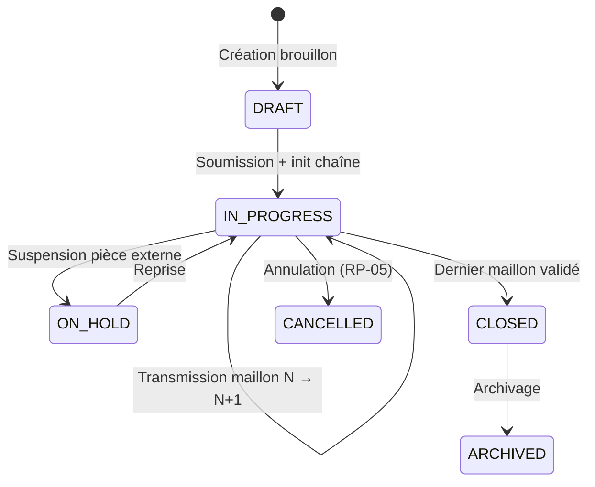

# Spécification détaillée — Module CHN (Chaîne de passation)

**Projet :** FluxPro — Suivi de dossiers par chaîne hiérarchique  
**Cas pilote :** Ministère des Travaux Publics du Cameroun (MINTP)  
**Module :** CHN — Chaîne de passation (CDC §7.4)  
**Version :** 1.0  
**Date :** 3 juillet 2026  
**Statut :** Spécification cible — **partiellement implémenté** (CHN-TPL livré, CHN-PASS / DEL à venir)

**Références :**
- [Cahier des charges §7.4](./CAHIER-DES-CHARGES-CHAINEFLUX-MINTP%20(1).md) — CHN-01 à CHN-10, §9 templates, §10 règles délais et passation
- [SPEC CHN-TPL](./SPEC-CHN-TPL.md) — détail configuration des templates
- [Sprint 3 — Chaînes & passation](./SPRINT-3-SPEC-CHAINES-PASSATION.md) — plan d'exécution technique
- [SPEC DOS](./SPEC-DOS.md) — dossiers, DOS-06, DOS-10, DOS-11
- [SPEC USR / RBAC](./SPEC-USR-RBAC.md) — rôles, permissions
- [SPEC ORG](./SPEC-ORG.md) — périmètre organisationnel
- [Inventaire types de dossiers](./PHASE-0-INVENTAIRE-TYPES-DOSSIERS.md) — catalogue COUR-STD, MARCHE-SMP, …
- Règle projet : `spring.jpa.hibernate.ddl-auto=none` — scripts dans `docs/sql/`

---

## Table des matières

1. [Contexte et objectifs](#1-contexte-et-objectifs)
2. [Décomposition modulaire](#2-décomposition-modulaire)
3. [État des lieux](#3-état-des-lieux)
4. [Exigences CDC — traçabilité](#4-exigences-cdc--traçabilité)
5. [Concepts métier](#5-concepts-métier)
6. [Architecture et flux](#6-architecture-et-flux)
7. [Modèle de données](#7-modèle-de-données)
8. [Règles métier](#8-règles-métier)
9. [Sous-module CHN-TPL — Templates](#9-sous-module-chn-tpl--templates)
10. [Sous-module CHN-PASS — Passation](#10-sous-module-chn-pass--passation)
11. [Sous-module DEL — Calcul des délais](#11-sous-module-del--calcul-des-délais)
12. [API REST — vue d'ensemble](#12-api-rest--vue-densemble)
13. [RBAC et périmètre](#13-rbac-et-périmètre)
14. [Frontend](#14-frontend)
15. [Templates pilote T01–T05](#15-templates-pilote-t01t05)
16. [Cas d'usage pilote](#16-cas-dusage-pilote)
17. [Plan de tests](#17-plan-de-tests)
18. [Recette UAT](#18-recette-uat)
19. [Hors périmètre et dépendances](#19-hors-périmètre-et-dépendances)
20. [Definition of Done](#20-definition-of-done)

---

## 1. Contexte et objectifs

### 1.1 Problème

La valeur métier de FluxPro repose sur la **circulation traçable** des dossiers : chaque document administratif suit un circuit hiérarchique prédéfini, avec un responsable identifié à chaque étape et un délai mesurable.

Sans module CHN, FluxPro ne peut pas répondre aux questions opérationnelles du MINTP :

- *Quel circuit s'applique à ce type de dossier ?*
- *Qui détient le dossier actuellement ?*
- *Depuis combien de temps ?*
- *Le délai du maillon est-il dépassé ?*

### 1.2 Objectifs du module CHN

| Objectif | Description | Sous-module |
|----------|-------------|-------------|
| **Modéliser** | Définir les circuits types (templates T01–T05) par type de dossier | CHN-TPL |
| **Instancier** | Matérialiser la chaîne sur chaque dossier à la création (DOS-06) | CHN-PASS |
| **Transmettre** | Faire avancer le dossier maillon par maillon avec horodatage | CHN-PASS |
| **Mesurer** | Calculer échéances et temps consommé (jours / heures ouvrés) | DEL |
| **Contrôler** | Garantir un seul responsable actif, retours motivés, suspension délai | CHN-PASS |
| **Informer** | Afficher le possessionnaire courant (CHN-07) | CHN-PASS + Front |

### 1.3 Exigences CDC §7.4 couvertes

| ID | Libellé | Priorité | Sous-module | Sprint cible |
|----|---------|----------|-------------|--------------|
| CHN-01 | Définition d'un template de chaîne par type de dossier | Must | CHN-TPL | S3 |
| CHN-02 | Maillon : libellé, rôle responsable, délai, action attendue | Must | CHN-TPL | S3 |
| CHN-03 | Transmission : l'agent cède le dossier au maillon suivant | Must | CHN-PASS | S3 |
| CHN-04 | Horodatage automatique à chaque transmission (date/heure, auteur) | Must | CHN-PASS | S3 |
| CHN-05 | Calcul temps passé par maillon (heures ouvrées) | Must | DEL | S3 |
| CHN-06 | Retour au maillon précédent (motif obligatoire) | Must | CHN-PASS | S3 |
| CHN-07 | Possessionnaire visible : « Dossier chez M. X depuis N jours » | Must | CHN-PASS + Front | S3 |
| CHN-08 | Verrouillage : un seul responsable actif par dossier | Must | CHN-PASS | S3 |
| CHN-09 | Copie informée (CC) sans responsabilité de traitement | Should | CHN-PASS | T1+ |
| CHN-10 | Saut de maillon exceptionnel (autorisation chef de service) | Should | CHN-PASS | T1+ |

### 1.4 Principes transverses

- Nommage technique en **anglais** (`chain_templates`, `file_passages`, `PassageStatus`)
- UUID en **BINARY(16)** ; schéma BDD via scripts SQL manuels (`docs/sql/`)
- Fuseau horaire métier : **`Africa/Douala`** (UTC+1)
- Erreurs API : **RFC 7807** (`ProblemDetail`)
- Chaque action de passation alimente le journal d'audit (AUD-01 — Sprint 5 complet)
- Le lien **type de dossier → template** est porté par `chain_templates.file_type_code` (pas l'inverse)

---

## 2. Décomposition modulaire

Le module CDC **CHN** est découpé en trois sous-modules techniques :

```
┌─────────────────────────────────────────────────────────────┐
│                    MODULE CHN (§7.4)                        │
├─────────────────┬─────────────────────┬─────────────────────┤
│   CHN-TPL       │     CHN-PASS        │        DEL          │
│   Templates     │     Passation       │   DelaiService      │
│   (config)      │     (exécution)     │   (calcul délais)   │
├─────────────────┼─────────────────────┼─────────────────────┤
│ CHN-01, CHN-02  │ CHN-03..08, 09, 10  │ CHN-05 + RM-01..05  │
│ Admin métier    │ Agents / managers   │ Service interne     │
└─────────────────┴─────────────────────┴─────────────────────┘
         │                    │                    │
         └────────────────────┴────────────────────┘
                              │
                    Module DOS (files)
                              │
              Modules aval : ALR (alertes), DSH (KPI), AUD
```

| Sous-module | Document détaillé | Responsabilité |
|-------------|-------------------|----------------|
| **CHN-TPL** | [SPEC-CHN-TPL.md](./SPEC-CHN-TPL.md) | CRUD templates, maillons, seed T01–T05 |
| **CHN-PASS** | §10 ci-dessous + [SPRINT-3](./SPRINT-3-SPEC-CHAINES-PASSATION.md) | Instanciation, transmission, retour, suspension |
| **DEL** | §11 ci-dessous + [SPRINT-3](./SPRINT-3-SPEC-CHAINES-PASSATION.md) | Jours ouvrés, heures ouvrées, fériés CM |

---

## 3. État des lieux

*Mise à jour : 3 juillet 2026*

### 3.1 CHN-TPL — Implémenté

| Composant | Statut |
|-----------|--------|
| Tables `chain_templates`, `chain_step_templates` | **Livré** — `docs/sql/2026-07-02_chain_templates.sql` |
| Entités JPA `ChainTemplate`, `ChainStepTemplate` | **Livré** |
| `ChainTemplateService`, `ChainTemplateController` | **Livré** |
| Tests `ChainTemplateServiceTest` | **Livré** |
| Seed T01–T05 (`ChainDataInitializer`) | **Livré** |
| Permissions `CHAIN_TEMPLATES:*` (RBAC) | **Livré** |
| Pages `/admin/chain-templates` (liste, détail, création, édition) | **Livré** |
| Duplication template | **Livré** |

### 3.2 CHN-PASS — Non implémenté

| Composant | Statut |
|-----------|--------|
| Table `file_passages` | Non créée |
| Entité `FilePassage`, `PassageStatus` | Non implémenté |
| `PassageService`, `PassageController` | Non implémenté |
| Instanciation chaîne à la création dossier (DOS-06) | Non implémenté |
| Permission `FILES:TRANSMIT` | Non seedée |
| Onglet **Circuit** sur fiche dossier | Non implémenté |
| Commentaires internes par maillon (DOS-10) | Non implémenté |

### 3.3 DEL — Non implémenté

| Composant | Statut |
|-----------|--------|
| `DelaiService` | Non implémenté |
| Table `business_calendar` (fériés CM) | Non créée |
| Calcul `due_at`, `consumed_hours`, `workingDaysHeld` | Non implémenté |
| Tests unitaires délais | Non implémentés |

### 3.4 Prérequis satisfaits

| Prérequis | Module | Statut |
|-----------|--------|--------|
| Auth JWT + RBAC | USR | Livré |
| Organisations + périmètre | ORG | Livré |
| Types de dossier (`file_types`) | REF | Livré |
| Dossiers (`files`) + pièces jointes | DOS | Livré (partiel) |
| Lien dossier → `chain_template_id` | DOS | Livré (champ FK) |

---

## 4. Exigences CDC — traçabilité

Matrice de couverture fonctionnelle → implémentation :

| ID | Fonctionnalité | ID technique | Statut |
|----|----------------|--------------|--------|
| CHN-01 | Template par type | TPL-F01..F09 | ✅ Livré |
| CHN-02 | Structure maillon | TPL-F05, TPL-F08 | ✅ Livré |
| CHN-03 | Transmission | PASS-F01 | ⏳ À faire |
| CHN-04 | Horodatage transmission | PASS-F02 | ⏳ À faire |
| CHN-05 | Temps passé maillon | DEL-F01..F04 | ⏳ À faire |
| CHN-06 | Retour arrière motivé | PASS-F03 | ⏳ À faire |
| CHN-07 | Indicateur possessionnaire | PASS-F04 | ⏳ À faire |
| CHN-08 | Verrouillage 1 responsable | PASS-F05 | ⏳ À faire |
| CHN-09 | CC informé | PASS-F06 | 📋 Should |
| CHN-10 | Saut de maillon | PASS-F07 | 📋 Should |

---

## 5. Concepts métier

### 5.1 Vocabulaire

| Terme | Définition |
|-------|------------|
| **Template de chaîne** | Modèle abstrait du circuit (T01…T05). Configuré par l'admin métier. |
| **Maillon template** | Étape type dans un template (`ChainStepTemplate`) : libellé, rôle, délai. |
| **Passage / maillon instance** | Occurrence concrète d'un maillon sur un dossier (`FilePassage`). |
| **Responsable actif** | Utilisateur détenteur du dossier au maillon `IN_PROGRESS`. |
| **Transmission** | Action de valider le maillon courant et d'activer le suivant. |
| **Possessionnaire** | Responsable actif + durée de détention (CHN-07). |

### 5.2 Cycle de vie d'un dossier dans la chaîne



### 5.3 Cycle de vie d'un maillon instance

| Statut (`PassageStatus`) | Signification |
|--------------------------|---------------|
| `PENDING` | Pas encore atteint |
| `IN_PROGRESS` | Responsable actif — **un seul par dossier** (CHN-08) |
| `COMPLETED` | Transmis au maillon suivant |
| `RETURNED` | Retourné au maillon précédent |
| `SUSPENDED` | En attente pièce externe — compteur gelé (RM-05) |
| `SKIPPED` | Saut exceptionnel autorisé (CHN-10) |

### 5.4 Résolution type → template

| `file_type_code` | Template | Priorité spéciale |
|------------------|----------|-------------------|
| `COUR-STD` | T01 | Si priorité « Très urgent » → T02 (DOS-06c) |
| `COUR-URG` | T02 | — |
| `MARCHE-SMP` | T03 | — |
| `AUTH-TRAV` | T04 | — |
| *(autres)* | Template actif lié par `file_type_code` | — |

---

## 6. Architecture et flux

### 6.1 Packages backend cibles

```
com.nanotech.flux_pro_backend
├── entity/
│   ├── ChainTemplate.java          ✅
│   ├── ChainStepTemplate.java        ✅
│   ├── FilePassage.java              ⏳
│   └── BusinessCalendarDay.java      ⏳
├── enumeration/
│   ├── PassageStatus.java            ⏳
│   └── DelayUnit.java                ✅ (sur template)
├── service/
│   ├── ChainTemplateService.java     ✅
│   ├── PassageService.java           ⏳
│   └── DelaiService.java             ⏳
├── controller/
│   ├── ChainTemplateController.java  ✅
│   └── PassageController.java        ⏳
```

### 6.2 Flux nominal — UC-01 (courrier entrant)

```
Agent DAG crée dossier COUR-STD
        │
        ▼
Résolution template T01 (DOS-06)
        │
        ▼
POST /files/{id}/chain/initialize
  → 7 FilePassage créés
  → Maillon 1 IN_PROGRESS, due_at calculé
        │
        ▼
Boucle : responsable transmet (CHN-03)
  → horodatage + auteur (CHN-04)
  → consumed_hours recalculé (CHN-05)
  → maillon suivant IN_PROGRESS
        │
        ▼
Maillon 7 (clôture) → dossier CLOSED (RP-04, DOS-11)
```

### 6.3 Flux alternatif — retour arrière (CHN-06)

```
Responsable maillon N (IN_PROGRESS)
        │
        ▼
POST .../return { reason: "≥ 20 caractères" }
        │
        ▼
Maillon N → RETURNED
Maillon N-1 → IN_PROGRESS (nouveau received_at, due_at)
```

### 6.4 Flux alternatif — suspension (RM-05)

```
Agent suspend (pièce externe manquante)
        │
        ▼
Maillon → SUSPENDED, dossier → ON_HOLD
Compteur délai gelé
        │
        ▼
Reprise → IN_PROGRESS, due_at = now + délai restant
Alertes ALR désactivées (ALR-07)
```

---

## 7. Modèle de données

### 7.1 Schéma relationnel

```
chain_templates (1) ──< chain_step_templates
chain_templates (1) ──< files.chain_template_id
files (1) ──< file_passages >── (1) chain_step_templates
users (1) ──< file_passages.responsible_user_id
business_calendar (fériés CM)
file_passage_cc (CHN-09, optionnel) ──> users
```

### 7.2 Scripts SQL

| Fichier | Contenu | Statut |
|---------|---------|--------|
| `docs/sql/2026-07-02_chain_templates.sql` | Tables templates | ✅ Existant |
| `docs/sql/2026-XX-XX_file_passages.sql` | Table passations + index verrouillage | ⏳ À produire |
| `docs/sql/2026-XX-XX_business_calendar.sql` | Fériés Cameroun | ⏳ À produire |

> **Rappel :** exécuter manuellement sur MySQL avant déploiement (`ddl-auto=none`).

### 7.3 Entité `FilePassage` (cible)

| Champ | Type | Description |
|-------|------|-------------|
| `id` | BINARY(16) PK | UUID |
| `file_id` | BINARY(16) FK | Dossier |
| `chain_step_template_id` | BINARY(16) FK | Référence maillon template |
| `step_order` | INT | Ordre dénormalisé |
| `responsible_user_id` | BINARY(16) FK | Responsable actuel |
| `status` | ENUM | `PassageStatus` |
| `received_at` | DATETIME(6) | Début délai (RM-03) |
| `transmitted_at` | DATETIME(6) NULL | Fin maillon |
| `due_at` | DATETIME(6) | Échéance (`DelaiService`) |
| `consumed_hours` | DECIMAL(10,2) | Temps ouvré consommé (CHN-05) |
| `comment` | TEXT NULL | Commentaire transmission |
| `internal_comment` | TEXT NULL | Commentaire interne maillon (DOS-10) |
| `return_reason` | VARCHAR(500) NULL | Motif retour (CHN-06) |
| `suspended_at` / `resumed_at` | DATETIME(6) NULL | Suspension RM-05 |

**Index critique CHN-08 :** contrainte garantissant au plus un `IN_PROGRESS` par `file_id` (index unique partiel ou validation service → `409 Conflict`).

---

## 8. Règles métier

### 8.1 Templates (TPL-01 à TPL-06)

Voir [SPEC-CHN-TPL §6](./SPEC-CHN-TPL.md#6-règles-métier). Résumé :

| ID | Règle |
|----|-------|
| TPL-01 | Code template unique |
| TPL-02 | `step_order` consécutifs 1..N |
| TPL-03 | Un seul maillon `closure_step` par template |
| TPL-04 | Somme délais maillons ≤ `total_delay_days` |
| TPL-05 | Templates système T01–T05 : non supprimables |
| TPL-06 | Désactivation interdite si dossiers en cours |

### 8.2 Passation (RP-01 à RP-05)

| ID | Règle | Validation |
|----|-------|------------|
| RP-01 | Commentaire obligatoire si transmission en retard | `now > due_at` → `comment` required |
| RP-02 | Motif retour ≥ 20 caractères | `@Size(min=20)` |
| RP-03 | Réaffectation : responsable actuel ou supérieur hiérarchique | `AccessControlService` |
| RP-04 | Clôture si tous maillons obligatoires validés | `PassageService` |
| RP-05 | Dossier annulé : historique passages conservé | Pas de DELETE cascade |

### 8.3 Verrouillage (CHN-08)

- **Au plus un** `FilePassage` avec `status = IN_PROGRESS` par dossier
- Tentative concurrente → HTTP `409 Conflict`
- Vérification en service **et** contrainte BDD si possible

### 8.4 Calcul des délais (RM-01 à RM-05)

| ID | Règle | Module |
|----|-------|--------|
| RM-01 | Jours ouvrés = lundi–vendredi | DEL |
| RM-02 | Exclure jours fériés Cameroun (table `business_calendar`) | DEL |
| RM-03 | Démarrage délai = `received_at` (réception effective) | DEL |
| RM-04 | T02 : heures ouvrées 08:00–17:00 `Africa/Douala` | DEL |
| RM-05 | Suspension : exclure `[suspended_at, resumed_at]` du calcul | DEL + CHN-PASS |

### 8.5 Lien dossier ↔ chaîne

| ID | Règle |
|----|-------|
| DOS-06 | À la soumission, résolution template via `file_type_code` (+ priorité T02) |
| DOS-06b | Changement de template interdit si chaîne initialisée |
| DOS-06c | Priorité « Très urgent » sur `COUR-STD` force template T02 |

### 8.6 Fonctions Should (CHN-09, CHN-10)

**CHN-09 — Copie informée (CC)**

- Table `file_passage_cc` : utilisateurs notifiés sans droit de transmission
- Notification in-app / email (Sprint 4) ; pas de responsabilité sur le délai

**CHN-10 — Saut de maillon**

- Autorisation `SERVICE_HEAD` ou supérieur
- Maillon sauté → `SKIPPED` ; motif obligatoire ; trace audit
- Maillons `optional=true` (ex. visa Ministre T03) éligibles au contournement standard

---

## 9. Sous-module CHN-TPL — Templates

> Spécification complète : **[SPEC-CHN-TPL.md](./SPEC-CHN-TPL.md)**

### 9.1 Périmètre

Configuration des modèles de chaîne : CRUD templates, gestion des maillons, seed MINTP, administration `/admin/chain-templates`.

### 9.2 API livrée

Base : `/api/admin/chain-templates`

| Méthode | Route | Permission |
|---------|-------|------------|
| GET | `/` | `CHAIN_TEMPLATES:READ` |
| GET | `/{id}` | `CHAIN_TEMPLATES:READ` |
| GET | `/by-code/{code}` | `CHAIN_TEMPLATES:READ` |
| POST | `/` | `CHAIN_TEMPLATES:CREATE` |
| PUT | `/{id}` | `CHAIN_TEMPLATES:UPDATE` |
| PUT | `/{id}/steps` | `CHAIN_TEMPLATES:UPDATE` |
| PATCH | `/{id}/activate` | `CHAIN_TEMPLATES:UPDATE` |
| PATCH | `/{id}/deactivate` | `CHAIN_TEMPLATES:UPDATE` |
| DELETE | `/{id}` | `CHAIN_TEMPLATES:DELETE` |
| POST | `/{id}/duplicate` | `CHAIN_TEMPLATES:CREATE` |

### 9.3 Frontend livré

| Route | Description |
|-------|-------------|
| `/admin/chain-templates` | Liste paginée, filtres actif / type |
| `/admin/chain-templates/new` | Création template + maillons |
| `/admin/chain-templates/[id]` | Détail, aperçu circuit, actions |
| `/admin/chain-templates/[id]/edit` | Édition en-tête et maillons |

---

## 10. Sous-module CHN-PASS — Passation

### 10.1 Périmètre fonctionnel

| ID | Fonctionnalité | Priorité |
|----|----------------|----------|
| PASS-F01 | Initialiser la chaîne sur un dossier (N passages) | Must |
| PASS-F02 | Transmettre au maillon suivant avec horodatage et auteur | Must |
| PASS-F03 | Retourner au maillon précédent (motif ≥ 20 car.) | Must |
| PASS-F04 | Exposer indicateur possessionnaire (CHN-07) | Must |
| PASS-F05 | Garantir verrouillage un responsable actif | Must |
| PASS-F06 | Suspendre / reprendre (attente pièce externe) | Must |
| PASS-F07 | Commentaire interne par maillon (DOS-10) | Must |
| PASS-F08 | Réaffectation forcée (RP-03) | Must |
| PASS-F09 | CC informé sans responsabilité (CHN-09) | Should |
| PASS-F10 | Saut de maillon autorisé (CHN-10) | Should |

### 10.2 Opérations

#### Initialisation (`POST /api/files/{id}/chain/initialize`)

- Déclenché à la **soumission** du dossier (transition `DRAFT` → `IN_PROGRESS`)
- Crée N `FilePassage` : maillon 1 `IN_PROGRESS`, autres `PENDING`
- Résout responsable maillon 1 (§10.3)
- Calcule `due_at` via `DelaiService`

#### Transmission (`POST /api/files/{id}/passages/{passageId}/transmit`)

Body : `{ "comment": "...", "nextResponsibleUserId": "..." }` (responsable optionnel si résolution auto)

Effets :
1. Maillon courant → `COMPLETED`, `transmitted_at = now()`, `consumed_hours` calculé
2. Maillon suivant → `IN_PROGRESS`, `received_at = now()`, nouveau `due_at`
3. `AuditLog` : action `FILE_TRANSMIT`
4. Si `closure_step` → dossier `CLOSED` (workflow DOS-11)

#### Retour (`POST .../return`)

Body : `{ "reason": "..." }` — min 20 caractères

#### Suspension / reprise (`POST .../suspend`, `POST .../resume`)

- Dossier → `ON_HOLD` ; alertes désactivées (ALR-07)

#### Réaffectation (`POST .../reassign`)

- Réservé responsable actuel ou supérieur (RP-03)
- Permission `FILES:UPDATE`

### 10.3 Résolution du responsable

Algorithme pour un maillon de rôle `R` sur dossier d'organisation `O` :

1. Utilisateurs **actifs** avec `role = R` dans `O` ou ancêtre hiérarchique pertinent
2. Si plusieurs : priorité chef de service de l'unité émettrice, sinon premier actif
3. Si aucun : erreur d'affectation — log + notification `BUSINESS_ADMIN`

| Rôle template | Correspondance MINTP |
|---------------|---------------------|
| `SUPPORT` | Secrétariat / courrier |
| `AGENT` | Agent traitant |
| `SERVICE_HEAD` | Chef de service |
| `DIRECTOR` | Directeur |
| `REGIONAL_DIRECTOR` | Directeur DRTP |
| `SECRETARY_GENERAL` | Secrétariat Général |
| `EXECUTIVE_OFFICE` | Cabinet / Ministre |

### 10.4 Indicateur CHN-07

Exposé dans `GET /api/files/{id}` et `GET /api/files/{id}/passages/current` :

```json
{
  "currentHolder": {
    "userId": "…",
    "fullName": "Paul K.",
    "organizationCode": "DAG",
    "stepLabel": "Directeur destinataire",
    "stepOrder": 3,
    "since": "2026-06-28T08:00:00+01:00",
    "workingDaysHeld": 3,
    "overdue": true,
    "dueAt": "2026-06-30T17:00:00+01:00"
  }
}
```

Libellé UI : *« Dossier chez {fullName} depuis {workingDaysHeld} jours ouvrés »*

---

## 11. Sous-module DEL — Calcul des délais

### 11.1 Interface `DelaiService`

| Méthode | Description |
|---------|-------------|
| `calculateDueDate(start, delayValue, unit)` | Date/heure d'échéance |
| `calculateConsumedHours(start, end, suspensions)` | Temps ouvré consommé |
| `countWorkingDays(start, end)` | Jours ouvrés écoulés |
| `isOverdue(dueAt, now)` | Retard ? |
| `addWorkingDays(date, days)` | Avance calendrier ouvré |
| `addWorkingHours(date, hours)` | Avance heures ouvrées (RM-04) |

### 11.2 Jours fériés Cameroun (seed initial)

| Date | Libellé |
|------|---------|
| 1er janvier | Nouvel An |
| 11 février | Fête de la Jeunesse |
| 1er mai | Fête du Travail |
| 20 mai | Fête Nationale |
| 25 décembre | Noël |

Liste extensible via `business_calendar` (`date`, `label`, `country_code='CM'`).

### 11.3 Exemples

**T01 — Maillon 4, 5 j.o., réception lundi 10/06/2026 09:00**

→ Échéance : lundi 17/06/2026 17:00

**T02 — Maillon 1, 4 h ouvrées, réception vendredi 14/06/2026 15:00**

→ 2 h vendredi (15h–17h) + 2 h lundi (08h–10h) → échéance lundi 10:00

### 11.4 Tests unitaires obligatoires

| ID | Scénario |
|----|----------|
| DEL-UT-01 | 5 j.o. sans férié |
| DEL-UT-02 | Franchissement week-end |
| DEL-UT-03 | Jour férié 20 mai exclu |
| DEL-UT-04 | 4 h ouvrées avec coupure week-end |
| DEL-UT-05 | Suspension 3 jours — temps gelé |
| DEL-UT-06 | `consumedHours` maillon complet |

---

## 12. API REST — vue d'ensemble

### 12.1 Templates (livré)

Voir [§9.2](#92-api-livrée).

### 12.2 Passation (cible)

| Méthode | Route | Permission | Description |
|---------|-------|------------|-------------|
| GET | `/api/files/{id}/passages` | `FILES:READ` | Circuit complet |
| GET | `/api/files/{id}/passages/current` | `FILES:READ` | Maillon actif + CHN-07 |
| POST | `/api/files/{id}/chain/initialize` | `FILES:UPDATE` | Instancier chaîne |
| POST | `/api/files/{id}/passages/{pid}/transmit` | `FILES:TRANSMIT` | Transmettre |
| POST | `/api/files/{id}/passages/{pid}/return` | `FILES:TRANSMIT` | Retour arrière |
| POST | `/api/files/{id}/passages/{pid}/suspend` | `FILES:TRANSMIT` | Suspension |
| POST | `/api/files/{id}/passages/{pid}/resume` | `FILES:TRANSMIT` | Reprise |
| POST | `/api/files/{id}/passages/{pid}/reassign` | `FILES:UPDATE` | Réaffectation |
| PATCH | `/api/files/{id}/passages/{pid}/comment` | `FILES:TRANSMIT` | Commentaire interne (DOS-10) |

### 12.3 Exemple — circuit dossier

```json
GET /api/files/{id}/passages

{
  "templateCode": "T01",
  "templateName": "Courrier entrant standard",
  "currentStepOrder": 3,
  "passages": [
    {
      "stepOrder": 1,
      "label": "Réception DAG",
      "status": "COMPLETED",
      "responsibleName": "Marie N.",
      "receivedAt": "2026-06-10T08:00:00+01:00",
      "transmittedAt": "2026-06-11T09:30:00+01:00",
      "dueAt": "2026-06-11T17:00:00+01:00",
      "consumedHours": 8.5,
      "overdue": false
    },
    {
      "stepOrder": 3,
      "label": "Directeur destinataire",
      "status": "IN_PROGRESS",
      "responsibleName": "Paul K.",
      "receivedAt": "2026-06-12T08:00:00+01:00",
      "dueAt": "2026-06-13T17:00:00+01:00",
      "workingDaysHeld": 2,
      "overdue": true
    }
  ]
}
```

---

## 13. RBAC et périmètre

### 13.1 Permissions

| Permission | Module | Description |
|------------|--------|-------------|
| `CHAIN_TEMPLATES:READ` | CHN-TPL | Consulter templates |
| `CHAIN_TEMPLATES:CREATE` | CHN-TPL | Créer / dupliquer |
| `CHAIN_TEMPLATES:UPDATE` | CHN-TPL | Modifier / activer / désactiver |
| `CHAIN_TEMPLATES:DELETE` | CHN-TPL | Supprimer (non système) |
| `FILES:READ` | DOS + CHN-PASS | Consulter circuit |
| `FILES:TRANSMIT` | CHN-PASS | Transmettre, retourner, suspendre |
| `FILES:UPDATE` | CHN-PASS | Init chaîne, réaffectation |

### 13.2 Matrice rôles (extrait)

| Rôle | Templates | Transmettre | Init chaîne |
|------|-----------|-------------|-------------|
| `SUPER_ADMIN` | CRUD | Oui | Oui |
| `BUSINESS_ADMIN` | CRUD | Oui | Oui |
| `DIRECTOR` | Lecture | Oui (périmètre) | Non |
| `SERVICE_HEAD` | Lecture | Oui | Non |
| `AGENT` | Lecture | Oui (si responsable) | Non |
| `READER` | Lecture | Non | Non |

### 13.3 Périmètre organisationnel

- Toute action de passation est soumise à `OrganizationScopeService`
- Un agent DRTP Centre **ne peut pas** transmettre un dossier DIER (test hérité Sprint 1)

---

## 14. Frontend

### 14.1 Écrans livrés (CHN-TPL)

| Route | Composant | Permission |
|-------|-----------|------------|
| `/admin/chain-templates` | Liste templates | `CHAIN_TEMPLATES:READ` |
| `/admin/chain-templates/new` | Formulaire création | `CHAIN_TEMPLATES:CREATE` |
| `/admin/chain-templates/[id]` | Détail + aperçu circuit | `CHAIN_TEMPLATES:READ` |
| `/admin/chain-templates/[id]/edit` | Édition | `CHAIN_TEMPLATES:UPDATE` |

### 14.2 Écrans cibles (CHN-PASS)

| Route | Description |
|-------|-------------|
| `/files/[id]` — onglet **Circuit** | Timeline maillons, bandeau CHN-07 |
| `/files/[id]` | Boutons Transmettre / Retourner / Suspendre (si responsable) |
| `/files` | Colonnes « Responsable actuel », « En retard » (DOS-09) |

### 14.3 Composant `PassageCircuit` (cible)

```
┌─────────────────────────────────────────┐
│ Dossier MINTP-DAG-2026-0042             │
│ [Circuit] [Pièces] [Historique]         │
├─────────────────────────────────────────┤
│ ⚠ Chez Paul K. (DAG) depuis 3 j. ouvrés │
├─────────────────────────────────────────┤
│ ✓ 1. Réception DAG          10/06       │
│ ✓ 2. Orientation Chef       11/06       │
│ ● 3. Directeur destinataire EN COURS    │
│ ○ 4. Agent traitant                     │
│ ...                                     │
├─────────────────────────────────────────┤
│ [Transmettre] [Retourner] [Suspendre]   │
└─────────────────────────────────────────┘
```

Modales : transmission (commentaire si retard), retour (motif), suspension (motif), commentaire interne (DOS-10).

### 14.4 Clés i18n (extrait)

```
files.circuit.title
files.circuit.currentHolder
files.circuit.transmit
files.circuit.return
files.circuit.suspend
files.circuit.resume
files.circuit.overdueCommentRequired
files.circuit.returnReasonMinLength
admin.chainTemplates.*   (livré)
```

---

## 15. Templates pilote T01–T05

Alignés [CDC §9](./CAHIER-DES-CHARGES-CHAINEFLUX-MINTP%20(1).md) et seed `ChainDataInitializer`.

| Code | Nom | Type dossier | Maillons | Délai total | Actif pilote |
|------|-----|--------------|----------|-------------|--------------|
| T01 | Courrier entrant standard | `COUR-STD` | 7 | 11 j.o. | ✅ |
| T02 | Courrier très urgent | `COUR-URG` | 6 | 2 j.o. (heures) | ✅ |
| T03 | Marché public simplifié | `MARCHE-SMP` | 7 | 15 j.o. | ✅ |
| T04 | Autorisation travaux DRTP | `AUTH-TRAV` | 6 | 18 j.o. | ✅ |
| T05 | Coopération / partenariat | — | 6 | 22 j.o. | ❌ (`active=false`) |

Détail maillon par maillon : [SPEC-CHN-TPL §10](./SPEC-CHN-TPL.md#10-données-de-référence--seed-mintp).

> **Point ouvert :** CDC UC-02 indique 21 j.o. pour T03 — MVP retenu **15 j.o.** Validation atelier DIER requise.

---

## 16. Cas d'usage pilote

### UC-01 — Courrier entrant DAG (T01)

**Critères d'acceptation :**
- [ ] Création dossier → chaîne T01 initialisée automatiquement
- [ ] 7 transmissions successives jusqu'à clôture
- [ ] Chaque transmission horodatée avec auteur
- [ ] `due_at` recalculé à chaque maillon
- [ ] Indicateur « chez X depuis N jours » visible sur maillon en retard

### UC-02 — Marché public DIER (T03)

- [ ] Chaîne T03 sur type `MARCHE-SMP`
- [ ] Retour maillon 3 → 2 avec motif 20 car.
- [ ] Directeur voit stagnation maillon 3 (indicateur CHN-07)

### UC-03 — Autorisation travaux DRTP (T04)

- [ ] Suspension maillon 3 — compteur gelé (RM-05)
- [ ] Reprise — nouvelle échéance cohérente
- [ ] Isolation périmètre : agent autre région → 403

### User stories

| ID | Story | Priorité |
|----|-------|----------|
| US-CHN-01 | En tant qu'admin métier, je configure les maillons d'un template | Must ✅ |
| US-CHN-02 | En tant qu'agent responsable, je transmets un dossier au maillon suivant | Must |
| US-CHN-03 | En tant que chef de service, je retourne un dossier avec motif | Must |
| US-CHN-04 | En tant que système, je calcule l'échéance en jours ouvrés | Must |
| US-CHN-05 | En tant qu'agent DRTP, je suspend l'attente pièce externe | Must |
| US-CHN-06 | En tant que directeur, je vois qui détient le dossier et depuis quand | Must |

---

## 17. Plan de tests

### 17.1 Tests unitaires

| Suite | Couverture | Statut |
|-------|------------|--------|
| `ChainTemplateServiceTest` | TPL-01 à TPL-06 | ✅ |
| `DelaiServiceTest` | RM-01 à RM-05 | ⏳ |
| `PassageServiceTest` | Transitions, CHN-08 | ⏳ |

### 17.2 Tests d'intégration

| ID | Scénario |
|----|----------|
| IT-CHN-01 | UC-01 bout en bout (7 maillons) |
| IT-CHN-02 | Retour motif < 20 car. → 400 |
| IT-CHN-03 | Double transmission concurrente → 409 |
| IT-CHN-04 | Suspension + reprise — `consumed_hours` correct |
| IT-CHN-05 | Agent hors périmètre → 403 |
| IT-CHN-06 | Init chaîne sur brouillon → 7 passages PENDING + 1 IN_PROGRESS |

### 17.3 Tests E2E frontend

| ID | Scénario |
|----|----------|
| E2E-CHN-01 | Timeline circuit sur fiche dossier |
| E2E-CHN-02 | Transmission avec commentaire obligatoire si retard |
| E2E-CHN-03 | Admin — édition template T01 |
| E2E-CHN-04 | Bandeau « chez X depuis N jours » |

---

## 18. Recette UAT

### 18.1 Scénarios métier

| ID | Scénario | Résultat attendu |
|----|----------|------------------|
| UAT-CHN-01 | Admin consulte template T01 | 7 maillons, délais conformes CDC |
| UAT-CHN-02 | Admin désactive template avec dossiers en cours | Refus avec message explicite |
| UAT-CHN-03 | Agent DAG soumet courrier standard | Chaîne T01 démarre, maillon 1 actif |
| UAT-CHN-04 | Agent transmet sans être responsable | Refus 403 |
| UAT-CHN-05 | Transmission en retard sans commentaire | Refus 400 |
| UAT-CHN-06 | Retour avec motif 15 caractères | Refus 400 |
| UAT-CHN-07 | Suspension puis reprise T04 maillon 3 | Délai recalculé, pas de faux retard |
| UAT-CHN-08 | Clôture après dernier maillon | Dossier CLOSED, scan réponse (DOS-11) |

### 18.2 PV de recette (modèle)

```
PROCÈS-VERBAL DE RECETTE UAT — Module CHN
Date : ___________
Participants : DAG ___, DIER ___, DRTP ___, DSI ___
Environnement : staging / pilote

Résultat global : [ ] Conforme  [ ] Réserves  [ ] Non conforme
Réserves : _______________________________________________
```

---

## 19. Hors périmètre et dépendances

### 19.1 Hors périmètre module CHN

| Sujet | Module | Sprint |
|-------|--------|--------|
| Alertes J-2, J+0, J+3, emails | ALR | S4 |
| Worker CRON calcul retards | ALR | S4 |
| Notifications in-app temps réel | ALR | S4 |
| Export PDF fiche de circulation | AUD | S5 |
| Dashboard KPI délai moyen | DSH | S5 |
| SMS opérateur local | ALR | Phase 2 |

### 19.2 Dépendances entrantes

| Module | Besoin pour CHN |
|--------|-----------------|
| USR / RBAC | Auth, rôles, permissions |
| ORG | Périmètre, résolution responsable |
| DOS | Entité `File`, statuts, soumission |
| REF | `file_types`, catalogue |

### 19.3 Dépendances sortantes

| Module | Alimenté par CHN |
|--------|------------------|
| ALR | `due_at`, `overdue`, statut `ON_HOLD` |
| DSH | Délais moyens, taux respect, charge agent |
| AUD | Actions transmit / return / suspend |
| DOS | Filtres retard et responsable (DOS-09) |

---

## 20. Definition of Done

### 20.1 CHN-TPL (livré)

- [x] Script SQL `2026-07-02_chain_templates.sql` exécutable
- [x] API `/api/admin/chain-templates` complète
- [x] Seed T01–T05 (`ChainDataInitializer`)
- [x] Pages admin frontend
- [x] Permissions RBAC seedées
- [x] Tests `ChainTemplateServiceTest`

### 20.2 CHN-PASS + DEL (cible Sprint 3)

- [ ] Script SQL `file_passages` + `business_calendar`
- [ ] `DelaiService` + tests ≥ 95 % branches
- [ ] `PassageService` + API passation
- [ ] Permission `FILES:TRANSMIT` seedée
- [ ] Instanciation auto à la soumission dossier
- [ ] Onglet Circuit sur fiche dossier
- [ ] UC-01, UC-02, UC-03 passent en intégration
- [ ] Verrouillage CHN-08 validé (test concurrent)
- [ ] OpenAPI à jour

### 20.3 Module CHN complet (CDC §7.4)

- [ ] CHN-01 à CHN-08 validés en UAT
- [ ] CHN-09 et CHN-10 planifiés ou livrés (Should)
- [ ] Documentation à jour (ce document + SPEC-CHN-TPL)
- [ ] Scripts SQL documentés et exécutés sur pilote MySQL

---

## Documents connexes

| Document | Rôle |
|----------|------|
| [SPEC-CHN-TPL.md](./SPEC-CHN-TPL.md) | Détail technique templates |
| [SPRINT-3-SPEC-CHAINES-PASSATION.md](./SPRINT-3-SPEC-CHAINES-PASSATION.md) | Plan sprint exécution |
| [SPEC-DOS.md](./SPEC-DOS.md) | Dossiers, lien chaîne |
| [ROADMAP-IMPLEMENTATION-CHAINEFLUX.md](./ROADMAP-IMPLEMENTATION-CHAINEFLUX.md) | Planning global |

---

*Spécification CHN v1.0 — FluxPro MINTP — Juillet 2026*
