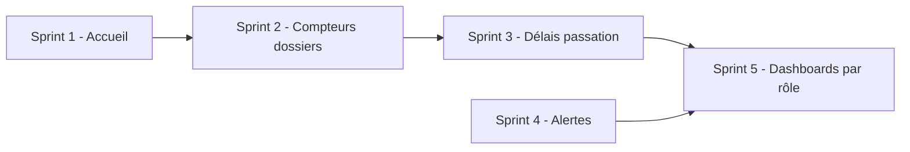
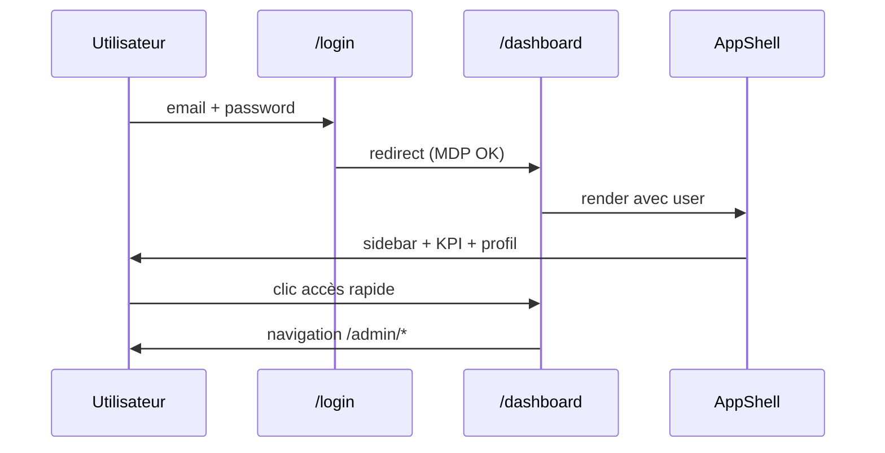

# Spécification — Tableau de bord (`/dashboard`)

**Projet :** FluxPro — Suivi de dossiers par chaîne hiérarchique  
**Cas pilote :** Ministère des Travaux Publics du Cameroun (MINTP)  
**Module :** DSH — Tableau de bord (version d'accueil Sprint 1)  
**Version :** 1.0  
**Date :** 1er juillet 2026  
**Statut :** **Implémenté (Sprint 1)** — KPI dossiers en attente Sprint 2 / Sprint 5

**Références :**
- [Cahier des charges](./CAHIER-DES-CHARGES-CHAINEFLUX-MINTP%20(1).md) — §7 (tableaux de bord), PERF-01
- [Roadmap](./ROADMAP-IMPLEMENTATION-CHAINEFLUX.md) — Sprint 1 (page d'accueil), Sprint 5 (dashboards métier)
- [Sprint 1 — Auth & Org](./SPRINT-1-SPEC-AUTH-ORG.md) — redirection post-login
- [SPEC USR / RBAC](./SPEC-USR-RBAC.md) — profil utilisateur, rôles, accès admin
- Code frontend : `flux-pro-front/src/app/dashboard/page.tsx`

---

## Table des matières

1. [Contexte et objectifs](#1-contexte-et-objectifs)
2. [Positionnement dans la roadmap](#2-positionnement-dans-la-roadmap)
3. [État des lieux](#3-état-des-lieux)
4. [Périmètre fonctionnel Sprint 1](#4-périmètre-fonctionnel-sprint-1)
5. [Structure de l'écran](#5-structure-de-lécran)
6. [Données affichées](#6-données-affichées)
7. [Contrôle d'accès et navigation](#7-contrôle-daccès-et-navigation)
8. [Internationalisation](#8-internationalisation)
9. [Parcours utilisateur](#9-parcours-utilisateur)
10. [User stories et critères d'acceptation](#10-user-stories-et-critères-dacceptation)
11. [Évolutions prévues](#11-évolutions-prévues)
12. [Hors périmètre](#12-hors-périmètre)
13. [Definition of Done](#13-definition-of-done)

---

## 1. Contexte et objectifs

### 1.1 Problème

Après authentification, l'utilisateur doit disposer d'une **page d'accueil** qui :

- confirme son identité et son rattachement organisationnel ;
- donne une vue synthétique du contexte FluxPro ;
- oriente vers les modules d'administration (Sprint 1) puis vers les dossiers (Sprint 2+).

Le cahier des charges prévoit des tableaux de bord **par rôle** avec KPI dossiers, retards et charge de travail (DSH-01 à DSH-07). Ces indicateurs nécessitent le module dossiers (Sprint 2) et les chaînes de passation (Sprint 3).

### 1.2 Objectifs du Sprint 1 (version actuelle)

| Objectif | Description |
|----------|-------------|
| **Accueil** | Page par défaut après login (`/` → `/dashboard`) |
| **Identité** | Afficher prénom, email, rôle, organisation |
| **Orientation** | Liens rapides vers modules admin selon le profil |
| **Préfiguration** | Zones graphiques pour KPI dossiers (données fictives / placeholder) |
| **Cohérence UX** | Mise en page responsive dans `AppShell` (sidebar + header) |

### 1.3 Principes

- Route protégée : **authentification obligatoire** (`RequireAuth`)
- Données profil : issues du **JWT / `GET /api/users/me`** (pas d'API dashboard dédiée en Sprint 1)
- KPI dossiers : **non connectés** à la base — libellés « Sprint 2 » / « — »
- Langues : **français** et **anglais** (i18n)

---

## 2. Positionnement dans la roadmap

| Phase | Sprint | Contenu `/dashboard` |
|-------|--------|----------------------|
| **Actuel** | Sprint 1 | Page d'accueil + profil + accès rapide admin + maquettes KPI |
| Futur | Sprint 2 | Compteur dossiers actifs réel (périmètre org) |
| Futur | Sprint 3 | Objectif de traitement / délai moyen par maillon |
| Futur | Sprint 4 | Widget alertes récentes |
| Cible | Sprint 5 | Dashboards par rôle (`/dashboard`, `/dashboard/equipe`, `/dashboard/direction`) |



---

## 3. État des lieux

### 3.1 Implémenté

| Élément | Fichier / composant | Statut |
|---------|---------------------|--------|
| Page `/dashboard` | `src/app/dashboard/page.tsx` | OK |
| Redirection `/` | `src/app/page.tsx` | OK → `/dashboard` si token |
| Redirection post-login | `src/app/login/page.tsx` | OK |
| Layout applicatif | `AppShell` | OK |
| Styles dashboard | `src/app/globals.css` (classes `dash-*`) | OK |
| i18n | `fr.json` / `en.json` → clé `dashboard.*` | OK |
| Carte profil | Données `user` depuis `AuthProvider` | OK |
| Accès rapide admin | Filtré par `isAdmin` / `SUPER_ADMIN` | OK (partiel) |

### 3.2 Partiel / placeholder

| Élément | Comportement actuel | Sprint cible |
|---------|---------------------|--------------|
| Stat « Agents pilotes » | Valeur fixe `85` | API comptage users périmètre |
| Stat « Dossiers actifs » | `—` + badge « Sprint 2 » | Sprint 2 |
| Graphique barres mensuel | Hauteurs statiques `BAR_HEIGHTS` | Sprint 5 — API stats |
| Jauge objectif traitement | 75 % fixe | Sprint 3 — `DelaiService` |
| Tendances (+11 %, +10 %) | Texte statique | Sprint 5 — calcul réel |
| Accès rapide | 3 liens (org, users, audit) | Enrichir (rôles, permissions, types org) |

### 3.3 Non implémenté

- API backend `/api/dashboard/*`
- Dashboards différenciés par rôle (DSH-01 à DSH-04)
- Export PDF / CSV depuis le dashboard
- Filtres temporels (30 j / 90 j)
- Widget alertes / activité récente

---

## 4. Périmètre fonctionnel Sprint 1

### 4.1 Inclus (Must)

| ID | Fonctionnalité |
|----|----------------|
| DSH-S1-01 | Afficher un message de bienvenue personnalisé (`Bonjour, {prénom}`) |
| DSH-S1-02 | Afficher la date du jour (locale fr/en) |
| DSH-S1-03 | Afficher le code organisation de l'utilisateur connecté |
| DSH-S1-04 | Afficher 4 cartes statistiques (organisation, agents, dossiers, rôle) |
| DSH-S1-05 | Afficher une zone graphique « Dossiers par mois » (placeholder) |
| DSH-S1-06 | Afficher une jauge « Objectif de traitement » (placeholder) |
| DSH-S1-07 | Carte « Mon profil » (identité, MDP, session) |
| DSH-S1-08 | Section « Accès rapide » vers modules admin autorisés |
| DSH-S1-09 | Page responsive (mobile / tablette / desktop) |
| DSH-S1-10 | Bloquer l'accès si non authentifié |

### 4.2 Should (améliorations court terme)

| ID | Fonctionnalité |
|----|----------------|
| DSH-S1-11 | Compteur agents réel via `GET /api/users` (total périmètre) |
| DSH-S1-12 | Accès rapide aligné sur la sidebar (`canSeePermission`) |
| DSH-S1-13 | Liens rôles / permissions pour `BUSINESS_ADMIN` |

### 4.3 Could (Sprint 2+)

| ID | Fonctionnalité |
|----|----------------|
| DSH-S1-14 | Liste des 5 derniers dossiers consultés |
| DSH-S1-15 | Bandeau alerte si `mustChangePassword` |

---

## 5. Structure de l'écran

La page est organisée en **5 zones verticales** dans `AppShell` :

```
┌─────────────────────────────────────────────────────────────┐
│ AppShell — Header (recherche, thème, profil)                │
├──────────┬──────────────────────────────────────────────────┤
│ Sidebar  │ ZONE A — Bandeau bienvenue                       │
│          │   Titre + sous-titre + date + code org          │
│          ├──────────────────────────────────────────────────┤
│          │ ZONE B — 4 cartes statistiques (grille 4 col.)  │
│          ├──────────────────────────────────────────────────┤
│          │ ZONE C — Graphique (8 col.) │ Jauge (4 col.)      │
│          ├──────────────────────────────────────────────────┤
│          │ ZONE D — Profil (4 col.)  │ Accès rapide (8 col.) │
└──────────┴──────────────────────────────────────────────────┘
```

### 5.1 Zone A — Bandeau bienvenue

| Champ | Source | Exemple |
|-------|--------|---------|
| Titre | `user.firstName` | « Bonjour, Emmanuel » |
| Sous-titre | i18n `dashboard.overview` | « Vue d'ensemble FluxPro — MINTP » |
| Date | `Date.toLocaleDateString` | « mercredi 1 juillet 2026 » |
| Code org | `user.organization.code` | « DAG » |

### 5.2 Zone B — Cartes statistiques

| Carte | Libellé i18n | Valeur Sprint 1 | Source cible |
|-------|--------------|-----------------|--------------|
| Organisation | `dashboard.organisation` | `user.organization.code` + nom | `/api/users/me` |
| Agents pilotes | `dashboard.pilotAgents` | `85` (fixe) | `GET /api/users` count |
| Dossiers actifs | `dashboard.activeFiles` | `—` | Sprint 2 — `GET /api/dossiers/stats` |
| Votre rôle | `dashboard.yourRole` | `user.role` formaté | `/api/users/me` |

Chaque carte comporte une **icône colorée**, une **valeur principale**, un **sous-texte** et un **badge tendance** (actif, +11 %, Sprint 2, session 8 h).

### 5.3 Zone C — Graphiques placeholder

**Graphique barres — Dossiers par mois**

- 12 barres (jan → déc), hauteurs prédéfinies en % (`BAR_HEIGHTS`)
- Sous-titre : « Volume estimé — disponible au Sprint 2 »
- Résumé : Total annuel `—`, Moyenne/mois `—`, Pic mai `90`

**Jauge — Objectif de traitement**

- Valeur fixe 75 %
- Sous-titre : délai moyen de passation par maillon
- Résumé : Objectif `48h`, Moyenne `—`, Aujourd'hui `—`

### 5.4 Zone D — Profil et accès rapide

**Carte Mon profil**

| Ligne | Source |
|-------|--------|
| Avatar | Initiales prénom + nom |
| Nom complet | `firstName` + `lastName` |
| Email | `user.email` |
| Badge rôle | `RoleBadge` |
| Direction | `user.organization.name` |
| Code org. | `user.organization.code` |
| Mot de passe | `mustChangePassword` → « À changer » / « À jour » |
| Session JWT | « Session active » (texte fixe) |

**Carte Accès rapide** (visible si au moins 1 lien)

| Lien | Route | Condition affichage |
|------|-------|---------------------|
| Organigramme | `/admin/org` | `isAdmin` |
| Utilisateurs | `/admin/users` | `isAdmin` |
| Journal connexions | `/admin/audit` | `user.role === SUPER_ADMIN` |

---

## 6. Données affichées

### 6.1 Données réelles (API / session)

Provient de `UserProfile` (`AuthProvider` → login ou `GET /api/users/me`) :

```typescript
interface UserProfile {
  id: string;
  email: string;
  lastName: string;
  firstName: string;
  role: UserRole;
  organization: { id: string; code: string; name: string };
  mustChangePassword: boolean;
  roles: string[];
  permissions: string[];
}
```

### 6.2 Données fictives (à remplacer)

| Donnée | Valeur actuelle | Fichier |
|--------|-----------------|---------|
| Nombre agents | `85` | `dashboard/page.tsx` L.148 |
| Hauteurs barres | `[65, 45, 80, …]` | `dashboard/page.tsx` L.27 |
| Jauge % | `75` | `dashboard/page.tsx` L.216 |
| Tendance agents | `+11%` | statique |
| Pic mai | `90` | `chartSummary` |
| Objectif délai | `48h` | `goalSummary` |

### 6.3 API future (Sprint 5 — proposition)

| Endpoint | Description |
|----------|-------------|
| `GET /api/dashboard/summary` | KPI agrégés selon rôle et périmètre org |
| `GET /api/dashboard/files-by-month?year=` | Volumes mensuels dossiers |
| `GET /api/dashboard/treatment-goal` | Délai moyen vs objectif |
| `GET /api/dashboard/recent-activity` | Dernières actions / alertes |

Réponse type `summary` (exemple) :

```json
{
  "activeFiles": 42,
  "agentsInScope": 12,
  "overdueFiles": 3,
  "averageTreatmentHours": 36.5,
  "treatmentGoalHours": 48
}
```

---

## 7. Contrôle d'accès et navigation

### 7.1 Accès à la page

| Route | Garde | Rôles |
|-------|-------|-------|
| `/dashboard` | `RequireAuth` (sans option) | Tout utilisateur authentifié avec MDP à jour |

**Flux de redirection :**

```
/ → token ? /dashboard : /login
/login OK → mustChangePassword ? /change-password : /dashboard
/change-password OK → /dashboard
```

### 7.2 Sidebar (AppShell)

Le menu latéral est **indépendant** du dashboard mais partage la même session :

| Section | Items | Visibilité |
|---------|-------|------------|
| Principal | Tableau de bord | Tous |
| Organisation | Organigramme, Types | `canAccessAdmin` |
| Administration | Utilisateurs, Rôles, Permissions, Audit | Selon `canSeePermission` / rôle |

### 7.3 Accès rapide dashboard vs sidebar

> **Écart connu :** l'accès rapide utilise `isAdmin` et `user.role === SUPER_ADMIN`, alors que la sidebar utilise `canSeePermission`. Harmonisation recommandée (DSH-S1-12).

---

## 8. Internationalisation

Clés principales (`dashboard.*`) :

| Clé | FR | EN |
|-----|----|----|
| `hello` | Bonjour, {{name}} | Hello, {{name}} |
| `overview` | Vue d'ensemble FluxPro — MINTP | FluxPro overview — MINTP |
| `organisation` | Organisation | Organisation |
| `pilotAgents` | Agents pilotes | Pilot agents |
| `activeFiles` | Dossiers actifs | Active files |
| `yourRole` | Votre rôle | Your role |
| `filesByMonth` | Dossiers par mois | Files by month |
| `filesByMonthSub` | Volume estimé — disponible au Sprint 2 | Estimated volume — available in Sprint 2 |
| `treatmentGoal` | Objectif de traitement | Treatment goal |
| `quickAccess` | Accès rapide | Quick access |
| `quickAccessSub` | Administration et configuration | Administration and configuration |
| `months.*` | Jan … Déc | Jan … Dec |

La date du jour suit la locale navigateur (`fr-FR` / `en-GB`).

---

## 9. Parcours utilisateur

### 9.1 Agent standard (AGENT)

1. Se connecte → redirigé vers `/dashboard`
2. Voit son organisation, son rôle, profil
3. **Ne voit pas** la section « Accès rapide » (non admin)
4. Voit les placeholders dossiers (préparation Sprint 2)

### 9.2 Administrateur métier (BUSINESS_ADMIN)

1. Même parcours + section « Accès rapide » (org, users)
2. Sidebar : Organisation + Administration (selon permissions)

### 9.3 Super administrateur (SUPER_ADMIN)

1. Accès rapide inclut le journal connexions
2. Sidebar complète



---

## 10. User stories et critères d'acceptation

### US-DSH-01 — Page d'accueil après connexion

**En tant qu'** utilisateur authentifié,  
**je veux** arriver sur un tableau de bord après login,  
**afin de** confirmer mon contexte et accéder aux modules.

**Critères d'acceptation :**
- [ ] Login réussi → URL `/dashboard`
- [ ] Titre contient le prénom de l'utilisateur
- [ ] Code et nom d'organisation affichés
- [ ] Rôle affiché avec badge

### US-DSH-02 — Protection de la route

**En tant que** visiteur non connecté,  
**je ne dois pas** accéder au dashboard.

**Critères :**
- [ ] Accès `/dashboard` sans token → redirection `/login`
- [ ] `mustChangePassword = true` → redirection `/change-password`

### US-DSH-03 — Accès rapide administration

**En tant qu'** administrateur,  
**je veux** des raccourcis vers org et utilisateurs,  
**afin de** ne pas chercher dans le menu.

**Critères :**
- [ ] `BUSINESS_ADMIN` voit organigramme et utilisateurs
- [ ] `SUPER_ADMIN` voit aussi journal connexions
- [ ] `AGENT` ne voit pas la carte accès rapide

### US-DSH-04 — Responsive

**En tant qu'** utilisateur mobile,  
**je veux** un affichage lisible.

**Critères :**
- [ ] Grille stats : 1 col. mobile, 2 tablette, 4 desktop
- [ ] Graphiques empilés verticalement sur mobile
- [ ] Sidebar repliable / drawer mobile via AppShell

### US-DSH-05 — Placeholder dossiers (Sprint 1)

**En tant que** PO,  
**je veux** visualiser l'emplacement futur des KPI dossiers,  
**afin de** valider la maquette avant Sprint 2.

**Critères :**
- [ ] Carte dossiers actifs affiche `—` et mention Sprint 2
- [ ] Graphique mensuel visible avec libellé explicite placeholder
- [ ] Aucun appel API dossiers en Sprint 1

---

## 11. Évolutions prévues

### Sprint 2 — Compteurs dossiers

- Remplacer `—` par le nombre de dossiers actifs du périmètre org
- Badge tendance calculé (vs mois précédent)

### Sprint 3 — Délais

- Alimenter jauge et `goalSummary.average` via `DelaiService`
- Objectif 48 h paramétrable par type de dossier

### Sprint 4 — Alertes

- Widget « Alertes récentes » (zone sous le bandeau ou colonne droite)
- Lien vers dossiers en retard

### Sprint 5 — Dashboards par rôle (cible CDC)

| Route | Rôle | Contenu |
|-------|------|---------|
| `/dashboard` | Agent | Mes dossiers, mes retards |
| `/dashboard/equipe` | Chef de service | Charge équipe |
| `/dashboard/direction` | Directeur | KPI direction, top retards |
| `/dashboard/executive` | SG / Cabinet | Vision transversale |

**PERF-01 :** chargement dashboard directeur **< 3 secondes**.

---

## 12. Hors périmètre

| Sujet | Sprint / phase |
|-------|----------------|
| KPI dossiers réels | Sprint 2+ |
| API `/api/dashboard/*` | Sprint 5 |
| Export PDF / CSV | Sprint 5 |
| Heatmap directions | Sprint 5 |
| Personnalisation widgets par utilisateur | Phase 2 |
| Notifications temps réel (WebSocket) | Sprint 4+ |

---

## 13. Definition of Done

### Sprint 1 (état actuel)

- [x] Route `/dashboard` fonctionnelle et protégée
- [x] Intégration `AppShell` + i18n fr/en
- [x] Profil utilisateur depuis session
- [x] Accès rapide admin conditionnel
- [x] Maquettes graphiques placeholder documentées
- [ ] Compteur agents dynamique (optionnel)
- [ ] Harmonisation accès rapide / `canSeePermission`
- [ ] Tests E2E Playwright : login → dashboard → liens admin

### Sprint 5 (cible)

- [ ] API dashboard documentée OpenAPI
- [ ] KPI branchés sur données réelles
- [ ] Dashboards par rôle
- [ ] PERF-01 validé (< 3 s)
- [ ] UC-04 recette avec données réalistes

---

*Spécification Dashboard v1.0 — FluxPro MINTP — Juillet 2026*
