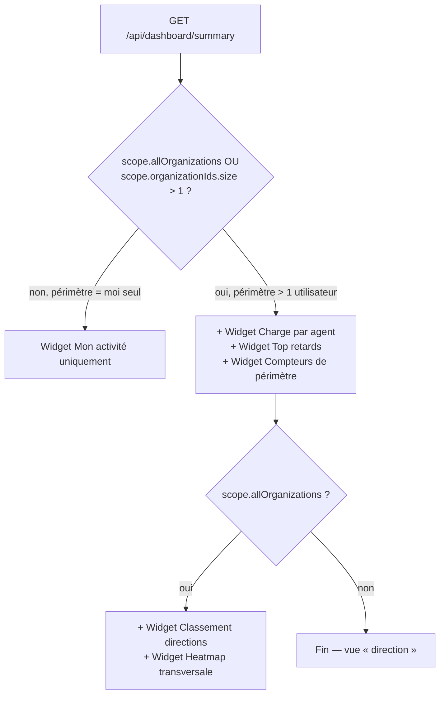
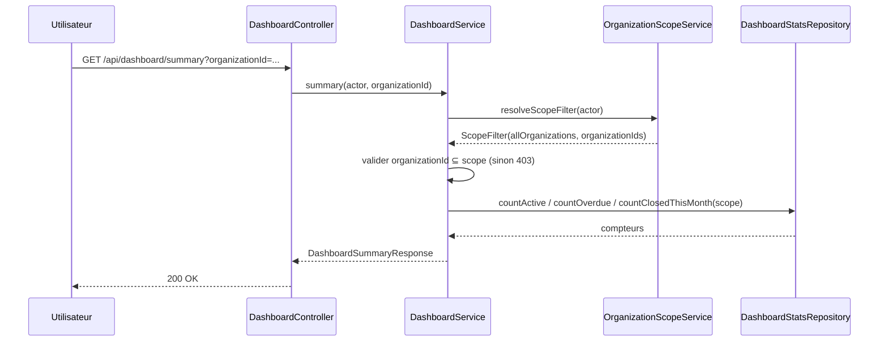
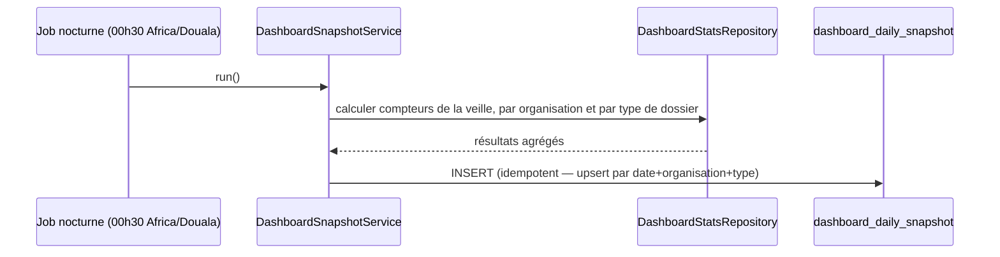
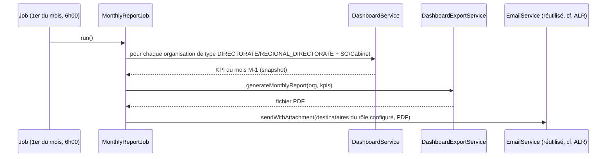

# Spécification détaillée — Module DSH (Tableaux de bord et reporting)

**Projet :** FluxPro — Suivi de dossiers par chaîne hiérarchique
**Cas pilote :** Ministère des Travaux Publics du Cameroun (MINTP)
**Module :** DSH — Tableaux de bord et reporting (CDC §7.6 et §11)
**Version :** 1.0
**Date :** 4 juillet 2026
**Statut :** Spécification cible — **non implémenté** (prérequis DOS / CHN-PASS / ALR / DEL livrés)

**Références :**
- [Cahier des charges §7.6](./CAHIER-DES-CHARGES-CHAINEFLUX-MINTP%20(1).md) — DSH-01 à DSH-08
- [Cahier des charges §8.4](./CAHIER-DES-CHARGES-CHAINEFLUX-MINTP%20(1).md) — UC-04 : consultation du tableau de bord Directeur
- [Cahier des charges §11](./CAHIER-DES-CHARGES-CHAINEFLUX-MINTP%20(1).md#11-tableaux-de-bord-et-reporting) — §11.1 rapport mensuel automatique, §11.2 exports disponibles
- [Cahier des charges §12.1](./CAHIER-DES-CHARGES-CHAINEFLUX-MINTP%20(1).md) — PERF-01 (chargement dashboard < 3 s)
- [Roadmap — Sprint 5](./ROADMAP-IMPLEMENTATION-CHAINEFLUX.md) — dashboards par rôle, statistiques, exports
- [SPEC Dashboard (Sprint 1)](./SPEC-DASHBOARD.md) — état antérieur : page d'accueil, données non connectées — **remplacé** par le présent document pour tout ce qui concerne les KPI réels (DSH-01 à DSH-08)
- [SPEC DOS](./SPEC-DOS.md) — `FileEntity`, statuts, `receivedAt`/`closedAt`
- [SPEC CHN](./SPEC-CHN.md) — `FilePassage`, `due_at`, `overdue`, `ChainTemplate.totalDelayDays`
- [SPEC ALR](./SPEC-ALR.md) — définition du retard, `DelaiService`, digest par rôle
- [SPEC USR / RBAC](./SPEC-USR-RBAC.md) — rôles, permissions, `OrganizationScopeService`
- Code existant réutilisé : `OrganizationScopeService`, `AccessControlService`, `DelaiService`, `FileRepository`, `FilePassageRepository`
- Règle projet : `spring.jpa.hibernate.ddl-auto=none` — tout script SQL dans `docs/sql/`

---

## Table des matières

1. [Contexte et objectifs](#1-contexte-et-objectifs)
2. [État des lieux](#2-état-des-lieux)
3. [Périmètre fonctionnel](#3-périmètre-fonctionnel)
4. [Concepts métier](#4-concepts-métier)
5. [Architecture et flux](#5-architecture-et-flux)
6. [Règles de calcul des indicateurs](#6-règles-de-calcul-des-indicateurs)
7. [Modèle de données](#7-modèle-de-données)
8. [API REST](#8-api-rest)
9. [Exports et rapports](#9-exports-et-rapports)
10. [RBAC et permissions](#10-rbac-et-permissions)
11. [Performance](#11-performance)
12. [Frontend — écrans cibles](#12-frontend--écrans-cibles)
13. [User stories et cas d'usage](#13-user-stories-et-cas-dusage)
14. [Plan de tests](#14-plan-de-tests)
15. [Recette UAT](#15-recette-uat)
16. [Hors périmètre et dépendances](#16-hors-périmètre-et-dépendances)
17. [Definition of Done](#17-definition-of-done)

---

## 1. Contexte et objectifs

### 1.1 Problème

Tous les modules précédents (DOS, CHN-PASS, ALR) produisent de la donnée opérationnelle — dossiers, maillons, échéances, alertes — mais aucun écran ne l'agrège pour donner une **vision de pilotage**. Un agent doit ouvrir `/files` et filtrer manuellement pour connaître sa charge ; un directeur n'a aucun moyen de savoir en un coup d'œil si sa direction est en avance ou en retard sans consulter dossier par dossier.

Le module **DSH** transforme les données déjà existantes (jamais dupliquées, jamais recalculées « à la main ») en **indicateurs consultables** : compteurs, tendances, classements, exports — jusqu'au cas d'usage pilote **UC-04** du CDC (« le directeur voit 47 dossiers actifs dont 8 en retard, délai moyen 14 jours, top 3 agents en retard »).

### 1.2 Objectifs du module DSH

| Objectif | Description | Exigence CDC |
|----------|-------------|--------------|
| **Compter** | Donner des compteurs fiables (actifs, en retard, clôturés) à tout instant | DSH-05 |
| **Contextualiser** | Adapter automatiquement le périmètre visible au rattachement organisationnel de l'utilisateur, sans écran dédié par rôle | DSH-01 à DSH-04 |
| **Mesurer** | Comparer délai réel vs délai cible, par type de dossier et par direction | DSH-06, DSH-07 |
| **Comparer** | Classer les directions par taux de respect des délais | DSH-07 |
| **Exporter** | Permettre l'extraction CSV/PDF des mêmes données pour un usage hors-ligne | DSH-08, §11.2 |
| **Automatiser** | Envoyer un rapport mensuel PDF à chaque directeur et au SG | §11.1 |

### 1.3 Exigences CDC §7.6 couvertes

| ID | Libellé | Priorité | Sprint cible |
|----|---------|----------|--------------|
| DSH-01 | Vue agent : mes dossiers en cours, mes retards, mes transmissions | Must | S5 |
| DSH-02 | Vue chef de service : dossiers équipe, retards, charge par agent | Must | S5 |
| DSH-03 | Vue directeur : KPI direction, top retards, délai moyen | Must | S5 |
| DSH-04 | Vue SG/Cabinet : vision transversale, heatmap par direction | Should | S5 |
| DSH-05 | Compteur dossiers : total actifs, en retard, clôturés ce mois | Must | S5 |
| DSH-06 | Graphique délai moyen par type de dossier (30/90 jours) | Must | S5 |
| DSH-07 | Classement directions par taux de respect des délais | Must | S5 |
| DSH-08 | Export CSV / PDF des rapports | Must | S5 |
| — | §11.1 Rapport mensuel automatique (PDF, envoyé le 1er du mois) | Should | S5 |
| — | §11.2 Exports disponibles (liste dossiers en retard, journal d'audit…) | Should | S5 |

### 1.4 Principes transverses

- **Aucune vue « par rôle » codée en dur.** Le CDC décrit DSH-01 à DSH-04 comme quatre vues (agent / chef de service / directeur / SG-Cabinet), mais le module ne contient **aucun `if role == DIRECTOR`** : la largeur du périmètre observable est entièrement déléguée à `OrganizationScopeService.resolveScopeFilter(actor)`, déjà utilisée par DOS et ALR. Le frontend compose l'écran à partir de **widgets génériques** (mon activité, charge d'équipe, KPI de périmètre, classement) et n'affiche que ceux pertinents selon la largeur de périmètre renvoyée par l'API — pas selon le nom du rôle.
- **Pas de duplication de données.** Aucune table ne recopie `FileEntity` / `FilePassage` : tous les compteurs sont calculés **à la lecture**, à partir des tables existantes (§7). Seule exception assumée : un instantané quotidien optionnel pour l'historique long (§7.3), nécessaire car un dossier clôturé aujourd'hui ne doit pas modifier rétroactivement la courbe « respect des délais » du mois dernier.
- **Regroupement par direction non figé.** « Classement des directions » (DSH-07) ne désigne pas littéralement les lignes de type `DIRECTORATE` : le niveau de regroupement est un paramètre (`groupByTypeCode`), résolu via `OrganizationType` (déjà administrable, cf. SPEC USR/RBAC) — un jour MINTP pourra vouloir grouper par `REGIONAL_DIRECTORATE` sans changer de code.
- **Réutilisation stricte de la définition du retard.** DSH n'invente pas une deuxième notion de « dossier en retard » : il réutilise exactement le périmètre de `FilePassageRepository.findOverdueForDigest` (maillon `IN_PROGRESS`, dossier `IN_PROGRESS`, `due_at` dépassé) déjà utilisé par le digest ALR-08, pour qu'un directeur ne voie jamais deux chiffres différents entre son email de digest et son dashboard.
- **`DelaiService` reste l'unique source de calcul de délai** (jours ouvrés, jours fériés CM, fuseau `Africa/Douala`) : DSH ne réimplémente aucun calcul calendaire.
- Nommage technique en anglais (`dashboard`, `stats`, `snapshot`), aligné sur les conventions CHN/DOS/ALR.
- Erreurs API : **RFC 7807** (`ProblemDetail`), cohérent avec les autres modules.

---

## 2. État des lieux

*Mise à jour : 4 juillet 2026*

| Composant | Statut |
|-----------|--------|
| Page `/dashboard` (accueil, données statiques) | **Livré (Sprint 1)** — cf. `SPEC-DASHBOARD.md` |
| `OrganizationScopeService.resolveScopeFilter` | **Livré** — réutilisable tel quel pour le périmètre DSH |
| `FileRepository.search` (filtre org/status/priorité/dates) | **Livré** — base de départ, sans agrégats |
| `FilePassageRepository.findOverdueForDigest` | **Livré** (module ALR) — définition canonique du retard |
| `DelaiService` (`countWorkingDays`, fuseau `Africa/Douala`) | **Livré** |
| `ChainTemplate.totalDelayDays` / `ChainStepTemplate.delayValue` | **Livré** — délais cibles |
| Requêtes d'agrégation (compteurs, moyennes, classements) | **Non implémentées** |
| `DashboardService` / `DashboardController` | **Non implémentés** |
| Table `dashboard_daily_snapshot` (historique, optionnelle) | **Non créée** |
| Job de rapport mensuel PDF (§11.1) | **Non implémenté** |
| Génération PDF (fiche, rapport, export) | **Aucune librairie PDF dans le projet à ce jour** |
| Export CSV | **Non implémenté** (le projet ne sait aujourd'hui qu'importer du CSV, cf. `CsvUtils`) |
| Permissions `DASHBOARD:*` (RBAC) | **Non seedées** |
| Frontend — widgets dynamiques, graphiques | **Non implémenté** (barres/jauge Sprint 1 = valeurs statiques) |

### 2.1 Prérequis satisfaits

| Prérequis | Module | Apport pour DSH |
|-----------|--------|------------------|
| Auth JWT + RBAC + `OrganizationScopeService` | USR | Résolution automatique du périmètre visible |
| Organisations + types (`OrganizationType`) | ORG | Regroupement configurable (direction, division, DRTP…) |
| Dossiers (`FileEntity`, `receivedAt`, `closedAt`, `status`) | DOS | Compteurs, délais réels |
| Chaîne de passation (`FilePassage`, `due_at`, `overdue`) | CHN-PASS | Retards, charge par agent |
| Templates (`ChainTemplate.totalDelayDays`) | CHN-TPL | Délai cible pour le taux de respect |
| Calcul des délais (`DelaiService`) | DEL | Jours ouvrés, jours fériés CM |
| Moteur d'alertes / définition du retard | ALR | Cohérence de la notion « en retard » entre digest et dashboard |

---

## 3. Périmètre fonctionnel

### 3.1 Fonctionnalités Must

| ID | Fonctionnalité | Exigence CDC |
|----|----------------|--------------|
| DSH-F01 | Widget « Mon activité » : mes maillons en cours, mes retards, mes transmissions récentes | DSH-01 |
| DSH-F02 | Widget « Compteurs » : dossiers actifs, en retard, clôturés ce mois, sur le périmètre organisationnel de l'appelant | DSH-05 |
| DSH-F03 | Widget « Charge par agent » : répartition des maillons actifs par utilisateur responsable, dans le périmètre | DSH-02 |
| DSH-F04 | Widget « Top retards » : liste des N dossiers les plus en retard (jours ouvrés) dans le périmètre | DSH-01, DSH-02, DSH-03 |
| DSH-F05 | Widget « Délai moyen par type de dossier » sur fenêtre glissante 30/90 jours | DSH-06 |
| DSH-F06 | Widget « Classement des directions » par taux de respect des délais | DSH-07 |
| DSH-F07 | Export CSV des widgets tabulaires (compteurs, top retards, classement, charge par agent) | DSH-08 |
| DSH-F08 | Le périmètre organisationnel de chaque widget est résolu automatiquement (jamais une valeur choisie librement en dehors du périmètre autorisé) | Sécurité, RBAC |

### 3.2 Fonctionnalités Should

| ID | Fonctionnalité | Exigence CDC |
|----|----------------|--------------|
| DSH-F09 | Widget « Vision transversale / heatmap » (couleur par direction selon taux de retard) pour les rôles à périmètre global | DSH-04 |
| DSH-F10 | Export PDF des mêmes rapports (compteurs, top retards, classement) | DSH-08 |
| DSH-F11 | Rapport mensuel automatique PDF, envoyé le 1er de chaque mois à chaque directeur et au SG | §11.1 |
| DSH-F12 | Instantané quotidien (`dashboard_daily_snapshot`) pour figer l'historique mensuel et éviter les recalculs rétroactifs | Performance, fiabilité historique |
| DSH-F13 | Filtre temporel configurable (30 j / 90 j / mois calendaire) sur les widgets de tendance | DSH-06 |

### 3.3 Fonctionnalités Could (Phase 2)

| ID | Fonctionnalité | Exigence CDC |
|----|----------------|--------------|
| DSH-F14 | Export XLSX « statistiques nationales » (Cabinet) | §11.2 |
| DSH-F15 | Cache applicatif (Redis) si la volumétrie nationale dégrade PERF-01 | Roadmap — risque perf S5 |
| DSH-F16 | Personnalisation des widgets affichés par utilisateur | Confort UX |

---

## 4. Concepts métier

### 4.1 Vocabulaire

| Terme | Définition |
|-------|------------|
| **Périmètre (scope)** | Ensemble d'organisations sur lequel un utilisateur peut voir des données, résolu par `OrganizationScopeService.resolveScopeFilter` — jamais recalculé indépendamment par DSH. |
| **Widget** | Bloc d'indicateur autonome (compteur, liste, graphique), interrogeable indépendamment via son propre endpoint, composé côté frontend selon le périmètre disponible. |
| **Dossier actif** | `FileEntity.status = IN_PROGRESS`. |
| **Dossier en retard** | Dossier portant au moins un maillon dans le périmètre de `FilePassageRepository.findOverdueForDigest` (même définition que le digest ALR-08). |
| **Délai réel** | Durée effective, en jours ouvrés (`DelaiService.countWorkingDays`), entre la réception d'un dossier/maillon et sa clôture/transmission. |
| **Délai cible** | `ChainTemplate.totalDelayDays` (niveau dossier) ou `ChainStepTemplate.delayValue` (niveau maillon), exprimé dans son `DelayUnit`. |
| **Taux de respect des délais** | Pourcentage de dossiers clôturés sur une période dont le délai réel ≤ délai cible du template appliqué. |
| **Niveau de regroupement** | Code d'`OrganizationType` (ex. `DIRECTORATE`, `REGIONAL_DIRECTORATE`) utilisé pour agréger un classement — jamais une valeur d'organisation câblée en dur. |
| **Instantané quotidien (snapshot)** | Ligne agrégée figée à J, utilisée pour reconstituer un historique stable (mois précédents) sans recalcul rétroactif. |

### 4.2 Composition des widgets par largeur de périmètre

Plutôt que quatre écrans dédiés (agent / chef de service / directeur / SG), le frontend assemble un **unique tableau de bord** dont les sections apparaissent selon ce que l'API renvoie réellement — reflet direct du périmètre de l'utilisateur, pas de son intitulé de rôle :



Cette approche reproduit fidèlement DSH-01 → DSH-04 (un agent sans subordonné voit *de fait* uniquement « Mon activité » ; le SG/Cabinet, ayant `scope.allOrganizations = true`, voit *de fait* la vision transversale) sans qu'aucune règle de code ne mentionne un nom de rôle.

### 4.3 Pourquoi un instantané quotidien optionnel (DSH-F12)

Calculer « taux de respect des délais de mars » en interrogeant `FileEntity` en temps réel donne un résultat différent selon le jour où l'on pose la question, si des dossiers de mars sont fermés tardivement en avril. Pour un **rapport mensuel** figé et un **historique 30/90 jours** stable, une ligne d'instantané par jour et par organisation (compteurs de la veille) est calculée une fois par un job nocturne, puis ne change plus. Les widgets « temps réel » (compteurs du jour, top retards) restent, eux, toujours calculés à la volée.

---

## 5. Architecture et flux

### 5.1 Packages backend cibles

```
com.nanotech.flux_pro_backend
├── controller
│   └── DashboardController.java          (nouveau)
├── service
│   ├── DashboardService.java             (nouveau — orchestration des widgets)
│   ├── DashboardExportService.java       (nouveau — CSV/PDF)
│   └── DashboardSnapshotService.java     (nouveau — instantané quotidien, DSH-F12)
├── repository
│   └── DashboardStatsRepository.java     (nouveau — requêtes d'agrégation JPQL/native)
├── entity
│   └── DashboardDailySnapshot.java       (nouveau, optionnel §7.3)
├── dto/response
│   ├── DashboardSummaryResponse.java
│   ├── WorkloadEntryResponse.java
│   ├── OverdueFileResponse.java
│   ├── DelayByTypeResponse.java
│   └── OrganizationRankingResponse.java
└── job
    └── MonthlyReportJob.java             (nouveau — §11.1, DSH-F11)
```

### 5.2 Vue d'ensemble du flux (widget temps réel)



### 5.3 Flux — instantané quotidien (DSH-F12)



### 5.4 Flux — rapport mensuel automatique (§11.1, DSH-F11)



---

## 6. Règles de calcul des indicateurs

### 6.1 Compteurs (DSH-05)

| Indicateur | Formule | Portée temporelle |
|------------|---------|--------------------|
| Dossiers actifs | `COUNT(FileEntity)` où `status = IN_PROGRESS` et `organization ∈ scope` | Instantané (temps réel) |
| Dossiers en retard | `COUNT(DISTINCT FileEntity)` référencés par `findOverdueForDigest`-équivalent, `organization ∈ scope` | Instantané |
| Clôturés ce mois | `COUNT(FileEntity)` où `status = CLOSED` et `closedAt` dans le mois calendaire courant (`Africa/Douala`) et `organization ∈ scope` | Mois glissant calendaire |
| Créés ce mois | `COUNT(FileEntity)` où `receivedAt` dans le mois calendaire courant et `organization ∈ scope` | Mois glissant calendaire |

### 6.2 Charge par agent (DSH-02)

```
GROUP BY responsible_user_id
SELECT COUNT(*) FILTER (status = IN_PROGRESS) AS actifs,
       COUNT(*) FILTER (overdue = true)       AS retards
FROM FilePassage
WHERE responsible_user.organization ∈ scope
```

Trié par `retards DESC, actifs DESC`. Limité aux utilisateurs actifs (`User.active = true`).

### 6.3 Top retards (DSH-01/02/03)

Réutilise directement le jeu de résultats de `FilePassageRepository.findOverdueForDigest`, filtré par `organization ∈ scope`, trié par `dueAt ASC` (le plus ancien en tête), tronqué à `limit` (défaut 10, max 100).

### 6.4 Délai moyen par type de dossier (DSH-06)

Pour chaque `fileTypeCode`, sur les dossiers **clôturés** dans la fenêtre (30 ou 90 jours glissants) et dans le périmètre :

```
délaiRéel(dossier) = DelaiService.countWorkingDays(receivedAt, closedAt)
délaiMoyen(type)   = moyenne(délaiRéel) sur tous les dossiers clôturés du type, dans la fenêtre
```

Le résultat inclut aussi, pour référence visuelle, le délai cible (`ChainTemplate.totalDelayDays` du template le plus utilisé pour ce type sur la période — ou `null` si plusieurs templates différents coexistent sans consensus, auquel cas le frontend affiche uniquement le réel).

### 6.5 Taux de respect des délais et classement (DSH-07)

```
respecté(dossier) = 1 si délaiRéel(dossier) ≤ totalDelayDays(chainTemplate appliqué) sinon 0
taux(organisation, période) = moyenne(respecté) × 100, sur les dossiers clôturés
                               de la période, regroupés par ancêtre de type `groupByTypeCode`
```

Le classement trie les organisations par `taux` décroissant. Une organisation sans dossier clôturé sur la période n'apparaît pas (évite un taux de 100 % artificiel par absence de données).

### 6.6 Heatmap transversale (DSH-04)

Même jeu de données que le classement (§6.5), restitué sous forme de carte à code couleur (vert ≥ objectif, orange proche, rouge en dessous d'un seuil paramétrable côté frontend) — aucun calcul supplémentaire côté API.

---

## 7. Modèle de données

### 7.1 Aucune nouvelle table obligatoire

Les widgets « temps réel » (§6.1 à §6.4, §6.6) s'appuient uniquement sur des requêtes d'agrégation (JPQL) sur les tables existantes : `files`, `file_passages`, `chain_templates`, `chain_step_templates`, `users`, `organizations`. **Aucun script SQL n'est requis** pour ces widgets.

### 7.2 Index recommandés (performance, cf. §11)

Un script SQL (`docs/sql/2026-07-xx_dashboard_indexes.sql`) ajoutera, si l'analyse de plan de requête le justifie en recette :

```sql
CREATE INDEX idx_files_status_org_closed  ON files (status, organization_id, closed_at);
CREATE INDEX idx_files_status_org_received ON files (status, organization_id, received_at);
CREATE INDEX idx_passages_responsible_status ON file_passages (responsible_user_id, status, due_at);
```

Ce script suit la règle projet (`ddl-auto=none`) : à exécuter manuellement, avec un `-- rollback` `DROP INDEX` commenté.

### 7.3 Table optionnelle `dashboard_daily_snapshot` (DSH-F12)

Nécessaire uniquement pour figer l'historique mensuel (§4.3) et le rapport §11.1 — pas pour les compteurs instantanés.

```sql
-- Objectif : instantané quotidien des KPI par organisation et type de dossier (DSH-F12)
-- Tables impactées : dashboard_daily_snapshot (création)
-- Exécution : manuelle sur MySQL avant déploiement (ddl-auto=none)

CREATE TABLE IF NOT EXISTS dashboard_daily_snapshot (
    id                    BINARY(16)   NOT NULL PRIMARY KEY,
    snapshot_date         DATE         NOT NULL,
    organization_id       BINARY(16)   NOT NULL,
    file_type_code        VARCHAR(32)  NULL,
    active_count          INT          NOT NULL DEFAULT 0,
    overdue_count         INT          NOT NULL DEFAULT 0,
    closed_count          INT          NOT NULL DEFAULT 0,
    average_delay_days    DECIMAL(6,2) NULL,
    compliance_rate       DECIMAL(5,2) NULL,
    created_at            DATETIME(6)  NOT NULL DEFAULT CURRENT_TIMESTAMP(6),
    CONSTRAINT fk_snapshot_organization
        FOREIGN KEY (organization_id) REFERENCES organizations(id) ON DELETE CASCADE,
    UNIQUE KEY uk_snapshot_day_org_type (snapshot_date, organization_id, file_type_code),
    INDEX idx_snapshot_date (snapshot_date)
) ENGINE=InnoDB DEFAULT CHARSET=utf8mb4 COLLATE=utf8mb4_unicode_ci;

-- rollback (commenté) :
-- DROP TABLE IF EXISTS dashboard_daily_snapshot;
```

`file_type_code` est nullable : une ligne `NULL` porte l'agrégat « tous types confondus » de l'organisation, pour accélérer les compteurs de synthèse sans jointure supplémentaire.

---

## 8. API REST

Toutes les routes exigent une authentification. Le paramètre `organizationId`, quand fourni, est validé par `AccessControlService.assertCanAccessOrganization` (403 si hors périmètre) ; omis, il vaut « tout le périmètre de l'appelant ».

### 8.1 Compteurs et activité personnelle

```
GET /api/dashboard/summary?organizationId=&fileTypeCode=
GET /api/dashboard/my-activity
```

`my-activity` (DSH-01) ne dépend d'aucun périmètre organisationnel : il retourne les maillons dont `responsibleUser = moi`, sans jointure sur `OrganizationScopeService` — un agent, un chef de service et un directeur y voient tous leur propre activité.

### 8.2 Widgets d'équipe / direction

```
GET /api/dashboard/workload?organizationId=
GET /api/dashboard/overdue-files?organizationId=&limit=10
GET /api/dashboard/delay-by-type?organizationId=&fileTypeCode=&windowDays=30
GET /api/dashboard/compliance-ranking?groupByTypeCode=DIRECTORATE&windowDays=90
```

### 8.3 Exemple — réponse `summary`

```json
GET /api/dashboard/summary?organizationId=8f2b...
200 OK
{
  "organizationId": "8f2b...",
  "organizationCode": "DIER",
  "scopeWidth": "SUBTREE",
  "activeFiles": 47,
  "overdueFiles": 8,
  "closedThisMonth": 12,
  "createdThisMonth": 15
}
```

`scopeWidth` (`SELF` / `SUBTREE` / `REGIONAL` / `GLOBAL`) est un indicateur informatif renvoyé pour permettre au frontend de décider quels widgets afficher (§4.2), sans qu'il ait besoin de connaître le rôle de l'utilisateur.

### 8.4 Erreurs (RFC 7807)

| Cas | Statut | Code |
|-----|--------|------|
| `organizationId` hors périmètre de l'appelant | 403 | `DASHBOARD_ORG_OUT_OF_SCOPE` |
| `groupByTypeCode` inconnu | 400 | `DASHBOARD_GROUP_TYPE_INVALID` |
| `windowDays` hors bornes (< 1 ou > 365) | 400 | `DASHBOARD_WINDOW_INVALID` |

---

## 9. Exports et rapports

### 9.1 Export CSV (DSH-08, Must)

```
GET /api/dashboard/export?dataset=overdue-files|workload|compliance-ranking&format=csv&organizationId=
```

Réutilise le même service d'agrégation que l'écran (§8), sérialisé en CSV (séparateur `;`, encodage UTF-8 avec BOM pour Excel FR) — pas de logique métier dupliquée entre export et affichage.

### 9.2 Export PDF (DSH-08, Should)

```
GET /api/dashboard/export?dataset=overdue-files|compliance-ranking&format=pdf&organizationId=
```

Nécessite l'introduction d'une librairie de génération PDF (aucune dans le projet à ce jour — proposition : **OpenPDF** ou **Flying Saucer + Thymeleaf**, à trancher en atelier technique Sprint 5). Gabarit sobre : en-tête MINTP, titre du rapport, période, tableau, pied de page horodaté.

### 9.3 Rapport mensuel automatique (§11.1, DSH-F11)

Envoyé le 1er de chaque mois à 6h00 (`Africa/Douala`) par `MonthlyReportJob`, à chaque utilisateur dont le rôle est configuré pour la réception (propriété `fluxpro.dashboard.monthly-report.target-role`, **pas un rôle figé dans le code** — même principe que `fluxpro.alerts.digest.target-role` en ALR), scopé à son organisation. Contenu (repris du CDC §11.1) :

1. Synthèse : dossiers créés, clôturés, en cours, en retard
2. Performance : taux de respect des délais (%), délai moyen par type
3. Top 10 des dossiers les plus en retard
4. Classement des agents par charge et respect des délais
5. Tendance : comparaison mois M vs mois M-1 (nécessite le snapshot §7.3)

### 9.4 Catalogue des exports (§11.2)

| Export | Format | Statut cible | Notes |
|--------|--------|---------------|-------|
| Liste dossiers en retard | CSV, PDF | Must (CSV) / Should (PDF) | `dataset=overdue-files` |
| Classement / rapport direction | CSV, PDF | Must (CSV) / Should (PDF) | `dataset=compliance-ranking` |
| Rapport mensuel direction | PDF | Should | Job automatique (§9.3), pas d'appel API direct nécessaire (déclenchement manuel possible pour test) |
| Fiche de circulation d'un dossier | PDF | **Hors périmètre DSH** — cf. module AUD (AUD-02) | Porté par le module Audit, pas Dashboard |
| Journal d'audit | CSV | **Hors périmètre DSH** — cf. module AUD | Idem |
| Statistiques nationales | PDF, XLSX | Could (Phase 2) | DSH-F14 |

---

## 10. RBAC et permissions

### 10.1 Permissions

| Permission | Description |
|------------|-------------|
| `DASHBOARD:READ` | Consulter les widgets du tableau de bord (compteurs, classement, etc.) |
| `DASHBOARD:EXPORT` | Déclencher un export CSV/PDF |

Aucune permission par widget ni par « vue de rôle » : la granularité pertinente est le **périmètre organisationnel** (déjà géré par `OrganizationScopeService`), pas une liste de fonctionnalités à activer/désactiver par rôle. Toute personne avec `DASHBOARD:READ` voit les widgets pertinents pour son périmètre, quel que soit son rôle exact.

### 10.2 Matrice rôles (valeurs par défaut, modifiable via `/admin/roles`)

| Rôle | `DASHBOARD:READ` | `DASHBOARD:EXPORT` |
|------|:---:|:---:|
| SUPER_ADMIN, BUSINESS_ADMIN | ✅ | ✅ |
| DIRECTOR, REGIONAL_DIRECTOR, SERVICE_HEAD | ✅ | ✅ |
| SECRETARY_GENERAL, EXECUTIVE_OFFICE | ✅ | ✅ |
| AGENT, SUPPORT | ✅ (activité personnelle uniquement, via `scopeWidth = SELF`) | ❌ |
| READER | ✅ | ❌ |

> Comme pour ALR, ces valeurs sont seedées par `RbacDataInitializer` **et** documentées dans un script SQL idempotent (`docs/sql/2026-07-xx_dsh_rbac_permissions.sql`), à exécuter manuellement en environnement où l'initializer n'a pas pu tourner.

### 10.3 Portée organisationnelle

Toute requête DSH passe systématiquement par `OrganizationScopeService.resolveScopeFilter(actor)` puis, si `organizationId` est fourni explicitement, par `AccessControlService.assertCanAccessOrganization`. Un `AGENT` ne peut jamais élargir son périmètre en modifiant le paramètre `organizationId` dans l'URL.

---

## 11. Performance

### 11.1 Exigence

**PERF-01 :** chargement du dashboard directeur < 3 secondes (CDC §12.1). PERF-03/04 : 100 utilisateurs simultanés en pilote, 500 à terme national.

### 11.2 Stratégie

1. **Requêtes d'agrégation ciblées** (`COUNT`, `AVG`, `GROUP BY` en base), jamais de chargement d'entités complètes suivi d'un calcul en mémoire Java, à l'exception des jeux déjà bornés (top 10 retards).
2. **Index dédiés** (§7.2), ajoutés après mesure réelle en recette plutôt que spéculativement.
3. **Snapshot quotidien** (§7.3) pour les vues historiques (30/90 jours, classement mensuel) : ces widgets lisent l'instantané, jamais les tables transactionnelles complètes sur toute leur profondeur historique.
4. **Cache applicatif (Redis)** explicitement classé **Could / Phase 2 (DSH-F15)** : le risque de performance est identifié dans la roadmap (S5), mais la stratégie ci-dessus doit être mesurée en premier ; un cache ne doit pas masquer une requête mal indexée.
5. **Pagination systématique** sur tout widget de type liste (top retards, charge par agent) — jamais un tableau non borné.

---

## 12. Frontend — écrans cibles

### 12.1 Principe : un seul `/dashboard` composé dynamiquement

Contrairement à des routes dédiées par rôle, l'écran `/dashboard` (routes `/dashboard/equipe` et `/dashboard/direction` de la roadmap deviennent des **ancres de la même page**, pas des pages distinctes) appelle `GET /api/dashboard/summary` puis affiche progressivement les widgets dont les données sont disponibles pour le `scopeWidth` retourné (§4.2, §8.3).

| Widget | Condition d'affichage | Source |
|--------|------------------------|--------|
| Mon activité | Toujours | `GET /api/dashboard/my-activity` |
| Compteurs de périmètre | `scopeWidth != SELF` | `GET /api/dashboard/summary` |
| Charge par agent | `scopeWidth != SELF` | `GET /api/dashboard/workload` |
| Top retards | `scopeWidth != SELF` | `GET /api/dashboard/overdue-files` |
| Délai moyen par type | `scopeWidth != SELF` | `GET /api/dashboard/delay-by-type` |
| Classement / heatmap directions | `scopeWidth == GLOBAL` | `GET /api/dashboard/compliance-ranking` |

### 12.2 Page `/rapports` (exports, DSH-08)

Liste des jeux de données exportables (§9.4), avec sélection du format (CSV/PDF selon disponibilité) et de la période — visible si `DASHBOARD:EXPORT`.

### 12.3 Composants graphiques

Le Sprint 1 utilise des barres CSS statiques (`globals.css`, classes `dash-*`) : pour des graphiques réels (courbe de tendance, classement), une librairie de graphiques légère devra être introduite (proposition à trancher en atelier technique : **Recharts** ou **Chart.js**, aucune dépendance de ce type n'existe encore dans `flux-pro-front`).

### 12.4 Clés i18n (extrait)

```
dashboard.myActivity.title
dashboard.summary.activeFiles
dashboard.summary.overdueFiles
dashboard.summary.closedThisMonth
dashboard.workload.title
dashboard.overdueFiles.title
dashboard.delayByType.title
dashboard.compliance.title
dashboard.compliance.ranking
reports.title
reports.export.csv
reports.export.pdf
```

---

## 13. User stories et cas d'usage

### US-DSH-01 — Vue agent

**En tant qu'** agent,
**je veux** voir mes maillons en cours et mes retards,
**afin de** prioriser mon travail sans naviguer dans `/files`.

| AC | Given | When | Then |
|----|-------|------|------|
| AC-01 | 3 maillons `IN_PROGRESS` assignés à moi, dont 1 en retard | J'ouvre `/dashboard` | Le widget « Mon activité » affiche 3 maillons, 1 marqué en retard |

### US-DSH-02 — Vue chef de service

**En tant que** chef de service,
**je veux** voir la charge de mon équipe,
**afin de** rééquilibrer les affectations.

| AC | Given | When | Then |
|----|-------|------|------|
| AC-01 | Mon périmètre contient 5 agents actifs | J'ouvre `/dashboard` | Le widget « Charge par agent » liste les 5 agents avec leurs compteurs, trié par retards décroissants |

### US-DSH-03 — Vue directeur (UC-04 du CDC)

**En tant que** directeur de la DIER,
**je veux** un résumé de l'activité de ma direction,
**afin de** débloquer les situations critiques.

| AC | Given | When | Then |
|----|-------|------|------|
| AC-01 | 47 dossiers actifs dont 8 en retard dans mon périmètre | J'ouvre `/dashboard` | Le widget « Compteurs » affiche 47 / 8, cohérent avec `/files?status=IN_PROGRESS` filtré sur mon périmètre |
| AC-02 | — | Je consulte « Top retards » | Les 8 dossiers en retard apparaissent, triés du plus ancien au plus récent dépassement |

### US-DSH-04 — Vision transversale SG/Cabinet

**En tant que** Secrétaire Général,
**je veux** une vue nationale par direction,
**afin d'**identifier les directions en difficulté.

| AC | Given | When | Then |
|----|-------|------|------|
| AC-01 | Mon rôle a un périmètre global (`scopeWidth = GLOBAL`) | J'ouvre `/dashboard` | Les widgets « Classement » et « Heatmap » apparaissent, absents pour un directeur |

### US-DSH-05 — Export CSV

**En tant qu'** utilisateur avec `DASHBOARD:EXPORT`,
**je veux** exporter la liste des dossiers en retard,
**afin de** la partager en réunion.

| AC | Given | When | Then |
|----|-------|------|------|
| AC-01 | 8 dossiers en retard dans mon périmètre | `GET /api/dashboard/export?dataset=overdue-files&format=csv` | Fichier CSV téléchargé avec 8 lignes + en-têtes |

### US-DSH-06 — Rapport mensuel automatique

**En tant que** directeur,
**je veux** recevoir un email récapitulatif le 1er du mois,
**afin de** ne pas avoir à me connecter pour un premier constat.

| AC | Given | When | Then |
|----|-------|------|------|
| AC-01 | Le 1er du mois à 6h00 | Le job `MonthlyReportJob` s'exécute | Chaque directeur reçoit un PDF avec les KPI du mois précédent |

---

## 14. Plan de tests

### 14.1 Tests unitaires

- `DashboardServiceTest` : résolution du périmètre déléguée à `OrganizationScopeService` (mock), calcul des compteurs, rejet 403 si `organizationId` hors périmètre.
- `DashboardStatsRepositoryTest` (`@DataJpaTest`) : compteurs actifs/en retard/clôturés avec jeux de données couvrant plusieurs organisations et types de dossier.
- Calcul du taux de respect des délais : cas limite (aucun dossier clôturé → organisation absente du classement), cas égalité de délai réel = délai cible → « respecté ».

### 14.2 Tests d'intégration

- `DashboardControllerIT` : un `AGENT` ne peut pas interroger `organizationId` hors de son périmètre (403) ; un `SECRETARY_GENERAL` peut interroger n'importe quelle organisation.
- Cohérence croisée : le compteur « en retard » de `/api/dashboard/summary` correspond exactement au nombre de dossiers listés par `/api/dashboard/overdue-files` sans pagination, et au nombre de destinataires du digest ALR-08 sur le même périmètre et à la même date.
- Export CSV : en-têtes, encodage, nombre de lignes = nombre d'éléments retournés par l'endpoint JSON équivalent.

### 14.3 Tests E2E frontend

- Connexion `AGENT` → `/dashboard` → seul le widget « Mon activité » est visible.
- Connexion `DIRECTOR` → widgets compteurs / charge / top retards visibles, classement absent.
- Connexion `SECRETARY_GENERAL` → classement et heatmap visibles.
- Export CSV déclenché depuis `/rapports` → fichier téléchargé non vide.

---

## 15. Recette UAT

### 15.1 Scénarios métier

1. Rejeu du cas d'usage pilote **UC-04** avec des données réelles de la DIER : les chiffres affichés (actifs, en retard, délai moyen, top 3 agents) doivent correspondre à un contrôle manuel sur `/files`.
2. Un chef de service de la DAG constate une charge déséquilibrée via le widget « Charge par agent » et réaffecte un dossier — le widget se met à jour à l'actualisation suivante.
3. Le SG exporte le classement des directions en CSV et l'ouvre dans Excel (encodage correct, colonnes lisibles).

### 15.2 Mesure de la performance (PERF-01)

Chronométrer le temps de réponse de `/api/dashboard/summary` et `/api/dashboard/compliance-ranking` pour un directeur avec un périmètre de taille réaliste (pilote : ~50-100 dossiers actifs) — cible **< 3 secondes** de bout en bout (réseau + rendu inclus).

### 15.3 PV de recette (modèle)

| Critère | Résultat attendu | Constaté | OK/KO |
|---------|-------------------|----------|-------|
| UC-04 rejoué avec données réelles | Chiffres cohérents avec `/files` | | |
| Widgets absents hors périmètre (agent ne voit pas classement) | Conforme | | |
| Export CSV dossiers en retard | Fichier exploitable | | |
| Temps de chargement dashboard directeur | < 3 s | | |
| Rapport mensuel reçu le 1er du mois (test à date simulée) | Email + PDF reçus | | |

---

## 16. Hors périmètre et dépendances

### 16.1 Hors périmètre module DSH

- Fiche de circulation PDF d'un dossier individuel et journal d'audit exportable → **module AUD** (AUD-01 à AUD-04), pas DSH.
- Notifications temps réel / WebSocket (les widgets se rafraîchissent par rechargement ou polling, comme le centre de notifications ALR) → évolution future.
- Personnalisation des widgets par utilisateur (DSH-F16) → Phase 2.
- Statistiques nationales multi-ministères / interopérabilité (T4 roadmap) → hors périmètre pilote MINTP.

### 16.2 Dépendances entrantes

| Dépendance | Module | Nature |
|------------|--------|--------|
| `OrganizationScopeService`, `AccessControlService` | USR/RBAC | Résolution de périmètre — **bloquant** |
| `FileEntity`, `FileRepository` | DOS | Source des compteurs — **bloquant** |
| `FilePassage`, `FilePassageRepository.findOverdueForDigest` | CHN-PASS / ALR | Définition du retard — **bloquant** |
| `ChainTemplate.totalDelayDays` | CHN-TPL | Délai cible — **bloquant** |
| `DelaiService` | DEL | Calcul jours ouvrés — **bloquant** |
| `EmailService` (réutilisé) | ALR | Envoi du rapport mensuel — **bloquant pour DSH-F11 uniquement** |

### 16.3 Dépendances sortantes

- Aucune : DSH est un module de **lecture seule**, il ne modifie jamais `FileEntity`, `FilePassage` ni aucune autre entité transactionnelle (à l'exception de l'écriture de ses propres instantanés `dashboard_daily_snapshot`).

---

## 17. Definition of Done

### 17.1 Backend

- [ ] `DashboardStatsRepository` : requêtes d'agrégation pour compteurs, charge par agent, délai moyen, taux de respect
- [ ] `DashboardService` : délégation intégrale du périmètre à `OrganizationScopeService`, validation 403 hors périmètre
- [ ] `DashboardController` : endpoints §8, erreurs RFC 7807
- [ ] `DashboardExportService` : export CSV (Must), PDF (Should)
- [ ] `DashboardSnapshotService` + job nocturne (Should, DSH-F12)
- [ ] `MonthlyReportJob` (Should, DSH-F11)
- [ ] Permissions `DASHBOARD:READ` / `DASHBOARD:EXPORT` seedées (`RbacDataInitializer` + script SQL idempotent)
- [ ] Script SQL `dashboard_daily_snapshot` (si DSH-F12 retenu) dans `docs/sql/`, jamais via `ddl-auto`
- [ ] Tests unitaires + intégration (§14) verts

### 17.2 Frontend

- [ ] `/dashboard` recomposé en widgets conditionnés par `scopeWidth` (§12.1), sans branche `if role === ...`
- [ ] `/rapports` : liste des exports disponibles, déclenchement CSV/PDF
- [ ] Graphiques réels (tendance, classement) remplaçant les barres CSS statiques du Sprint 1
- [ ] i18n fr/en complète (§12.4)
- [ ] Tests E2E (§14.3)

### 17.3 Recette

- [ ] UC-04 rejoué avec succès sur données réelles
- [ ] PERF-01 mesuré et validé (< 3 s)
- [ ] PV de recette signé (§15.3)

### 17.4 Documentation

- [ ] `SPEC-DASHBOARD.md` mis à jour avec un renvoi explicite vers ce document pour le périmètre cible
- [ ] OpenAPI des endpoints `/api/dashboard/*` généré et relu
- [ ] Roadmap Sprint 5 mise à jour avec le statut réel

---

## Documents connexes

- [SPEC Dashboard (Sprint 1)](./SPEC-DASHBOARD.md)
- [SPEC ALR](./SPEC-ALR.md)
- [SPEC CHN](./SPEC-CHN.md)
- [SPEC DOS](./SPEC-DOS.md)
- [SPEC USR / RBAC](./SPEC-USR-RBAC.md)
- [Cahier des charges MINTP](./CAHIER-DES-CHARGES-CHAINEFLUX-MINTP%20(1).md)
- [Roadmap d'implémentation](./ROADMAP-IMPLEMENTATION-CHAINEFLUX.md)

---

*Spécification DSH v1.0 — FluxPro MINTP — Juillet 2026*
