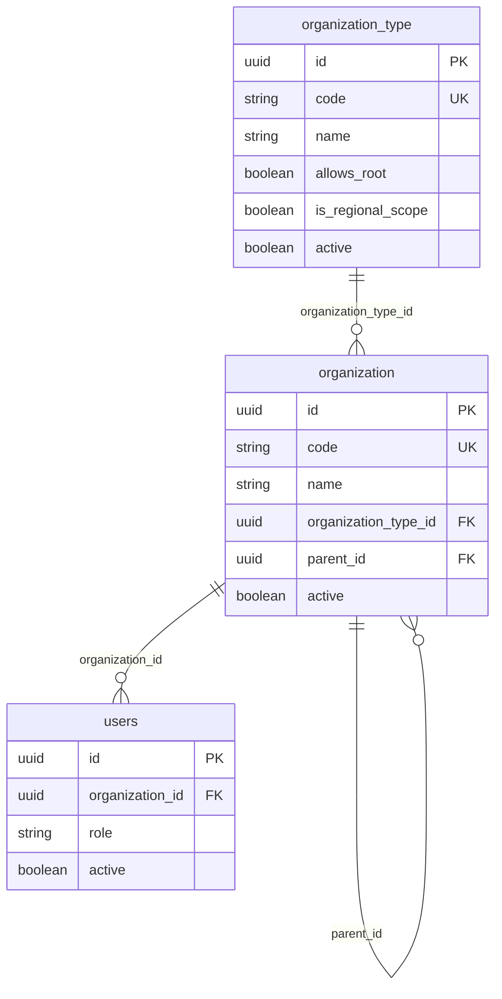
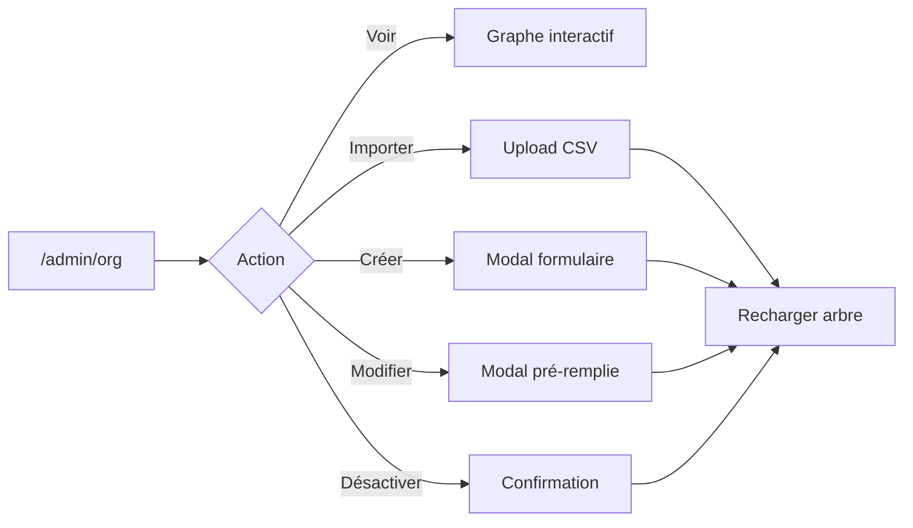

# Spécification — Module organisation (ORG)

**Projet :** FluxPro — Suivi de dossiers par chaîne hiérarchique  
**Éditeur :** Nano-Tech  
**Cas pilote :** Ministère des Travaux Publics du Cameroun (MINTP)  
**Module :** ORG — Référentiel organisationnel  
**Version :** 1.1  
**Date :** 1er juillet 2026  
**Statut :** Spécification cible — **partiellement implémentée** (types encore en enum Java — voir §2.1, §4)

**Références :**
- [Cahier des charges](./CAHIER-DES-CHARGES-CHAINEFLUX-MINTP%20(1).md) — §5, §7.1, §7.2
- [Sprint 1 — Auth & Org](./SPRINT-1-SPEC-AUTH-ORG.md) — section 5 (base historique)
- [Spécification USR / RBAC](./SPEC-USR-RBAC.md) — isolation périmètre, affectation utilisateurs
- [Données pilote](./data/README-AGENTS-MINTP.md)
- Schéma SQL initial : [`docs/sql/V1__create_users_organizations_auth.sql`](./sql/V1__create_users_organizations_auth.sql)
- Migration types (cible) : [`docs/sql/2026-07-01_organization_types_table.sql`](./sql/2026-07-01_organization_types_table.sql)
- Règle projet : `spring.jpa.hibernate.ddl-auto=none` — toute évolution schéma via scripts `docs/sql/`

---

## Table des matières

1. [Contexte et objectifs](#1-contexte-et-objectifs)
2. [État des lieux](#2-état-des-lieux)
3. [Périmètre fonctionnel](#3-périmètre-fonctionnel)
4. [Types d'organisation](#4-types-dorganisation)
5. [Modèle de données](#5-modèle-de-données)
6. [API REST](#6-api-rest)
7. [Règles métier](#7-règles-métier)
8. [RBAC et périmètre organisationnel](#8-rbac-et-périmètre-organisationnel)
9. [Import CSV](#9-import-csv)
10. [Frontend](#10-frontend)
11. [User stories et critères d'acceptation](#11-user-stories-et-critères-dacceptation)
12. [Plan de tests](#12-plan-de-tests)
13. [Plan d'implémentation](#13-plan-dimplémentation)
14. [Hors périmètre](#14-hors-périmètre)
15. [Definition of Done](#15-definition-of-done)

---

## 1. Contexte et objectifs

### 1.1 Problème

FluxPro est une solution **générique** de gestion de dossiers par chaîne hiérarchique. Chaque déploiement client (MINTP en pilote) possède un **organigramme institutionnel** : ministère, directions, divisions, services, délégations régionales (DRTP).

Ce référentiel sert de base à :

- l'**affectation** des utilisateurs (module USR) ;
- le **filtrage des données** (dossiers, tableaux de bord, alertes — sprints ultérieurs) ;
- l'**isolation des périmètres** (notamment entre DRTP).

Sans module ORG fiable, le RBAC ne peut pas appliquer de périmètre organisationnel cohérent.

### 1.2 Objectifs du module

| Objectif | Description |
|----------|-------------|
| **Modéliser** | Représenter l'arbre hiérarchique parent → enfants |
| **Typologiser** | Gérer les **types d'organisation en base** (référentiel paramétrable, pas enum figé) |
| **Visualiser** | Afficher l'organigramme de façon interactive |
| **Administrer** | Créer, modifier, désactiver des nœuds (admins) |
| **Initialiser** | Importer le référentiel pilote (CSV) et pré-configurer les 10 DRTP |
| **Sécuriser** | Restreindre la lecture/écriture selon le rôle et le périmètre |

### 1.3 Principes d'architecture

- API REST JSON sous `/api/organizations` et `/api/organization-types` (nommage **anglais**)
- Hiérarchie **auto-référencée** (`parent_id` → `organization.id`)
- Types d'organisation **stockés en BDD** (`organization_type`) — référencés par FK (`organization_type_id`)
- **Pas de suppression physique** — désactivation logique (`active = false`) sur organisations et types
- Schéma BDD géré **manuellement** (`ddl-auto=none`)
- Erreurs API au format **RFC 7807** (`ProblemDetail`)
- Le code organisation (`code`) est l'identifiant métier stable (import, JWT, périmètre DRTP)

---

## 2. État des lieux

> Écart entre le code actuel (juillet 2026) et la spécification cible.

### 2.1 Backend

| Composant | Existant (code juil. 2026) | Cible spec 1.1 |
|-----------|----------------------------|----------------|
| Entité `Organization` | Table `organization`, champ `type` en **enum Java** | FK `organization_type_id` → table `organization_type` |
| `OrganizationType` enum | `MINISTRY`, `DIRECTORATE`, … | **À supprimer** — remplacé par entité `OrganizationType` JPA |
| `OrganizationController` | CRUD org + tree + import | + endpoints types ; réactivation org |
| `OrganizationTypeController` | — | CRUD référentiel types (`/api/organization-types`) |
| `OrganizationService` | CRUD, arbre scopé, unicité `code` | Résolution type par `typeId` ; cycles ; blocage désactivation |
| `OrganizationTypeService` | — | CRUD types, seed, règles `is_regional_scope` |
| `OrganizationImportService` | Colonne CSV `type` → `OrganizationType.valueOf()` | Colonne `type` → résolution par `organization_type.code` |
| `OrganizationScopeService` | DRTP via enum `REGIONAL_DIRECTORATE` | DRTP via flag `organization_type.is_regional_scope` |
| `DataInitializer` | Seed MINTP, 10 DRTP | + seed des 5 types MINTP par défaut |

### 2.2 Frontend

| Écran | Existant | Manquant |
|-------|----------|----------|
| `/admin/org` | Graphe horizontal React Flow, import CSV | CRUD org ; CRUD types ; recherche/filtre |
| `/admin/org/types` | — | Liste + formulaire types d'organisation |
| Sélecteur org (users) | Liste plate (`<Select>`) | Sélecteur hiérarchique (arbre) |
| API client | `getOrganizationTree`, `importOrganizations` | + CRUD org ; + `getOrganizationTypes`, CRUD types |
| Accès page | `RequireAuth admin` uniquement | Lecture arbre pour rôles non-admin (API oui, UI non) |

### 2.3 Correspondance documentation ↔ code

| Sujet | Ancienne spec (Sprint 1) | Code actuel |
|-------|--------------------------|-------------|
| Endpoint | `/api/organisations` | `/api/organizations` |
| Table | `organisation` | `organization` |
| Champs | `nom`, `actif` | `name`, `active` |
| Types | Enum Java `OrganizationType` | **Table `organization_type`** (cible) |
| Rôle admin métier | `ADMIN_METIER` | `BUSINESS_ADMIN` |

---

## 3. Périmètre fonctionnel

### 3.1 Inclus (Must)

| ID | Fonctionnalité |
|----|----------------|
| ORG-01 | Arbre hiérarchique : Ministère → Direction → Division → Service → DRTP |
| ORG-02 | Visualisation interactive de l'organigramme |
| ORG-03 | Création d'une organisation (nœud enfant) |
| ORG-04 | Modification d'une organisation (nom, type, parent, statut) |
| ORG-05 | Désactivation logique d'une organisation |
| ORG-06 | Consultation détail d'un nœud |
| ORG-07 | Import initial CSV (upsert par `code`) |
| ORG-08 | Référentiel 10 DRTP pré-configurées au démarrage |
| ORG-09 | Filtrage de l'arbre selon le périmètre de l'utilisateur connecté |
| ORG-10 | Unicité du `code` organisation |
| ORG-15 | **Référentiel des types d'organisation en BDD** (création, modification, consultation) |
| ORG-16 | Affectation d'un type à chaque organisation via `organization_type_id` |
| ORG-17 | Seed des types par défaut au déploiement (MINTP : 5 types) |

### 3.2 Inclus (Should — phase 1 bis)

| ID | Fonctionnalité |
|----|----------------|
| ORG-11 | Recherche par nom ou code sur la page organigramme |
| ORG-12 | Export CSV du référentiel |
| ORG-13 | Réactivation d'une organisation désactivée |
| ORG-14 | Sélecteur hiérarchique pour affectation utilisateur |
| ORG-18 | Désactivation d'un type (si aucune org active ne l'utilise) |
| ORG-19 | Couleur / ordre d'affichage configurable par type (UI graphe) |

### 3.3 Exclu (voir §14)

Intérims, historique d'affectations, import Excel, synchronisation LDAP/AD.

---

## 4. Types d'organisation (référentiel BDD)

> **Décision d'architecture (v1.1)** : les types ne sont **plus** modélisés comme une énumération Java figée. Ils constituent un **référentiel paramétrable** en base, administrable par les `SUPER_ADMIN` / `BUSINESS_ADMIN`, afin d'adapter FluxPro à d'autres clients institutionnels sans redéploiement.

### 4.1 Table `organization_type`

| Colonne | Type SQL | Obligatoire | Description |
|---------|----------|-------------|-------------|
| `id` | `CHAR(36)` UUID | Oui | Clé primaire |
| `code` | `VARCHAR(32)` | Oui, **unique** | Code stable machine (ex. `MINISTRY`, `DRTP`) — utilisé import CSV, logique métier |
| `name` | `VARCHAR(255)` | Oui | Libellé par défaut (FR) affiché dans l'UI |
| `name_en` | `VARCHAR(255)` | Non | Libellé anglais (optionnel ; sinon i18n côté front) |
| `description` | `TEXT` | Non | Aide contextuelle admin |
| `color` | `VARCHAR(20)` | Non | Couleur badge graphe (ex. `#2563EB`, ou token `blue`) |
| `sort_order` | `INT` | Oui, défaut `0` | Ordre dans les listes déroulantes |
| `allows_root` | `BOOLEAN` | Oui, défaut `FALSE` | `TRUE` si une org peut être racine sans parent (ex. Ministère) |
| `is_regional_scope` | `BOOLEAN` | Oui, défaut `FALSE` | `TRUE` pour les types déclenchant l'isolation DRTP (ex. DRTP) |
| `active` | `BOOLEAN` | Oui, défaut `TRUE` | `FALSE` = type désactivé (non assignable aux nouvelles orgs) |
| `created_at` | `DATETIME(6)` | Auto | |
| `updated_at` | `DATETIME(6)` | Auto | |

**Index :** `idx_organization_type_code` (unique)

### 4.2 Types seed MINTP (déploiement pilote)

Insérés par script SQL + `DataInitializer` si absents :

| code | name | allows_root | is_regional_scope | color | sort_order |
|------|------|-------------|-------------------|-------|------------|
| `MINISTRY` | Ministère | ✅ | ❌ | `purple` | 1 |
| `DIRECTORATE` | Direction | ❌ | ❌ | `blue` | 2 |
| `DIVISION` | Division | ❌ | ❌ | `gray` | 3 |
| `SERVICE` | Service | ❌ | ❌ | `green` | 4 |
| `REGIONAL_DIRECTORATE` | DRTP | ❌ | ✅ | `orange` | 5 |

> Un client non-MINTP pourra ajouter d'autres types (ex. `AGENCY`, `UNIT`) via l'interface admin sans modifier le code.

### 4.3 Lien organisation ↔ type

La table `organization` référence le type par clé étrangère :

| Ancien (code actuel) | Cible (spec 1.1) |
|----------------------|------------------|
| Colonne `type VARCHAR(30)` (enum string) | Colonne `organization_type_id CHAR(36) NOT NULL` FK → `organization_type.id` |

**Migration :** script `docs/sql/2026-07-01_organization_types_table.sql` (voir §5.4).

### 4.4 Contraintes de typage

| Règle | Description |
|-------|-------------|
| ORG-T01 | Une org racine doit avoir un type avec `allows_root = true` |
| ORG-T02 | Le type référencé doit être **actif** à la création/modification |
| ORG-T03 | Un type avec `is_regional_scope = true` déclenche l'isolation périmètre DRTP (`OrganizationScopeService`) |
| ORG-T04 | Un type ne peut être désactivé que s'**aucune organisation active** ne l'utilise |
| ORG-T05 | Le `code` d'un type est **immuable** après création (stabilité import / intégrations) |
| ORG-T06 | Phase 2 optionnelle : table `organization_type_parent` pour parents autorisés par type |

### 4.5 API types — `/api/organization-types`

| Méthode | Chemin | Autorisation | Description |
|---------|--------|--------------|-------------|
| `GET` | `/` | Authentifié | Liste des types actifs (tri `sort_order`) |
| `GET` | `/all` | `SUPER_ADMIN`, `BUSINESS_ADMIN` | Liste incluant types inactifs |
| `GET` | `/{id}` | Authentifié | Détail type |
| `POST` | `/` | `SUPER_ADMIN`, `BUSINESS_ADMIN` | Créer un type |
| `PUT` | `/{id}` | `SUPER_ADMIN`, `BUSINESS_ADMIN` | Modifier nom, couleur, flags (pas `code`) |
| `PATCH` | `/{id}/deactivate` | `SUPER_ADMIN`, `BUSINESS_ADMIN` | Désactiver |

#### Exemple — `OrganizationTypeResponse`

```json
{
  "id": "uuid-...",
  "code": "DIRECTORATE",
  "name": "Direction",
  "nameEn": "Directorate",
  "color": "blue",
  "sortOrder": 2,
  "allowsRoot": false,
  "isRegionalScope": false,
  "active": true
}
```

### 4.6 Arbre pilote (siège — extrait)

Source : [`docs/data/organisations-mintp.csv`](./data/organisations-mintp.csv)

```
MINTP
├── MINTP-CABINET
├── MINTP-SG
├── DSI
├── DAG
│   ├── DAG-COURRIER
│   └── DAG-ARCHIVES
├── DIER
│   ├── DIER-MARCHES
│   ├── DIER-TECH
│   ├── DIER-BUDGET
│   └── DIER-PROG
└── DRTP-C (pilote actif)
    ├── DRTP-C-AUTH
    └── DRTP-C-ROUTES
```

### 4.7 Seed des 10 DRTP (ORG-08)

Pré-créées au démarrage par `DataInitializer` si absentes :

| Code | Nom |
|------|-----|
| `DRTP-ADAMAOUA` | DRTP Adamaoua (Ngaoundéré) |
| `DRTP-C` | DRTP Centre (Yaoundé) — **pilote** |
| `DRTP-EST` | DRTP Est (Bertoua) |
| `DRTP-EXTN` | DRTP Extrême-Nord (Maroua) |
| `DRTP-LITTORAL` | DRTP Littoral (Douala) |
| `DRTP-NORD` | DRTP Nord (Garoua) |
| `DRTP-NO` | DRTP Nord-Ouest (Bamenda) |
| `DRTP-OUEST` | DRTP Ouest (Bafoussam) |
| `DRTP-SUD` | DRTP Sud (Ebolowa) |
| `DRTP-SO` | DRTP Sud-Ouest (Buea) |

---

## 5. Modèle de données

### 5.1 Table `organization_type`

Voir §4.1 pour le détail des colonnes.

### 5.2 Table `organization`

| Colonne | Type SQL | Obligatoire | Description |
|---------|----------|-------------|-------------|
| `id` | `CHAR(36)` UUID | Oui | Clé primaire |
| `code` | `VARCHAR(32)` | Oui, **unique** | Identifiant métier stable (ex. `DAG`, `DRTP-C`) |
| `name` | `VARCHAR(255)` | Oui | Libellé complet |
| `organization_type_id` | `CHAR(36)` FK | Oui | Référence → `organization_type.id` |
| `parent_id` | `CHAR(36)` FK | Non | Référence parent ; `NULL` = racine |
| `active` | `BOOLEAN` | Oui, défaut `TRUE` | `FALSE` = désactivée (soft delete) |
| `created_at` | `DATETIME(6)` | Auto | Horodatage création |
| `updated_at` | `DATETIME(6)` | Auto | Horodatage mise à jour |

**Index :** `idx_organization_parent`, `idx_organization_code` (unique), `idx_organization_type`

> **Écart code actuel :** la colonne s'appelle encore `type VARCHAR(30)` (valeur enum). La migration §5.4 la remplace par `organization_type_id`.

### 5.3 Relations



### 5.4 Migration schéma (à exécuter manuellement)

Fichier cible : `docs/sql/2026-07-01_organization_types_table.sql`

**Objectif :** créer `organization_type`, peupler les 5 types MINTP, migrer `organization.type` → `organization_type_id`, supprimer l'ancienne colonne.

**Prérequis :** base existante avec table `organization` (script V1).

**Étapes :**
1. `CREATE TABLE organization_type`
2. `INSERT` des 5 types seed (§4.2)
3. `ALTER TABLE organization ADD organization_type_id`
4. `UPDATE organization SET organization_type_id = (SELECT id FROM organization_type WHERE code = organization.type)`
5. `ALTER` — `organization_type_id NOT NULL`, FK, index
6. `ALTER TABLE organization DROP COLUMN type`

> ⚠️ **Exécution manuelle sur MySQL** avant ou après déploiement du code — `ddl-auto=none` interdit toute migration automatique Hibernate.

### 5.5 DTOs API

#### Requête — `OrganizationRequest`

| Champ | Type | Obligatoire | Notes |
|-------|------|-------------|-------|
| `code` | string | Oui | Unique, max 32 car. |
| `name` | string | Oui | |
| `typeId` | UUID | Oui | FK `organization_type.id` (remplace l'ancien champ enum `type`) |
| `parentId` | UUID | Non | `null` = racine (nécessite type `allows_root`) |
| `active` | boolean | Oui | Défaut `true` à la création |

#### Requête — `OrganizationTypeRequest`

| Champ | Type | Obligatoire | Notes |
|-------|------|-------------|-------|
| `code` | string | Oui (création) | Unique, immuable après création |
| `name` | string | Oui | |
| `nameEn` | string | Non | |
| `description` | string | Non | |
| `color` | string | Non | |
| `sortOrder` | int | Non | Défaut `0` |
| `allowsRoot` | boolean | Oui | |
| `isRegionalScope` | boolean | Oui | |
| `active` | boolean | Oui | Défaut `true` |

#### Réponse arbre — `OrganizationTreeResponse`

| Champ | Type | Description |
|-------|------|-------------|
| `id` | UUID | |
| `code` | string | |
| `name` | string | |
| `type` | `OrganizationTypeResponse` | Objet type imbriqué (plus une enum) |
| `active` | boolean | |
| `children` | `OrganizationTreeResponse[]` | Sous-arbre récursif |

#### Réponse résumé — `OrganizationSummaryResponse`

| Champ | Type |
|-------|------|
| `id` | UUID |
| `code` | string |
| `name` | string |
| `type` | `OrganizationTypeResponse` |

#### Import — `ImportResult`

| Champ | Type | Description |
|-------|------|-------------|
| `created` | int | Lignes créées |
| `updated` | int | Lignes mises à jour |
| `errors` | string[] | Messages d'erreur par ligne |

---

## 6. API REST

Base organisations : `/api/organizations`  
Base types : `/api/organization-types`  
Authentification : **Bearer JWT** obligatoire (sauf routes publiques auth).

### 6.1 Synthèse des endpoints — organisations

| Méthode | Chemin | Autorisation | Description | Statut |
|---------|--------|--------------|-------------|--------|
| `GET` | `/tree` | Authentifié | Arbre hiérarchique filtré par périmètre | ✅ Implémenté (enum) |
| `GET` | `/{id}` | Authentifié + scope | Détail résumé ; 403 hors périmètre | ✅ Implémenté |
| `POST` | `/` | `SUPER_ADMIN`, `BUSINESS_ADMIN` | Créer une organisation | ✅ Backend ; ❌ UI |
| `PUT` | `/{id}` | `SUPER_ADMIN`, `BUSINESS_ADMIN` | Modifier une organisation | ✅ Backend ; ❌ UI |
| `PATCH` | `/{id}/deactivate` | `SUPER_ADMIN`, `BUSINESS_ADMIN` | Désactiver | ✅ Backend ; ❌ UI |
| `PATCH` | `/{id}/activate` | `SUPER_ADMIN`, `BUSINESS_ADMIN` | Réactiver | ❌ À implémenter |
| `POST` | `/import` | `SUPER_ADMIN` | Import CSV multipart | ✅ Implémenté |

### 6.1 bis Synthèse des endpoints — types d'organisation

| Méthode | Chemin | Autorisation | Description | Statut |
|---------|--------|--------------|-------------|--------|
| `GET` | `/api/organization-types` | Authentifié | Types actifs (select UI) | ❌ À implémenter |
| `GET` | `/api/organization-types/all` | Admin | Types actifs + inactifs | ❌ À implémenter |
| `GET` | `/api/organization-types/{id}` | Authentifié | Détail type | ❌ À implémenter |
| `POST` | `/api/organization-types` | Admin | Créer un type | ❌ À implémenter |
| `PUT` | `/api/organization-types/{id}` | Admin | Modifier un type | ❌ À implémenter |
| `PATCH` | `/api/organization-types/{id}/deactivate` | Admin | Désactiver un type | ❌ À implémenter |

### 6.2 `GET /api/organizations/tree`

**Comportement :**
1. Charge toutes les organisations **actives**
2. Applique le filtre de périmètre (`OrganizationScopeService`)
3. Reconstruit l'arbre racines → enfants (`DtoMapper.buildTree`)

**Réponse :** `200 OK` — tableau de nœuds racine avec `children` imbriqués.

**Exemple (tronqué) :**

```json
[
  {
    "id": "a1b2c3d4-...",
    "code": "MINTP",
    "name": "Ministère des Travaux Publics",
    "type": {
      "id": "uuid-type-ministry",
      "code": "MINISTRY",
      "name": "Ministère",
      "color": "purple",
      "allowsRoot": true,
      "isRegionalScope": false
    },
    "active": true,
    "children": [
      {
        "id": "...",
        "code": "DAG",
        "name": "Direction des Affaires Générales",
        "type": {
          "id": "uuid-type-directorate",
          "code": "DIRECTORATE",
          "name": "Direction",
          "color": "blue",
          "allowsRoot": false,
          "isRegionalScope": false
        },
        "active": true,
        "children": []
      }
    ]
  }
]
```

### 6.3 `GET /api/organizations/{id}`

**Réponse :** `200 OK` — `OrganizationSummaryResponse`

**Erreurs :**
- `404` — organisation introuvable
- `403` — hors périmètre utilisateur

### 6.4 `POST /api/organizations`

**Corps :**

```json
{
  "code": "DAG-NEW",
  "name": "Nouvelle direction",
  "typeId": "uuid-type-directorate",
  "parentId": "uuid-du-mintp",
  "active": true
}
```

**Réponse :** `201 Created` — `OrganizationSummaryResponse`

**Erreurs :**
- `400` — validation (`code` vide, `typeId` manquant ou type inactif, parent introuvable)
- `400` — `code` déjà utilisé
- `403` — rôle insuffisant

### 6.5 `PUT /api/organizations/{id}`

Même corps que `POST`. Met à jour nom, type, parent, statut actif.

**Erreurs supplémentaires cibles (à implémenter) :**
- `400` — cycle détecté (ORG-R04)
- `400` — parent inactif

### 6.6 `PATCH /api/organizations/{id}/deactivate`

**Comportement :** `active = false` (pas de suppression en base).

**Erreurs cibles (à implémenter) :**
- `409` — utilisateurs actifs encore rattachés à ce nœud ou ses descendants

### 6.7 `POST /api/organizations/import`

**Content-Type :** `multipart/form-data`  
**Champ :** `file` (fichier CSV)

**Réponse :**

```json
{
  "created": 12,
  "updated": 3,
  "errors": ["Line 5: parent not found XYZ"]
}
```

---

## 7. Règles métier

| ID | Règle | Implémenté | Description |
|----|-------|------------|-------------|
| ORG-R01 | Org inactive → pas de nouvel utilisateur | ✅ | `AccessControlService.assertOrganizationWritable` |
| ORG-R02 | `code` unique | ✅ | Contrainte BDD + service |
| ORG-R03 | Pas de DELETE physique | ✅ | Uniquement `deactivate` |
| ORG-R04 | Pas de cycle dans la hiérarchie | ❌ | Un nœud ne peut pas être ancêtre de lui-même |
| ORG-R05 | Déplacement → périmètre descendants recalculé | ✅ (implicite) | Scope basé sur `parent_id` à la lecture |
| ORG-R06 | Écriture réservée aux admins | ✅ | `@PreAuthorize` SUPER_ADMIN, BUSINESS_ADMIN |
| ORG-R07 | Lecture arbre filtrée par périmètre | ✅ | Sauf rôles à scope global |
| ORG-R08 | Import upsert par `code` | ✅ | Crée ou met à jour |
| ORG-R09 | Parent doit exister à l'import | ✅ | Erreur ligne si `parent_code` inconnu |
| ORG-R10 | Désactivation bloquée si agents actifs | ❌ | À implémenter |
| ORG-R11 | `code` immuable recommandé | ⚠️ Partiel | Modifiable via API (risque intégration) |
| ORG-R12 | Type org = FK BDD active | ❌ | `typeId` doit pointer vers `organization_type` actif |
| ORG-R13 | Racine → type `allows_root` | ❌ | Validation à la création |
| ORG-R14 | Type inutilisé peut être désactivé | ❌ | Blocage si orgs actives rattachées |
| ORG-R15 | Isolation DRTP via `is_regional_scope` | ❌ | Remplace la comparaison enum `REGIONAL_DIRECTORATE` |

### 7.1 Détection de cycle (ORG-R04) — spécification cible

Lors d'un `PUT` modifiant `parentId` :

1. Remonter les ancêtres du nouveau parent
2. Si `id` du nœud courant apparaît dans cette chaîne → rejeter
3. Optionnel : interdire de déplacer un nœud sous l'un de ses descendants

```java
// Pseudo-code
void assertNoCycle(UUID nodeId, UUID newParentId) {
    UUID current = newParentId;
    while (current != null) {
        if (current.equals(nodeId)) throw new IllegalArgumentException("Cycle detected");
        current = parentOf(current);
    }
}
```

---

## 8. RBAC et périmètre organisationnel

### 8.1 Matrice endpoint × rôle

| Action | SUPER_ADMIN | BUSINESS_ADMIN | SECRETARY_GENERAL | EXECUTIVE_OFFICE | REGIONAL_DIRECTOR | Autres rôles |
|--------|-------------|----------------|-------------------|------------------|-------------------|--------------|
| Voir arbre (scope) | Tout | Tout | Tout | Tout | DRTP homologue | Sous-arbre + ancêtres |
| Détail nœud | Tout | Tout | Tout | Tout | DRTP homologue | Périmètre |
| Créer / modifier / désactiver org | ✅ | ✅ | ❌ | ❌ | ❌ | ❌ |
| CRUD types d'organisation | ✅ | ✅ | ❌ | ❌ | ❌ | ❌ |
| Import CSV org | ✅ | ❌ | ❌ | ❌ | ❌ | ❌ |

### 8.2 Logique de périmètre (`OrganizationScopeService`)

| Cas | Règle |
|-----|-------|
| Scope global | `SUPER_ADMIN`, `SECRETARY_GENERAL`, `EXECUTIVE_OFFICE` → toutes les orgs actives |
| DRTP | `REGIONAL_DIRECTOR` → nœuds dont le type a `is_regional_scope = true` et même racine régionale (remontée parent) |
| Autres rôles | Organisation de l'utilisateur + **descendants** + **ancêtres** sur la même branche |

### 8.3 JWT et contexte

Le token JWT contient `organizationId` et `organizationCode` de l'utilisateur connecté, utilisés par le filtre de scope.

### 8.4 Écart connu

Les endpoints d'**écriture** ne vérifient pas encore que le `BUSINESS_ADMIN` opère dans son propre périmètre — tout admin métier peut modifier n'importe quel nœud. **À corriger** en phase 1 bis.

---

## 9. Import CSV

### 9.1 Format

- **Séparateur :** point-virgule (`;`)
- **Encodage :** UTF-8
- **Fichier pilote :** [`docs/data/organisations-mintp.csv`](./data/organisations-mintp.csv)

### 9.2 Colonnes

| Colonne CSV | Champ entité | Obligatoire | Exemple |
|-------------|--------------|-------------|---------|
| `code` | `code` | Oui | `DAG` |
| `nom` | `name` | Non (défaut = code) | `Direction des Affaires Générales` |
| `type` | `organization_type.code` | Oui | `DIRECTORATE` — résolu en FK |
| `parent_code` | `parent.code` | Non | `MINTP` |
| `actif` | `active` | Non (défaut `true`) | `TRUE` |

### 9.3 Comportement

1. Parse ligne par ligne
2. Résolution du type par `organization_type.code` (doit exister et être actif)
3. Upsert organisation par `code` (création ou mise à jour)
4. Résolution du parent par `parent_code` (cache + BDD)
5. Retourne compteurs `created`, `updated` et liste `errors`

### 9.4 Ordre d'import recommandé

1. **Types** — seed SQL ou création via `/api/organization-types` (5 types MINTP)
2. `organisations-mintp.csv` (ou seed `DataInitializer`)
3. `agents-mintp.csv` (module USR — dépend des orgs existantes)

---

## 10. Frontend

### 10.1 Route et accès

| Route | Garde actuelle | Garde cible |
|-------|----------------|-------------|
| `/admin/org` | `RequireAuth admin` | Admin pour écriture ; lecture étendue possible |

### 10.2 Écran organigramme — `/admin/org`

#### Implémenté

| Élément | Détail |
|---------|--------|
| En-tête | Titre, description, bouton import CSV |
| Graphe | `OrganisationGraph.tsx` — React Flow, horizontal gauche → droite |
| Nœuds | Badge type coloré (couleur depuis `organization_type.color`), code monospace, nom |
| **Types admin** | Page ou onglet `/admin/org/types` — liste, création, édition |
| Contrôles | Zoom, minimap, pan |
| États | Chargement, vide (invite import), erreur API |

#### À implémenter

| Élément | Description |
|---------|-------------|
| **Création** | Bouton « Ajouter » sur un nœud ou barre d'outils → modal formulaire |
| **Modification** | Clic nœud ou menu contextuel → modal pré-remplie |
| **Désactivation** | Action avec confirmation ; afficher badge inactif |
| **Recherche** | Champ filtre par `code` ou `name` (surlignage ou masquage nœuds) |
| **Formulaire org** | Champs : code, nom, type (`Select` chargé via `GET /organization-types`), parent, actif |
| **Feedback** | Toasts succès/erreur ; rechargement arbre après mutation |

### 10.3 Formulaire création / modification

| Champ | Widget | Validation |
|-------|--------|------------|
| Code | `TextField` | Obligatoire, max 32, unique |
| Nom | `TextField` | Obligatoire |
| Type | `Select` | Options depuis API `GET /api/organization-types` (pas enum TS figée) |
| Parent | `TreeSelect` | Optionnel pour racine ; liste scopée |
| Actif | `Switch` | Défaut `true` |

**Création enfant :** depuis un nœud parent P, pré-remplir `parentId = P.id`.

### 10.4 Fonctions API frontend à ajouter (`lib/api.ts`)

```typescript
export async function getOrganizationTypes(): Promise<OrganizationType[]>
export async function createOrganizationType(body: OrganizationTypeRequest): Promise<OrganizationType>
export async function updateOrganizationType(id: string, body: OrganizationTypeRequest): Promise<OrganizationType>
export async function createOrganization(body: OrganizationRequest): Promise<OrganizationSummary>
export async function updateOrganization(id: string, body: OrganizationRequest): Promise<OrganizationSummary>
export async function deactivateOrganization(id: string): Promise<OrganizationSummary>
```

> Le type TypeScript `OrganizationType` devient une **interface** alignée sur la réponse API, et non plus une union de littéraux enum.

### 10.5 Composant `OrganizationSelect` (cible)

Sélecteur hiérarchique réutilisable sur :
- formulaire utilisateur (`UserFormPage`)
- filtres liste utilisateurs

Affiche l'arbre en indentation ; n'affiche que les orgs **actives** du périmètre.

### 10.6 Maquette flux utilisateur



---

## 11. User stories et critères d'acceptation

### US-ORG-01 — Visualiser l'organigramme

**En tant qu'** utilisateur authentifié,  
**je veux** voir la structure hiérarchique de mon organisation,  
**afin de** comprendre la chaîne institutionnelle.

| Critère | Given | When | Then |
|---------|-------|------|------|
| AC-01 | Utilisateur DRTP-C | GET `/tree` | Voit MINTP → branche DRTP-C uniquement |
| AC-02 | SUPER_ADMIN | GET `/tree` | Voit l'arbre complet |
| AC-03 | Arbre non vide | Ouvre `/admin/org` | Graphe horizontal affiché |

### US-ORG-02 — Créer une organisation

**En tant qu'** administrateur (`SUPER_ADMIN` ou `BUSINESS_ADMIN`),  
**je veux** ajouter un nœud enfant,  
**afin d'** enrichir l'organigramme.

| Critère | Given | When | Then |
|---------|-------|------|------|
| AC-01 | Parent MINTP actif | POST avec code unique | `201`, nœud visible dans l'arbre |
| AC-02 | Code déjà utilisé | POST | `400`, message explicite |
| AC-03 | Rôle AGENT | POST | `403` |

### US-ORG-03 — Modifier une organisation

**En tant qu'** administrateur,  
**je veux** modifier le nom, le type ou le parent,  
**afin de** corriger ou réorganiser la structure.

| Critère | Given | When | Then |
|---------|-------|------|------|
| AC-01 | Nœud DAG existant | PUT nom modifié | `200`, arbre mis à jour |
| AC-02 | Déplacement créant cycle | PUT | `400` cycle (cible) |
| AC-03 | Admin UI | Sauvegarde formulaire | Toast succès, graphe rafraîchi |

### US-ORG-04 — Désactiver une organisation

**En tant qu'** administrateur,  
**je veux** désactiver une direction ou service fermé,  
**afin de** empêcher de nouvelles affectations.

| Critère | Given | When | Then |
|---------|-------|------|------|
| AC-01 | Org sans utilisateurs actifs | PATCH deactivate | `active = false` |
| AC-02 | Org avec agents actifs | PATCH deactivate | `409` (cible) |
| AC-03 | Org inactive | Création utilisateur sur ce nœud | `400` ORG-R01 |

### US-ORG-05 — Importer le référentiel pilote

**En tant que** `SUPER_ADMIN`,  
**je veux** importer `organisations-mintp.csv`,  
**afin d'** initialiser rapidement le déploiement MINTP.

| Critère | Given | When | Then |
|---------|-------|------|------|
| AC-01 | Base vide | Import CSV valide | `created > 0`, arbre affiché |
| AC-02 | Ré-import même fichier | Import | `updated > 0`, pas de doublons `code` |
| AC-03 | Ligne parent manquant | Import | Erreur listée, autres lignes OK |

### US-ORG-06 — Gérer les types d'organisation

**En tant qu'** administrateur,  
**je veux** créer et modifier les types d'organisation en base,  
**afin d'** adapter la typologie à chaque client sans modifier le code.

| Critère | Given | When | Then |
|---------|-------|------|------|
| AC-01 | Base neuve | Exécution script seed | 5 types MINTP présents |
| AC-02 | Type `AGENCY` inexistant | POST `/organization-types` | `201`, type disponible dans le select org |
| AC-03 | Type utilisé par org active | PATCH deactivate type | `409` |
| AC-04 | Création org | POST avec `typeId` | Org créée avec FK correcte |

---

## 12. Plan de tests

### 12.1 Tests unitaires

| ID | Composant | Scénario |
|----|-----------|----------|
| UT-ORG-01 | `DtoMapper.buildTree` | Arbre plat → hiérarchie correcte |
| UT-ORG-02 | `OrganizationScopeService` | DRTP isolation (existant) |
| UT-ORG-03 | `OrganizationService` | Unicité `code` |
| UT-ORG-05 | `OrganizationTypeService` | Désactivation bloquée si orgs actives |
| UT-ORG-06 | `OrganizationScopeService` | Isolation via `is_regional_scope` (plus enum) |

### 12.2 Tests d'intégration API

| ID | Scénario | Résultat attendu |
|----|----------|------------------|
| IT-ORG-01 | CRUD complet SUPER_ADMIN | 201 / 200 / arbre cohérent |
| IT-ORG-02 | AGENT tente POST | 403 |
| IT-ORG-03 | REGIONAL_DIRECTOR GET tree | Pas de branche autre DRTP |
| IT-ORG-04 | Import CSV 15 lignes | Compteurs corrects |
| IT-ORG-06 | CRUD types SUPER_ADMIN | 201 / 200 / liste cohérente |
| IT-ORG-07 | Import CSV avec type inconnu | Erreur ligne explicite |

### 12.3 Tests frontend (manuels / E2E)

| ID | Scénario |
|----|----------|
| E2E-ORG-01 | Import CSV → graphe visible |
| E2E-ORG-02 | Créer enfant depuis modal → nœud affiché |
| E2E-ORG-03 | Modifier nom → reflété sur graphe |
| E2E-ORG-04 | Désactiver → badge inactif |

---

## 13. Plan d'implémentation

### Phase 0 — Migration types BDD (priorité critique)

| # | Tâche | Fichiers |
|---|-------|----------|
| 0.1 | Script SQL `organization_type` + migration FK | `docs/sql/2026-07-01_organization_types_table.sql` |
| 0.2 | Entité JPA `OrganizationType` + repository | `entity/OrganizationType.java` |
| 0.3 | Remplacer enum par `@ManyToOne` sur `Organization` | `entity/Organization.java` |
| 0.4 | `OrganizationTypeController` + `OrganizationTypeService` | controller, service, DTOs |
| 0.5 | Adapter import, scope, seed, DTOs, tests | services existants |
| 0.6 | Supprimer `enumeration/OrganizationType.java` | après migration complète |
| 0.7 | Frontend : interface `OrganizationType` + `getOrganizationTypes()` | `types.ts`, `api.ts`, graphe |

### Phase A — Compléter le backend organisations

| # | Tâche | Fichiers |
|---|-------|----------|
| A1 | Détection cycles `applyRequest` | `OrganizationService.java` |
| A2 | Blocage désactivation si users actifs | `OrganizationService.java`, requête repo |
| A3 | Endpoint `PATCH /{id}/activate` | Controller + Service |
| A4 | Tests IT CRUD + cycle | `src/test/java/...` |

### Phase B — UI CRUD organigramme (priorité haute)

| # | Tâche | Fichiers |
|---|-------|----------|
| B1 | Wrappers API create/update/deactivate | `flux-pro-front/src/lib/api.ts` |
| B2 | Modal formulaire org | `OrganizationFormModal.tsx` (nouveau) |
| B3 | Actions sur graphe (clic / menu) | `OrganisationGraph.tsx`, `admin/org/page.tsx` |
| B5 | Page `/admin/org/types` — CRUD types | `admin/org/types/page.tsx` |
| B6 | Select types dynamique (API) dans formulaire org | `OrganizationFormModal.tsx` |

### Phase C — Améliorations (priorité moyenne)

| # | Tâche |
|---|-------|
| C1 | Recherche/filtre sur page org |
| C2 | `OrganizationSelect` hiérarchique (users) |
| C3 | Export CSV backend + bouton UI |
| C4 | Scope écriture pour `BUSINESS_ADMIN` |
| C5 | Afficher orgs inactives grisées dans l'arbre |

---

## 14. Hors périmètre

| ID | Fonctionnalité | Sprint / phase |
|----|----------------|-----------------|
| ORG-X01 | Gestion intérims / suppléant (`substitute_id`) | Phase 2 |
| ORG-X02 | Historique des affectations organisationnelles | Phase 2 |
| ORG-X03 | Import Excel (`.xlsx`) | Phase 2 |
| ORG-X04 | Synchronisation LDAP / Active Directory | Phase 2 |
| ORG-X05 | Multi-tenant (plusieurs ministères) | Hors MVP |
| ORG-X06 | Géolocalisation DRTP / carte | Sprint ultérieur |

---

## 15. Definition of Done

Le module ORG est considéré **livré** lorsque :

- [ ] Table `organization_type` créée et peuplée (script SQL exécuté manuellement)
- [ ] Enum Java `OrganizationType` supprimée — FK `organization_type_id` en production
- [ ] Endpoints `/api/organization-types` implémentés (CRUD)
- [ ] Tous les endpoints Must organisations (§6.1) implémentés et documentés OpenAPI
- [ ] Règles ORG-R01 à ORG-R15 appliquées (§7)
- [ ] Page `/admin/org` permet **visualiser, créer, modifier, désactiver** organisations
- [ ] Page ou section **types d'organisation** permet création et modification
- [ ] Import CSV pilote MINTP reproductible (`organisations-mintp.csv`)
- [ ] 10 DRTP présentes après seed
- [ ] Tests IT isolation DRTP et CRUD verts
- [ ] Aucune régression sur affectation utilisateurs (module USR)
- [ ] Évolutions schéma éventuelles livrées en script `docs/sql/` daté (exécution manuelle MySQL)

---

*Document v1.1 — types d'organisation en BDD (référentiel paramétrable). Code actuel encore en enum — voir plan Phase 0.*
