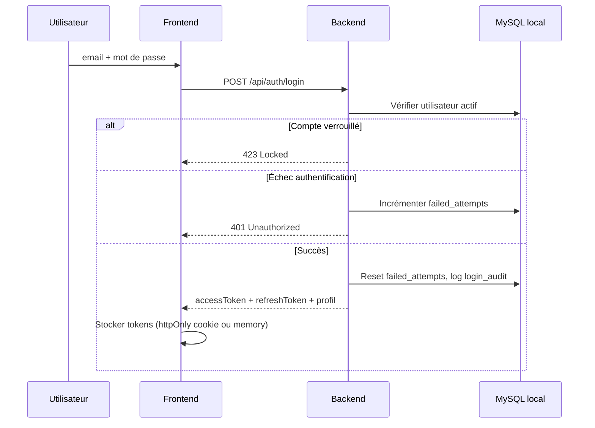

# Sprint 1 — Spécification détaillée : Auth & Référentiel organisationnel

**Projet :** FluxPro — Suivi de dossiers par chaîne hiérarchique  
**Cas pilote :** Ministère des Travaux Publics du Cameroun (MINTP)  
**Sprint :** 1 — Semaines 7–8 (Phase 1 MVP)  
**Thème :** Authentification, RBAC, organigramme MINTP  
**Version :** 1.0  
**Date :** 30 juin 2025

**Références :**
- [Cahier des charges](./CAHIER-DES-CHARGES-CHAINEFLUX-MINTP%20(1).md) — §5, §7.1, §7.2, §14, §15
- [Roadmap](./ROADMAP-IMPLEMENTATION-CHAINEFLUX.md) — Sprint 1
- [Données pilote](./data/README-AGENTS-MINTP.md)

---

## Table des matières

1. [Objectifs et périmètre](#1-objectifs-et-périmètre)
2. [Prérequis et dépendances](#2-prérequis-et-dépendances)
3. [Architecture technique](#3-architecture-technique)
4. [Module AUTH — Authentification](#4-module-auth--authentification)
5. [Module ORG — Référentiel organisationnel](#5-module-org--référentiel-organisationnel)
6. [Module USR — Gestion des utilisateurs](#6-module-usr--gestion-des-utilisateurs)
7. [RBAC — Matrice des permissions](#7-rbac--matrice-des-permissions)
8. [Modèle de données](#8-modèle-de-données)
9. [API REST](#9-api-rest)
10. [Import CSV / Excel](#10-import-csv--excel)
11. [Frontend](#11-frontend)
12. [Sécurité](#12-sécurité)
13. [User stories et critères d'acceptation](#13-user-stories-et-critères-dacceptation)
14. [Plan de tests](#14-plan-de-tests)
15. [Hors périmètre Sprint 1](#15-hors-périmètre-sprint-1)
16. [Livrables et Definition of Done](#16-livrables-et-definition-of-done)
17. [Estimation et risques](#17-estimation-et-risques)

---

## 1. Objectifs et périmètre

### 1.1 Objectif du sprint

Mettre en place le **socle d'identité et d'organisation** permettant :

- l'authentification sécurisée des ~85 agents pilotes ;
- la modélisation de l'organigramme MINTP (siège + 10 DRTP) ;
- l'affectation des utilisateurs à une direction/service avec un **rôle RBAC** ;
- l'**isolation des périmètres** (notamment DRTP par région) ;
- l'import initial des données Phase 0 (`organisations-mintp.csv`, `agents-mintp.csv`).

Ce sprint **ne gère pas encore les dossiers** (Sprint 2), mais pose les fondations d'autorisation utilisées par tous les modules suivants.

### 1.2 Périmètre inclus

| Module | Fonctionnalités | IDs CDC |
|--------|-----------------|---------|
| **AUTH** | Login email/MDP, politique MDP, verrouillage, session 8 h, journal connexions | AUTH-01 à AUTH-04, AUTH-07 |
| **ORG** | Arbre hiérarchique, CRUD organisations, import CSV/Excel, 10 DRTP pré-configurées | ORG-01, ORG-02, ORG-06 |
| **USR** | CRUD utilisateurs, affectation poste/direction, 10 rôles RBAC | ORG-03, §5.1 |
| **FE** | Pages `/login`, `/admin/org`, `/admin/users` | — |

### 1.3 Critères d'acceptation sprint (roadmap)

- [ ] Import CSV de **85 agents pilotes** réussi
- [ ] Un agent **DRTP Centre** ne voit pas les données d'une autre DRTP (isolation org) — test préparatoire pour Sprint 2
- [ ] **Verrouillage compte** après 5 échecs testé
- [ ] **Journal connexions** consultable par `SUPER_ADMIN`
- [ ] API Auth + Org documentée (**OpenAPI/Swagger**)

---

## 2. Prérequis et dépendances

### 2.1 Dépend de Sprint 0

| Prérequis | Description |
|-----------|-------------|
| Base de données locale | **MySQL** installé localement, base `fluxpro` accessible (pas de Docker) |
| Configuration backend | `application.properties` — connexion JDBC locale opérationnelle |
| Migrations Flyway/Liquibase | Schéma versionné (syntaxe MySQL) |
| CI/CD | Pipeline lint + tests + build |
| Layout frontend | App Router, thème MINTP, i18n FR |
| `SecurityConfig` de base | Spring Security stateless (squelette existant) |

### 2.2 Données Phase 0 requises

| Fichier | Usage Sprint 1 |
|---------|----------------|
| [`data/organisations-mintp.csv`](./data/organisations-mintp.csv) | Import arbre pilote (siège) |
| [`data/agents-mintp.csv`](./data/agents-mintp.csv) | Import 85 utilisateurs |
| Seed SQL 10 DRTP | Complément ORG-06 (voir §5.4) |

### 2.3 Débloque

- Sprint 2 — Gestion des dossiers (filtrage par `organisation_id`)
- Sprint 3 — Chaînes de passation (rôles responsables par maillon)
- Sprint 4 — Alertes (destinataires par rôle/hiérarchie)

---

## 3. Architecture technique

### 3.1 Stack (alignée dépôt)

| Couche | Technologie |
|--------|-------------|
| Frontend | Next.js 16, React 19, TypeScript, Tailwind, shadcn/ui |
| Backend | Spring Boot 3.x, Java 21 |
| BDD | **MySQL 8** (instance locale, sans Docker) |
| Auth | JWT (access) + refresh token, BCrypt |
| API docs | SpringDoc OpenAPI 3 |
| Migrations | Flyway (scripts MySQL) ou `ddl-auto=update` en dev initial |

> **Note infrastructure :** le développement local n'utilise **pas Docker**. Redis et MinIO seront ajoutés aux sprints concernés (alertes S4, fichiers S2) ; en Sprint 1, seule la base MySQL locale est requise.

### 3.1.1 Environnement local (configuration actuelle)

Fichier : `flux-pro-backend/src/main/resources/application.properties`

| Paramètre | Valeur dev |
|-----------|------------|
| URL JDBC | `jdbc:mysql://localhost:3306/fluxpro` |
| Utilisateur | `core` |
| Création auto BDD | `createDatabaseIfNotExist=true` |
| JPA | `ddl-auto=update` (dev) → Flyway en recette/prod |
| Port API | `8080` |

**Prérequis machine développeur :**

1. MySQL 8+ installé et démarré en service local
2. Base `fluxpro` créée (ou auto-créée au démarrage)
3. Backend : `./mvnw spring-boot:run`
4. Frontend : `npm run dev` (port 3000)

### 3.2 Packages backend (à créer)

```
flux-pro-backend/src/main/java/com/nanotech/flux_pro_backend/
├── auth/
│   ├── AuthController.java
│   ├── AuthService.java
│   ├── dto/LoginRequest, TokenResponse, ...
│   └── LoginAuditService.java
├── organisation/
│   ├── Organisation.java (entity)
│   ├── OrganisationController.java
│   ├── OrganisationService.java
│   ├── OrganisationRepository.java
│   └── OrganisationImportService.java
├── utilisateur/
│   ├── Utilisateur.java
│   ├── UtilisateurController.java
│   ├── UtilisateurService.java
│   ├── UtilisateurRepository.java
│   └── UtilisateurImportService.java
├── security/
│   ├── JwtTokenProvider.java
│   ├── JwtAuthenticationFilter.java
│   ├── UserDetailsServiceImpl.java
│   ├── Role.java (enum)
│   └── SecurityUtils.java (organisation scope)
└── config/
    └── SecurityConfig.java (mise à jour)
```

### 3.3 Routes frontend

| Route | Rôle minimum | Description |
|-------|----------------|-------------|
| `/login` | Public | Connexion |
| `/admin/org` | `SUPER_ADMIN`, `ADMIN_METIER` | Gestion organigramme |
| `/admin/users` | `SUPER_ADMIN`, `ADMIN_METIER` | Gestion utilisateurs |
| `/` | Authentifié | Redirection dashboard (placeholder Sprint 5) |

---

## 4. Module AUTH — Authentification

### 4.1 Exigences fonctionnelles

| ID | Exigence | Priorité | Implémentation Sprint 1 |
|----|----------|----------|-------------------------|
| AUTH-01 | Connexion email institutionnel + mot de passe | Must | `POST /api/auth/login` |
| AUTH-02 | MDP : 8 car. min, majuscule, chiffre, caractère spécial | Must | Validation création/reset MDP |
| AUTH-03 | Verrouillage après 5 échecs (30 min) | Must | Compteur `failed_login_attempts` |
| AUTH-04 | Session expire après 8 h d'inactivité | Must | Access token TTL 8 h + refresh |
| AUTH-05 | 2FA email | Should | **Hors sprint** (phase 2) |
| AUTH-06 | LDAP/AD MINTP | Should | **Hors sprint** (phase 2) |
| AUTH-07 | Journal connexions (qui, quand, IP) | Must | Table `login_audit` |

### 4.2 Flux de connexion



### 4.3 Politique mot de passe (AUTH-02)

| Règle | Valeur |
|-------|--------|
| Longueur minimale | 8 caractères |
| Majuscule | Au moins 1 |
| Chiffre | Au moins 1 |
| Caractère spécial | Au moins 1 (`!@#$%^&*...`) |
| Hash stockage | BCrypt (strength 12) |
| Mot de passe initial | Généré par `SUPER_ADMIN` à la création ; changement obligatoire au 1er login (recommandé) |

**Regex de validation :**

```
^(?=.*[A-Z])(?=.*\d)(?=.*[!@#$%^&*()_+\-=\[\]{};':"\\|,.<>/?]).{8,}$
```

### 4.4 Verrouillage compte (AUTH-03)

| Paramètre | Valeur |
|-----------|--------|
| Seuil d'échecs | 5 tentatives consécutives |
| Durée verrouillage | 30 minutes |
| Réinitialisation compteur | Connexion réussie |
| Message utilisateur | « Compte temporairement verrouillé. Réessayez dans X minutes. » |
| Déverrouillage manuel | `SUPER_ADMIN` peut déverrouiller via API |

### 4.5 Gestion de session (AUTH-04)

| Token | Durée | Usage |
|-------|-------|-------|
| Access token (JWT) | 8 heures | Header `Authorization: Bearer {token}` |
| Refresh token | 7 jours | Renouvellement access token |
| Inactivité | 8 h | Expiration access token = fin de session effective |

**Claims JWT :**

```json
{
  "sub": "uuid-utilisateur",
  "email": "e.ngono@mintp.cm",
  "role": "ADMIN_METIER",
  "organisationId": "uuid-org",
  "organisationCode": "DAG-COURRIER",
  "iat": 1719756000,
  "exp": 1719784800
}
```

### 4.6 Journal des connexions (AUTH-07)

Chaque tentative (succès ou échec) enregistre :

| Champ | Type | Description |
|-------|------|-------------|
| `id` | UUID | Identifiant |
| `utilisateur_id` | UUID nullable | Null si email inconnu |
| `email` | string | Email saisi |
| `succes` | boolean | Résultat |
| `ip_address` | string | IP client (`X-Forwarded-For` si proxy) |
| `user_agent` | string | Navigateur |
| `motif_echec` | string nullable | `INVALID_PASSWORD`, `ACCOUNT_LOCKED`, `USER_INACTIVE`, `UNKNOWN_EMAIL` |
| `created_at` | timestamp | Horodatage serveur (UTC, affichage Africa/Douala) |

**Consultation :** réservée à `SUPER_ADMIN`, paginée, filtres par date/email/succès.

---

## 5. Module ORG — Référentiel organisationnel

### 5.1 Exigences fonctionnelles

| ID | Exigence | Priorité | Sprint 1 |
|----|----------|----------|----------|
| ORG-01 | Arbre hiérarchique Ministère → Direction → Division → Service → DRTP | Must | Oui |
| ORG-02 | Import initial CSV/Excel | Must | Oui |
| ORG-03 | Affectation agent à poste et direction | Must | Via module USR |
| ORG-04 | Gestion intérims (suppléant) | Should | **Hors sprint** |
| ORG-05 | Historique affectations | Should | **Hors sprint** |
| ORG-06 | Référentiel 10 DRTP pré-configuré | Must | Seed + CRUD |

### 5.2 Types d'organisation

| Type | Code enum | Exemple | Parent typique |
|------|-----------|---------|----------------|
| Ministère | `MINISTERE` | MINTP | — |
| Direction | `DIRECTION` | DAG, DIER, DSI | MINTP |
| Division | `DIVISION` | DIER-TECH | Direction |
| Service | `SERVICE` | DAG-COURRIER | Direction ou Division |
| DRTP | `DRTP` | DRTP-C, DRTP-LITTORAL | MINTP |

### 5.3 Arbre pilote (siège — import CSV)

Structure minimale issue de [`organisations-mintp.csv`](./data/organisations-mintp.csv) :

```
MINTP
├── MINTP-CABINET
├── MINTP-SG
├── DSI
├── DAG
│   ├── DAG-COURRIER
│   └── DAG-ARCHIVES
├── DIER
│   ├── DIER-MARCHES
│   ├── DIER-TECH
│   ├── DIER-BUDGET
│   └── DIER-PROG
└── DRTP-C (pilote actif)
    ├── DRTP-C-AUTH
    └── DRTP-C-ROUTES
```

### 5.4 Seed des 10 DRTP (ORG-06)

Les 10 délégations régionales sont **pré-créées** (actives, sans utilisateurs sauf DRTP-C) :

| Code | Nom |
|------|-----|
| `DRTP-ADAMAOUA` | DRTP Adamaoua (Ngaoundéré) |
| `DRTP-C` | DRTP Centre (Yaoundé) — **pilote** |
| `DRTP-EST` | DRTP Est (Bertoua) |
| `DRTP-EXTN` | DRTP Extrême-Nord (Maroua) |
| `DRTP-LITTORAL` | DRTP Littoral (Douala) |
| `DRTP-NORD` | DRTP Nord (Garoua) |
| `DRTP-NO` | DRTP Nord-Ouest (Bamenda) |
| `DRTP-OUEST` | DRTP Ouest (Bafoussam) |
| `DRTP-SUD` | DRTP Sud (Ebolowa) |
| `DRTP-SO` | DRTP Sud-Ouest (Buea) |

Migration Flyway `V2__seed_drtp.sql` : insertion des 9 DRTP hors Centre + services types (secrétariat, routes) en structure minimale.

### 5.5 Règles métier ORG

| Règle | Description |
|-------|-------------|
| ORG-R01 | Une organisation inactive n'accepte pas de nouveaux utilisateurs |
| ORG-R02 | Le `code` est unique dans tout le référentiel |
| ORG-R03 | Suppression logique uniquement (`actif = false`) — pas de DELETE physique |
| ORG-R04 | Un nœud ne peut pas être son propre ancêtre (pas de cycle) |
| ORG-R05 | Déplacer un nœud met à jour le périmètre de tous les descendants |
| ORG-R06 | Seuls `SUPER_ADMIN` et `ADMIN_METIER` peuvent modifier l'arbre |

### 5.6 CRUD organisations

| Action | API | Autorisation |
|--------|-----|--------------|
| Lister l'arbre | `GET /api/organisations/tree` | Authentifié |
| Détail nœud | `GET /api/organisations/{id}` | Authentifié |
| Créer | `POST /api/organisations` | `SUPER_ADMIN`, `ADMIN_METIER` |
| Modifier | `PUT /api/organisations/{id}` | `SUPER_ADMIN`, `ADMIN_METIER` |
| Désactiver | `PATCH /api/organisations/{id}/deactivate` | `SUPER_ADMIN`, `ADMIN_METIER` |
| Import CSV | `POST /api/organisations/import` | `SUPER_ADMIN` |

---

## 6. Module USR — Gestion des utilisateurs

### 6.1 Rôles RBAC (10 rôles)

| Rôle | Code | Description |
|------|------|-------------|
| Super administrateur | `SUPER_ADMIN` | DSI — configuration système, tous périmètres |
| Administrateur métier | `ADMIN_METIER` | Référent métier — org, users, templates (S3+) |
| Cabinet | `CABINET` | Vue globale, dossiers sensibles |
| Secrétaire Général | `SG` | Vue transversale, escalades SG |
| Directeur | `DIRECTEUR` | Périmètre direction |
| Chef de service | `CHEF_SERVICE` | Périmètre service/division |
| Agent | `AGENT` | Opérations dossiers |
| Cadre d'appui | `APPUI` | Enregistrement, transmission |
| Lecteur | `LECTEUR` | Consultation seule |
| DRTP | `DRTP` | Directeur délégation régionale |

### 6.2 Champs utilisateur

| Champ | Type | Obligatoire | Notes |
|-------|------|-------------|-------|
| `id` | UUID | Auto | PK |
| `matricule` | string | Oui | Unique (ex. `MAT-2015-0001`) |
| `email` | string | Oui | Unique, login |
| `nom` | string | Oui | |
| `prenom` | string | Oui | |
| `telephone` | string | Non | Format `+237...` |
| `role` | enum Role | Oui | 10 valeurs |
| `organisation_id` | UUID FK | Oui | Affectation principale |
| `fonction` | string | Non | Intitulé poste |
| `password_hash` | string | Oui | BCrypt |
| `must_change_password` | boolean | Défaut true | 1er login |
| `failed_login_attempts` | int | Défaut 0 | Verrouillage |
| `locked_until` | timestamp nullable | | Fin verrouillage |
| `actif` | boolean | Défaut true | |
| `suppleant_id` | UUID nullable | | Réservé ORG-04 (phase 2) |
| `created_at` | timestamp | Auto | |
| `updated_at` | timestamp | Auto | |

### 6.3 Règles métier USR

| Règle | Description |
|-------|-------------|
| USR-R01 | Email et matricule uniques |
| USR-R02 | Un utilisateur actif appartient à **exactement une** organisation |
| USR-R03 | Seul `SUPER_ADMIN` peut attribuer le rôle `SUPER_ADMIN` |
| USR-R04 | `ADMIN_METIER` gère les users de son périmètre (sauf `SUPER_ADMIN`) |
| USR-R05 | Désactivation = `actif = false` ; sessions existantes invalidées au prochain refresh |
| USR-R06 | Reset MDP : `SUPER_ADMIN` génère un MDP temporaire |

### 6.4 CRUD utilisateurs

| Action | API | Autorisation |
|--------|-----|--------------|
| Liste paginée | `GET /api/utilisateurs` | `SUPER_ADMIN`, `ADMIN_METIER`, `DIRECTEUR` (son périmètre) |
| Détail | `GET /api/utilisateurs/{id}` | Selon périmètre |
| Créer | `POST /api/utilisateurs` | `SUPER_ADMIN`, `ADMIN_METIER` |
| Modifier | `PUT /api/utilisateurs/{id}` | `SUPER_ADMIN`, `ADMIN_METIER` |
| Désactiver | `PATCH /api/utilisateurs/{id}/deactivate` | `SUPER_ADMIN`, `ADMIN_METIER` |
| Reset MDP | `POST /api/utilisateurs/{id}/reset-password` | `SUPER_ADMIN` |
| Import CSV | `POST /api/utilisateurs/import` | `SUPER_ADMIN` |
| Profil courant | `GET /api/utilisateurs/me` | Authentifié |

---

## 7. RBAC — Matrice des permissions

### 7.1 Permissions Sprint 1 (ressources)

| Ressource | Actions |
|-----------|---------|
| `auth` | login, logout, refresh, change-password |
| `organisation` | read, create, update, deactivate, import |
| `utilisateur` | read, create, update, deactivate, reset-password, import |
| `login_audit` | read |

### 7.2 Matrice rôle × permission

| Permission | SUPER_ADMIN | ADMIN_METIER | DIRECTEUR | CHEF_SERVICE | DRTP | SG | CABINET | AGENT/APPUI | LECTEUR |
|------------|:-----------:|:------------:|:---------:|:------------:|:----:|:--:|:-------:|:-----------:|:-------:|
| org:read | ✓ | ✓ | ✓ | ✓ | ✓ | ✓ | ✓ | ✓ | ✓ |
| org:write | ✓ | ✓ | — | — | — | — | — | — | — |
| org:import | ✓ | — | — | — | — | — | — | — | — |
| user:read (tous) | ✓ | ✓* | ✓* | ✓* | ✓* | — | — | — | — |
| user:write | ✓ | ✓* | — | — | — | — | — | — | — |
| user:import | ✓ | — | — | — | — | — | — | — | — |
| login_audit:read | ✓ | — | — | — | — | — | — | — | — |
| admin:access | ✓ | ✓ | — | — | — | — | — | — | — |

\* Périmètre limité à l'organisation et ses descendants.

### 7.3 Isolation organisationnelle (préparation Sprint 2)

Mécanisme `OrganisationScopeService` :

```java
// Pseudo-code — appliqué dès Sprint 1 pour tests
boolean canAccessOrganisation(User user, UUID orgId) {
    if (user.role == SUPER_ADMIN || user.role == SG || user.role == CABINET) return true;
    return orgId est ancêtre ou descendant de user.organisationId;
}
```

**Test d'acceptation :** utilisateur `DRTP-C` → accès refusé (403) aux ressources `DRTP-LITTORAL`.

| Rôle | Périmètre données |
|------|-------------------|
| `SUPER_ADMIN`, `SG`, `CABINET` | Tout le ministère |
| `DIRECTEUR` | Sa direction + descendants |
| `CHEF_SERVICE`, `AGENT`, `APPUI`, `LECTEUR` | Son service + descendants |
| `DRTP` | Sa DRTP régionale uniquement |
| `ADMIN_METIER` | Configurable ; par défaut direction d'affectation |

---

## 8. Modèle de données

### 8.1 Schéma relationnel Sprint 1 (MySQL)

> Le projet utilise **MySQL local** (pas PostgreSQL). Les enums sont mappés en `VARCHAR` via JPA `@Enumerated(STRING)` ; les identifiants en `CHAR(36)` (UUID).

```sql
-- V1__auth_org_users.sql (MySQL)

CREATE TABLE organisation (
  id            CHAR(36) PRIMARY KEY,
  code          VARCHAR(32) NOT NULL UNIQUE,
  nom           VARCHAR(255) NOT NULL,
  type          VARCHAR(20) NOT NULL,
  parent_id     CHAR(36),
  actif         BOOLEAN NOT NULL DEFAULT TRUE,
  created_at    DATETIME(6) NOT NULL DEFAULT CURRENT_TIMESTAMP(6),
  updated_at    DATETIME(6) NOT NULL DEFAULT CURRENT_TIMESTAMP(6) ON UPDATE CURRENT_TIMESTAMP(6),
  CONSTRAINT fk_organisation_parent FOREIGN KEY (parent_id) REFERENCES organisation(id),
  CONSTRAINT chk_organisation_type CHECK (type IN (
    'MINISTERE', 'DIRECTION', 'DIVISION', 'SERVICE', 'DRTP'
  ))
);

CREATE INDEX idx_organisation_parent ON organisation(parent_id);
CREATE INDEX idx_organisation_code ON organisation(code);

CREATE TABLE utilisateur (
  id                    CHAR(36) PRIMARY KEY,
  matricule             VARCHAR(32) NOT NULL UNIQUE,
  email                 VARCHAR(255) NOT NULL UNIQUE,
  nom                   VARCHAR(100) NOT NULL,
  prenom                VARCHAR(100) NOT NULL,
  telephone             VARCHAR(20),
  role                  VARCHAR(20) NOT NULL,
  organisation_id       CHAR(36) NOT NULL,
  fonction              VARCHAR(255),
  password_hash         VARCHAR(255) NOT NULL,
  must_change_password  BOOLEAN NOT NULL DEFAULT TRUE,
  failed_login_attempts INT NOT NULL DEFAULT 0,
  locked_until          DATETIME(6),
  actif                 BOOLEAN NOT NULL DEFAULT TRUE,
  suppleant_id          CHAR(36),
  created_at            DATETIME(6) NOT NULL DEFAULT CURRENT_TIMESTAMP(6),
  updated_at            DATETIME(6) NOT NULL DEFAULT CURRENT_TIMESTAMP(6) ON UPDATE CURRENT_TIMESTAMP(6),
  CONSTRAINT fk_utilisateur_org FOREIGN KEY (organisation_id) REFERENCES organisation(id),
  CONSTRAINT fk_utilisateur_suppleant FOREIGN KEY (suppleant_id) REFERENCES utilisateur(id)
);

CREATE INDEX idx_utilisateur_org ON utilisateur(organisation_id);
CREATE INDEX idx_utilisateur_email ON utilisateur(email);

CREATE TABLE login_audit (
  id              CHAR(36) PRIMARY KEY,
  utilisateur_id  CHAR(36),
  email           VARCHAR(255) NOT NULL,
  succes          BOOLEAN NOT NULL,
  ip_address      VARCHAR(45),
  user_agent      TEXT,
  motif_echec     VARCHAR(50),
  created_at      DATETIME(6) NOT NULL DEFAULT CURRENT_TIMESTAMP(6),
  CONSTRAINT fk_login_audit_user FOREIGN KEY (utilisateur_id) REFERENCES utilisateur(id)
);

CREATE INDEX idx_login_audit_date ON login_audit(created_at);
CREATE INDEX idx_login_audit_user ON login_audit(utilisateur_id);
```

### 8.2 Migrations Flyway prévues

| Version | Fichier | Contenu |
|---------|---------|---------|
| V1 | `V1__create_auth_org_users.sql` | Tables + enums + index |
| V2 | `V2__seed_mintp_org.sql` | MINTP racine + 10 DRTP |
| V3 | `V3__seed_super_admin.sql` | Compte DSI initial (hors import CSV) |

---

## 9. API REST

**Base URL :** `/api`  
**Format :** JSON UTF-8  
**Dates :** ISO 8601 ; affichage UI en `JJ/MM/AAAA` (fuseau `Africa/Douala`)  
**Erreurs :** RFC 7807 Problem Details

### 9.1 Authentification

#### `POST /api/auth/login`

**Request :**

```json
{
  "email": "e.ngono@mintp.cm",
  "password": "Mintp@2025"
}
```

**Response 200 :**

```json
{
  "accessToken": "eyJhbG...",
  "refreshToken": "dGhpcy...",
  "expiresIn": 28800,
  "user": {
    "id": "uuid",
    "email": "e.ngono@mintp.cm",
    "nom": "NGONO",
    "prenom": "Estelle",
    "role": "ADMIN_METIER",
    "organisation": {
      "id": "uuid",
      "code": "DAG-COURRIER",
      "nom": "Service Courrier"
    },
    "mustChangePassword": false
  }
}
```

**Erreurs :** `401` (identifiants invalides), `423` (compte verrouillé), `403` (compte inactif)

#### `POST /api/auth/refresh`

Body : `{ "refreshToken": "..." }` → nouveau `accessToken`

#### `POST /api/auth/logout`

Invalide le refresh token (blacklist Redis optionnelle Sprint 1, ou suppression côté client minimum)

#### `POST /api/auth/change-password`

Body : `{ "currentPassword": "...", "newPassword": "..." }` — authentifié

### 9.2 Organisations

#### `GET /api/organisations/tree`

**Response 200 :**

```json
[
  {
    "id": "uuid",
    "code": "MINTP",
    "nom": "Ministère des Travaux Publics",
    "type": "MINISTERE",
    "actif": true,
    "children": [
      {
        "id": "uuid",
        "code": "DAG",
        "nom": "Direction des Affaires Générales",
        "type": "DIRECTION",
        "actif": true,
        "children": []
      }
    ]
  }
]
```

#### `POST /api/organisations`

```json
{
  "code": "DAG-COURRIER",
  "nom": "Service Courrier",
  "type": "SERVICE",
  "parentId": "uuid-direction-dag",
  "actif": true
}
```

#### `POST /api/organisations/import`

`multipart/form-data` : fichier CSV/Excel  
**Response :** rapport `{ "created": 14, "updated": 0, "errors": [] }`

### 9.3 Utilisateurs

#### `GET /api/utilisateurs?page=0&size=20&organisationId=&role=&search=`

#### `POST /api/utilisateurs`

```json
{
  "matricule": "MAT-2025-0099",
  "email": "nouveau.agent@mintp.cm",
  "nom": "DUPONT",
  "prenom": "Jean",
  "telephone": "+237 677 00 00 00",
  "role": "AGENT",
  "organisationId": "uuid",
  "fonction": "Agent de traitement courrier"
}
```

**Response 201 :** utilisateur créé + `temporaryPassword` (affiché une seule fois)

#### `POST /api/utilisateurs/import`

Import `agents-mintp.csv` — voir §10

### 9.4 Journal connexions

#### `GET /api/admin/login-audit?page=0&size=50&from=&to=&email=&succes=`

Réservé `SUPER_ADMIN`.

---

## 10. Import CSV / Excel

### 10.1 Organisations — format

Fichier : [`organisations-mintp.csv`](./data/organisations-mintp.csv)

| Colonne | Obligatoire | Règle |
|---------|-------------|-------|
| `code` | Oui | Unique, max 32 car. |
| `nom` | Oui | Max 255 car. |
| `type` | Oui | Enum `organisation_type` |
| `parent_code` | Non* | Code parent ; vide = racine |
| `actif` | Oui | `true` / `false` |

\* Sauf `MINTP` racine.

**Comportement import :**

- Mode `upsert` par `code`
- Parents doivent exister ou être dans le même fichier (tri topologique)
- Rapport d'erreurs ligne par ligne sans rollback partiel (transaction par lot de 100)

### 10.2 Utilisateurs — format

Fichier : [`agents-mintp.csv`](./data/agents-mintp.csv)

| Colonne | Obligatoire | Règle |
|---------|-------------|-------|
| `matricule` | Oui | Unique |
| `email` | Oui | Unique, format email |
| `nom`, `prenom` | Oui | |
| `telephone` | Non | |
| `role` | Oui | Enum `user_role` |
| `organisation_code` | Oui | Doit exister |
| `service` | Non | Informatif (non persisté ou champ `fonction`) |
| `fonction` | Non | |
| `actif` | Oui | `true` / `false` |

**Mot de passe initial à l'import :**

- Option A (recommandée) : MDP aléatoire par user + `must_change_password = true`
- Option B : MDP par défaut `ChangeMe@MINTP1` + changement obligatoire 1er login
- **Ne jamais** stocker le MDP en clair dans le CSV

### 10.3 Ordre d'import

```
1. POST /api/organisations/import  (organisations-mintp.csv)
2. Migration V2 seed 10 DRTP
3. POST /api/utilisateurs/import     (agents-mintp.csv)
4. Vérification : COUNT = 85 utilisateurs actifs
```

### 10.4 Support Excel

Extension `.xlsx` via Apache POI — première feuille, en-têtes identiques au CSV, séparateur auto-détecté.

---

## 11. Frontend

### 11.1 Page `/login`

| Élément | Spécification |
|---------|---------------|
| Logo | MINTP + FluxPro |
| Champs | Email institutionnel, mot de passe |
| Actions | Connexion, lien « Mot de passe oublié » (désactivé S1 — contacter DSI) |
| Erreurs | Messages en français (compte verrouillé, identifiants invalides) |
| Redirection | `/` ou page demandée avant login |
| Responsive | ≥ 1280×720 (CDC DoD) |

### 11.2 Page `/admin/org`

| Fonctionnalité | Détail |
|----------------|--------|
| Vue principale | Arbre expandable (composant Tree) |
| Actions | Ajouter enfant, modifier, désactiver |
| Filtre | Recherche par nom/code |
| Import | Bouton upload CSV → modal rapport |
| Badge | Organisations inactives grisées |

### 11.3 Page `/admin/users`

| Fonctionnalité | Détail |
|----------------|--------|
| Liste | Table paginée : matricule, nom, email, rôle, organisation, actif |
| Filtres | Organisation (arbre), rôle, recherche texte |
| Actions | Créer, modifier, désactiver, reset MDP |
| Import | Upload `agents-mintp.csv` |
| Rôles | Select enum 10 valeurs |

### 11.4 Composants partagés

| Composant | Usage |
|-----------|-------|
| `AuthGuard` | HOC / middleware Next.js — redirect `/login` |
| `RoleGuard` | Masque routes admin |
| `OrganisationSelect` | Tree select hiérarchique |
| `ApiClient` | Axios/fetch + intercepteur JWT + refresh |
| `UserMenu` | Header : nom, rôle, déconnexion |

### 11.5 Thème et i18n

- Langue : **français** uniquement (Sprint 1)
- Couleurs : charte MINTP (vert / or — à valider UX)
- Formats : dates `JJ/MM/AAAA`, téléphone `+237`

---

## 12. Sécurité

| Mesure | Sprint 1 |
|--------|----------|
| HTTPS | Obligatoire staging/prod |
| CSRF | Désactivé (API stateless JWT) |
| CORS | Origines `localhost:3000`, domaine staging/prod |
| Rate limiting login | 10 req/min/IP (recommandé) |
| Headers sécurité | `X-Content-Type-Options`, `X-Frame-Options` |
| Mots de passe | BCrypt, jamais loggés |
| JWT secret | Variable d'environnement, ≥ 256 bits |
| Données sensibles | Pas de MDP dans audit logs |

---

## 13. User stories et critères d'acceptation

### US-S1-01 — Connexion agent

**En tant qu'** agent MINTP, **je veux** me connecter avec mon email institutionnel **afin d'** accéder à FluxPro.

| Critère | Given | When | Then |
|---------|-------|------|------|
| AC-01 | Compte actif, MDP correct | Login | 200 + tokens + profil |
| AC-02 | MDP incorrect | 5 tentatives | Compte verrouillé 30 min |
| AC-03 | Compte inactif | Login | 403 + message explicite |
| AC-04 | Session > 8 h | Requête API | 401 → refresh ou re-login |

### US-S1-02 — Import organigramme

**En tant que** `SUPER_ADMIN`, **je veux** importer l'organigramme CSV **afin de** initialiser le référentiel.

| Critère | Then |
|---------|------|
| AC-01 | 15+ nœuds créés depuis `organisations-mintp.csv` |
| AC-02 | 10 DRTP présentes après seed |
| AC-03 | Arbre affiché sur `/admin/org` |

### US-S1-03 — Import agents pilotes

**En tant que** `SUPER_ADMIN`, **je veux** importer les 85 agents **afin de** préparer le pilote.

| Critère | Then |
|---------|------|
| AC-01 | 85 utilisateurs créés, 0 erreur bloquante |
| AC-02 | Chaque user lié à une `organisation_id` valide |
| AC-03 | Rôles conformes au CSV |

### US-S1-04 — Isolation DRTP

**En tant que** système, **je dois** empêcher un agent DRTP Centre d'accéder au périmètre DRTP Littoral.

| Critère | Then |
|---------|------|
| AC-01 | `GET /api/organisations/{drtp-littoral-id}` → 403 pour user DRTP-C |
| AC-02 | Test automatisé d'intégration vert |

### US-S1-05 — Journal connexions

**En tant que** `SUPER_ADMIN`, **je veux** consulter le journal des connexions **afin d'** auditer les accès.

| Critère | Then |
|---------|------|
| AC-01 | Chaque login/logout enregistré avec IP et horodatage |
| AC-02 | Filtres date/email fonctionnels |
| AC-03 | `ADMIN_METIER` n'y a pas accès (403) |

### US-S1-06 — Gestion utilisateur

**En tant qu'** `ADMIN_METIER`, **je veux** créer et désactiver des agents **afin de** gérer mon équipe.

| Critère | Then |
|---------|------|
| AC-01 | Création avec validation MDP policy |
| AC-02 | Désactivation empêche nouvelle connexion |
| AC-03 | Périmètre limité à sa direction |

---

## 14. Plan de tests

### 14.1 Tests unitaires backend

| Classe | Cas |
|--------|-----|
| `PasswordValidator` | MDP valides/invalides |
| `JwtTokenProvider` | Génération, expiration, claims |
| `AuthService` | Login OK, échec, verrouillage |
| `OrganisationService` | Arbre, cycle détecté |
| `OrganisationScopeService` | Isolation DRTP |
| `UtilisateurImportService` | CSV valide, erreurs ligne |

### 14.2 Tests d'intégration

| ID | Scénario |
|----|----------|
| IT-01 | Login → accès endpoint protégé |
| IT-02 | 5 échecs → 423 |
| IT-03 | Import org + import users → 85 users |
| IT-04 | DRTP-C vs DRTP-LITTORAL → 403 |
| IT-05 | Login audit paginé SUPER_ADMIN |

### 14.3 Tests frontend (E2E — optionnel)

| ID | Scénario |
|----|----------|
| E2E-01 | Login redirect dashboard |
| E2E-02 | Admin org : créer service enfant |
| E2E-03 | Admin users : filtre par rôle |

### 14.4 Jeux de données test

- Compte `SUPER_ADMIN` : `e.fotso@mintp.cm`
- Compte `DRTP` : `a.mezode@mintp.cm` (DRTP-C)
- Compte `AGENT` DIER : `k.ahidjo@mintp.cm`
- MDP test : défini en variable `TEST_USER_PASSWORD` (non commitée)

---

## 15. Hors périmètre Sprint 1

| ID / Fonctionnalité | Report |
|---------------------|--------|
| AUTH-05 — 2FA email | Phase 2 |
| AUTH-06 — LDAP/AD | Phase 2 |
| ORG-04 — Intérims / suppléance | Sprint ultérieur (Should) |
| ORG-05 — Historique affectations | Sprint ultérieur |
| Gestion des dossiers | Sprint 2 |
| Mot de passe oublié automatisé (email) | Phase 2 — contacter DSI en S1 |
| Audit métier complet (AUD-01) | Sprint 5 |
| SMS / notifications | Sprint 4 |

---

## 16. Livrables et Definition of Done

### 16.1 Livrables

| # | Livrable | Format |
|---|----------|--------|
| L1 | API Auth + Org + Users | Code + Swagger `/swagger-ui.html` |
| L2 | Migrations Flyway V1–V3 | SQL versionné |
| L3 | Pages frontend login + admin | Next.js déployé staging |
| L4 | Import CSV fonctionnel | 85 agents importables |
| L5 | Tests unitaires + intégration | CI verte |
| L6 | Ce document | `docs/SPRINT-1-SPEC-AUTH-ORG.md` |

### 16.2 Definition of Done (sprint)

Conforme à la DoD projet (roadmap §12) :

1. Code revu et mergé sur `main`
2. Tests unitaires + intégration passants
3. API documentée Swagger
4. Interface responsive ≥ 1280×720
5. Textes FR, dates JJ/MM/AAAA, fuseau Africa/Douala
6. Journal `login_audit` alimenté
7. Déployé sur `staging` et démontrable
8. Critères d'acceptation §1.3 validés

---

## 17. Estimation et risques

### 17.1 Décomposition (story points ≈ 25)

| Epic | Points | Risque |
|------|--------|--------|
| AUTH JWT + verrouillage + audit | 8 | Moyen |
| ORG arbre + CRUD + import | 6 | Faible |
| USR CRUD + import 85 agents | 6 | Faible |
| Frontend 3 pages | 5 | Faible |

### 17.2 Risques

| Risque | Impact | Mitigation |
|--------|--------|------------|
| RBAC trop complexe | Retard S2/S3 | Matrice §7 figée, tests isolation dès S1 |
| Import CSV RH incomplet | Blocage recette | Jeu `agents-mintp.csv` prêt Phase 0 |
| JWT / refresh mal configuré | Sécurité | Revue DSI, TTL 8 h strict |
| Confusion rôles `DRTP` vs `DIRECTEUR` | Erreurs droits | Documentation + enum strict |

### 17.3 Démo fin de sprint (S8)

Scénario démo comité technique :

1. Login `SUPER_ADMIN` → Swagger
2. Afficher arbre org (MINTP + 10 DRTP)
3. Import ou vérification 85 agents
4. Login `DRTP Centre` → tentative accès DRTP Littoral → 403
5. Simuler 5 échecs login → verrouillage
6. Consulter journal connexions

---

*Spécification Sprint 1 v1.0 — FluxPro MINTP — À réviser après démo S8.*
