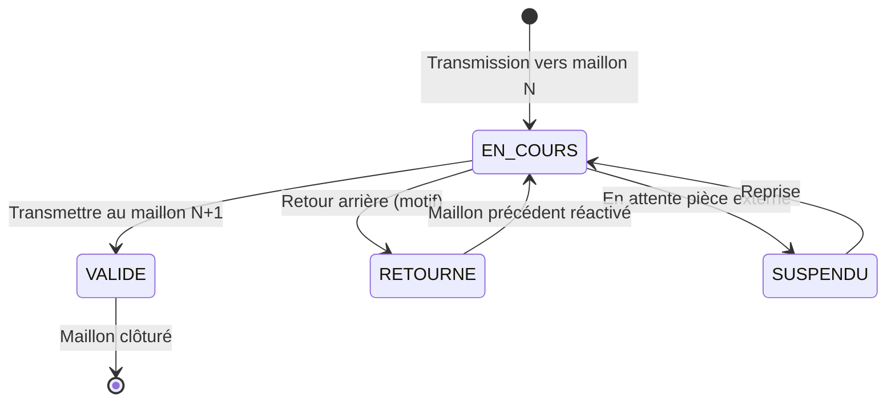

# Sprint 3 — Spécification détaillée : Chaînes de passation, templates & calcul des délais

**Projet :** FluxPro — Suivi de dossiers par chaîne hiérarchique  
**Cas pilote :** Ministère des Travaux Publics du Cameroun (MINTP)  
**Sprint :** 3 — Semaines 11–12 (Phase 1 MVP)  
**Thème :** Templates de chaîne, passation maillon à maillon, `DelaiService`  
**Version :** 1.0  
**Date :** 1er juillet 2026  
**Statut :** Spécification cible — **non implémenté**

**Références :**
- [Cahier des charges](./CAHIER-DES-CHARGES-CHAINEFLUX-MINTP%20(1).md) — §7.4 (CHN), §8 (UC-01 à UC-03), §9 (templates), §10 (règles délais)
- [Roadmap](./ROADMAP-IMPLEMENTATION-CHAINEFLUX.md) — Sprint 3
- [Inventaire types de dossiers](./PHASE-0-INVENTAIRE-TYPES-DOSSIERS.md) — circuits T01–T04
- [Rapport baseline](./PHASE-0-RAPPORT-BASELINE.md) — délais actuels vs cibles
- [Sprint 1 — Auth & Org](./SPRINT-1-SPEC-AUTH-ORG.md) — RBAC, périmètre org
- Règle projet : `spring.jpa.hibernate.ddl-auto=none` — scripts SQL dans `docs/sql/`

---

## Table des matières

1. [Objectifs et périmètre](#1-objectifs-et-périmètre)
2. [Prérequis et dépendances](#2-prérequis-et-dépendances)
3. [Architecture technique](#3-architecture-technique)
4. [Module CHN-TPL — Templates de chaîne](#4-module-chn-tpl--templates-de-chaîne)
5. [Module CHN-PASS — Passation](#5-module-chn-pass--passation)
6. [Module DEL — Calcul des délais (`DelaiService`)](#6-module-del--calcul-des-délais-delaisservice)
7. [Règles métier](#7-règles-métier)
8. [Modèle de données](#8-modèle-de-données)
9. [API REST](#9-api-rest)
10. [RBAC et périmètre](#10-rbac-et-périmètre)
11. [Frontend](#11-frontend)
12. [Données de référence — Templates pilote](#12-données-de-référence--templates-pilote)
13. [Cas d'usage et user stories](#13-cas-dusage-et-user-stories)
14. [Plan de tests](#14-plan-de-tests)
15. [Hors périmètre Sprint 3](#15-hors-périmètre-sprint-3)
16. [Livrables et Definition of Done](#16-livrables-et-definition-of-done)
17. [Estimation et risques](#17-estimation-et-risques)

---

## 1. Objectifs et périmètre

### 1.1 Objectif du sprint

Implémenter le **cœur métier** de FluxPro : la circulation d'un dossier à travers une **chaîne de passation** prédéfinie, avec :

- configuration des **templates** T01–T05 (maillons, rôles, délais) ;
- **transmission** d'un maillon au suivant avec horodatage et traçabilité ;
- **calcul automatique** des échéances et du temps consommé (jours ouvrés / heures ouvrées) ;
- **retour arrière** motivé et statut « En attente pièce externe » (suspension délai) ;
- **verrouillage** : un seul responsable actif par dossier.

Ce sprint rend exécutable les cas d'usage **UC-01**, **UC-02** et **UC-03** du cahier des charges.

### 1.2 Périmètre fonctionnel (Must)

| ID CDC | Fonctionnalité | Module |
|--------|----------------|--------|
| CHN-01 | Template de chaîne par type de dossier | CHN-TPL |
| CHN-02 | Maillon : libellé, rôle, délai, action attendue | CHN-TPL |
| CHN-03 | Transmission au maillon suivant | CHN-PASS |
| CHN-04 | Horodatage automatique (date/heure, auteur) | CHN-PASS |
| CHN-05 | Calcul temps passé par maillon | DEL |
| CHN-06 | Retour au maillon précédent (motif ≥ 20 car.) | CHN-PASS |
| CHN-07 | Affichage « chez M. X depuis N jours » | CHN-PASS + Front |
| CHN-08 | Un seul responsable actif par dossier | CHN-PASS |
| RM-01 à RM-05 | Règles jours ouvrés, fériés, suspension | DEL |
| DOS-06 | Application auto du template à la création dossier | Lien S2 → S3 |

### 1.3 Should (si capacité restante)

| ID | Fonctionnalité |
|----|----------------|
| CHN-09 | Copie informée (CC) sans responsabilité de traitement |
| CHN-10 | Saut de maillon exceptionnel (autorisation `SERVICE_HEAD`) |
| DOS-10 | Commentaires internes par maillon |

### 1.4 Hors périmètre Sprint 3

Voir [§15](#15-hors-périmètre-sprint-3) — notamment **alertes et escalades** (Sprint 4).

---

## 2. Prérequis et dépendances

### 2.1 Dépend de Sprint 2 (obligatoire)

| Prérequis | Description |
|-----------|-------------|
| Entité `Dossier` | CRUD, statuts, numérotation `MINTP-{DIR}-{ANNÉE}-{SEQ}` |
| Types de dossier | Catalogue `COUR-STD`, `COUR-URG`, `MARCHE-SMP`, `AUTH-TRAV` |
| Lien type → template | Champ `template_id` ou résolution via `file_type.template_code` |
| Pièces jointes | Upload MinIO (pour UC-01 scan PDF) |
| Permissions dossiers | `FILES:READ`, `FILES:CREATE`, `FILES:UPDATE`, `FILES:TRANSMIT` |

### 2.2 Dépend de Sprint 1 (livré)

| Composant | Usage Sprint 3 |
|-----------|----------------|
| `User`, `UserRole` | Résolution responsable par maillon |
| `Organization`, périmètre DRTP | Isolation + affectation maillon |
| JWT + RBAC | `@RequiresPermission` sur endpoints passation |
| `OrganizationScopeService` | Filtrage dossiers par périmètre |

### 2.3 Débloque

| Sprint | Module |
|--------|--------|
| Sprint 4 | Moteur d'alertes (seuils J-2, J+0, J+3…) sur `date_echeance` |
| Sprint 5 | KPI délai moyen, taux respect délais sur dashboard |

---

## 3. Architecture technique

### 3.1 Packages backend proposés

```
com.nanotech.flux_pro_backend
├── entity/
│   ├── ChainTemplate.java
│   ├── ChainStepTemplate.java      // maillon template
│   ├── FilePassage.java            // instance maillon (passation)
│   └── BusinessCalendarDay.java    // fériés CM (optionnel table)
├── enumeration/
│   ├── PassageStatus.java
│   ├── DelayUnit.java              // WORKING_DAYS | WORKING_HOURS
│   └── FileWorkflowStatus.java     // incl. AWAITING_EXTERNAL
├── repository/
├── service/
│   ├── ChainTemplateService.java
│   ├── PassageService.java
│   └── DelaiService.java           // service critique
├── controller/
│   ├── ChainTemplateController.java
│   └── PassageController.java
└── dto/
```

### 3.2 Principes

- API REST JSON `/api`, erreurs **RFC 7807**
- Schéma BDD : scripts manuels `docs/sql/2026-XX-XX_chain_templates_passages.sql`
- UUID en **BINARY(16)** (aligné entités existantes Hibernate)
- Fuseau horaire métier : **`Africa/Douala`** (UTC+1)
- Journalisation : chaque transmission → `AuditLog` (append-only, Sprint 5 complet)

### 3.3 Diagramme de flux — Passation nominale



---

## 4. Module CHN-TPL — Templates de chaîne

### 4.1 Entités

**`ChainTemplate`** (table `chain_templates`)

| Champ | Type | Description |
|-------|------|-------------|
| `id` | BINARY(16) PK | UUID |
| `code` | VARCHAR(10) UNIQUE | `T01` … `T05` |
| `name` | VARCHAR(255) | Libellé |
| `description` | TEXT | Description |
| `file_type_code` | VARCHAR(32) | Lien catalogue (`COUR-STD`, …) |
| `total_delay_days` | INT | Délai total indicatif (j.o.) |
| `delay_unit` | ENUM | `WORKING_DAYS` (défaut) ou `WORKING_HOURS` (T02) |
| `active` | BOOLEAN | Template actif |
| `system_template` | BOOLEAN | Non supprimable si true |

**`ChainStepTemplate`** (table `chain_step_templates`)

| Champ | Type | Description |
|-------|------|-------------|
| `id` | BINARY(16) PK | UUID |
| `chain_template_id` | BINARY(16) FK | Template parent |
| `step_order` | INT | Ordre 1..N |
| `label` | VARCHAR(255) | Libellé maillon |
| `responsible_role` | VARCHAR(30) | `UserRole` attendu |
| `delay_value` | INT | Valeur délai |
| `delay_unit` | ENUM | `WORKING_DAYS` ou `WORKING_HOURS` |
| `expected_action` | VARCHAR(500) | Action attendue |
| `optional` | BOOLEAN | Maillon facultatif (ex. visa Ministre) |
| `closure_step` | BOOLEAN | Dernier maillon = clôture |

### 4.2 Règles template

| ID | Règle |
|----|-------|
| TPL-01 | Un `code` template est unique |
| TPL-02 | Les `step_order` sont consécutifs sans trou (1..N) |
| TPL-03 | Un seul maillon `closure_step = true` par template |
| TPL-04 | La somme des délais maillons ≤ `total_delay_days` (+ tolérance 0) |
| TPL-05 | Template système (T01–T05 seed) : modification maillons autorisée, suppression interdite |
| TPL-06 | Désactivation (`active=false`) interdite si dossiers en cours utilisent le template |

### 4.3 CRUD — droits

| Action | Permission | Rôles typiques |
|--------|------------|--------------|
| Lister / consulter | `CHAIN_TEMPLATES:READ` | Tous agents (lecture) |
| Créer / modifier | `CHAIN_TEMPLATES:UPDATE` | `BUSINESS_ADMIN`, `SUPER_ADMIN` |
| Désactiver | `CHAIN_TEMPLATES:UPDATE` | `BUSINESS_ADMIN` |

---

## 5. Module CHN-PASS — Passation

### 5.1 Entité `FilePassage` (table `file_passages`)

Instance d'un maillon pour un dossier donné.

| Champ | Type | Description |
|-------|------|-------------|
| `id` | BINARY(16) PK | UUID |
| `file_id` | BINARY(16) FK | Dossier |
| `chain_step_template_id` | BINARY(16) FK | Référence maillon template |
| `step_order` | INT | Copie ordre (dénormalisé) |
| `responsible_user_id` | BINARY(16) FK | Responsable actuel |
| `status` | ENUM | Voir §5.2 |
| `received_at` | DATETIME(6) | Réception effective (début délai) |
| `transmitted_at` | DATETIME(6) NULL | Transmission sortante |
| `due_at` | DATETIME(6) | Échéance calculée |
| `consumed_hours` | DECIMAL(10,2) | Temps consommé (heures ouvrées) |
| `comment` | TEXT NULL | Commentaire transmission |
| `return_reason` | VARCHAR(500) NULL | Motif retour (≥ 20 car.) |
| `suspended_at` | DATETIME(6) NULL | Début suspension |
| `resumed_at` | DATETIME(6) NULL | Fin suspension |

### 5.2 Statuts maillon (`PassageStatus`)

| Statut | Description |
|--------|-------------|
| `PENDING` | Pas encore atteint |
| `IN_PROGRESS` | Responsable actif — **un seul par dossier** |
| `COMPLETED` | Transmis au maillon suivant |
| `RETURNED` | Retourné au maillon précédent |
| `SUSPENDED` | En attente pièce externe (RM-05) |
| `SKIPPED` | Saut exceptionnel (CHN-10) |

### 5.3 Opérations

#### 5.3.1 Initialisation chaîne (`POST /api/files/{id}/chain/initialize`)

- Déclenché à la **création dossier** (DOS-06) ou manuellement si brouillon
- Crée N instances `FilePassage` (statut `PENDING`, sauf maillon 1 → `IN_PROGRESS`)
- Affecte responsable maillon 1 selon règle de résolution (§5.4)
- Calcule `due_at` maillon 1 via `DelaiService`

#### 5.3.2 Transmission (`POST /api/files/{id}/passages/{passageId}/transmit`)

**Préconditions :**
- Appelant = responsable actuel **ou** supérieur hiérarchique (RP-03)
- Maillon en `IN_PROGRESS`
- Commentaire obligatoire si `due_at` dépassé (RP-01)

**Effets :**
1. Maillon courant → `COMPLETED`, `transmitted_at = now()`, calcule `consumed_hours`
2. Maillon suivant → `IN_PROGRESS`, `received_at = now()`, calcule `due_at`
3. Résolution nouveau responsable
4. Écriture `AuditLog`
5. Si dernier maillon → dossier `CLOSED` (RP-04)

#### 5.3.3 Retour arrière (`POST /api/files/{id}/passages/{passageId}/return`)

- Body : `{ "reason": "..." }` — min **20 caractères** (RP-02, CHN-06)
- Maillon courant → `RETURNED`
- Maillon précédent → `IN_PROGRESS` (nouveau `received_at`, nouvelle `due_at`)

#### 5.3.4 Suspension (`POST /api/files/{id}/passages/{passageId}/suspend`)

- Body : `{ "reason": "..." }`
- Statut → `SUSPENDED`, `suspended_at = now()`
- Compteur délai **gelé** (RM-05)
- Dossier → statut `AWAITING_EXTERNAL`

#### 5.3.5 Reprise (`POST /api/files/{id}/passages/{passageId}/resume`)

- Statut → `IN_PROGRESS`, `resumed_at = now()`
- Recalcul `due_at` = now + délai restant

### 5.4 Résolution du responsable

Algorithme pour un maillon de rôle `R` sur dossier d'organisation `O` :

1. Chercher utilisateur **actif** avec `role = R` dans l'organisation `O` ou ancêtre hiérarchique pertinent
2. Si plusieurs candidats : priorité au **chef de service** de l'unité émettrice, sinon premier actif
3. Si aucun : dossier en **erreur d'affectation** — notification `BUSINESS_ADMIN` (log, alerte S4)

| Rôle template (`UserRole`) | Correspondance CDC |
|----------------------------|-------------------|
| `AGENT` | Agent traitant |
| `SERVICE_HEAD` | Chef de service |
| `DIRECTOR` | Directeur |
| `SECRETARY_GENERAL` | Secrétariat Général |
| `EXECUTIVE_OFFICE` | Cabinet / Ministre |
| `REGIONAL_DIRECTOR` | Directeur DRTP |
| `SUPPORT` | Secrétariat / courrier |

### 5.5 Indicateur CHN-07

Calcul exposé dans API dossier :

```json
{
  "currentHolder": {
    "userId": "...",
    "fullName": "Jean Dupont",
    "organizationCode": "DAG",
    "since": "2026-06-28T08:00:00Z",
    "workingDaysHeld": 3,
    "overdue": true,
    "dueAt": "2026-06-30T17:00:00Z"
  }
}
```

Libellé UI : *« Dossier chez {fullName} depuis {workingDaysHeld} jours ouvrés »*

---

## 6. Module DEL — Calcul des délais (`DelaiService`)

### 6.1 Responsabilités

Service **sans état**, injectable, couvrant :

| Méthode | Description |
|---------|-------------|
| `calculateDueDate(start, delayValue, unit)` | Date/heure d'échéance |
| `calculateConsumedHours(start, end)` | Temps ouvré entre deux instants |
| `countWorkingDays(start, end)` | Jours ouvrés écoulés |
| `isOverdue(dueAt, now)` | Retard ? |
| `addWorkingDays(date, days)` | Avance calendrier ouvré |
| `addWorkingHours(date, hours)` | Avance heures ouvrées |

### 6.2 Règles RM-01 à RM-05

| ID | Implémentation |
|----|----------------|
| RM-01 | Jours ouvrés = lun–ven uniquement |
| RM-02 | Exclure jours fériés Cameroun (table `business_calendar` ou liste en config) |
| RM-03 | `start` = `received_at` (transmission entrante) |
| RM-04 | T02 : unité `WORKING_HOURS`, plage **08:00–17:00** Africa/Douala |
| RM-05 | Si `SUSPENDED` : exclure période `[suspended_at, resumed_at]` du calcul |

### 6.3 Jours fériés Cameroun (seed initial)

| Date | Libellé |
|------|---------|
| 1er janvier | Nouvel An |
| 11 février | Fête de la Jeunesse |
| 1er mai | Fête du Travail |
| 20 mai | Fête Nationale |
| 25 décembre | Noël |

> Liste extensible via table `business_calendar` (`date`, `label`, `country_code='CM'`).

### 6.4 Exemples de calcul

**T01 — Maillon 4, 5 j.o., réception lundi 10/06/2026 09:00**

- Échéance : lundi 17/06/2026 17:00 (5 j.o., hors week-end)

**T02 — Maillon 1, 4 h ouvrées, réception vendredi 14/06/2026 15:00**

- 2 h vendredi (15h–17h) + 2 h lundi 17/06 (08h–10h) → échéance lundi 10:00

### 6.5 Tests unitaires obligatoires

| Test | Scénario |
|------|----------|
| `DEL-UT-01` | 5 j.o. sans férié |
| `DEL-UT-02` | Franchissement week-end |
| `DEL-UT-03` | Jour férié 20 mai exclu |
| `DEL-UT-04` | 4 h ouvrées avec coupure week-end |
| `DEL-UT-05` | Suspension 3 jours — temps gelé |
| `DEL-UT-06` | `consumedHours` maillon complet |

---

## 7. Règles métier

### 7.1 Passation (RP)

| ID | Règle | Validation |
|----|-------|------------|
| RP-01 | Commentaire si retard à la transmission | `now > due_at` → `comment` required |
| RP-02 | Motif retour ≥ 20 caractères | `@Size(min=20)` |
| RP-03 | Réaffectation forcée : responsable ou supérieur | `AccessControlService` |
| RP-04 | Clôture si tous maillons obligatoires validés | Service |
| RP-05 | Dossier annulé : historique conservé | Pas de DELETE cascade passages |

### 7.2 Verrouillage CHN-08

- Contrainte métier : **au plus un** `FilePassage` avec `status = IN_PROGRESS` par `file_id`
- Index unique partiel ou validation service avant commit
- Tentative concurrente → `409 Conflict`

### 7.3 Lien dossier ↔ template

| ID | Règle |
|----|-------|
| DOS-06 | À la création, `file_type_code` détermine `chain_template.code` |
| DOS-06b | Changement de template interdit si chaîne déjà initialisée |
| DOS-06c | Priorité « Très urgent » force T02 sur type `COUR-STD` si sélectionné |

---

## 8. Modèle de données

### 8.1 Schéma relationnel

```
chain_templates (1) ──< chain_step_templates
chain_templates (1) ──< files (Sprint 2)
files (1) ──< file_passages >── (1) chain_step_templates
users (1) ──< file_passages.responsible_user_id
business_calendar (dates fériés)
```

### 8.2 Script SQL (à produire)

Fichier proposé : `docs/sql/2026-XX-XX_chain_templates_passages.sql`

Contenu :
- `CREATE TABLE chain_templates`
- `CREATE TABLE chain_step_templates`
- `CREATE TABLE file_passages`
- `CREATE TABLE business_calendar`
- Index : `idx_passages_file`, `idx_passages_status`, `uk_file_in_progress` (partiel)
- Section seed T01–T05

### 8.3 Énumérations Java

```java
public enum PassageStatus {
    PENDING, IN_PROGRESS, COMPLETED, RETURNED, SUSPENDED, SKIPPED
}

public enum DelayUnit {
    WORKING_DAYS, WORKING_HOURS
}
```

---

## 9. API REST

### 9.1 Templates

| Méthode | Route | Permission | Description |
|---------|-------|------------|-------------|
| GET | `/api/admin/chain-templates` | `CHAIN_TEMPLATES:READ` | Liste |
| GET | `/api/admin/chain-templates/{id}` | `CHAIN_TEMPLATES:READ` | Détail + maillons |
| POST | `/api/admin/chain-templates` | `CHAIN_TEMPLATES:CREATE` | Créer |
| PUT | `/api/admin/chain-templates/{id}` | `CHAIN_TEMPLATES:UPDATE` | Modifier |
| PUT | `/api/admin/chain-templates/{id}/steps` | `CHAIN_TEMPLATES:UPDATE` | Remplacer maillons |
| PATCH | `/api/admin/chain-templates/{id}/deactivate` | `CHAIN_TEMPLATES:UPDATE` | Désactiver |

### 9.2 Passation (sur dossier)

| Méthode | Route | Permission | Description |
|---------|-------|------------|-------------|
| GET | `/api/files/{id}/passages` | `FILES:READ` | Circuit complet |
| GET | `/api/files/{id}/passages/current` | `FILES:READ` | Maillon actif + indicateur CHN-07 |
| POST | `/api/files/{id}/chain/initialize` | `FILES:UPDATE` | Instancier chaîne |
| POST | `/api/files/{id}/passages/{pid}/transmit` | `FILES:TRANSMIT` | Transmettre |
| POST | `/api/files/{id}/passages/{pid}/return` | `FILES:TRANSMIT` | Retour arrière |
| POST | `/api/files/{id}/passages/{pid}/suspend` | `FILES:TRANSMIT` | Suspension |
| POST | `/api/files/{id}/passages/{pid}/resume` | `FILES:TRANSMIT` | Reprise |
| POST | `/api/files/{id}/passages/{pid}/reassign` | `FILES:UPDATE` | Réaffectation forcée |

### 9.3 Exemple — Circuit dossier

```json
GET /api/files/{id}/passages

{
  "templateCode": "T01",
  "templateName": "Courrier entrant standard",
  "currentStepOrder": 3,
  "passages": [
    {
      "stepOrder": 1,
      "label": "Réception DAG",
      "status": "COMPLETED",
      "responsibleName": "Marie N.",
      "receivedAt": "2026-06-10T08:00:00Z",
      "transmittedAt": "2026-06-11T09:30:00Z",
      "dueAt": "2026-06-11T17:00:00Z",
      "consumedHours": 8.5,
      "overdue": false
    },
    {
      "stepOrder": 3,
      "label": "Directeur destinataire",
      "status": "IN_PROGRESS",
      "responsibleName": "Paul K.",
      "receivedAt": "2026-06-12T08:00:00Z",
      "dueAt": "2026-06-13T17:00:00Z",
      "workingDaysHeld": 2,
      "overdue": true
    }
  ]
}
```

---

## 10. RBAC et périmètre

### 10.1 Nouvelles permissions

| Permission | Description |
|------------|-------------|
| `CHAIN_TEMPLATES:READ` | Consulter templates |
| `CHAIN_TEMPLATES:CREATE` | Créer template |
| `CHAIN_TEMPLATES:UPDATE` | Modifier / désactiver |
| `FILES:TRANSMIT` | Transmettre, retourner, suspendre |

### 10.2 Matrice rôles (extrait)

| Rôle | Templates | Transmettre | Init chaîne |
|------|-----------|-------------|-------------|
| `SUPER_ADMIN` | CRUD | Oui | Oui |
| `BUSINESS_ADMIN` | CRUD | Oui | Oui |
| `DIRECTOR` | Lecture | Oui (ses dossiers) | Non |
| `SERVICE_HEAD` | Lecture | Oui | Non |
| `AGENT` | Lecture | Oui (si responsable) | Non |
| `READER` | Lecture | Non | Non |

### 10.3 Périmètre organisationnel

- Un agent ne peut agir que sur dossiers de **son périmètre** (`OrganizationScopeService`)
- DRTP Centre **ne voit pas** les dossiers DIER (test hérité Sprint 1, appliqué aux endpoints passation)

---

## 11. Frontend

### 11.1 Écrans

| Route | Description | Rôles |
|-------|-------------|-------|
| `/admin/chain-templates` | Liste templates | `CHAIN_TEMPLATES:READ` |
| `/admin/chain-templates/[id]` | Édition maillons | `CHAIN_TEMPLATES:UPDATE` |
| `/files/[id]` | Fiche dossier — onglet **Circuit** | `FILES:READ` |
| `/files/[id]` | Boutons **Transmettre** / **Retourner** / **Suspendre** | Responsable |

### 11.2 Composant `PassageCircuit`

- Timeline verticale des maillons (statut couleur)
- Maillon actif mis en évidence
- Bandeau : *« Chez {nom} depuis {n} jours »* (CHN-07)
- Modales : transmission (commentaire), retour (motif), suspension (motif)

### 11.3 Wireframe logique

```
┌─────────────────────────────────────────┐
│ Dossier MINTP-DAG-2026-0042             │
│ [Circuit] [Pièces] [Historique]         │
├─────────────────────────────────────────┤
│ ⚠ Chez Paul K. (DAG) depuis 3 j. ouvrés │
├─────────────────────────────────────────┤
│ ✓ 1. Réception DAG          10/06       │
│ ✓ 2. Orientation Chef       11/06       │
│ ● 3. Directeur destinataire EN COURS    │
│ ○ 4. Agent traitant                     │
│ ...                                     │
├─────────────────────────────────────────┤
│ [Transmettre] [Retourner] [Suspendre]   │
└─────────────────────────────────────────┘
```

---

## 12. Données de référence — Templates pilote

### 12.1 T01 — Courrier entrant standard (7 maillons, 11 j.o.)

| # | Libellé | Rôle | Délai | Unité |
|---|---------|------|-------|-------|
| 1 | Réception DAG | `SUPPORT` | 1 | j.o. |
| 2 | Orientation Chef Courrier | `SERVICE_HEAD` | 1 | j.o. |
| 3 | Directeur destinataire | `DIRECTOR` | 1 | j.o. |
| 4 | Agent traitant | `AGENT` | 5 | j.o. |
| 5 | Validation Chef Service | `SERVICE_HEAD` | 2 | j.o. |
| 6 | Expédition réponse | `SUPPORT` | 1 | j.o. |
| 7 | Clôture | `AGENT` | 0 | clôture |

### 12.2 T02 — Courrier très urgent (6 maillons, 2 j.o.)

| # | Libellé | Rôle | Délai | Unité |
|---|---------|------|-------|-------|
| 1 | Réception DAG | `SUPPORT` | 4 | h ouvrées |
| 2 | Directeur destinataire | `DIRECTOR` | 4 | h ouvrées |
| 3 | Agent traitant | `AGENT` | 1 | j.o. |
| 4 | Validation | `SERVICE_HEAD` | 4 | h ouvrées |
| 5 | Expédition | `SUPPORT` | 4 | h ouvrées |
| 6 | Clôture | `AGENT` | 0 | clôture |

### 12.3 T03 — Marché public simplifié (7 maillons, 15 j.o.)

Aligné [PHASE-0-INVENTAIRE §6.2](./PHASE-0-INVENTAIRE-TYPES-DOSSIERS.md).

> **Point ouvert :** CDC UC-02 indique 21 j.o. — MVP retenu **15 j.o.** Validation atelier requise.

### 12.4 T04 — Autorisation travaux DRTP (5 maillons, 18 j.o.)

Maillon 3 prévu pour bascule « En attente pièce externe » (UC-03).

### 12.5 T05 — Coopération / partenariat (22 j.o.)

Pré-configuré, **hors pilote actif** (`active=false` par défaut).

---

## 13. Cas d'usage et user stories

### UC-01 — Courrier entrant DAG (T01)

**Critères d'acceptation Sprint 3 :**
- [ ] Création dossier → chaîne T01 initialisée automatiquement
- [ ] 7 transmissions successives jusqu'à clôture
- [ ] Chaque transmission horodatée avec auteur
- [ ] `due_at` recalculé à chaque maillon
- [ ] Indicateur « chez X depuis N jours » visible sur maillon 3 en retard simulé

### UC-02 — Marché public DIER (T03)

- [ ] Chaîne T03 sur type `MARCHE-SMP`
- [ ] Retour maillon 3 → 2 avec motif 20 car.
- [ ] Directeur DIER voit stagnation maillon 3 (indicateur, pas encore alerte email S4)

### UC-03 — Autorisation travaux DRTP (T04)

- [ ] Suspension maillon 3 — compteur gelé
- [ ] Reprise — nouvelle échéance cohérente
- [ ] Isolation : agent DRTP autre région → 403

### User stories techniques

| ID | Story | Priorité |
|----|-------|----------|
| US-S3-01 | En tant qu'admin métier, je configure les maillons d'un template | Must |
| US-S3-02 | En tant qu'agent responsable, je transmets un dossier au maillon suivant | Must |
| US-S3-03 | En tant que chef de service, je retourne un dossier avec motif | Must |
| US-S3-04 | En tant que système, je calcule l'échéance en jours ouvrés | Must |
| US-S3-05 | En tant qu'agent DRTP, je suspend l'attente pièce externe | Must |
| US-S3-06 | En tant que directeur, je vois qui détient le dossier et depuis quand | Must |

---

## 14. Plan de tests

### 14.1 Tests unitaires

| Suite | Couverture |
|-------|------------|
| `DelaiServiceTest` | RM-01 à RM-05, cas limites week-end/fériés |
| `PassageServiceTest` | Transitions statut, verrouillage CHN-08 |
| `ChainTemplateServiceTest` | Validation TPL-01 à TPL-06 |

### 14.2 Tests d'intégration

| ID | Scénario |
|----|----------|
| IT-S3-01 | UC-01 bout en bout (7 maillons) |
| IT-S3-02 | Retour arrière motif < 20 car. → 400 |
| IT-S3-03 | Double transmission concurrente → 409 |
| IT-S3-04 | Suspension + reprise — `consumed_hours` correct |
| IT-S3-05 | Agent hors périmètre → 403 |

### 14.3 Tests E2E frontend

| ID | Scénario |
|----|----------|
| E2E-S3-01 | Affichage timeline circuit sur fiche dossier |
| E2E-S3-02 | Transmission avec commentaire obligatoire si retard |
| E2E-S3-03 | Admin — édition template T01 |

---

## 15. Hors périmètre Sprint 3

| Sujet | Sprint |
|-------|--------|
| Alertes J-2, J+0, J+3, emails SMTP | Sprint 4 |
| Worker CRON calcul retards | Sprint 4 |
| Notifications in-app / WebSocket | Sprint 4 |
| Export PDF fiche de circulation | Sprint 5 |
| Dashboard KPI délai moyen | Sprint 5 |
| CHN-09 CC informé | Should ultérieur |
| CHN-10 Saut de maillon | Should ultérieur |
| SMS | Phase 2 |

---

## 16. Livrables et Definition of Done

### 16.1 Livrables

| Livrable | Emplacement |
|----------|-------------|
| Script SQL chaînes / passations | `docs/sql/2026-XX-XX_chain_templates_passages.sql` |
| Seed templates T01–T05 | Même script ou `ChainDataInitializer` |
| API documentée | OpenAPI / Swagger |
| `DelaiService` + tests | `src/.../service/DelaiService.java` |
| Pages admin templates + circuit dossier | `flux-pro-front` |
| Présentation démo UC-01 | Réunion fin S12 |

### 16.2 Definition of Done

- [ ] Scripts SQL exécutés manuellement sur MySQL pilote
- [ ] T01–T04 actifs et seedés
- [ ] UC-01, UC-02, UC-03 passent en intégration
- [ ] `DelaiServiceTest` ≥ 95 % branches couvertes
- [ ] Verrouillage un responsable actif validé
- [ ] RBAC + périmètre org sur tous endpoints passation
- [ ] Pas de régression Sprint 1 (auth, org, users)
- [ ] Documentation OpenAPI à jour

---

## 17. Estimation et risques

### 17.1 Estimation (indicative)

| Lot | Points | Durée |
|-----|--------|-------|
| Modèle + SQL + seed templates | 8 | 2 j |
| `DelaiService` + tests | 13 | 3 j |
| `PassageService` + API | 21 | 5 j |
| Frontend circuit + admin templates | 13 | 3 j |
| IT + recette UC-01/02/03 | 8 | 2 j |
| **Total** | **~63** | **~15 j** |

### 17.2 Risques

| Risque | Impact | Mitigation |
|--------|--------|------------|
| Sprint 2 dossiers incomplet | Bloquant | Gel S3, prioriser DOS-06 |
| Écart délais T03 (15 vs 21 j.o.) | Moyen | Atelier métier S2/S3 |
| Complexité `DelaiService` heures ouvrées | Élevé | Tests exhaustifs, lib Java time |
| Résolution responsable ambiguë | Moyen | Règle explicite + log + admin override |
| Performance circuit long (10+ maillons) | Faible | Pagination, index BDD |

### 17.3 Points ouverts

| # | Question | Décision attendue |
|---|----------|-------------------|
| O1 | T03 : 15 ou 21 j.o. ? | PO + référent DIER |
| O2 | Maillon clôture : rôle `AGENT` ou système ? | Atelier DAG |
| O3 | Table `business_calendar` vs fichier config YAML | Équipe tech |
| O4 | Réaffectation : notification immédiate ou S4 ? | PO |

---

*Spécification Sprint 3 v1.0 — FluxPro MINTP — Juillet 2026 — À réviser après atelier validation templates.*
